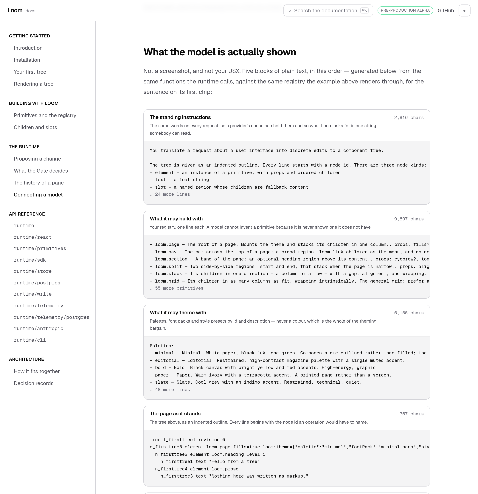
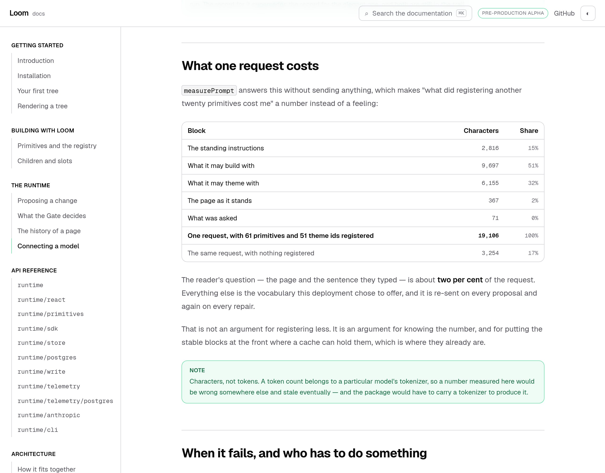
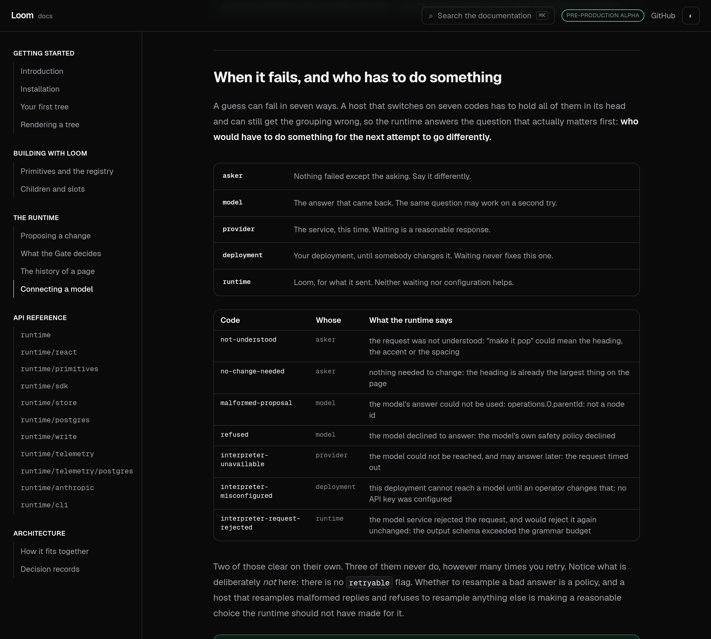
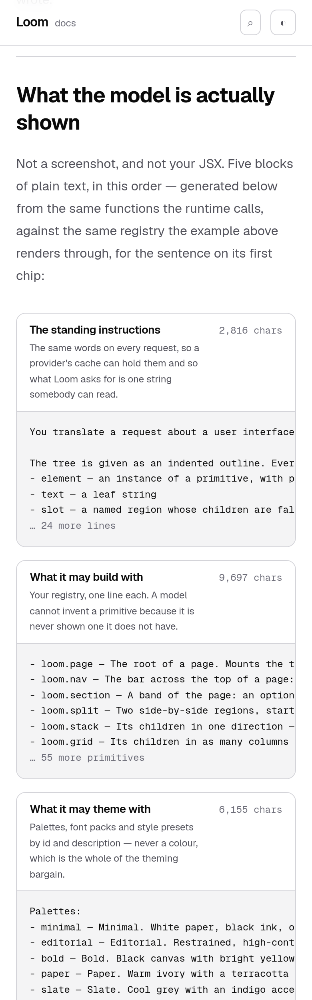

# 25 August 2026 — connecting a model

**Routine:** `Loom docs` · **Branch:** `docs-09-connecting-a-model` · **Section:** §4c

The site could explain everything the runtime does with certainty and nothing
about the one step that guesses. *Proposing a change* said `modelInterpreter`
exists and moved on; nothing else mentioned it. A reader could finish the whole
site, understand the Gate, the log and undo — and still have no idea what
happens when you put a real model behind any of it.

That page now exists, and it does not describe the prompt. It prints it.

## What is on the page

**The slot, and what goes in it.** `ChangeInterpreter` is one method. The wiring
is nine lines and they are on the page: `anthropicModelClient` around the SDK's
`messages`, `modelInterpreter` around that, and the object drops into the slot
the preset was in with nothing downstream changing.

**What the model is actually shown.** Five blocks of plain text — the standing
instructions, your primitives, your themes, the page as an outline, the
sentence somebody typed. Built at page-build time by the same renderers
`buildUserMessage` calls, against the same registry the example directly above
renders through.

**What it is allowed to say back.** An inserted node carries no id, props arrive
as a JSON-encoded string, only elements and text can be inserted — and the reply
is a three-way outcome rather than a delta, because *"nothing needs changing"* is
an answer.

**What one request costs**, and this is the one I did not expect to be so blunt.

**Who has to do something when it fails.** Seven codes, five actors, read off
`interpretationFault` and `describeInterpretationError` rather than typed.

## The decision that shaped the page

**Almost none of it is written down.**

A page about the model seam is exactly the page that rots: it quotes a prompt, a
schema and a set of error codes, all of which live in `src/` and none of which
send anything when they change. The generated API reference exists because a
hand-maintained reference drifts within a week, and the same argument applies
with more force to prose that quotes a constant.

So three components do the quoting, and each of them is a projection of the
repository rather than a copy of it:

- `<ModelRequest />` — the five blocks, from `renderCatalogue`,
  `renderThemeCatalogue`, `renderTree` and `INTERPRETER_SYSTEM_PROMPT`, sized by
  `measurePrompt`.
- `<PromptCost />` — the table above, including the "with nothing registered"
  comparison the argument rests on.
- `<InterpretationFaults />` — the seven codes, keyed by a `Record` over the
  error union, so an **eighth code added to the runtime fails the documentation
  build** rather than leaving the table quietly one row short.

Two numbers could not be components without turning a paragraph into a table —
the reply schema's compiled size, and the proportion of a request that is the
reader's own question. `claims.test.ts` reads the MDX source and holds both
against `draftSchemaByteSize`, `GRAMMAR_BUDGET_BYTES` and `measurePrompt`.

**The three components are imported by the page rather than registered
globally.** `mdx-components.tsx` lives outside this route group and its own
comment asks for the global list to stay short enough to hold in the head; three
components used by exactly one page have no business in every page's namespace.
The consequence worth stating plainly: **nothing outside `app/(docs)/` was
touched on this branch.**

## What the elisions do, and why they are not code blocks

The catalogue block is 9,697 characters. The page shows six lines and then
`… 55 more primitives`, in the runtime's own eliding convention.

These are deliberately **not** `CodeBlock`s. Every fenced block on this site
carries a copy button, and a reader who copied an elided catalogue would take
away a list with fifty-five entries missing and nothing saying so. A printout is
for reading; the snippets meant to be taken are still fenced blocks in the prose.

## What I got wrong, and what caught it

**A phantom fourth column, on every generated table the site has.**

The first screenshot of the cost table showed three columns of numbers inside a
full-width rounded border with a hand's width of empty space beside them, and
double borders inside every cell. Neither was mine.

`globals.css` has said since 21 August that `.prose table { display: block }`,
which is how a **markdown** table scrolls sideways on a phone instead of widening
the page. `.not-prose` in this sheet resets a colour and a margin — it is not a
cascade barrier — so the rule reached every table a component built as well, and
a block-level table shrinks to its content. `EntryPoints` and `DecisionRecords`
have had it since they were written; it was invisible on those two only because
their content happens to fill the width.

Fixed by narrowing the selector — `.prose table:not(.not-prose *)` — rather than
resetting inside `.not-prose`, and the reason is the interesting half: a reset
needs higher specificity than the rule it undoes, which is already higher than a
single utility class, so it would win against the very declarations the component
wrote. A rule that never matches leaves them unopposed.

The test beside it is a **source** assertion, checked in both directions, and
`house-theme.test.ts` was already the file that reads `globals.css`. It has to be
a source assertion: the suite that renders these components runs in jsdom, which
parses no stylesheet, so a DOM test there would assert nothing while reading as
though it did. I confirmed it fails on the regression by reintroducing it.

**Fourth docs defect in six runs found by looking at a screenshot**, and the
first three were the same shape — true markup, passing tests, wrong picture.

## One correction to a page I wrote two days ago

*The history of a page* said the runtime "ships one implementation" of the hold
store, in memory. `postgresHoldStore` landed the same week under 0088, with a
contract suite run against both. True when written, false four days later, and
nothing failed.

Rewritten, and the replacement says the thing that actually decides it: whether
the process that judged a change can still be spoken to when the answer arrives.
On a serverless host it cannot, which is the whole of why the second
implementation exists.

It is also the reason this run generated as much as it did, and the finding filed
about it asks the §4c question directly — how does a documentation site stay true
when the thing it documents moves — with a recommendation rather than a habit.

## Tests

`pnpm install && pnpm verify` at the repository root, **green**:

| Suite | Files | Tests |
| --- | --- | --- |
| `@loom/runtime` | 106 | 1641 |
| `@loom/app` | 121 | 1724 |

Nothing failed, nothing skipped, nothing weakened, and `next build` succeeded
across all five route groups. The app suite went 1693 → 1724, so **31 new
tests** — 29 in four new files, and two added to `house-theme.test.ts`, which was
already the file that reads `globals.css`.

The ones worth naming, because they are the claims the page makes:

- every block is sized the way `measurePrompt` sizes it, and the five sum to the
  total — so an elided preview still reports what the whole block costs
- the tree block is printed **whole**, byte-identical to `renderTree` of the
  example rendered directly above it
- the elided blocks say exactly how much they hid: preview lines plus the elided
  count equals the registry's real length
- two builds of the page produce an identical request, and an unknown example id
  throws at build time rather than rendering an empty box
- every fault row's sentence is `describeInterpretationError`'s and every row's
  actor is `interpretationFault`'s, for the error its key names
- the two prose numbers are the runtime's: the draft schema really is under the
  grammar budget at depth 4 and really is over at depth 5, and the reader's own
  question really is a small fraction of the request
- and, through the components rather than around them: every block, summary,
  size, elision and fault row reaches the page
- the prose table rules carry their `.not-prose` guard, in both directions, and
  a markdown table still scrolls

## Findings

**Filed for `Loom daily build`** — `renderCatalogue` appends a full stop to a
description that already has one, so all 61 lines of the catalogue a model reads
end in `..`. Cosmetic, in the one string this system exists to send, and
invisible because nothing renders it. One line in `render.ts` is the fix I would
take.

**Filed for `Loom primitives` and the maintainer** — the theme vocabulary is 32%
of every request and the primitive catalogue 51%. Nothing is wrong; the number
simply had never been looked at, and a description is prompt surface rather than
documentation.

**Filed, mine, closed** — the prose stylesheet leak above, with the general shape
for any lane that has a prose stylesheet and generated markup.

**Filed, mine, open** — how a page's prose about the runtime stays true, with the
hold-store sentence as the worked example.

**No framework gaps.** First run in `apps/` to consume the interpretation seam's
projections for anything other than assembling a request, and nothing was wanted
that `@loom/runtime` does not export. No deep import, no new primitive, `src/`
not opened.

## Open questions

Whether the API reference should link **into** this page from `runtime/anthropic`
and `runtime/sdk`, or whether the pager and the sidebar are enough. The reference
is generated and I am not going to hand-write cross-links into it; the shape that
would work is a per-entry-point "explained on" field beside the existing summary
in `entry-points.ts`, which is one line per door and stays a single list. Not
built, because it is a change to how the generated section reads and this branch
is already a page. My recommendation is in the pull request comment.

