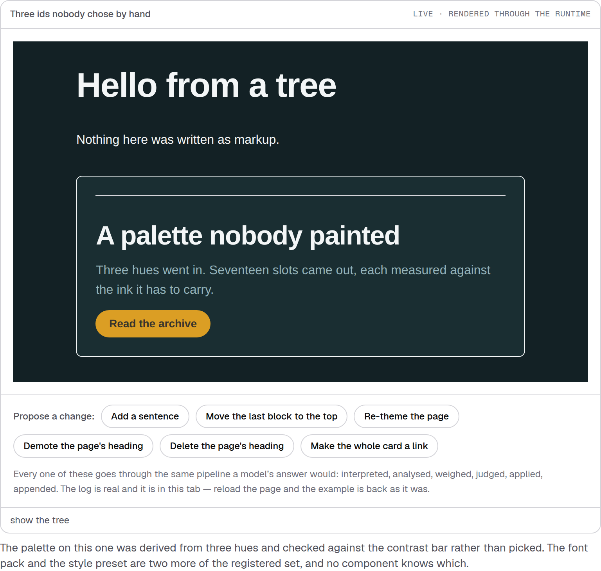
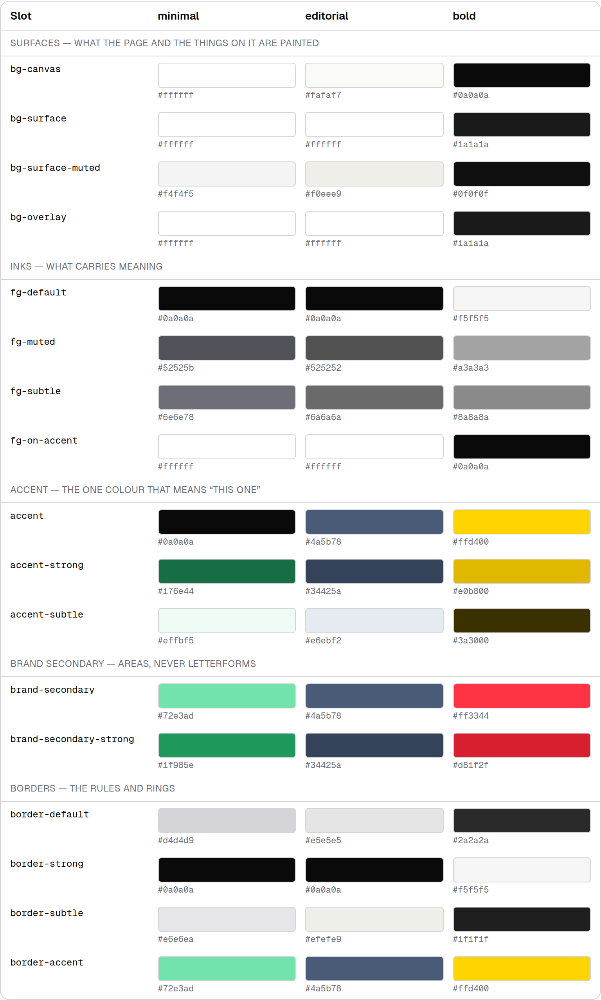
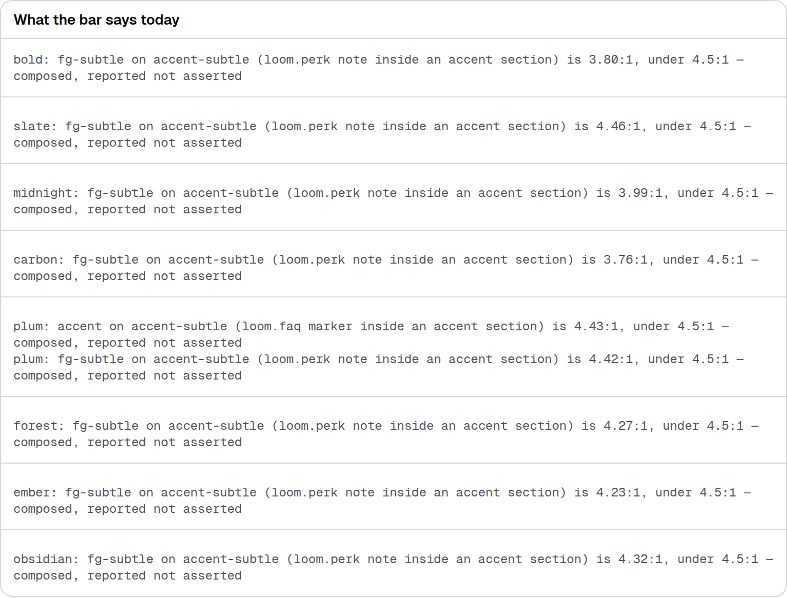
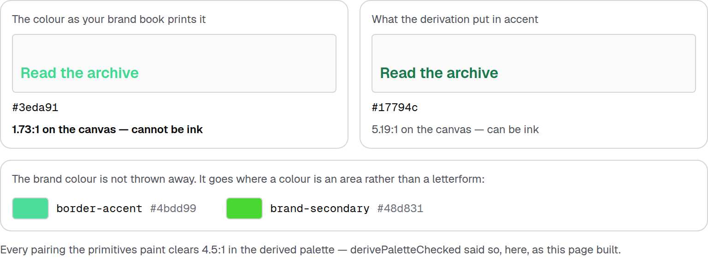
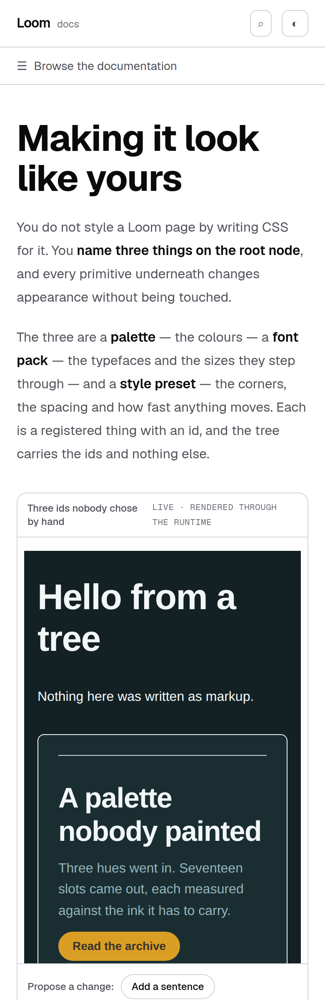

# 25 August 2026 — making it look like yours

**Routine:** `Loom docs` · **Branch:** `docs-10-making-it-yours` · **Section:** §4c

A reader could finish *Building with Loom* knowing how to define a primitive and
how to compose two of them, and still have no idea how to make the result look
like their product. The whole of what this site said about appearance was a
forty-line subsection on *Rendering a tree* called *"Themes are three ids on the
root"* — true, and the first thing anybody actually wants after their first tree
renders.

**Making it look like yours** is that page, third in *Building with Loom*.

## The thing that made it worth a page

Loom's theme surface is bigger than any other part of the runtime that had no
prose at all: **twenty-one palettes, twenty font packs, ten style presets**, and
a `derivePalette` / `auditPalette` pair that is the most opinionated code in
`src/`. It is also, per the finding on #155, **32% of every request a model is
sent** — so a palette's `description` is prompt surface rather than
documentation, which is the last line of the page and was worth reaching.

None of it was described anywhere.

## Three blocks that are generated, and one that is measured live

The page states figures, and a page that states figures is the page that rots.
So the three blocks carrying them project the repository instead:

**The slot table** reads `PALETTE_SLOTS` and `STARTER_PALETTES`. Every slot a
palette must declare, with what three registered palettes actually put in it. A
slot added to the runtime appears on the next build; one renamed cannot leave a
stale row behind. The tier breaks are derived from the slot names rather than
declared — the enum is written in tier order and says so, so the break is the
moment the prefix changes, and a tier declared in the component would be a second
opinion about the runtime's ordering.

**The contrast audit** calls `auditPalette` on all twenty-one palettes at build
time and prints what came back — `describePaletteAudit`'s own sentences, not a
paraphrase.

This is the block I would defend hardest. A documentation page could easily have
summarised *"the starter palettes are accessible"* and been technically defensible
— **0 painted failures out of 21 palettes** is a real result. But `describePaletteAudit`'s
own comment says a description showing only what is asserted would let a reader
take an empty string for a clean palette, and printing a green tick over the same
eight palettes would be exactly that fault, committed by the site instead of the
runtime. So the composed failures are on the page, in the runtime's words, with
their real ratios.

**The brand-colour derivation** runs `derivePaletteChecked` on a mint at build
time, so the claim the section rests on is a measurement rather than an excuse.

The section had to say *your brand colour will come back darker than your brand
book says, and that is correct*. Asserted, that reads as the tool being clumsy.
Printed — a mint at 1.73:1 beside the derived accent at 5.19:1, both rendered on
the derived canvas — it reads as the only honest answer, and the reader can see
that the brand colour is not discarded but moved to `border-accent` and
`brand-secondary`, where it is an area rather than a letterform.

## The prose is still allowed to spell numbers

Four sentences carry a figure — seventeen slots, eight ramp steps, the 4.5:1 bar,
and "your brand plus twenty-one others". Generating those into components would
have turned four paragraphs into four tables.

`theming-claims.test.ts` reads the MDX back off disk and holds each figure
against the runtime, plus the three theme ids in the opening code block against
`createThemeRegistry().resolve`. It deliberately holds **only figures** — a test
that asserted the wording would have to be edited every time somebody improved a
sentence, and would teach the next writer to stop improving them.

## The example, and two versions of it that were wrong

The example wears `tide` / `grotesque` / `technical` — none of which any surface
in this repository wears, and the palette is one of the eighteen that were
*derived* rather than authored. That is the page's argument made by the example
rather than by a sentence: the reader is looking at a combination this repository
has never rendered anywhere else, produced by typing three strings.

Getting there took two rejected attempts, both caught by screenshot and by
nothing else:

**`harbour` was invisible.** White canvas, navy accent — a perfectly good palette
and, next to the house theme's white canvas and near-black ink, indistinguishable
from it. An example whose whole caption is *"three ids nobody chose by hand"*
that renders identically to every other example on the site is worse than no
example. Every test passed.

**`mono-display` broke the frame.** Its top ramp step is 76px against the house
pack's 72, which sounds like nothing — but monospace glyphs are roughly 1.6×
wider, so the `h1` wrapped to two lines, the card heading wrapped to two more, and
the example ran off the bottom of its own frame. Not a defect in the font pack;
a real property of monospace that no unit test can see. `grotesque` tops out at
44px and the whole tree fits.

## What the screenshots caught in my own components

**A browser's own list markers, again.** The audit prints one `<pre>` per palette
in a `<ul>`, and each row carried a bullet — plus the user agent's `pre` margin,
so the rows sat in a column of dead space. `.not-prose` is not a cascade barrier
in this sheet, which is the same root cause as the phantom table column filed on
#155 and fixed there. Filed rather than fixed a second way, because #155 narrows
the offending selector and two fixes for one cause is how a stylesheet gets hard
to reason about. The explicit `list-none pl-0` / `m-0 p-0` here is local and
survives either outcome.

**Hex labels that looked like input fields.** `<code>` inside `.not-prose` still
picks up the site's inline-code pill, so every hex sat in a grey rounded box. The
other generated tables on this site use `font-mono` on a plain element and avoid
it; these do now too.

That is the fifth and sixth docs defect in seven runs found by looking at a
screenshot rather than by a test.

## One decision that was not specified

**The slot table shows three palettes, not twenty-one.** Twenty-one columns is a
catalogue, and the argument the section makes — *the same seventeen names hold
different colours* — needs only enough width to see it happen. The count of the
rest is stated in prose beside it and held by the claims test. The three shown
are the ones the four surfaces wear, so a reader comparing them against the page
around them is comparing against something they can also see.

## Tests

`pnpm install && pnpm verify` at the repository root, **green, exit 0**.

| Suite | Files | Tests |
| --- | --- | --- |
| `@loom/runtime` | 106 | 1647 |
| `@loom/app` | 125 | 1796 |

`src/` was not opened, and the runtime figures are unchanged from `main` because
of it. The app suite went 1777 → 1796 across 123 → 125 files: **19 new tests in
two new files**, nothing skipped, nothing weakened. `next build` succeeded across
all five route groups.

The ones worth naming, because they are the claims the page makes:

- the slot table has a row for **every** member of `PALETTE_SLOTS`, and every
  swatch is the colour the palette actually holds
- the audit's four figures equal what `auditPalette` returns over
  `STARTER_PALETTES`, recomputed in the test rather than copied
- every palette the runtime reports a composed failure on has its **exact**
  `describePaletteAudit` string on the page — compared by `textContent`, because
  the strings are multi-line and Testing Library normalises whitespace
- the brand colour cannot carry text and the derived accent can, both measured
- `derivePaletteChecked` reports the derived palette clean
- the page's four spelled-out figures match `PALETTE_SLOTS.length`, `RAMP_STEPS`,
  `TEXT_CONTRAST_MINIMUM` and `STARTER_PALETTES.length`
- the three ids in the opening code block resolve through a default registry

### One existing test was changed, and it was strengthened

`house-theme.test.ts` exempted exactly one example from wearing the house theme,
by id, in an `if`. A second deliberate exception made it fail — correctly. The
exemption is now a named list with the reason, and it gained two assertions the
single `if` could not carry: **every** exempt example must actually differ from
the house theme, and every id on the list must name an example that exists. An
exemption is now a claim rather than a hole.

## Findings

**Filed for `Loom primitives`** — one pairing accounts for eight of the nine
composed failures across the whole registered set: `fg-subtle` on `accent-subtle`,
in `loom.perk`. Nine palettes fail nothing else. That points at the tinted panel
or at the subtle ink rather than at nine palettes, and it is now on a public page.

**Filed, mine** — `.not-prose` leaking list markers and `pre` padding, above.

**No framework gaps.** Everything this page needed from `@loom/runtime` —
`PALETTE_SLOTS`, `STARTER_PALETTES`, `auditPalette`, `describePaletteAudit`,
`PALETTE_TEXT_PAIRINGS`, `TEXT_CONTRAST_MINIMUM`, `derivePaletteChecked`,
`canCarryText`, `hslHex`, `createThemeRegistry` — is exported from the root entry
point, pure, and returns data rather than a formatted line. Printing an audit on
a page was possible only because of that. No deep import, no new primitive,
`src/` not opened.

## Open questions

Whether the API reference should link into pages like this one, which is the same
question #155 raised and is still the one thing I would spend a run on next: a
reader landing on `runtime` from search sees `auditPalette`'s signature and has
no way to reach the page that explains what a composed failure is.

