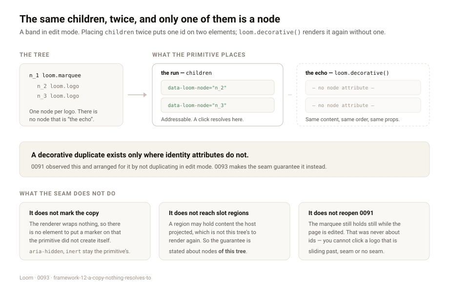

---
# A copy nothing resolves to, and a catalogue line that ends once

**Date:** 2026-08-25 · **Routine:** `Loom daily build` · **Section:** §4b ·
**Branch:** `framework-12-a-copy-nothing-resolves-to`

## The migration, first

**It is done, and it was done before this run started.** `apps/loom` is on `main`
with five route groups — `(marketing)`, `(docs)`, `(lessons)`, `(portal)` and
`(demo)` — `apps/portal` and `apps/docs` are gone, sign-in is middleware at the
`(portal)` boundary, and there is one deployment. `pnpm verify` on `main` at
`9ff7a6b` is green: 1695 runtime tests, 1880 application tests, one Next build.
Nothing in the tree is half-migrated. The three routines waiting on the shape can
read that as settled.

There were no open pull requests and no maintainer comments to address.

## What was done, in plain language

Two entries from my own queue, both filed by other routines against this lane.
They are unrelated to each other and the second is one line; it is here rather
than in a pull request of its own because a whole review cycle for a missing full
stop costs more than it saves. Both are described separately below and they are
separate commits.

### 1. A primitive can ask for a copy of its own children

`Loom primitives` filed this on 25 August. Some arrangements have to say the same
content twice — a seamless loop is the one that forced it, because a track that
translates by exactly one run's width has to have a second copy of the run
waiting after the seam or the band pauses empty once a cycle.

Children reach a primitive already rendered. In edit mode they carry
`data-loom-node`, so placing the same `children` twice puts **one node id on two
elements** — the failure 0051 rejected, where a portal resolves an id to a copy
and highlights a node that is not the one the reviewer clicked. With a marquee it
is worse than arbitrary: which copy is under the cursor is a function of an
animation's phase.

`loom.decorative()` is now on every render context. It renders the node's
children a second time with identity switched off — the same nodes, in the same
order, with the same props, and not one `data-loom-node` among them. Nothing is
rendered until it is called, so a primitive that will never want a copy pays one
closure; calling it twice returns the same elements.

The rule it makes true is the property 0091 already named, promoted from
something a primitive arranged by avoiding the situation into something the seam
guarantees:

> **A decorative duplicate exists only where identity attributes do not.**

**Three things it deliberately does not do**, and they are the interesting part.

- **It does not mark the copy, and does not make it inert.** The renderer wraps
  nothing — `editable.ts` gives the reason and it holds here — so there is no
  element for a marker to sit on that the primitive did not create itself.
  `aria-hidden` and `inert` stay the primitive's job. What the seam supplies is
  the half a primitive could not do for itself: nothing in the copy resolves.
- **It does not reach slot regions.** A named region may hold content the *host*
  projected into the render, which is not this tree's and cannot be rendered
  again. So the guarantee is stated precisely: no node **of this tree** carries
  its identity twice. A primitive that wants a decorative copy of a region should
  file for it and name itself.
- **It does not reopen 0091.** `loom.marquee` still holds still while the page is
  being edited. The id collision was never that decision's motive — 0091 says so,
  and says why the ordering matters: a rule justified only by an implementation
  problem gets argued away the moment the implementation changes. The
  implementation has changed and the rule is untouched. What is different is that
  a primitive wanting an echo for a reason other than motion no longer has to
  make 0091's argument to get one.

One consequence is written down rather than left to be discovered.
`loom.editable` is the statement *this element can be edited*, and nothing in a
decorative copy can be — it is not a node and there is no id to author an intent
against. So descendants inside the copy do not receive it, and a descendant that
branches on it takes its unedited branch there while the original beside it
holds. A nested marquee is the first place anyone would notice that.

`src/primitives/` was not touched. The seam is available; whether `loom.marquee`
and `loom.logo-cloud` use it is their lane's call, and it is filed for them.

### 2. Every catalogue line the model reads ended in two full stops

`Loom docs` filed this on 25 August, found by printing the real request on a
documentation page — which is the argument for printing it. `renderCatalogue`
appended a full stop to a description that already had one, so a model read
`…stacks its children in one column.. props: fills?, width?`, sixty-odd times, on
every proposal and again on every repair.

Measured rather than assumed: **64 of the starter library's 64 descriptions end
in terminal punctuation**, so every line was doubled. The finding said 61; the
library has grown since.

Fixed in this lane as the finding recommended, with one change to the
recommendation. It said `render.ts` should stop appending. Never appending is
right for this library and wrong for the case the library does not control: a
host's own primitive described as `A banner` would render `— A banner props:
tone?`, running the sentence into the props with nothing between them. So
`renderCatalogue` appends a full stop only when the description does not already
end in `.`, `!` or `?`. Both halves are tested, and the regression assertion the
finding asked for is there — against the starter library rather than a fixture,
because a fixture could be written either way.

## Decisions I made that nothing specified

- **A callback, not an eager second render.** Rendering every node's children
  twice would be exponential in depth, paid by every page for a feature almost no
  primitive uses. A thunk costs one closure and is rendered only if asked for.
- **The decorative walk's diagnostics are discarded.** It walks nodes the primary
  render has already walked, so everything it could say the caller has been told.
  Reporting them twice would make `renderLoomTree`'s output a function of which
  primitives happened to ask for a copy rather than of the tree.
- **`renderCatalogue` normalises rather than stops appending.** Reasoned above.
- **The conformance probe answers `loom.decorative()` with a *distinct* marker.**
  A probe has no tree, so there is nothing to render again. If the copy answered
  with the same marker as `children`, a primitive that placed only the copy —
  rendering its whole content unaddressable — would be reported as one that
  renders its children.

## Records

- **Added:** [0093 — A decorative copy is the same children without identity](../decisions/0093-a-decorative-copy-is-the-same-children-without-identity.md),
  Accepted. Index regenerated.
- **Superseded:** none. 0093 explicitly does not supersede 0091, and says why.

## Findings

**Closed two, both owned by this lane:**

- *a seamless loop needs a decorative duplicate, and the render seam has no way
  to make one* (filed by `Loom primitives`) — the seam is built; two of the three
  things it asked for are declined in 0093 with reasons.
- *every line of the catalogue a model reads ends in two full stops* (filed by
  `Loom docs`) — fixed, with the count corrected to 64 of 64.

**Filed one, owned by `Loom primitives`:** the seam exists now, `loom.marquee`
could build its echo from it, and `loom.logo-cloud`'s reason for declining to
scroll is answerable — with the warning, stated twice because it is the thing
most likely to be misread, that this does not license the band to travel in edit
mode. That would be a new record superseding 0091 and an argument about review
ergonomics.

**Also edited, outside this lane and for the usual reason:**
`apps/loom/app/(marketing)/_lib/copy.ts`, `decisions: "92"` → `"93"`. Another
one-digit edit by a routine outside marketing to keep `main` green — the fourth
recorded instance at least, and the finding recommending the count be derived at
build time rather than asserted as a literal is still open and still owned by
`Loom marketing`. Leaving it red would block four surfaces over two digits.

`apps/loom/app/(docs)/_lib/api/reference.generated.json` was regenerated with
`pnpm --filter @loom/app docs:api`, as its own test instructs, because the
published surface gained a type.

## Open questions

- **A decorative copy of a *slot region*.** Ruled out of 0093 because the content
  may be the host's and unrepeatable. If a primitive wants one, the honest answer
  is probably that the host projects two copies, and that is a different seam.
  Not built on speculation.
- **Whether a decorative copy should suppress behaviours.** It does not: a copy
  of a code block keeps its copy button, which is a second control on the page.
  Suppressing it was rejected because the copy would then look different from the
  original beside it, which is exactly the seam a marquee exists to hide. It is
  worth revisiting if a primitive ever places a decorative copy that is *not*
  visually adjacent to its original.
- **The `renderCatalogue` normalisation is invisible to every test that does not
  look for it.** Nothing renders that string; it is read by a model. The starter
  library assertion is the guard, and it only guards this library.

## Test numbers

`pnpm install && pnpm verify`, green, on `framework-12-a-copy-nothing-resolves-to`:

| suite | result |
| --- | --- |
| runtime (`vitest run`) | **1695 passed**, 108 files, 0 failed |
| application (`@loom/app`) | **1880 passed**, 132 files, 0 failed |
| `tsc --noEmit`, `tsc -p tsconfig.build.json` | clean |
| `next build` | clean |

New tests: 7 in `src/render/decorative.test.ts`, 4 in
`src/interpretation/render.test.ts`. Nothing was skipped, weakened or deleted.
Two suites failed on the first full run and both were the change's own
consequences rather than defects — the marketing fact count and the generated API
reference, both handled above.

## Token discipline

One branch, one unit, one pull request. **No follow-up scheduled and no
self-check-in armed.** The pull request will be auto-subscribed by the harness;
I will unsubscribe rather than claim not to be subscribed, per the standing
finding on that wording.
