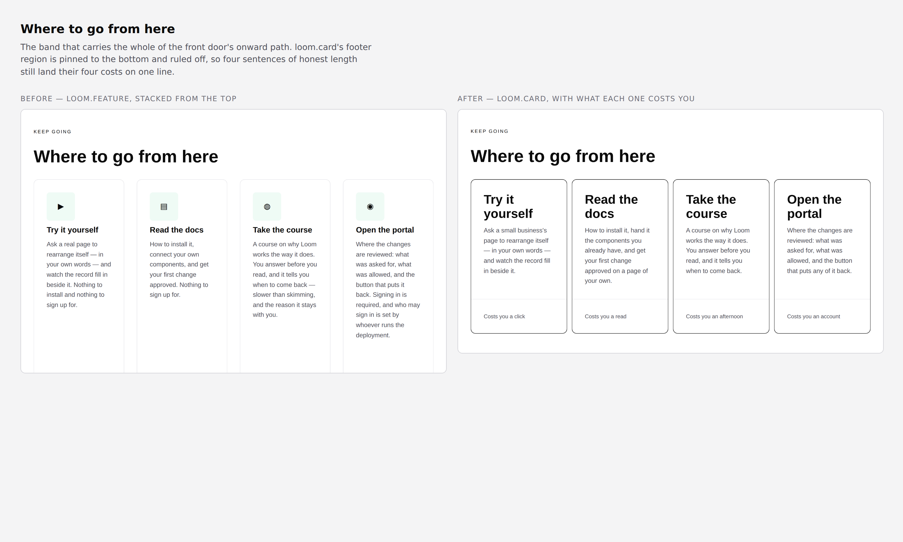
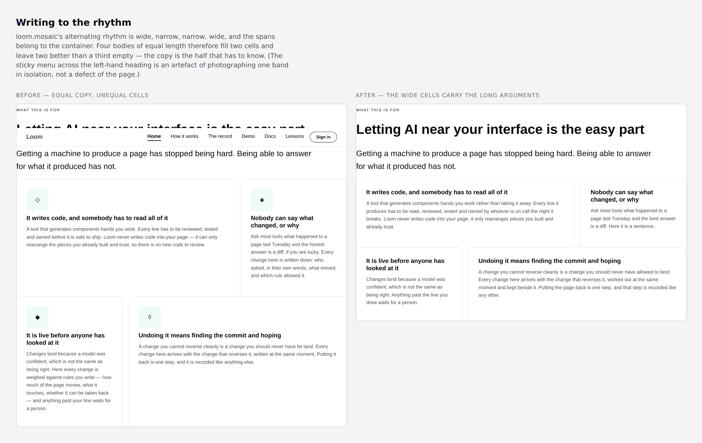
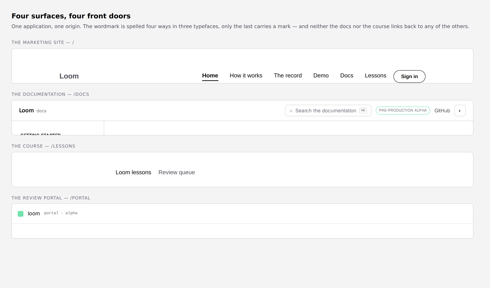
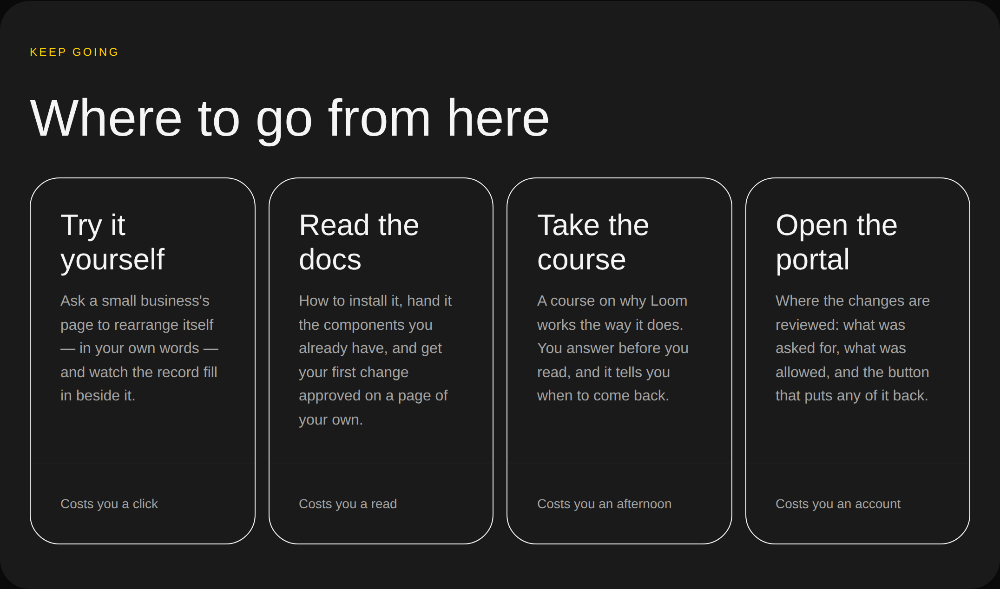


# 2026-08-25 — marketing: where to go from here

Ten runs have made this site deeper. Three pages, each of them further into the
mechanism than the last. This run is the first to open all four surfaces of the
product side by side and look at the front door the way a stranger meets it —
and the two bands that carry a visitor *onward* were the two worst-composed
things on the page.

---

## What shipped

Two bands of the front door, rebuilt, and the reason is the same in both:
**a container's layout is a fact the tree has to write to.** Neither band was
wrong about what it said. Both were written as if every cell were the same size
and every sentence the same length, and neither of those was true.

### The band that sends people onward

*Where to go from here* is the whole of this site's path into the demo, the
documentation, the course and the portal — the thing the maintainer's 18 August
decision makes this lane's job rather than a footer's. It was four
`loom.feature` tiles, whose interior is its props: a glyph, a title and a
sentence, stacked from the top. Four sentences of four honest lengths in one row
that stretches every card to the tallest, so **two of the four ran better than a
third empty.**

It is `loom.grid` over `loom.card` now, and the whole of the fix is a region
that already existed. `loom.card`'s `footer` is pinned to the bottom and ruled
off — its own note says why it is there: *a row of cards of unequal length still
has its footers on one line.* So each sentence may be as long as it honestly
needs to be, and the four cards land their four footers on one line.

**What is in the footer is the part worth arguing with.** Not a *learn more* —
what the destination costs you.

| | |
| --- | --- |
| Try it yourself | Costs you a click |
| Read the docs | Costs you a read |
| Take the course | Costs you an afternoon |
| Open the portal | Costs you an account |

That order is not a flourish. `PRODUCT_SURFACES` has been ordered by ascending
cost to the visitor since the list was written, and the reasoning has sat in a
comment ever since — visible to whoever edits the file and to nobody who reads
the site. It is the most useful thing four cards side by side can say, because
someone deciding where to click next is deciding how much of their afternoon to
spend.

It also **replaced a clause rather than adding one**. The portal's blurb used to
end *"Signing in is required, and who may sign in is set by whoever runs the
deployment"* — the band's promise that every card is honest about what is behind
it, said as a sentence only that card carries. *Costs you an account* is the
same honesty in four words, in the position a reader is already comparing along.
`site.test.ts` now holds that in both directions across all four surfaces, where
it held one surface in one direction before.

### The band that makes the argument

*What this is for* is four problems in a `loom.mosaic`, whose `alternating`
rhythm is **wide, narrow, narrow, wide**. The spans belong to the container and
the children are never told which cell they landed in, which is 0062's argument
and is right.

What follows from it is a job the tree has to do and had not: a wide cell is
twice a narrow cell's column width, so four bodies of roughly equal length come
out as two full cells and two cells half empty. The band that carries this
site's whole argument looked unfinished, and it had looked that way since the
mosaic landed on 21 August.

The two wide cells now carry the two long arguments at roughly twice the
characters of the narrow ones, and `pages.test.ts` holds **the ratio rather than
the wording** — because the wording will be edited by whoever is nearest the
sentence, and the failure is the silent kind: a shortened first body reads fine
in a diff and leaves a hole only a screenshot finds.

The glyphs went with it, in both bands. `◇ ◈ ◆ ◊` is four diamonds
distinguishable only by fill, and `▶ ▤ ◍ ◉` is four unrelated marks — decoration
that survived four rewrites of this page without ever meaning anything.
`loom.feature`'s own note says an icon *set* is a registry of its own; picking
single glyphs out of Unicode until they look about right is that note being
ignored.

## Four surfaces, four front doors

The brief names the shape to aim at — *a marketing root, docs at a path, the
signed-in product at another, all feeling like one thing.* This is the first run
to check, and the honest answer is that they do not. The wordmark is spelled
four ways in three typefaces; the portal is the only surface carrying a mark,
and it is the one a visitor reaches last.

Worse, and the reason it is filed rather than noted: **`/docs` and `/lessons`
cannot be left.** Neither links to `/`, to the demo, to the course or to the
portal from anywhere in its chrome. So the front door spends a menu and a whole
band sending people onward, and two of the four places it sends them are
one-way. A reader who follows *Read the docs*, is convinced, and wants the
demonstration has to edit the address bar.

`/portal` is the exception and is the pattern: an unconfigured deployment says
*"This portal isn't set up yet"*, offers the live demo, and offers *← Back to
Loom*. Filed for the two lanes that own the chrome, with this screenshot. The
half of it that is **this lane's** — the front door being the one surface with
no mark at all — is not filed against anyone and is the obvious next unit here.

## The one thing that shipped worse than it should have

**The card titles are 32px and they should be about 20px.**

`loom.heading` welds size to level — its own description says so, and
`STEP_FOR_LEVEL` is the whole mechanism. A card inside a `loom.section` whose
heading is level 2 gets a level-3 title, which is step 6: 32px in a card about
290px wide, so all four titles wrap to two lines and the nav band comes out
louder than the argument band above it.

The library already disagrees with itself about this: `loom.feature` renders its
title as a hard-coded `<h3>` at 20px. The same level renders at two sizes
depending on which primitive you go through, and only the wrong one is reachable
from a tree.

Three ways out were considered and all three are worse than shipping it:

- **Level 5** gives the right size and puts an `h5` directly under an `h2`. A
  marketing site that breaks its own document outline so a card looks right is
  not a trade to make quietly.
- **`loom.prose` instead of a heading** takes four destinations out of the
  outline entirely.
- **Three columns** fits the titles and leaves the fourth card alone on a second
  row — the exact failure this band removed a fifth card to avoid on 22 August.

So it ships at 32px, it is filed for `Loom primitives` with a suggested `scale`
prop, and it is the first thing to look at on the preview. On a phone the cards
are full width and the size is right; it is only wrong at four across.

## Tests

`pnpm install && pnpm verify` — **green, exit 0. Nothing failed, nothing
skipped, no test weakened.**

| suite | before | after |
| --- | --- | --- |
| `@loom/runtime` | 1647 / 106 files | **1647 / 106 files** — `src/` was not opened |
| `@loom/app` | 1777 / 123 files | **1780 / 123 files** |
| marketing, within it | 534 | **537** |

Three tests added and two rewritten. The rewrites are both strengthenings and
both are worth naming, because a test that changes in a diff deserves the
argument:

- **`site.test.ts` — what a guarded surface says.** It asserted that the
  portal's blurb contained the word *sign*. That passes a site where every card
  warns about signing in, which is the failure that matters now the warning is a
  short phrase in a fixed slot rather than a clause someone writes deliberately.
  It now holds all four surfaces in both directions: a surface says *sign* or
  *account* if and only if it is guarded.
- **`pages.test.ts` — copy inside markup.** `expect(home).toContain(blurb)`
  compared authored copy against rendered markup, and had been right by luck: no
  sentence on this site had ever contained a character React escapes. The demo's
  new blurb reads *a small business's page*, the apostrophe renders as `&#x27;`,
  and the assertion failed on a correct page. An escaping helper rather than
  relaxing it to a fragment — a test that looks for half a sentence passes a page
  that lost the other half.

The three new ones:

- **Every destination says what it costs, in the order they are offered.** The
  tree's order against `PRODUCT_SURFACES`' order, not against four expected
  words: the job is that the page agrees with `site.ts`, not that anybody's
  phrasing survives review.
- **The mosaic's wide cells carry more than 1.6× its narrow cells.** Verified by
  mutation, and the honest form of that result is worth recording: restoring
  **all four** of the bodies this band shipped with fails it, and restoring only
  the first one does not — 258 characters against a 133-character narrow cell
  still clears the floor. So it catches the band drifting back toward four equal
  paragraphs, which is the state it was actually in, and it is a floor rather
  than a guarantee. The threshold was left with headroom deliberately: a test
  that fails on every ordinary copy edit is a test people learn to change rather
  than to read.
- **No body exceeds the 280 characters `loom.feature` accepts.** Writing to the
  rhythm pushes the wide cells deliberately close to the cap, and an over-long
  body is a validation diagnostic rather than a thrown render — so it would reach
  the page as a cell that quietly did not draw.

Measured alongside: `scrollWidth` is exactly 390 at a 390px viewport, and both
bands were checked under all three registered palettes.

## Decisions and findings

**No record written.** Both changes are compositional and neither constrains
anything outside this lane. `src/` was not opened.

**One finding closed.** `Loom demo`'s 23 August entry — the front door promised
*"a real page"* for a demonstration that is now visibly somebody else's, a
physiotherapy clinic that says so in its own bar. Their suggested wording,
verbatim.

**Four filed.** Three are above: the four front doors, `loom.heading`'s welded
size, and a question rather than a complaint — *nothing on a linked card says it
is a link until you hover it, and a phone cannot.* Both card primitives signal a
link by hover alone, deliberately and for good reasons; the measurement is that
at rest, on a touch device, the front door's entire onward path offers no
visible evidence that any of it is clickable. This lane's cost line happens to
answer it for this band and is not a general answer.

The fourth is `FACTS`, for the fifth and sixth time — **#156 hit it twice
today**, once for three new primitives and once for a record. This report adds
one thing the previous four did not, which is why the cheap fix was not simply
taken here: `/` is a **dynamic** route, so deriving the record count means a
`readdirSync` inside a serverless function against a directory five levels above
the Vercel root. Making it safe reaches `next.config.ts` or the app's
`package.json` — files #157 has just ruled belong to other lanes. The one-line
fix is not one line. A third option is offered in the finding.

## Open questions

- **Positioning, audience and the licence line** (#96, restated on #134, #142
  and #150). The licence line is still the site's one placeholder and still
  gates Phase 2.
- **`FACTS`**, above. Fifth consecutive report.
- **The phone header is three rows**, filed 22 and 23 August. Unchanged here and
  no longer this lane's to wait on: #157 built the disclosure seam 0086 asked
  for and handed `loom.nav` to `Loom primitives` with the five steps.
