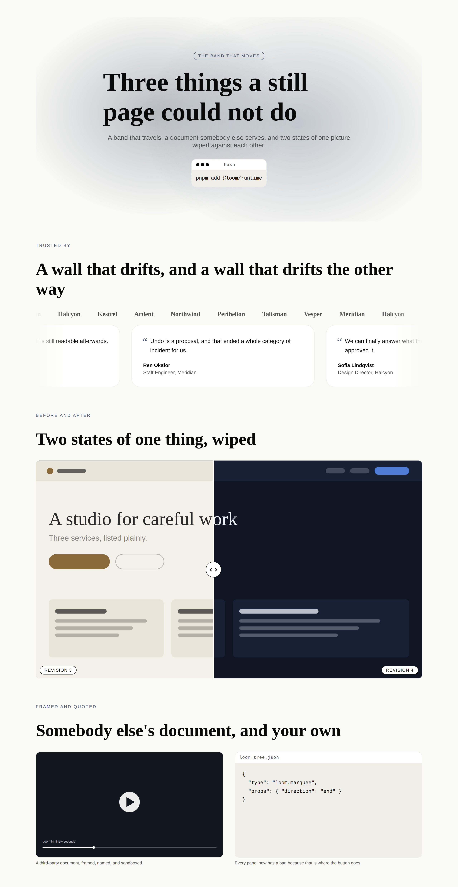
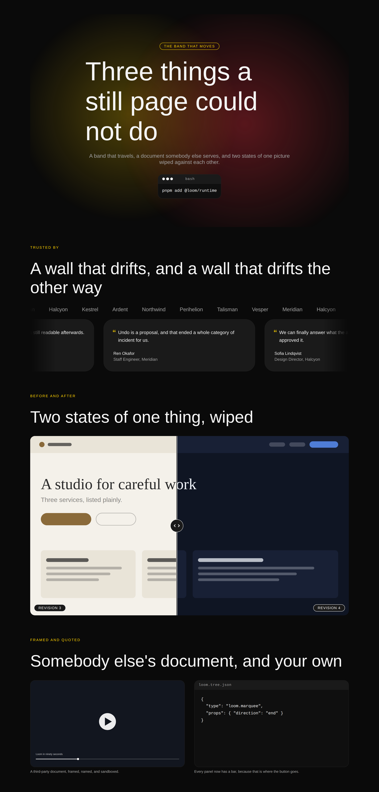
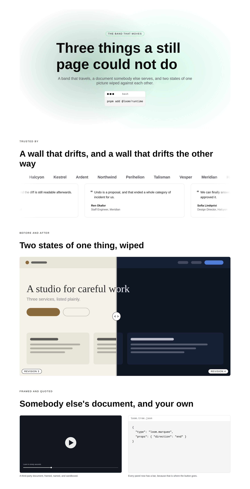
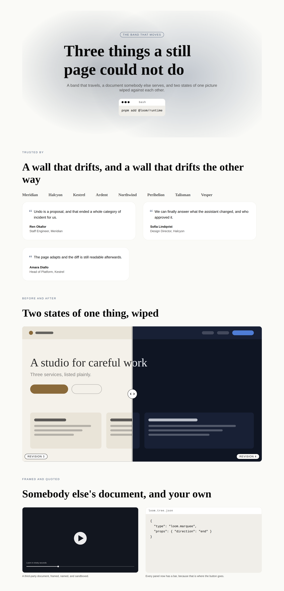
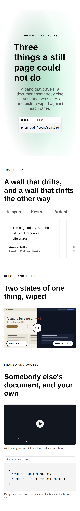

# 25 August 2026 — the band that moves, and the button that was waiting for a seam

**Routine:** `Loom primitives` · **Section:** §4b · **Branch:** `primitives-13-the-band-that-moves`

Three primitives — `loom.marquee`, `loom.embed`, `loom.before-after` — taking the
library from **61 to 64**, and a fourth thing that is not a primitive: the copy
button on `loom.code`, which is 0086's first consumer in this library and closes
the oldest open finding in this lane's queue. **The port map's *atomic to build*
table is now empty**, and one of its three verdicts turned out to be wrong in an
instructive way. One decision record, `0091`. Three defects found by screenshots
and by nothing else.

## Which primitives, and why those

**Because they are the three the brief names, and because after four runs of
building around the port map, the thing left in it was the part that pops.**

The brief's fourth category is *"atomic complex — the genuine exceptions where
behaviour cannot decompose: marquees, canvas effects, anything self-measuring"*,
and the port map's *atomic to build* table held exactly three rows: `marquee`,
`embed`, `before-after`. They had been left for last for four consecutive runs,
each of which built something the surfaces were more immediately blocked on. The
queue this run was different: with the prose and table layers landed, the open
findings owned by this lane were repairs and one request — the copy button —
that 0086 had made buildable three days earlier and nobody had built.

So: the three that close a table, plus the one that closes a finding. They are
also, not coincidentally, the four things on the list that a *still* page cannot
do at all, which is the coherence this unit has: **a band that travels, a
document somebody else serves, two states of one picture wiped against each
other, and a control that runs.**

**What this deliberately is not:** the six Hermes pairs — offerings,
credentials, episodes, books, listings, events. Five runs have now looked at that
list and built something else. The difference this time is that the reason has
changed: those six are genuinely next, and the only thing ahead of them was a
table that is now empty.

## The verdict the port map had wrong, and why it is worth writing down

`marquee` was listed as **atomic**, on the grounds that *"continuous animation
over its content; splitting produces nodes that mean nothing alone"*.

That is true of the **motion** and false of the **content**. A logo in a marquee
is a logo; it means the same thing standing still, and a quote in a ticker is
still a quote. What cannot decompose is the loop — there is no node that is "the
scrolling" — and the loop is a property of the *container*, which is exactly
0054's shape: a container named for the arrangement it puts its children in,
sitting beside `loom.stack`, `loom.grid` and `loom.mosaic`. It needed no new
child type at all, because every child type it wants was already registered.

The rule the row got wrong, stated so the next row does not:

> **Indivisible behaviour makes a primitive atomic only when the thing the
> behaviour acts on is also indivisible.**

An animated gradient is atomic because there is nothing underneath it. A marquee
is a container because there is.

The other two verdicts were right, and for different reasons. `loom.embed`
frames a document with no interior this library can address — 0052's
*nothing-interesting-inside* exception. `loom.before-after` superimposes two
regions rather than arranging them, so 0054 has nothing to say: there is no
arrangement to name.

## Which Hermes fields became nodes, and which stayed props

| Candidate | Verdict | Why |
| --- | --- | --- |
| `marquee.items` | **nodes** | 0052's opening clause. The whole correction above. |
| `marquee.speed` / `duration` | **neither — refused** | `docs/primitive-granularity.md` lists `animationSpeed` as a real prop and is right about *granularity*; 0055 refuses it on the other axis, because a duration is a number a model writes and the Gate weighs as one small reversible edit. See below for what replaces it. |
| `marquee.direction`, `density`, `edges` | **props** | Three renderings of however-many children there are. Changing one moves no child in or out. |
| `embed.src`, `title`, `aspect`, `caption`, `frame` | **props** | A leaf with no interior. `title` is **required and non-empty**, on `loom.media`'s argument for `alt` — and with no `decorative` escape hatch, because a document nobody should reach does not belong on the page. |
| `before-after`'s two images | **slots** | 0051. Each side is a region the primitive *places*, so the before side can be a `loom.media` with its own alt text and the after side can be a card. Two URL props would have made both unsayable to save two nodes. |
| `before-after.beforeLabel` / `afterLabel` | **props** | The one place on this primitive where 0052's fixed-field clause applies, and it is not the same call as the slots: a corner label authored *inside* the clipped layer would be cut in half by the wipe. |
| `before-after.position` | **prop** | A rendering of two fixed regions. Moving it adds no node and removes none — the sharper question the granularity doc says to ask. |
| `code.copy` (a prop to turn the button on) | **not a prop** | There is nothing to configure. The control is unconditional, so `interactive: "always"` rather than `{ whenProps }`. |

## The three things the design turns on

### A marquee's pace comes from its item count, because it may not come from the tree

0055 refuses a duration in the tree. Refusing it leaves a real problem rather
than solving one: a CSS loop translates a track by its own width over a fixed
duration, so **six logos drift and twenty sprint** — same declaration, three
times the linear speed. A primitive cannot measure its children, and a static
stylesheet cannot interpolate an index into a selector.

What CSS *can* do is count. `:has(> * > :nth-child(12))` is true of a run of
twelve or more, so the duration is enumerated once per count, ascending, and the
last matching rule wins. Fifteen rules of one declaration each, and a band that
moves at one speed whatever is in it with nothing in the tree naming a
millisecond. A browser without `:has()` gets the one-item duration and a slow
band, which is the right way to fail.

### The band holds still while the page is being edited — [0091](../decisions/0091-motion-stops-in-edit-mode-and-that-is-where-a-decorative-duplicate-belongs.md)

`loom.logo-cloud` has carried a paragraph since 19 August explaining why it does
not scroll: a seamless loop needs the run rendered **twice**, and two copies of a
node mean two elements carrying one `data-loom-node` — the failure 0051 rejected,
where a portal resolves an id to a copy and highlights a node that is not the one
the reviewer clicked. That reasoning is correct and it is why this library has
had no marquee.

The record's argument is deliberately *not* the id collision:

> **You cannot click a logo that is sliding past.**

A moving target is hostile to the one activity edit mode exists for. So the band
holds still exactly when somebody is editing it — one run, no echo, wrapped — and
travels when the page is published. `loom.editable` is present only in edit mode,
which makes that the whole test. The identity question then resolves as a
*consequence*, and that ordering is the point: a rule justified only by an
implementation problem gets argued away the moment the implementation changes.

What falls out is a property rather than a hope — **a decorative duplicate exists
only where identity attributes do not** — and a test asserts it across five
fixtures, not just the marquee's own.

The cost is real and visible: the portal's preview does not show the motion.
Whoever looks at the band can see it is still. The silent version of this — motion
that plays and resolves clicks to the wrong copy — would be much worse and much
harder to find. The seam that would remove the trade-off entirely is filed for
`src/render/`.

### An `iframe` src is a whole document, and a scheme allowlist is not enough for one

Every other URL in this library reaches an `href` or an `img src`, which is why
0053 has been sufficient. `loom.embed`'s reaches an `iframe`, chosen by a model.

The primitive sets the narrowest defaults it can alone — a three-token `sandbox`
with no forms, no downloads and no top-level navigation; `referrerPolicy` that
sends the origin and never the path; an explicit four-capability `allow`. What it
cannot do is know *which origins this deployment is willing to frame*, which is
per-deployment and belongs beside the endpoint registry, nor notice that
`allow-scripts` with `allow-same-origin` is a sandbox only because the framed
document is cross-origin. Filed with a concrete recommendation rather than
guessed at.

## Three defects the screenshots found and eighteen tests did not

**Every one of them came from looking at the page**, which is now the third
consecutive run to say so.

### The divider that vanished under `bold`

`loom.before-after` drew its divider, its handle and its two corner chips in
`bg-surface`, on the argument — written into the file — that a palette's paper
always contrasts with its ink. It does, with its *ink*. Not with a photograph.
`bold`'s surface is near-black, and over a dark screenshot the seam disappeared
entirely: the two states butted together with nothing between them.

No palette slot fixes this, because the thing being contrasted against is content
the primitive did not choose and cannot sample. What works on any ground is an
**edge**: a fill in the palette's surface inside a one-pixel ring of its ink. On a
light photograph under a dark palette the ring reads; on a dark one the fill
does. One of the two is always visible, and the pair costs one `box-shadow`.
Asserted by a test that counts the rings, so it cannot come back quietly.

### The still band that wrapped into one item per line, five hundred pixels tall

Found in the edit-mode screenshot, which exists in this run precisely because
0091 introduced a second rendering and a second rendering nobody looks at is a
second rendering that is wrong.

The still variant made the track a **flex** container with the run as a flex item
set to `flex: 1 1 auto; flex-wrap: wrap`. A wrapped flex container that is itself
a flex item has its height computed from its single-line content and then
overflows — three quote cards at 151px each, laid out inside a box the browser
had already decided was 516px tall. The fix is one word: the still track is
`display: block`, so the run is an ordinary block-level flex container and wraps
the way anything else does.

### The quote card that was wider than the phone it was on

At 390px a `loom.quote` card's natural width is around 580, so the marquee — which
correctly does not shrink its children, because a scrolling band does not — showed
a card whose borders were both off-screen and which read as loose text lying on
the page.

The cap is `max-inline-size: min(32rem, 80cqi)`, and the unit is the finding.
`cqi` measures the **band's** inline size, not the viewport's. This lane filed
*`loom.mosaic` reads the viewport where it should read its container* against
itself on 21 August, so the second primitive to want a container measurement takes
the container. A test asserts there is no `vw` in the rule.

## The copy button, and the one consequence beyond the button

`loom.code` declares `behaviours: ["copy"]`, declares the two strings the control
takes its name from, declares itself `interactive`, and places what the runtime
hands it. It implements nothing — 0086's bargain — and the whole of its part is
deciding *where the button goes*.

That decision has a visible consequence. The panel's bar used to appear only for
a `terminal` tone or a named `language`. A button floated over the code would sit
on the first line of a snippet whose whitespace *is* the content, so **the bar now
appears whenever the panel does** — which means a plain `loom.code` renders one
row taller than it did yesterday, and a copyable panel always has somewhere to say
what it is. Filed for the three surfaces that render code.

The second consequence is `interactive: "always"`, which means the Gate will now
refuse a code panel nested inside a linked `loom.card` — a `<button>` inside an
`<a>`, where a browser silently drops one of the two. Nothing in the repository
does that today.

**The control renders nothing on the server**, by 0086's design: it appears from
an effect once `navigator.clipboard.writeText` is actually there. So it is absent
from every screenshot above, and that is correct rather than broken.

## What the library still cannot express

- **A marquee cannot travel in edit mode**, and the seam that would let it — a way
  to render a subtree with the renderer's decorating switched off — is `src/render/`'s.
  Filed with the shape it would take.
- **A wipe cannot be dragged.** It needs a second member of the behaviour
  vocabulary, and an interesting one: unlike `copy`, this control would have to
  hand a *number back* to the primitive that placed it, which is a real design
  question. Filed rather than faked, on the same principle that kept the copy
  button out until there was somewhere for it to come from.
- **An embed cannot be checked against anything but its scheme.** Filed.
- **A marquee cannot pause on a tap.** It pauses on hover and on focus-within, and
  a touch device has neither. The honest note rather than a gap worth closing.
- **A `<tfoot>`, a cell that spans two columns, a red callout, and a relative
  internal link** — all still open, all from previous runs, none of them this
  unit's.

## Verification

`pnpm verify` green from the repository root, exit 0: **1665 runtime tests across
106 files, 1777 application tests across 123 files, 0 skipped.** Nothing was
weakened to get there. Eighteen of the runtime tests are new, all in the new
`the band that moves` block, plus two rewritten where the change made an older
assertion false — the code panel's bar, and the registry's own roll call.

Two files outside `src/primitives/` had to change and both are counts another
lane holds against the registry with its own test — `FACTS.primitives` `"61"` →
`"64"` **and `FACTS.decisions` `"90"` → `"91"`**, and `reference.generated.json`
regenerated with `pnpm --filter @loom/app docs:api`. Both recorded in
`FINDINGS.md`. The record count is the fifth such edit in seven days and is
already filed twice by other lanes; deriving both numbers from
`STARTER_PRIMITIVES.length` and a directory listing would end it, and is
`Loom marketing`'s call.

One small refactor came with the work rather than for its own sake:
`loom.media`'s three named aspect ratios moved to `layout.ts`, because
`loom.embed` and `loom.before-after` need the same three and a second copy of
`16 / 9` is a rewrite away from disagreeing with the first. `auto` stayed on
`loom.media`, where it means something.

## The preview

**The deployment is green and its address could not be read from here.** Vercel
reports `Deployment has completed` on `e408395`, and the only URL the commit
status carries is the build page —
<https://vercel.com/jpizzolato36-6341s-projects/loom/DbiqnyP3XZnGijupF8GNaGtsXC6Q>
— which is the inspector rather than the preview. The branch alias is not
derivable: previous ones carry a hash segment (`loom-git-primitives-12-the-t-def545-…`)
that nothing in the status or the API exposes to this session, and `*.vercel.app`
is outside the egress allowlist, so it cannot be probed either. `Loom docs` filed
exactly this on 23 August — *the preview URL, unreachable from the routine that
has to publish it* — and this is another occurrence.

What stands in for it is the five screenshots above: the specimen rendered
through `renderLoomTree` under all three registered palettes, the same page in
**edit mode**, and one at a true 390px. That is the surface these three
primitives are; the preview would show them as the docs and marketing surfaces
compose them, which is a different and also useful thing.

## 21st.dev

**Blocked for the eighth time**, across five lanes now. `docs/routines.md` still
lists it under `permissions.allow`; `WebFetch` returns `EGRESS_BLOCKED`. Recorded
rather than quietly skipped, so nobody reads this and assumes the visual standard
was consulted. The recommendation is unchanged: fix the allowlist, or drop the
line from the briefs.

Calibration was against `loom.hero`, `loom.feature-grid` and `loom.code` — the
floor the brief names — and against the five screenshots. Three of the run's
defects came from those and from nothing else.

One correction to a previous run's note, recorded because the workaround costs
something: the 24 August report says this Chromium "will not lay out narrower
than 485", so its phone screenshot was taken through an iframe. That is not true
of `/opt/pw-browsers/chromium` driven with `viewport: { width: 390 }, isMobile:
true`, which reports a 390px client width and lays out correctly. It matters
because the nested-iframe route did not finish loading images and frames before
the screenshot, and a band that looked empty was the harness rather than the
primitive.
