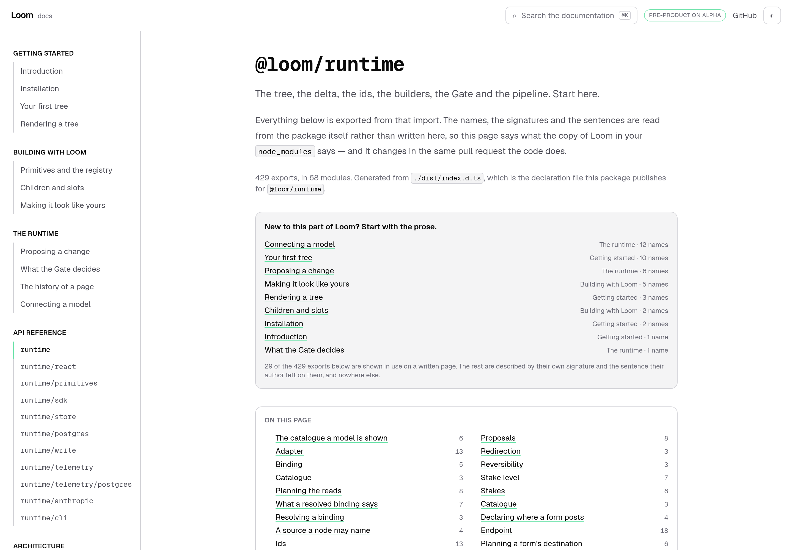
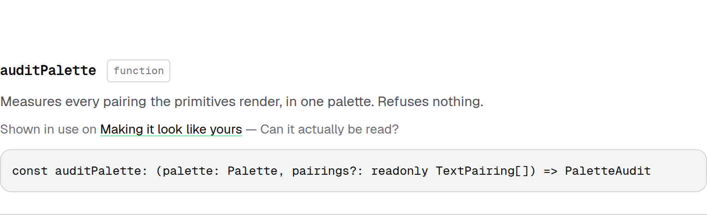
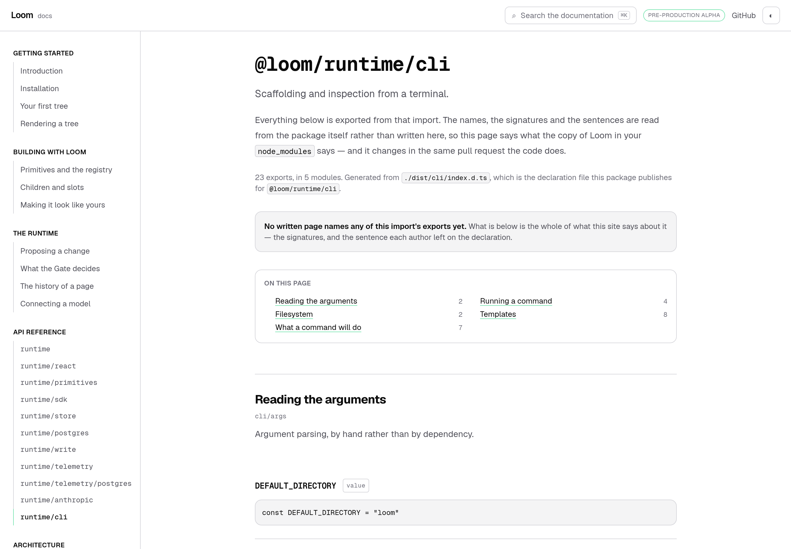
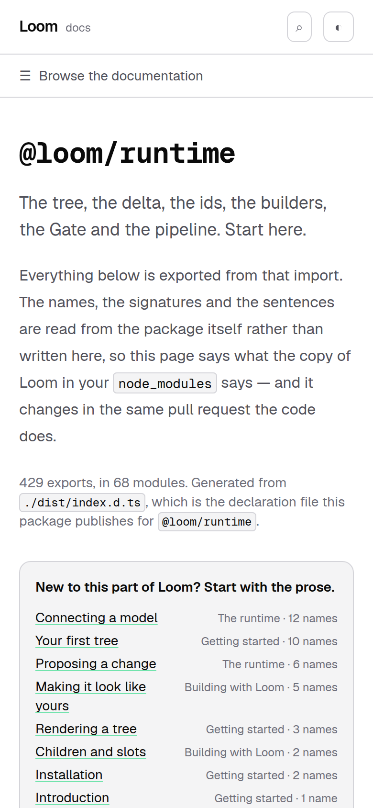
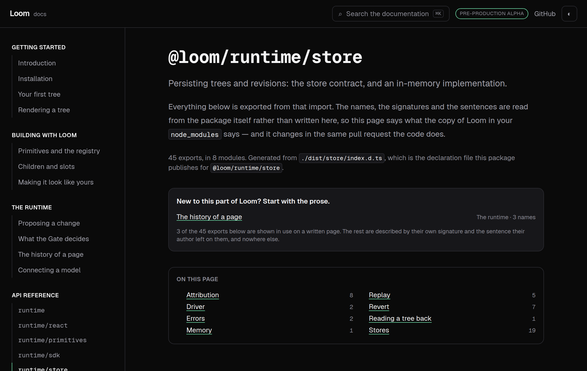

# 26 August 2026 — where a name is explained

**Routine:** `Loom docs` · **Branch:** `docs-11-where-a-name-is-explained` · **Section:** §4c

The API reference has been generated from the published entry points since it
shipped, and that is the right call — a hand-written one is wrong within a week
and nothing goes red when it happens. What it bought, and what nobody had
noticed, is that **a generated page can only say what a declaration file says.**

A reader searches for `auditPalette`, lands on `@loom/runtime`, and gets a
signature and one sentence. Somewhere else on this site is a page that spends
four paragraphs on what a composed failure is and prints the runtime's own audit
lines. The reference had no way to point at it. That was the open question at the
end of the last two docs reports, named both times as the next thing worth a run.

## What shipped

**A link from every export back to the pages that show it in use**, and a band
at the top of each reference page offering those pages before the list of names.

Both come from one index, and the index is **derived rather than written**. A
hand-maintained map from export to page would be wrong within a week for exactly
the reason the reference is generated in the first place. So the site reads the
only evidence that cannot lie: **the written pages already print these names**,
in fenced blocks and in backticks. A page that stops naming an export stops being
offered for it in the same commit; a page that starts naming one is offered from
then on, and nobody is told to update anything.

That is the whole of it: *`auditPalette` → Making it look like yours → Can it
actually be read?* — the section that explains what the numbers under it mean.

## The wording is the part I would defend hardest

The page says **"Shown in use on"**. It does not say *explained on*, and the
difference is not fussiness.

What the site knows is that the page prints this name in code. Whether the page
*teaches* the export is a judgement nobody made. All 43 links today happen to
land in a real discussion — I checked every one by hand — and nothing keeps that
true as pages are written. A link that promised an explanation and delivered a
code block would be worse than the silence it replaced, because a reader who
follows one bad link stops following them.

So the claim on the page is exactly the claim the evidence supports, and the gap
between that and what a reader might want is filed rather than papered over.

## The number is on the page, not just in this report

**43 of 801 published names appear in code on a written page.** Every reference
page prints its own share of that: *29 of the 429 exports below are shown in use
on a written page. The rest are described by their own signature and the sentence
their author left on them, and nowhere else.*

A band that listed three links and stopped would let a reader take those three
for a documented entry point. This is the same rule the theming page's contrast
audit follows, and it was settled there for the same reason: **printing only what
clears the bar is how a page tells a comfortable lie without writing a false
sentence.**

Which is also why the band is present when it has nothing to offer.

`cli`, `write`, `telemetry` and `telemetry/postgres` — 110 exports — have no
prose anywhere on this site. A reader who lands on one and is told so stops
looking. A reader shown nothing goes hunting through a sidebar that was never
going to have it. The full table is in `FINDINGS.md`, with the two pages I would
write next and in what order.

## Three rules with a wrong answer, and the tests that hold them

The matcher is small and every part of it is a decision:

**A name behind a full stop does not count.** `result.ok` is a property read on a
value; the `ok` this package exports is the function that made it. They share a
spelling and nothing else. Without this, `ok` would be "shown in use" on most of
the site.

**Only code counts** — a fenced block or a span between backticks. The
alternative is matching prose, and prose is where a page says *"the registry"*
and means the idea rather than `createPrimitiveRegistry`. Backticks are how this
site already draws that line, on every page, without being asked.

**The first mention on a page wins, and it belongs to the nearest heading above
it** — including a heading's own backticks, which belong to that heading rather
than to the one before it. A reader following the link wants the place the page
*starts* talking about the name.

Each is held against markdown written to exercise it rather than against
whichever page happens to exercise it today, which is `headings.ts`'s pattern and
is what stops another lane's ordinary work turning this one red — the failure
mode the lessons routine filed against this directory on 24 August.

## Tests

`pnpm install && pnpm verify` at the repository root, **green, exit 0. Nothing
failed, nothing skipped, no test weakened.**

| Suite | Files | Tests | Change |
| --- | --- | --- | --- |
| `@loom/runtime` | 108 | 1695 | unchanged — `src/` was not opened |
| `@loom/app` | 133 | 1911 | 132 / 1880 on `main` |

**31 new tests**, 24 in one new file and 7 added to the reference component's.
`next build` clean across all five route groups.

Three were verified by mutation, because a test that has never failed is a claim
rather than a check:

- dropping the full stop from the identifier pattern fails *"does not count a
  property read that happens to share a name"*, and only that one
- applying a heading only from the *next* line fails *"counts a heading's own
  backticks under that heading"*, and only that one
- moving the prose band below the contents list fails *"offers the written pages
  before the list of names"*, and only that one

The claims worth naming:

- every href the index produces is a page that exists, checked against `nav.ts`
- every anchor it produces is a heading really on that page, checked against the
  same reader the search index uses — a link to a heading that is not there does
  not fail, it lands the reader at the top of the page and looks like the feature
  simply is not very good
- every key in the index is a name the package publishes
- a name's pages come out in the site's reading order, so an introduction is
  offered before a page four sections later
- the index names more than one page, which is the guard against a reader that
  silently read one file and stopped

## Two things the screenshots and a browser probe caught

**The list needed its own reset, and I checked rather than assumed.** The
25 August finding says `.not-prose` is not a cascade barrier in this sheet. It is
still true after #155 narrowed the table selector: a bare `<ul>` inside
`.not-prose` computes to `display: flex`, `padding-left: 20px`,
`list-style: disc`, measured in the browser rather than reasoned about. The
comment in the component now says the measured values and which utility answers
which, because the previous version of that comment would have taught the next
reader something very slightly false — the disc does not currently render, since
these rows are flex items, and it would the day one of them stops being one.

**Dark and 390px both checked before the pull request, not after.** The band
carries `bg-surface-muted`, which is the one functional fill this theme keeps in
both modes.

`document.documentElement.scrollWidth` is exactly 390 at a 390px viewport.

## Scope

`apps/loom/app/(docs)/` only — two files changed, one route changed, two files
added. **No file in another lane was opened this run**, which is worth recording
because three of the last four documentation runs had to touch one and explain
it. `src/` was not opened, `reference.generated.json` was not regenerated because
the runtime's surface did not move, and no new primitive was needed: the reference
pages are docs-site chrome in 0067's sense, which is the same footing they have
been on since they shipped.

## No framework gaps

Everything this needed already existed in the docs lane — `nav.ts`, the
generated reference, `headingAnchor` and `REPOSITORY_ROOT`. Nothing was asked of
`@loom/runtime` and nothing was worked around.

## Open questions

**Whether a written page should declare what it teaches.** The derived index is
the right answer today and it has a stated ceiling: it cannot tell an explanation
from an appearance, and it cannot see a page that says *"the registry"* and means
`createPrimitiveRegistry`. The shape that closes it is a short list in each page's
front matter, checked against the reference by a test — a small hand-maintained
map with a red test behind it rather than a large one with nothing. It is worth
doing only once the derived version is visibly wrong, and today it is not. Filed.

**The two pages the zeroes ask for.** Writing an accepted change back
(`@loom/runtime/write`) is the largest real gap on this site: it is a thing every
deployment must do and there is not a paragraph about it anywhere. That is what I
would spend the next run on.

