---
# A control that hands back a number

**Date:** 2026-08-26 · **Routine:** `Loom daily build` · **Section:** §4b ·
**Branch:** `framework-14-a-control-that-hands-back-a-number`

## The maintainer's comments, first

None to address. #165 went up this morning with two comments of mine on it and
no reply yet; it is green, its preview is Ready, and it is waiting on review.
Nothing was polled and nothing was scheduled to poll it.

## The migration, before anything else

**Still done, and it was done before this run started.** `apps/loom` holds the
four route groups plus `(demo)`, `apps/portal` and `apps/docs` are gone,
middleware guards the `(portal)` boundary and the whole thing deploys as one
Vercel project. The tree is not half-migrated in any respect. Four routines can
keep reading that as settled.

## What was done, in plain language

`Loom primitives` filed a finding on 25 August: **a wipe cannot be dragged.**
`loom.before-after` puts its divider where a prop says and leaves it there, and
both pure-CSS routes to moving it are worse than the gap — `resize: horizontal`
gives a grab area of sixteen corner pixels drawn by the browser that no palette
can reach, and CSS cannot read an `<input type="range">` at all, so a range
input cannot drive a clip. The primitive declined to ship a handle that looks
draggable and is not, which is the same refusal `loom.code` made about a fake
copy button, and asked for a behaviour instead.

The finding was right that this is a behaviour, and right that it is not shaped
like the two that exist. `copy` acts on the node's text, read off the tree.
`disclose` acts on nothing — it stamps its state on its own button and the
primitive's rule decides what open and closed mean. Both are complete in
themselves. **A drag produces a number that another part of the primitive's
layout is a function of**, and the finding could not decide from its own lane
how that number should get there.

It gets there through CSS, and the reason is a fact about CSS that decides the
whole design: **a custom property is visible to the element it is set on and to
that element's descendants, and to nothing else.** The layer a wipe clips is the
control's *uncle* — a sibling's subtree. So the value has to be written to a
common ancestor, and the runtime is not allowed to go picking one: reaching into
markup the primitive owns is what 0086 refused when it refused to read the DOM
for the copy text.

So the primitive says which box, and the runtime writes there:

- `data-loom-drag` on the box enclosing both the control and whatever moves with
  it. Presence is the whole signal; the attribute's value is never read.
- `--loom-drag` on that same box, seeded by the primitive with the position it
  already renders, then overwritten by the control as a **unitless number from 0
  to 100** — so a rule multiplies it by `1%` for a clip or by `1px` for anything
  else, rather than being handed a length whose meaning the runtime guessed.

That ordering is what makes the still version survive. The number is in the
server's markup, so a page that never hydrates is exactly the wipe that ships
today, at the position the prop says; and the control **reads without writing**
on mount, so nothing moves when scripting arrives.

The control itself is a real slider — `role="slider"` with the ARIA value
attributes, focusable, arrows by one, page keys by ten, `Home` and `End` to the
extremes, pointer capture for the drag, and both the pointer and the left/right
keys mirrored under `direction: rtl`, because a wipe is clipped from the inline
start and a right-to-left page mirrors the whole comparison. It measures against
the **scope's** box rather than its own, which is the difference between an edge
that follows your finger and one that crosses the picture in a centimetre.

**One new fault became possible, so it is checked.** A control placed inside no
marked scope renders, takes focus, follows the pointer and moves nothing —
present, and useless, which is worse to find on a page than a control that is
simply missing. `probePlacement` now reports it as `unscopedBehaviours` and
`auditRegistry` carries it beside `unplacedBehaviours`. The check is generic: a
behaviour declares `scope` in the vocabulary and gets the probe for free.

Two defences, not one: a control that finds no scope at runtime stays the inert
`hidden` placeholder it renders before hydration.

## Decisions nobody specified, and why they went this way

- **A custom property rather than a callback.** The shape a React developer
  reaches for first, and it fails on 0009: the primitive would hold state,
  re-render its layers on every pointer move, and need `"use client"` of its own
  — which is the thing 0086 keeps inside the runtime. A property moves the edge
  without React knowing anything happened.
- **A marked scope rather than `parentElement`.** One line shorter and no new
  concept, and it makes the primitive's box model part of the contract silently:
  place the control inside a chip and the number lands in the chip, with nothing
  anywhere saying so.
- **The full 0–100 sweep**, wider than the primitive's own 5–95 prop bound. That
  bound is about what a *proposal* may write; a reader dragging to the end is
  looking at one picture on purpose.
- **The runtime draws the grip, and draws it two-tone** — a surface fill with a
  one-pixel ring of ink — because this is the one control in the vocabulary that
  sits by definition on content the page did not choose. `loom.before-after`
  learned that in an hour on 25 August when a single-colour divider vanished into
  a dark screenshot under `bold`.
- **`drag`, not `wipe` or `before-after`.** It publishes a number into a scope;
  a split pane or any range-shaped comparison would take the identical control.

All five are recorded in
[0094](../decisions/0094-a-behaviour-may-publish-a-number-into-a-scope-the-primitive-marks.md)
with what was rejected.

## Records

- **0094 — A behaviour may publish a number into a scope the primitive marks.**
  Accepted. Index regenerated.
- Nothing superseded. 0086 is extended by it, not contradicted: a behaviour is
  still a control the runtime builds and a primitive places, and this is the
  first one that also needs the primitive to say a word first.
- **The number collided again, and again it was forced.** `main` carries records
  through 0093, so 0094 is the next free number there, which is what the brief
  says to take. #164 and #165 are both open with an 0094 of their own. Taking
  0095 is not available: `pnpm decisions:index` fails on a gap, so the PR would
  open on red. Whichever of the three merges after the first has to renumber.
  Sixth or seventh instance; the finding proposing a fix is open and owned by the
  maintainer.

## Findings

**Closed:** *a wipe cannot be dragged, and the behaviour vocabulary has one
member* (`Loom primitives`, 25 August). The seam is built and the design
question it raised is answered.

**Filed:** *the drag seam is built, and `loom.before-after` is the primitive it
was built for*, for `Loom primitives`, with the markup to write, the four things
worth knowing before taking it, and an explicit offer: **if the runtime's grip is
wrong for that primitive, say so and this lane will reshape it.** That is the
ergonomics test a seam with no consumer has never had, and it is cheapest now.

## Open questions

- **A seam with one caller and no user, again.** `drag` is tested by its own
  tests and nothing else, which is exactly where `submit` and `frames` were when
  they shipped. Two of the three now have a consumer; this one does not yet.
- **Nothing writes the reader's number back to the tree**, deliberately. A drag
  is a view of a comparison, not an edit of it. If a portal ever wants "set the
  divider where I left it" that is a proposal, and it is a different feature.
- **`aria-valuetext` is `"62%"`.** A per cent sign is not a word in anybody's
  language, but it is a formatting choice the text seam does not cover. If a
  deployment ever needs it spoken differently, that is a fourth string on the
  behaviour.

## Test numbers

`pnpm install && pnpm verify` — **green**, on the head that was pushed.

| suite | files | tests | skipped |
| --- | --- | --- | --- |
| runtime (`src/`) | 109 | 1717 | 0 |
| application (`apps/loom`) | 132 | 1880 | 0 |

**23 new tests** — 15 on the control in jsdom (server output, the placeholder
outside a scope, the starting number, publication, both key sizes, clamping,
pointer geometry, the right-to-left mirror, one element and no wrapper) and 8 on
the seam (the vocabulary is three, which behaviours require a scope, three
registration refusals, and three audit cases including a wipe that places its
control and marks nothing).

Nothing was weakened, skipped or deleted to get there. Three existing
expectations changed, all the same edit: a `probePlacement` verdict asserted
whole now carries one more empty list.

**Two files outside this lane changed, both because their own tests said to.**
`apps/loom/app/(docs)/_lib/api/reference.generated.json`, regenerated by
`pnpm --filter @loom/app docs:api` because two new exports appear in the
reference. And `apps/loom/app/(marketing)/_lib/copy.ts`, whose `FACTS.decisions`
went 93 → 94 by hand — at least the sixth recorded instance of a routine outside
marketing bumping that literal to keep `main` green. Deriving it from a directory
listing at build time ends it; the finding is open against `Loom marketing`.
