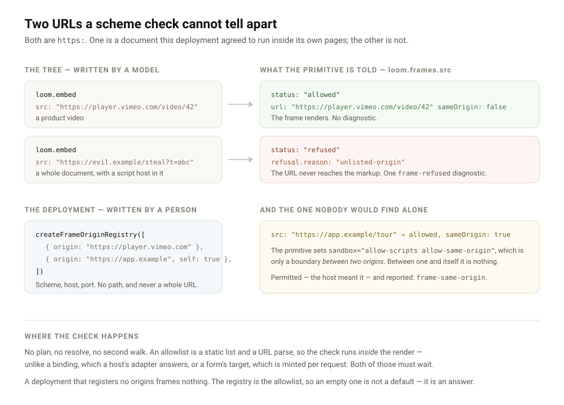

---
# A frame names an origin somebody permitted

**Date:** 2026-08-26 · **Routine:** `Loom daily build` · **Section:** §3, §4b ·
**Branch:** `framework-13-a-frame-names-an-origin-somebody-permitted`

## The migration, first

**It is done, and it was done before this run started** — same as yesterday.
`apps/loom` is on `main` with five route groups, `apps/portal` and `apps/docs`
are gone, sign-in is middleware at the `(portal)` boundary, and there is one
deployment. Nothing in the tree is half-migrated. `pnpm verify` on `main` at
`cc7f6c0` is green.

There were no maintainer comments to address. One pull request is open, #164,
and it belongs to `Loom primitives`; its two comments are that routine's own
report and a note about markdown images, neither addressed to this lane. Nothing
was touched on it.

## What was done, in plain language

One finding from my queue, filed by `Loom primitives` on 25 August: **an
`iframe` src is a whole document, and the only check on it is its scheme.**

`loom.embed` shipped last week. Every other URL in the library reaches an `href`
or an `img src`, which is why 0053's scheme allowlist has been enough for them —
the worst a bad `https:` link does is disappoint whoever clicks it. An `iframe`
src is a whole document with a script host in it, running inside the page, named
by a model. `https://collect.example.com/harvest` passes every check the system
had.

The primitive did what a primitive can do alone — the narrowest `sandbox` a real
provider needs, a `referrerPolicy` that does not hand a private preview URL to
whoever is being framed, four media capabilities rather than inheritance — and
its own doc comment says precisely what that leaves undone. This run built the
rest.

### A deployment says whose documents it will run

`createFrameOriginRegistry` takes a list of origins and a line about each.
`renderRequest` takes it as `origins`, beside `sources`, `themes`, `text` and
`endpoints`. A primitive declares `frames: ["src"]` and reads `loom.frames.src`,
which is `allowed` — carrying the normalised URL, its origin, and whether it is
this deployment's own — or `refused` with a reason. **It never receives the raw
prop through this seam.**

The recommendation in the finding was an embed-origin registry "shaped like the
endpoint one". It is, with **one inversion that is the whole design**, and it is
worth stating because it is the part somebody would otherwise get wrong.

A form's address never appears in a tree at all (0065), because where a
visitor's data goes is not a content decision. A frame's URL is *entirely* a
content decision — which video, which map — and a registry of whole URLs would
mean somebody registers a URL every time a marketing person uploads a video. The
registry would quietly become a content table maintained by whoever runs the
servers. So **the tree keeps the URL and the registry holds the origins**: a
deployment says once, and means forever, whose documents it is willing to run.

### The half nobody would have found

The finding's second item was the one I did not expect to be able to close:

> **Notice when the sandbox is inert.** `allow-scripts` with `allow-same-origin`
> is only a sandbox *because* the framed document is cross-origin. A host that
> embeds its own origin gets nothing from it and nothing in the render can tell.

It can now, and the reason is small: the registry is the only thing in the
system that knows what *own* means for this deployment. An origin registered
with `self: true` is permitted — a host that wrote that meant it — and raises a
`frame-same-origin` diagnostic. That is **the only diagnostic in the renderer
raised for something that worked**, and it is deliberate: this is the one place
that can notice a sandbox is decoration, and noticing silently is the same as
not noticing.

### Where the check happens, and why it is not a fourth resolution pass

The obvious build is a plan and a resolve step, symmetrical with data and
submissions. It would be wrong. A binding is answered by a host's adapter and a
form's target is minted per request, so both may do IO and neither can happen
inside a synchronous walk (0008). An allowlist is a static list and a URL parse.
Building the second walk anyway buys nothing and costs a pass that can disagree
with the first about which props are framable.

So the check runs **inside** the render. That is the one structural difference
from the two seams this is modelled on, and it is why the seam is about a third
the size of `src/submit/`.

## Decisions I made that nothing specified

- **`frames` is a list of prop names, not a `true`.** The runtime has to know
  *which* string to check and cannot infer it: a `src` reaching an `iframe` and
  a `src` reaching an `img` are the same JSON. The registry refuses a `frames`
  naming a prop the schema does not declare — the same check
  `interactive.whenProps` gets, with more riding on it, because a frame
  declaration drifting off a renamed prop fails **open**.
- **The seam fails closed.** No registry means every frame refused, with a
  diagnostic saying so. The registry *is* the allowlist, and a default of "frame
  it" would make this a formality every host has to remember to switch on. It
  also means the refusal path is what every unconfigured deployment sees, which
  is the point below about `loom.embed`.
- **An origin is scheme, host and port, and a path is refused rather than
  ignored.** `https://example.com/embed` reads as an allowlist scoped to a
  directory. An origin check cannot scope to one, and an allowlist that silently
  permits more than it appears to is worse than none. Credentials are refused
  for the same reason — `new URL` drops them from `origin` without complaint.
- **The URL handed to the primitive is normalised through `URL`.** What the
  browser resolves has to be the string the allowlist checked; echoing the prop
  back verbatim would make the check advisory.
- **Two outcome states, not three.** A submission has a third expressed by
  absence — a form nobody gave a target. A frame has no equivalent: the URL is
  in the props, so a node either carries one or renders no frame.
- **The audit takes the author's word about `frames`,** and this is the one
  place it does. The registry already refuses a declaration naming a prop the
  schema lacks; the failure left over — a primitive that frames a prop it never
  declared — is invisible to a probe, because a frame built from an undeclared
  prop looks exactly like one built from a declared prop. Catching it needs a
  lint over markup, not a call of the component. Written down rather than left
  as a gap somebody discovers.
- **The conformance probe answers a declared frame with `allowed`.** A probe has
  no allowlist. Answering `refused` would mean probing every embed's error state
  and reporting it as the primitive. The URL is a marker origin nobody can
  register, so one escaping into real markup is recognisable rather than being a
  plausible video that never loads.

## Records

- **Added:** [0094 — A frame carries its URL, and the deployment carries the
  origins](../decisions/0094-a-frame-carries-its-url-and-the-deployment-carries-the-origins.md),
  Accepted. Index regenerated.
- **Superseded:** none. 0053 is unchanged and still correct — a scheme allowlist
  is the right check for an `href`; this is the check it was never going to make.

**On the number, and it needs saying plainly.** `main` carries records through
0093, so 0094 is the next free number *on `main`*, which is what the brief says
to take. The open #164 also adds an 0094. The index generator fails on a gap, so
taking 0095 would have opened the pull request on red. **Whichever of the two
merges second has to renumber**, and the collision is now the fifth or sixth
recorded instance of the same friction; the finding proposing a fix for it is
open and owned by the maintainer.

## Findings

**Closed one, owned by this lane:** *an `iframe` src is a whole document, and
the only check on it is its scheme* (filed by `Loom primitives`). Both halves
built. The recommendation was followed with the origins-not-URLs inversion
described above.

**Filed one, owned by `Loom primitives`:** the seam exists and `loom.embed` does
not use it yet — two lines and a branch. The entry is deliberately long about
the part that is not mechanical: **after this change, an embed on a deployment
with no allowlist renders a refusal**, so what a refused embed *looks like* is
the real work, and `loom.code` declining to fake a copy button is the precedent.

**Also edited, outside this lane and for the usual reason:**
`apps/loom/app/(marketing)/_lib/copy.ts`, `decisions: "93"` → `"94"`. A
one-digit edit by a routine outside marketing to keep `main` green — at least
the fifth recorded instance, and the finding asking for the count to be derived
at build time rather than asserted as a literal is still open and still owned by
`Loom marketing`. Leaving it red would block four surfaces over two digits.

`apps/loom/app/(docs)/_lib/api/reference.generated.json` was regenerated with
`pnpm --filter @loom/app docs:api`, as its own test instructs, because the
published surface gained a module.

## Open questions

- **A seam with no consumer has had its ergonomics tested by nothing but its own
  tests.** That was true of the submission seam when it shipped too, and it is a
  real cost rather than a formality: if `loom.frames.src` is awkward to read in
  a primitive, the cheapest time to reshape it is before there are two callers.
  Said so in the finding.
- **An allowlist says who a deployment trusts, not what they serve.** Nothing
  here helps if a permitted origin is compromised. It replaces "any host on the
  internet" with "these four", which is the whole of what it claims — worth
  writing down so nobody reads more into it.
- **A fifth registry to wire.** `renderRequest` now takes `sources`, `themes`,
  `text`, `endpoints` and `origins`. The `LoomDeployment` object bundling them,
  recorded as worth considering under 0065 and still not built, is more worth
  considering than it was. Not built here: it is a change to every composition
  root and belongs in its own review.
- **Whether the Gate should weigh a change of frame origin.** A `configure`
  moving a `src` from a permitted origin to an unpermitted one now renders a
  refusal rather than a hostile document, so nothing leaks — but "this embed
  stopped working" is a stake factor and it is reported as an ordinary prop
  change. The same question 0065 left open about a change of destination, and
  left open here for the same reason.

## Test numbers

`pnpm install && pnpm verify`, green, on
`framework-13-a-frame-names-an-origin-somebody-permitted`:

| suite | result |
| --- | --- |
| runtime (`vitest run`) | **1730 passed**, 111 files, 0 failed |
| application (`@loom/app`) | **1880 passed**, 132 files, 0 failed |
| `tsc --noEmit`, `tsc -p tsconfig.build.json` | clean |
| `next build` | clean |

**35 new tests**, all in this lane: 11 in `src/frame/origin.test.ts`, 12 in
`src/frame/resolution.test.ts`, 9 in `src/render/frame.test.ts`, 3 added to
`src/sdk/audit.test.ts`. Nothing was skipped, weakened or deleted.

Four suites failed during the run and all four were the change's own
consequences rather than defects, each named above or here: two doc-comment
conventions in `documentation.test.ts` (a record number written into a published
sentence, and a new module with no opening paragraph — both fixed in the source,
not in the test), the marketing fact count, and the generated API reference.

## Token discipline

One branch, one unit, one pull request. **No follow-up scheduled and no
self-check-in armed.** The pull request will be auto-subscribed by the harness;
I will unsubscribe rather than claim not to be subscribed, per the standing
finding on that wording.
