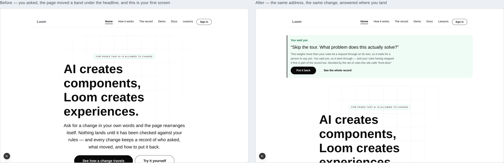
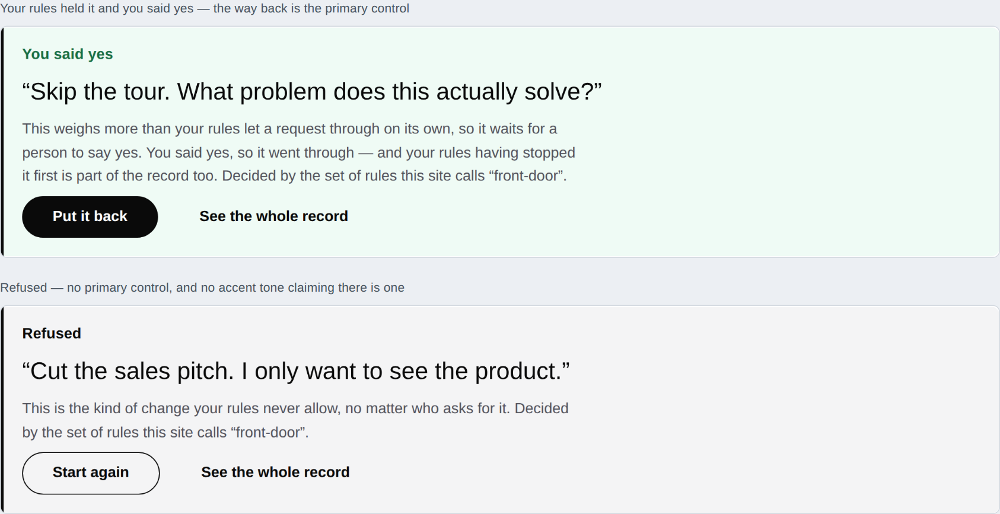
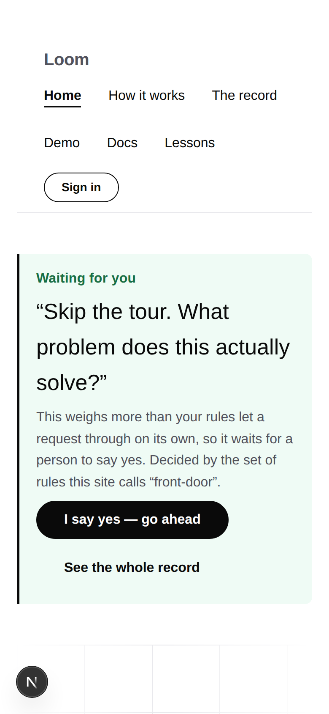
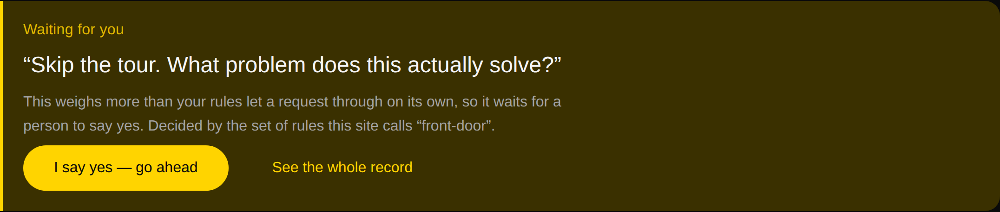

# 2026-08-26 — marketing: what you asked for, before you scroll

Eleven runs have made this site deeper, and this is the first one to click a
button on it and watch what a visitor actually sees.

The band that lets someone ask the front door to rearrange itself has worked
since 22 August. It works now. What nobody had checked is what happens in the
half-second after the click — and the answer is that **the browser puts the
reader at the top of the document, and the top of the document is a hero 880px
tall that is identical in every state.**

Both of those are `/?ask=problem&approve=1`. On the left, the visitor has asked
*"Skip the tour. What problem does this actually solve?"*, the rules held it, the
visitor said yes, and the page really did lift the whole band about what Loom is
for to just under the headline — eleven pieces, one step, reversible, recorded.
Their first screen is byte for byte the screen they arrived on.

The one thing on this site a competitor cannot copy was happening below the fold.

---

## What shipped

**One band, and it only exists for a visitor who has asked for something.**

A `loom.callout` above the opening band carrying three things: the verdict as its
title, the request in the visitor's own words, and what the rules decided —
followed by the one control the moment calls for.

It is the **headline of the record, not a second copy of it.** The panel further
down owns the five steps: what was asked, what the change was worked out to be,
how much of the page it moved, which rule decided, and what putting it back would
restore. This says the two things that are useless 1,200px further down — what
the rules decided, and what you may now do about it.

### Every word of it is the record's

Nothing in the new module composes a sentence about what happened. The title is
`record.verdictLabel`, the quote is `record.asked`, the sentence is
`record.verdictLine`, and the control is chosen by `record.awaitingYou` and
`record.landed`. That is the assertion the band has to earn: a notice at the top
saying *allowed* while the panel two screens down says *waiting for you* would be
this site failing at the exact claim it makes, and it is the failure a screenshot
review cannot catch, because the two are never on screen together.

`answer.test.ts` holds it against the run's own record rather than against
expected copy, in all ten states — five requests, each of them also approved.

### The control is the one the rules are waiting for

| The rules said | Above the fold |
| --- | --- |
| Waiting for you | **I say yes — go ahead** |
| You said yes / Allowed | **Put it back** |
| Refused | Start again |
| Nothing to do | Start again |

The panel's *Start again* is deliberately **not** repeated beside a held change.
Up here the question is "will you allow this?", and offering the way out beside
the way through turns a decision into a pair of exits. The panel below still has
both, where the reader has the whole record in front of them.

### The one thing that shipped worse before it shipped better

**The first version painted a refusal green.** `tone: "accent"` for every verdict
and `neutral` only for *nothing to do* — which is defensible in a sentence and
wrong on a screen: *Refused* and *You said yes* rendered identically apart from
one word, on the band a reader reads fastest.

The library has two callout tones and **no red**, deliberately: a Loom palette
declares an accent, a secondary brand and neutrals, and none of them means
danger. That is a recorded decision and the right one. So a refusal cannot be
painted as a refusal — but it must not be painted as an approval either.

The rule that replaced it makes the tone track the *action* rather than the
sentiment, which is something a palette can honestly say: **the accent tone and a
primary control are the same claim, so the band wears one if and only if it
offers the other.** Held and landed hand the visitor a decision and are accent;
refused and nothing-to-do hand them nothing and are an aside. The title carries
the verdict, and it is the only thing that does.

That is checkable, and it is checked.

### What it hands over instead of an anchor

The band wanted a *read the whole record* link pointing at the panel below it,
and a Loom page **cannot link to itself**. The address half is fine —
`linkUrlSchema` would pass `#see-it-happen` without complaint — and no primitive
in the library renders an `id` for it to reach. Filed for `Loom primitives` with
a suggested `anchor` prop and the three decisions that come with it; not worked
around, because the workaround is a local component and this lane does not get
one.

What it offers instead is `/the-record?changes=…`, which replays that exact
request from the published front door. That is a better destination for a record
somebody might send to a colleague, and a test follows the address the band
actually writes — through `readChangeSequence`, the same reader the route uses —
and holds the replayed verdict against the one the visitor was just shown.

## The page a stranger arrives at is unchanged

Node for node. The band is spread in conditionally and there is no record on
arrival, so `/` is the tree it has always been — which matters more than it
sounds, because that is the tree every crawler, every share preview and every
first impression gets.

Two assertions rather than one, and the second is the one worth having: the band
is absent, **and** the menu is still child 0 and the opening band still child 1.
An empty spread that quietly reordered something would pass the first check on
its own.

On a phone the whole answer — verdict, request, reasoning and both controls — is
on the first screen without scrolling. `scrollWidth` is exactly 390 at a 390px
viewport in all five states, and the band was checked under all three registered
palettes.

## Where it sits, and why not inside the hero

Above the opening band rather than in it, and the reason is a rule this site
already lives by. `loom.hero` has an unused `media` region and putting the answer
there was the first idea. It is wrong twice:

- **The opening band is a demonstration.** *Turn it down* is one of the five
  requests and its entire content is configuring `backdrop` and `stature` on that
  exact node. A band whose props are the thing being demonstrated must not also
  be a status display, and a tree that pre-set either prop would make that choice
  a no-op — the page quietly losing one of the four kinds of change it claims to
  show.
- **The geometry runs the wrong way.** With a media region the hero becomes two
  columns, so the text column narrows from 704px to about 590px and the headline
  goes from three lines to four. Measured before it was written: it would have
  made the band ~290px *taller*.

Above it, the notice is the first thing under the menu in every state, which is
where a browser leaves a reader who has just followed a link. That is the whole
requirement.

## Tests

`pnpm install && pnpm verify` — **green, exit 0. Nothing failed, nothing skipped,
no test weakened, and no existing test changed.**

| suite | before | after |
| --- | --- | --- |
| `@loom/runtime` | 1695 / 108 files | **1695 / 108 files** — `src/` was not opened |
| `@loom/app` | 1880 / 132 files | **1932 / 133 files** |
| marketing, within it | 537 | **589** |

Fifty-two new tests in one new file, and no existing test touched. Two of the
site's standing suites already cover the new band without being edited, which is
worth naming because it is the lane system working: `adapt.test.ts` holds the
reserved vocabulary and the one-`h1` rule against the **served** page in all ten
ask states, so the band inherited both the moment it existed. A second copy of
the reserved-word list in the new file would have been a second list to keep in
step, and the one that drifted would be the one nobody was reading — so it is
not there, and a comment says why.

**Three of the new assertions were verified by mutation**, because a test that
has never failed is a claim rather than a check:

- Dropping the approval from the record link's address (`approved: false`) fails
  *hands over an address that replays to the same verdict* on all five approved
  states, and only those.
- Painting every verdict `accent` fails *wears the accent tone if and only if it
  hands the visitor something to do* on the refusal, in both its states.
- Moving the band below the hero fails *answers above the opening band* on all
  ten.

The remaining honest limit: **`nothing-to-do` is never reached from a fresh front
door**, because all five requests change something on a page nobody has touched.
The tone rule is asserted for it in code and exercised only through the refusal.
It is reachable from `/the-record` after the same request twice, and holding it
there belongs to that page's suite rather than this one.

## Decisions and findings

**No record written.** The band is compositional, adds nothing to the library,
and constrains nothing outside this lane. `src/` was not opened and no file
outside `apps/loom/app/(marketing)/` changed except `FINDINGS.md` and this
report.

**Two filed, both for `Loom primitives`, both above.**

- **A tree cannot point at a band of its own page.** The scheme allowlist would
  accept a fragment; nothing renders an `id`. An `anchor` prop on the band
  primitives, with the three decisions that come with it named.
- **The opening band takes the whole first screen, measured.** 880px, menu to
  1036px, both calls to action at 866–926px against a 900px fold. This lane has
  no lever: the headline is the maintainer's and its size is welded to its level,
  the text measure is a module constant rather than a prop, and `stature` is
  spoken for by *Turn it down*. Three ways out offered, in preference order.

**None closed.** Nothing in the queue was answerable from this lane this run.

## Open questions

- **Positioning, audience and the licence line** (#96, restated on #134, #142,
  #150 and #163). The licence line is the site's one remaining placeholder and
  still gates Phase 2. Nothing here touched it.
- **`FACTS`** — not hit this run, and unchanged since the 25 August entry. Sixth
  occurrence stands; three options are on it and the choice is not a routine's.
- **The phone header is three rows**, filed 22 and 23 August, visible in the
  screenshot above. Handed to `Loom primitives` with 0086's disclosure seam on
  #157 and not this lane's to wait on.
