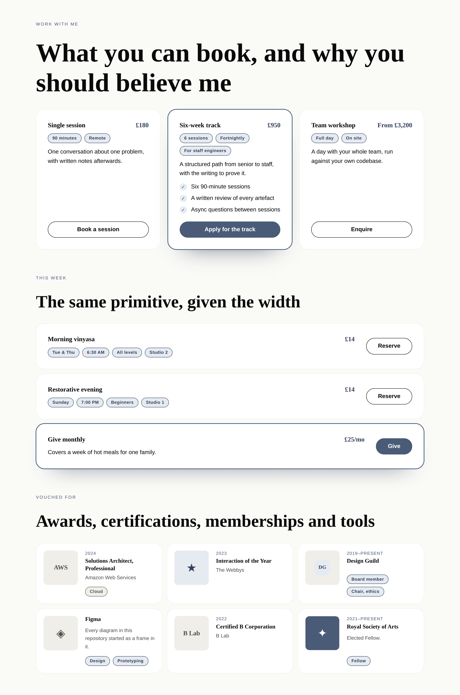
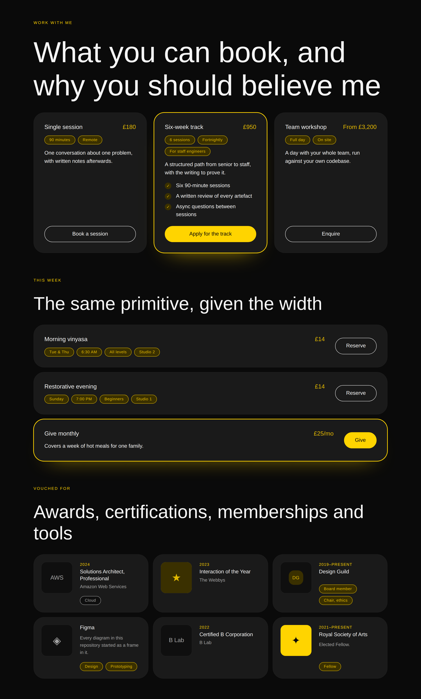
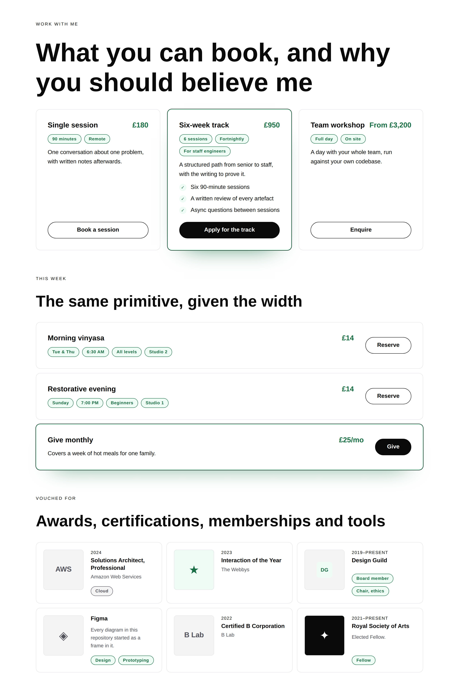
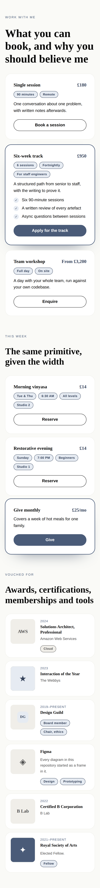

# 26 August 2026 — what you can book, and why you should be believed

**Routine:** `Loom primitives` · **Section:** §4b · **Branch:** `primitives-14-what-you-can-book`

Two pairs — `loom.offering-grid` / `loom.offering` and `loom.credential-grid` /
`loom.credential` — taking the library from **64 to 68** and the Hermes port
from **46 of 70 settled to 62 of 70**. Eleven blocks in one run, which is the
largest single move the port has had, because eleven of them turned out to be
two records. One decision record, `0094`, forced by the two pairs disagreeing
about the same field on the same day. Two defects found by screenshots and by
nothing else.

## Which primitives, and why those

**Because the port map's *pairs to build* table had six rows and these two were
eleven of its nineteen blocks**, and because the previous run emptied the
*atomic* table and said in as many words that the six pairs were "genuinely
next, and the only thing ahead of them was a table that is now empty."

Within the six, these two rather than the other four:

- **Things booked** is seven blocks — `services`, `coaching-packages`,
  `mentorship-tracks`, `donation-tiers`, `class-schedule`,
  `volunteer-opportunities`, `restaurant-menu` — the largest collapse remaining
  anywhere in the ledger, and the band a marketing site actually sells from.
  Nothing in the library could say *here is what you can buy and here is the
  button* except `loom.tier`, which is a pricing table and wrong for six of the
  seven.
- **Credentials** is four more, and it is the other half of the same page:
  `loom.logo-cloud` could show that clients exist and nothing could say what a
  person is certified in, elected to, or works with.

They also sit on opposite sides of 0066 — an offering is **acted on**, a
credential is **read** — which made them the right two to build together, and is
how the run found the question 0094 answers.

**What this deliberately is not:** episodes, books, listings and events. Those
are four pairs over eight blocks, all of them one card in one grid, and none of
them is a band the demo or the marketing site stands on this month.

## Which Hermes fields became nodes, and which stayed props

| Candidate | Verdict | Why |
| --- | --- | --- |
| `includes`, `outcomes` (newline-separated strings) | **nodes** | 0052's opening clause. A list that never got to be one; a `loom.perk-list` of rows, which is `loom.tier`'s call about `features` unchanged. |
| `duration`, `format`, `day`, `time`, `level`, `location`, `instructor`, `dietary`, `skills` | **nodes** | Nine fields across seven blocks, all of them a short qualifier beside the name, and **there is never exactly one**: a class has a day *and* a time *and* a level *and* a room. `loom.badge` in a `meta` region — `loom.product`'s call about `format`/`itemCount`, and 0052's own argument about `hours-of-operation`'s seven weekday fields. |
| `description`, `impact`, `desc` on an offering | **nodes** | 0052's third clause, and **0094**: the card already has a flow, so prose held as a prop beside that flow could never be moved below it. |
| `role` (affiliation), `category` (tool) | **nodes** | A board seat is a role and a chair is another; a tool is *Design* and *Prototyping*. Badges in `meta`. |
| `badge` / `logo` / `image` on a credential | **a region** | The one place the port improves on Hermes rather than transcribing it. Three fields, three blocks, all bare URLs — and a URL can express exactly one rendering. See below. |
| `btnText` + `link` | **a region** | A `loom.action`. A primitive that reimplemented a link as two props would be a second call to action with its own copy of 0053's allowlist to keep in step. |
| `name`, `price` / `amount` | **props** | Exactly one per record. `price` is free text for the reason `loom.tier` gives and Hermes learned: a donation tier's ask and a menu's "Market price" are the same field, and no number with a currency prop beside it says either. |
| `emphasis` | **prop** | Two renderings of however-many children there are. Changing it moves no child in or out — the sharper question the granularity doc says to ask. |
| `note` on a credential (Hermes' `why`) | **prop** | **0094 read the other way.** A credential has no repeated part, so it has no flow, so its one sentence has nowhere to be a node *among* — which is exactly 0059's multi-string leaf. |
| `issuer` / `organization`, `year` | **props** | One issuer, one year. `year` is free text and never parsed, the call `loom.article`'s `kicker` and `loom.milestone`'s `marker` both make: a parsed date refuses "2019–present". |
| `columns` on either container | **prop** | A floor and never a count. Nothing truncates either band, so changing it changes no node. |

## The three things the design turns on

### One card that reads as a menu row when it is given the width — and no prop says so

The seven blocks the offering pair ports want **two different bands**. Services,
packages and tracks are a grid of cards. A class schedule, a volunteer roster and
a restaurant menu are full-width rows with the price at one end and the control
at the other. Those are not the same layout, and the obvious answers are both
wrong:

- **Two primitives** — `loom.offering` and `loom.offering-row` — is 0054's
  arrangement word attached to the wrong half of the pair, and doubles the
  catalogue entry a model has to choose between for one content model.
- **A prop** — `layout: "card" | "row"` — is a value an author has to keep in
  step with the *grid's* `columns`, in two places, forever. Set them
  disagreeing and you get three menu rows squeezed into a three-column grid, and
  nothing in any projection or screenshot shows it.

It is neither, because it is **a question about how much room the card was
given**, and the card can ask it. `loom.offering` declares
`container-type: inline-size`, and one `@container (min-width: 40rem)` rule
turns the frame inside it from a column into a row and cancels the `auto` margin
that pins the control to the floor. The same node, with the same props, is a
card in a three-column grid and a row in a single column. The `columns: "one"`
that makes a schedule is the *only* thing anybody sets.

Two mechanics are worth knowing before the fourth primitive reaches for this,
and both are commented in the source:

1. **A container query reads its ancestor, never itself.** The element that
   declares the containment cannot be the element the rule flips, so there is an
   inner `loom-offering-frame` `
` for the rule to reach. It is markup
   rather than a node, and it is the kind of thing that gets refactored away by
   someone who does not know why it is there.
2. **Nothing about the frame may be set inline.** `stylesheet.ts` says an inline
   style beats a rule in that file, and here three values — the frame's
   direction, the action's start margin, the gap — are all cancelled by the
   `@container` block. A test asserts the frame's opening tag carries no `style`
   at all.

This is the **third** primitive to want a measurement of its own container
rather than of the viewport, after `loom.marquee`'s `cqi` item cap and
`loom.mosaic` — which reads the viewport where it should read its container and
has been filed against this lane since 21 August. Filed again with the pattern
named, and deliberately not fixed here: changing a shipped primitive's layout
under a width nobody has photographed belongs in a run with the screenshots to
prove it.

### A credential's mark is a region, because Hermes' URL could only ever be one thing

Hermes holds the same field three ways — `badge` on a certification, `logo` on an
affiliation, `image` on a tool — and every one of them is a bare URL that renders
as an ``. That is one rendering, and this library already has four better
ones: `loom.logo` holds a wordmark back to grey until it is pointed at,
`loom.avatar` rounds and rings a face and falls back to a monogram,
`loom.icon` draws a glyph for an award that never had a picture, and
`loom.media` carries its own alt text.

So it is a slot (0051 — the card *places* it, at a leading edge the flow of
children does not go), and it is `loom.before-after`'s argument reached again:
two URL props would have made both sides unsayable to save two nodes. The
specimen has all four kinds in one wall and they line up, which is the
observable payoff and the reason the box is a **fixed square** rather than
shrink-to-fit: a wordmark, a round badge and a glyph are three different widths,
and four cards in a row would start their names at four different places.

### 0094, which neither pair could have found alone

`loom.tier` holds its description as a `loom.prose` **child**, citing 0052.
`loom.article` holds its excerpt as an `excerpt` **prop**, citing 0059. Both
citations are correct and the two records do not contradict each other — 0052 is
about a block's prose, 0059 about a leaf's strings. What was missing was the
test for which of the two a given card is, and five more card pairs are going to
ask it.

Building `loom.offering` and `loom.credential` on the same day forced it,
because they are the same content model to within their words and the honest
answer for one is not the honest answer for the other. The rule
([0094](../decisions/0094-a-cards-prose-is-a-child-when-the-card-has-a-flow.md)):

> **Ask whether the card has a children flow at all. It has one exactly when its
> content model has a repeated part.**

An offering has an includes list, so it has a flow, so its sentence is a node
*in* that flow and "put the blurb under what's included" is one `move`. A
credential has no repeated part at all, so there is nothing to reorder the
sentence against, making it a node buys no reachability, and 0059's leaf applies
unchanged. Both shipped cards were already right; the argument has stopped being
made twice in two files, and the audit's leaves list is now exactly the set of
cards whose prose is a prop.

## Two defects the screenshots found and eighteen assertions did not

**Both came from looking at the page**, which is now the fourth consecutive run
in this lane to say so.

### The year that wrapped a name onto three lines

`loom.credential` put its year as a trailing chip on the name's own row —
`justify-content: space-between`, a résumé's arrangement, and a good-looking one
in the first render. In a **three-column** wall the text column is about 240px
wide, the year takes ninety of them, and every credential whose name ran past
three words broke to three lines with the year stranded on one of its own.

The interesting part is that the obvious fix does not work. `flex: 1 1 auto` with
`min-inline-size: 0` on the name looks like it should let the name narrow and
keep the pair on one line, and it does not, because **a wrapping flex row decides
wrapping before it decides shrinking**. Switching the row to `nowrap` does fix it
— and it is still the wrong answer, because a name and its date competing for one
line is a competition the name has to win at every width.

So the year is a **kicker above the name**, which is `loom.article`'s vertical
rhythm reached for the second time in the library, and the competition is gone
rather than resolved. Asserted by document order rather than by pixels, because
the order is the fix.

### The issuer that read as a link it was not

`loom.credential` set its issuer line in `accent`, which is what
`loom.article` does with a kicker and what gives a card of grey text some life.
On a credential it is wrong, and the reason is 0066: the **whole card is a
link** here, by way of the stretched name anchor. Accent-coloured *words* sitting
beside the name read as a second link, and clicking them goes to the card's
destination rather than to whatever the reader thought "Amazon Web Services"
was. Under `bold` — where accent is a saturated yellow — it was unmissable.

The colour did not go away, it moved: the issuer is `fg-muted` and the **year**
carries the accent. A year is unmistakably not a destination, and the card keeps
its one piece of colour.

## The naming change, which is 0054 applied rather than overruled

The port map proposed `loom.offering-list` and `loom.credential-list`. Both
shipped as **`-grid`**, because 0054 says the arrangement word names *what the
container does with its children*, and what both of them do is
`repeat(auto-fit, minmax(…))` — the same expression every other `-grid` in the
library uses. 0054's own consequence is the reason to get it right now: a
container that changes its arrangement changes its name, and a rename is a
breaking change to every stored tree. The port map's four remaining rows are
marked as predictions rather than commitments for the same reason.

`loom.offering-grid` also carries a **local** column vocabulary — `auto | one |
two | three` — where `loom.credential-grid` takes the shared `COLUMN_NAMES`.
That is not a preference. The shared names are `auto | two | three | four`, and
four offerings across is never a band anybody wants, while the arrangement that
*is* wanted for three of the seven blocks — a single full-width column — has no
name in it at all. `loom.perk-list` set the precedent for a local vocabulary and
gave the same reason. `one` is the arrangement at which a `loom.offering` becomes
a row, which is why the two decisions are really one.

## What the library still cannot express

- **A mosaic still measures the screen where it should measure its container.**
  Filed 21 August, filed again today with the pattern the offering pair
  establishes. Not fixed here on purpose.
- **A schedule cannot sort or filter itself.** A class list is the first band in
  the library a reader would plausibly want to narrow — by day, by level — and
  that is client-side state, which the runtime has no seam for. It is the same
  wall `tabs` hit in the port map, and this is a second block behind it.
- **An offering cannot say it is sold out.** `loom.perk`'s `state` is the shape
  the answer would take — a closed set of renderings, one `configure` to switch —
  but it is a real content decision about what the closed set is (`available`,
  `waitlist`, `full`, `closed`?) and it should be made against a real page rather
  than guessed at. Left out rather than invented.
- **A credential cannot be verified.** `href` points at a verification page and
  the card cannot say whether anybody checked. That is a binding (0058) rather
  than a prop, and it is the right shape for it.
- **A `<tfoot>`, a cell spanning two columns, a red callout, a relative internal
  link, a draggable wipe, an embed checked against more than its scheme** — all
  still open, all from previous runs, none of them this unit's.

## Verification

`pnpm verify` green from the repository root, exit 0: **1706 runtime tests
across 108 files, 1880 application tests across 132 files, 0 skipped.** Nothing
was weakened to get there. Ten of the runtime tests are new, all in the new
`what you can book, and why you should be believed` block, plus three updated
where the change made an older assertion false — the registry's roll call, its
count, and the audit's leaves list.

One existing test was **extended rather than weakened**, and it is worth naming
because the line is thin. `closes every block in the library stylesheet` walks
the stylesheet asserting no rule body contains a `{`, skipping the at-rules that
legitimately nest — `@media`, `@supports`, `@keyframes`. `@container` is a
fourth one, and it is added to that list. The test's actual property — that a
missing `}` cannot silently swallow the rule after it — is untouched, and the
brace-balance half of it still covers the new block.

Two files outside `src/primitives/` changed and both are counts another lane
holds against the registry with its own test: `FACTS.primitives` `"64"` → `"68"`
and `FACTS.decisions` `"93"` → `"94"` in
`apps/loom/app/(marketing)/_lib/copy.ts`, with `reference.generated.json`
regenerated by `pnpm --filter @loom/app docs:api`. Filed in `FINDINGS.md` for
the seventh consecutive day, now with a second document showing the same
failure — the port map's own three totals disagreed with each other before this
run and are corrected in the diff.

## The preview

Opened with the pull request; the address is the `vercel[bot]` comment's alias,
which `pull_request_read` with `method: "get_comments"` returns in full. Read it
from there rather than from the commit status, which carries only the inspector
URL — that is the correction the 25 August report made and it holds.

The five screenshots above remain the primary evidence, because they are the
library's own specimen under every registered palette, in edit mode, and at a
true 390px, which is what these four primitives actually are. **Both of this
run's defects came from them and from nothing else.**

## 21st.dev

**Blocked for the ninth time**, across five lanes. `docs/routines.md` still
lists it under `permissions.allow`; `WebFetch` returns `EGRESS_BLOCKED`.
Recorded rather than quietly skipped, so nobody reads this and assumes the
visual standard was consulted. Calibration was against `loom.hero`,
`loom.feature-grid` and `loom.tier` — the floor the brief names — and against the
screenshots.
