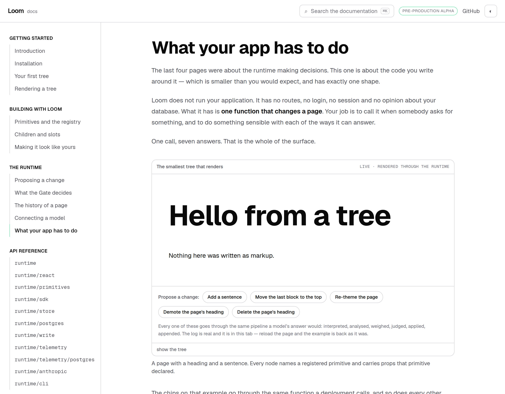
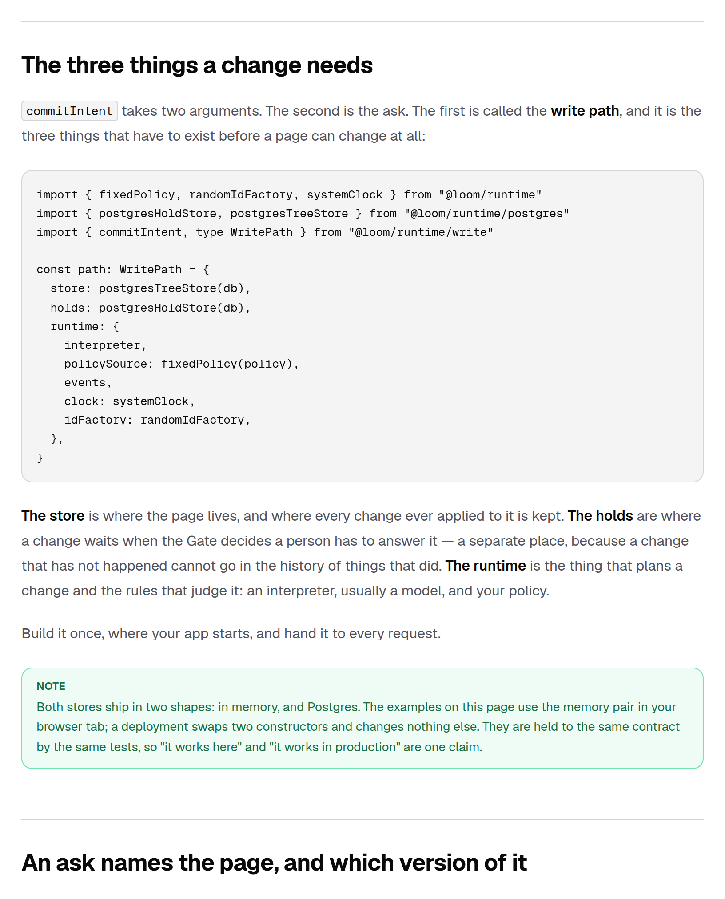
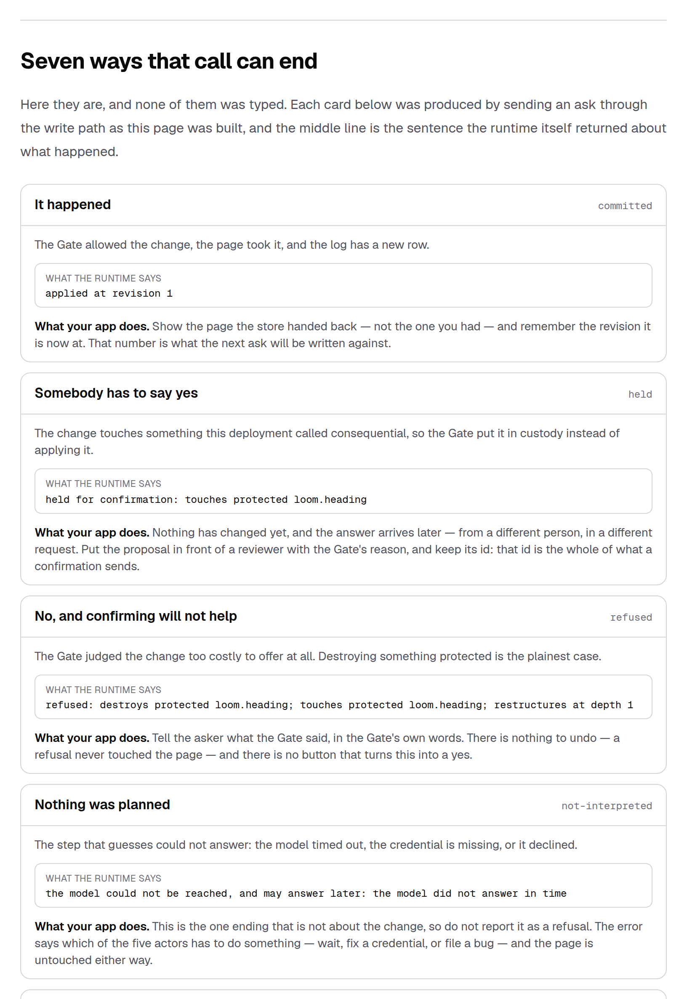
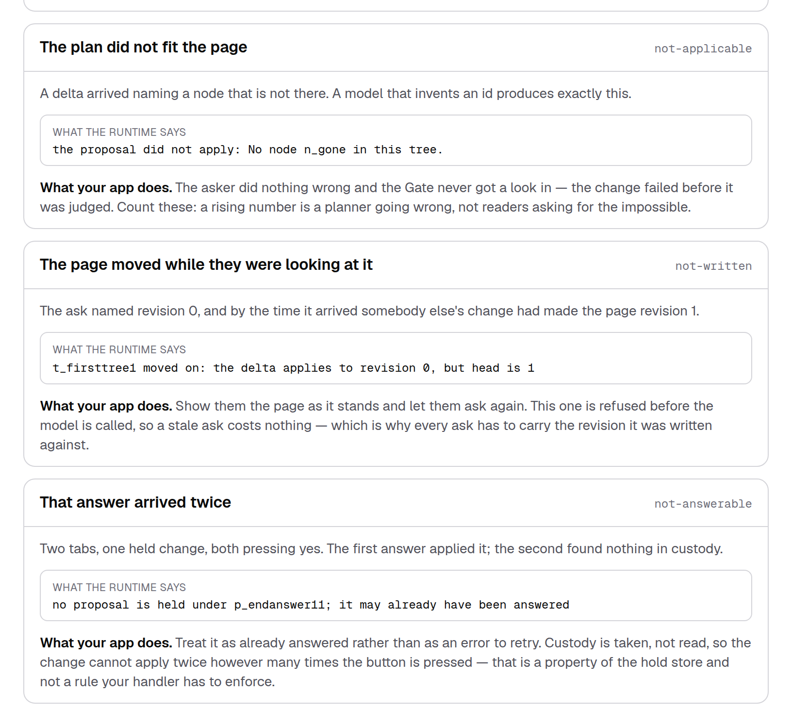
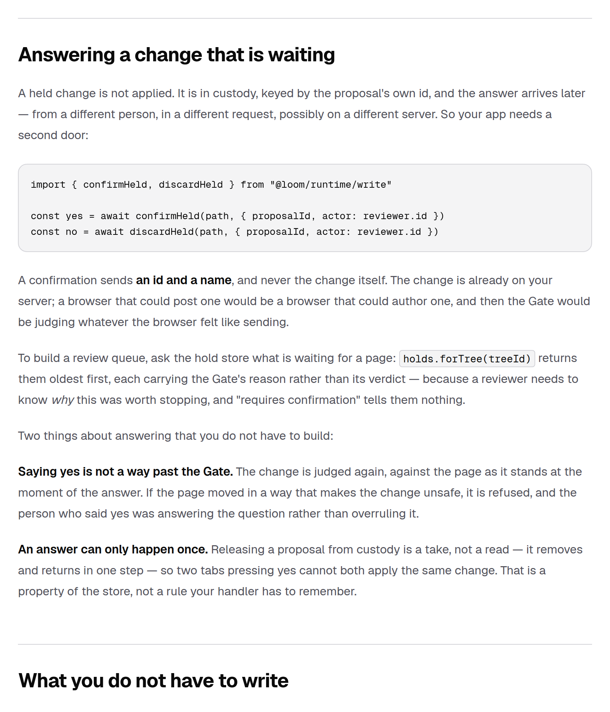
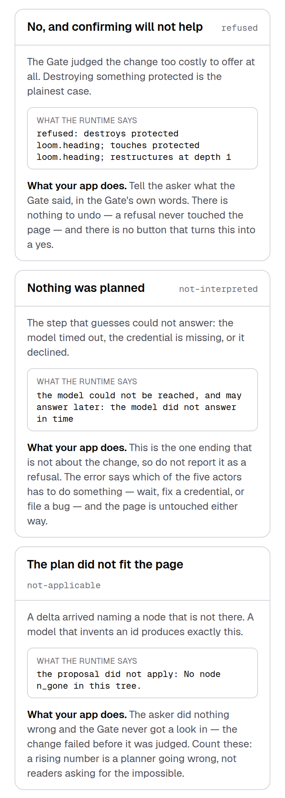

# 27 August 2026 — what your app has to do

**Routine:** `Loom docs` · **Branch:** `docs-12-what-your-app-has-to-do` · **Section:** §4c

The site could explain what a tree is, how a change is proposed, what the Gate
decides, what the log records and how a model is wired in — and a reader who had
finished all of it still had nowhere to learn **what their own code is supposed
to look like**. `@loom/runtime/write` is the door every deployment has to open,
and until this page it had **no prose anywhere on this site**: twenty-one
exports, described by their own signatures and nothing else. That was the first
of the four zeroes filed on #167, and the page I said I would write next.

**What your app has to do** is the fifth page in *The runtime*, and the last
written page before the API reference.

## The shape of the page

One sentence carries it: **one call, seven answers.**

The first half is small on purpose — three things to build (`store`, `holds`,
`runtime`), one function to call, and the two fields people leave out of an ask
and what each of them costs.

The second half is the part a host actually has to plan for: **every way
`commitIntent` can end, and what a deployment owes a person for each one.**

## The seven endings are not a table

The tempting way to write this page is seven headings and seven sentences. It
would be right today, wrong the first time the runtime grew an eighth ending,
and nothing would fail in between.

So each card is **produced by ending that way**. As the page builds, seven
in-memory stores are opened and seven asks are sent through `commitIntent` with
this site's own Gate policy behind them. The line in the middle of each card is
`describeWriteOutcome`'s sentence about the outcome that came back.

Two things hold it together, and they are the reason this is worth more than a
table:

- **The recipes are a `Record` keyed by `WriteOutcome["kind"]`.** An ending
  added to the runtime is a **type error in the documentation** rather than a
  row nobody notices is missing.
- **Every recipe asserts it reached the ending it claims.** If a policy moves,
  or a check lands earlier in the path, `produceWriteEndings` throws and
  `next build` stops. Verified by mutation: pointing the `refused` recipe at the
  demote plan fails the build with *"the refused ending produced a held"*.

The endings are produced against the **first example on this site** — the tree
with a heading and a sentence a reader has been clicking since *Your first
tree*. So `held` and `refused` are the same two asks they have already watched,
judged by the same policy, rather than a scenario invented to make a point.

## What I would defend hardest

**Four of the seven endings have nothing to do with the Gate**, and a page that
folded them into "it failed" would be teaching a host to build the wrong error
handling.

A model that times out is not a refusal. A delta naming a node that is not there
is not the asker's fault — the Gate never saw it, and a rising count of those is
a signal about the planner. A page that moved under somebody is not an error at
all; it is a page to re-render. And a second answer arriving on an already
answered hold is not a race to guard against, because custody is a take rather
than a read.

The runtime keeps these seven apart deliberately. The page's job was to say what
each of them means for a person, which is the one half a runtime cannot supply.

## What the page deliberately does not repeat

*The history of a page* already covers the log, the snapshot, why an undo is a
proposal, and why a stale ask is refused before it costs anything. This page
gets one section — *What you do not have to write* — that names those three and
sends the reader nowhere, because the point there is that **the host does not
implement them**. Restating the argument would have been the second copy §4c
exists to avoid.

## Decisions taken that were not specified

**The component is an async server component**, which is a first for this site.
The write path is asynchronous, so a block that runs it has to be — and the
alternative, generating a JSON file with a script, would have reintroduced
exactly the staleness the block exists to prevent. The page still prerenders
statically: `next build` lists it as `○ (Static)`.

**Cards, not a table.** Five fields per ending is four columns too many at
390px, and the two that matter most — the runtime's sentence and what a host
does — are the two a table squeezes thinnest.

**The block prints the runtime's line verbatim, including the ugly one.** The
`refused` line is three clauses long and wraps to three lines on a phone. A
prettier summary would have been the site paraphrasing a verdict, which is the
fault the theming page's contrast audit was built to avoid committing.

## Tests

`pnpm install && pnpm verify` at the repository root, **green, exit 0. Nothing
failed, nothing skipped, no test weakened.**

| Suite | Files | Tests |
| --- | --- | --- |
| `@loom/runtime` | 108 | 1695 — unchanged, `src/` was not opened |
| `@loom/app` | **135** | **1900** (132 / 1880 on `main`) |

**20 new tests in three new files**, and three of them were verified by
mutation:

- dropping an ending from the reading order fails three tests, including the
  page's own count of them
- pointing a recipe at the wrong plan stops the build, not just the test run
- renaming `discardHeld` to something the runtime does not export fails the
  claims test with *"@loom/runtime/write does not export rejectHeld"*

The ones worth naming:

- every ending in the reading order is produced, in that order, and the two
  groups the prose draws (three from the Gate, four from the world) still add up
  to the number of endings there are
- the same page is produced twice — a fixed clock and sequential ids, so two
  builds of one commit are byte-identical
- the `not-written` line equals `describeStoreError` of the conflict it should
  be, reconstructed from the example's own tree id rather than copied
- the `not-interpreted` line equals `describeInterpretationError` of the error
  the recipe fed in
- the `held` and `refused` lines name the primitive **this site's policy**
  protects, read from `docsGatePolicy` rather than typed
- **every import line in every fenced block on the page names a real export of a
  real entry point**, checked by importing the module and asking it

That last one is the test I would keep if I could keep only one. A code block is
the one kind of prose on a documentation site that a reader will paste, and a
function that does not exist costs somebody an hour before they conclude the
documentation is lying.

## Findings

**Filed for `Loom daily build`** — `WriteOutcome` has no exported list of its
kinds, so anything that wants to enumerate them (this page, a telemetry
dashboard, an operations runbook) has to keep its own copy in reading order.
`EPISODE_RESOLUTION_KINDS` in `src/telemetry/episode.ts` is the same problem
already solved once, so the shape is settled and it is a small addition.

**Filed, mine** — three of the four zeroes remain: `cli`, `telemetry` and
`telemetry/postgres`, 89 exports with no prose. `write` is now off that list.

**Noted, mine** — `.not-prose` is still not a cascade barrier, measured again in
the browser on this page: a bare `<ul>` inside it computes to `display: flex`,
`padding-left: 20px`, `list-style: disc`. Third component, handled locally
again. The general finding stays open and this is a third data point rather than
a third fix.

**No framework gaps.** Everything the page and the block needed —
`commitIntent`, `confirmHeld`, `memoryHoldStore`, `describeWriteOutcome`,
`fixedPolicy`, `noopEventSink`, `memoryTreeStore`, `sequentialIdFactory`,
`nodeIdSchema` — is exported from a published entry point and returns data
rather than a formatted line. `src/` was not opened, and **no file outside
`apps/loom/app/(docs)/` was touched** except `FINDINGS.md` and this report.

## Open questions

Nothing blocking. The next page I would write is `telemetry` — what a request
cost and what the deployment learns from a month of them — because it is the
largest remaining door with no prose, and because *Connecting a model* already
ends by pointing at a cost nobody can see the shape of yet.

