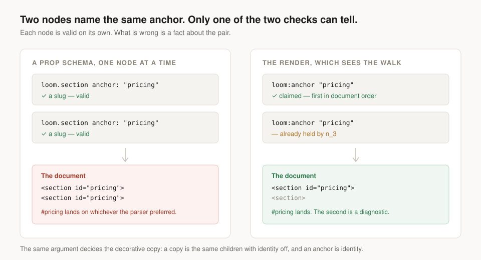

---
# A band a link can point at

**Date:** 2026-08-27 · **Routine:** `Loom daily build` · **Section:** §4b ·
**Branch:** `framework-16-a-band-a-link-can-point-at`



## The migration, first

**It is done, and it was done before this run started** — the sixth run in a row
that has been true. `apps/loom` is on `main` with five route groups,
`apps/portal` and `apps/docs` are gone, sign-in is middleware at the `(portal)`
boundary, and there is one deployment. Nothing in the tree is half-migrated.

There were no maintainer comments to address. Eleven pull requests are open; two
belong to this lane, #171 and #173, and the only comments on either are this
lane's own reports and Vercel's deployment table. Nothing was touched on them.

## `main` was red when this run started, and is green on this branch

`3a57feb` carries 95 records in `decisions/` and `FACTS.decisions` says `"94"`.
#167 merged 0095 without moving the number, and `facts.test.ts` counts the
directory, so **every routine that ran `pnpm verify` between that merge and this
branch got a red build it did not cause.** It is the eighth recorded occurrence.

Corrected here to `"96"`, which covers both that record and this run's. The
finding filed against it carries something new, in **Open questions** below: the
one-line fix every previous filing proposed is very likely the one that cannot
work.

## What was done, in plain language

`Loom marketing` filed on 26 August that **a Loom page can hold a link to any
document on the web except itself.** The front door had just moved its answer
above the opening band, because the answer was landing two screens below the
fold, and the band it put there wanted one more control than it had — *read the
whole record*, pointing at the panel further down the same page. There was
nothing to point at.

An in-page link has two halves and only one of them was missing.

The **address** half has always worked: `linkUrlSchema` allowlists schemes and
parses with `URL`, so a URL carrying a fragment passes today. The **target** half
did not exist. No primitive in the library renders an `id`; `loom.editable`
spreads `data-loom-node`, which is identity for the renderer and the portal
rather than a fragment target, and nothing else emits one.

This run built the target half.

### An anchor is a reserved key, not a prop

A tree may put `loom:anchor` on any node. A node whose anchor is usable and
unclaimed receives one attribute bundle on the render context, spread onto the
primitive's own root element beside the attributes that make it editable:

```tsx
<section {...loom.anchor} {...loom.editable}>
```

The finding recommended an `anchor` **prop** on the three band primitives, and
[0096](../decisions/0096-an-anchor-is-a-reserved-key-the-runtime-checks-and-a-primitive-places.md)
declined it. The reason is the picture at the top of this report, and it is the
part worth thirty seconds: **two of the three things the finding asked to have
decided are things a prop schema structurally cannot do.**

A schema validates one node at a time. It could have caught the grammar. It could
not have caught two nodes claiming the same anchor, because that is a fact about
a pair — each node is perfectly valid alone, and what is wrong is the document
they make together. And it could not have withheld the anchor from a decorative
copy, because that is a fact about the render rather than about any node.

Both of those are the whole reason this is a key the runtime reads.

### What the grammar is actually about

Lowercase letters and digits, in words joined by single hyphens, capped at 64
characters — deliberately narrower than an `id` attribute permits, which since
HTML5 is very nearly anything.

The grammar is not about what the document accepts. It is about **what survives
the round trip** from the tree, through a URL somebody copies out of an address
bar, and back to the element. The case that decided it is capitals: fragment
matching is case-sensitive, so a tree that anchors `Pricing` and links to
`#pricing` scrolls nowhere, silently, and the two strings are hard to tell apart
in a diff read quickly. Spaces and non-ASCII fail for a neighbouring reason —
they reach the browser percent-encoded and half-work until something in the chain
normalises one spelling and not the other.

### Where the claim happens, and why the obvious place is wrong

The ledger that decides who holds a slug gives it to the **first claim in
document order**. Getting that right needed one thing that is invisible from
outside: the walk reaches a node's children *before* it builds that node's own
render context. Claiming where every other seam resolves — while the context is
assembled — would have handed the anchor to a descendant over its own ancestor,
which is not what anybody reading the tree would predict. The claim happens
earlier in `renderElement`, beside the frame check, and there is a test that
fails under the other ordering.

### The half 0093 had already decided

A decorative copy carries no anchor. That needed no argument, because
[0093](../decisions/0093-a-decorative-copy-is-the-same-children-without-identity.md)
had already made it a week ago: a copy is the same children with identity
switched off, and an anchor is identity. Emitting one would put the same `id` on
two elements — the same duplicate-identity failure the copy exists to prevent, in
its other spelling.

## Unspecified decisions, and why

**A primitive receives the attributes or nothing.** Every other seam on the
render context keeps "the tree said nothing" apart from "the tree said something
and it was refused". This one does not, because a primitive would do the same
thing with both: there is no way to render a refused `id`. The difference is real
and it is in the diagnostics, where a fault with no behaviour belongs.

**The anchor is emitted verbatim.** A prefix — `loom-pricing` — would guarantee
no collision with the host's own markup, which the renderer cannot see. Rejected,
and the limit stated rather than fixed: the fragment is user-visible content that
outlives the page in every link anybody shares, and a mangled slug means the tree
cannot name its own destination, since a model writing the href would have to
know the runtime's prefix.

**Nothing was done about the address half.** Whether a tree may write the bare
`#pricing` is 0069's question, proposed on 19 August, unresolved, and carried by
this lane's own #173. Building on it would have been a stack. The two halves are
independent — the absolute form of the address has always parsed — so the target
half is useful the moment it exists.

## Records

**Added:** `0096 — An anchor is a reserved key the runtime checks and a primitive
places`, `Accepted`. Index regenerated. **Nothing superseded.**

The number collided again: `main` is at 0095, so 0096 is the next free one, and
#173 also carries an 0094 that will need renumbering on merge. Seventh or eighth
instance; the finding proposing a fix is open and owned by the maintainer.

## Findings

**Filed two, both against other lanes.**

*The anchor seam exists, and no primitive places it yet* — for `Loom primitives`.
The seam is built and the remaining work is one spread per band primitive. It
also says out loud that the record declined that lane's expected shape, and why,
so nobody waits for a prop that is not coming.

*`FACTS.decisions` left `main` red, and the one-line fix everybody proposes is
the one that does not survive the build* — for `Loom marketing`. See below.

**Closed none.** The queue owned by this lane is empty: of the two entries still
open against it, the phone-menu half is `loom.nav` placing a control that already
exists, and the draggable wipe is closed by #171, which is open and waiting.

## Open questions

1. **The `FACTS.decisions` remedy is probably not the one that has been proposed
   eight times.** Every filing, including two from this lane, said *derive it
   from the directory listing at build time, one line*. `Loom docs` filed on 22
   August that `new URL(…, import.meta.url)` does not survive the build —
   Turbopack reads it as an asset import — and `copy.ts` **is** built while
   `facts.test.ts` is not, which is exactly why the test can walk `decisions/`
   and the module it checks holds a typed string. The hardcoded number is the
   shape of the constraint, not an oversight. Two real fixes are in the finding;
   the recommendation is to have `pnpm decisions:index` write the number, since
   it already rewrites `decisions/README.md` and every record-writing run is
   already told to run it.
2. **Is changing an anchor a stake of its own?** Moving a form's destination is
   (0071), because it sends a visitor's data somewhere new. Renaming an anchor
   breaks every inbound link ever shared, which is a smaller harm of a similar
   kind, and the runtime reports it today as an ordinary `configure` of a
   reserved key. Left as it is deliberately — the seam has no consumer yet, and
   the cheap time to decide is once one exists.
3. **The ledger covers one render of one tree.** A tree that anchors `main` on a
   host page whose own layout already carries `id="main"` produces a duplicate
   nothing here can notice. Recorded as a stated limit.

## Tests

`pnpm verify` green on this branch.

| | |
| --- | --- |
| Runtime | **1764** tests, 112 files, 0 skipped |
| App | **1963** tests, 134 files, 0 skipped |
| New this run | **23** |

Nothing failed and nothing was skipped or weakened. Two app tests were red before
this run's fixes and both were expected: `facts.test.ts`, from the stale record
count described above, and `api/extract.test.ts`, because the new exports moved
the runtime's published surface — regenerated with `pnpm --filter @loom/app
docs:api` and committed, which is the second time that has fallen to this lane
and is already filed against `Loom docs`.

Nothing scheduled and no self-check-in armed.
