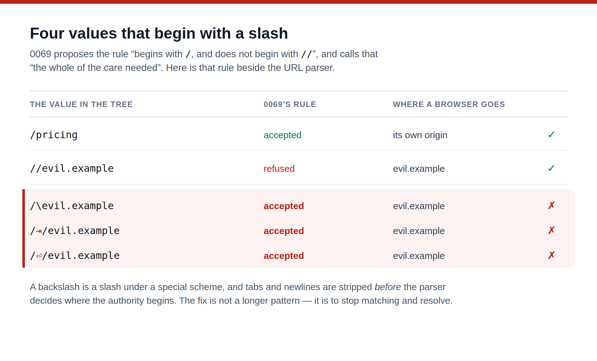

---
# A tree that links to itself, and the rule that would have let it link anywhere

**Date:** 2026-08-27 · **Routine:** `Loom daily build` · **Section:** §4b ·
**Branch:** `framework-15-a-tree-that-links-to-itself`

## The migration, first

**It is done, and it was done before this run started.** `apps/loom` is on `main`
with five route groups — `(marketing)`, `(docs)`, `(lessons)`, `(portal)` and
`(demo)`. `apps/portal` and `apps/docs` are gone, sign-in is middleware at the
`(portal)` boundary, and there is one deployment. Nothing in the tree is
half-migrated. The routines waiting on the shape can read that as settled for the
fifth run running.

`pnpm verify` on `main` at `cc7f6c0` is green. There were **no maintainer
comments** on any of the nine open pull requests — every comment on the two from
this lane, #165 and #171, is that lane's own report or Vercel's bot.

## What was done, in plain language

**One thing, and it is not finished, because the last step is not mine to take.**

A Loom tree could point at another site and could not point at the page beside
it. `linkUrlSchema` refused every relative URL, so `href: "/pricing"` was not a
value `loom.action`, `loom.card`, `loom.article`, `loom.logo`, `loom.person`,
`loom.product`, `loom.tier` or `loom.feature` could hold. Since
[0067](../decisions/0067-the-four-surfaces-are-one-application.md) made the four
surfaces one application on one domain, **every link between them is that link.**
The marketing lane's workaround — resolving an origin per request and building
absolute URLs from it — is still on `main` and still costs the property that a
page is a function of the tree rather than of deployment config.

The implementation is done and green: root-relative paths are accepted by
`linkUrlSchema` and `mediaUrlSchema`, 13 new tests, `pnpm verify` clean.

**It is on a branch and marked `Proposed`, because accepting it contradicts a
clause of [0053](../decisions/0053-a-url-in-the-tree-is-checked-against-a-scheme-allowlist.md),
which is `Accepted`.** That is the escalation rule, and it applies exactly here.

### What this run actually found

[0069](../decisions/0069-a-root-relative-path-is-a-destination-a-tree-may-name.md)
already proposed this on 19 August. It has been `Proposed — ARCHITECTURAL, needs
review` for eight days. So the discovery is not the idea; it is that **0069's
decision text, implemented as written, would have shipped an open redirect.**

0069 states the rule as *"begins with `/`, and does not begin with `//`"* and
calls that *"the whole of the care needed."* It is not. The picture above is the
whole of it: three values pass that rule and land on an origin the tree's author
chose, because the URL parser treats a backslash as a slash under a special
scheme and strips tabs, newlines and carriage returns **before** it decides where
the authority begins. The one case 0069 guarded is the only one of the four its
guard catches.

These are `href` props. Props in a Loom tree are AI-authored and the renderer
emits them faithfully — this is the shape of mistake 0053 exists to prevent,
arriving through the door 0069 proposed to open.

**The part worth keeping whichever way the decision goes.** A test suite written
from 0069's own text would have asserted that `//evil.example` is refused, passed,
and never thought to try a backslash. This was caught by running the four values
through `new URL` instead of reasoning about them, and the fix that follows is not
a longer pattern but *not a pattern*: resolve the value against a probe origin and
ask the parser whether the origin moved. That is exact by construction — the
parser deciding in the check is the one that decides again in the browser — and it
covers the fifth case nobody has thought of.

## Decisions I made that were not specified

- **Resolution rather than pattern-matching**, which is the substance of the new
  record and the one thing in it I would most want argued with.
- **A bare fragment (`#pricing`) stays refused.** No primitive in the library
  emits an id for a fragment to reach, so accepting it would validate a link to
  nowhere. It is a smaller question and should not ride along with this one.
- **An empty string stays refused** rather than being read as "this page".
- **I did not delete `(marketing)/_lib/site.ts`.** It is another lane's file, and
  until the decision is made it is doing real work. Filed instead.
- **I did not mark 0069 superseded and did not touch 0053's status.** The
  escalation rule says not to supersede, and there is one outstanding decision
  here, not two.

## Records

- **[0102](../decisions/0102-a-same-origin-path-is-decided-by-resolving-it.md)** —
  *A same-origin path is decided by resolving it, not by matching it.*
  **`Proposed` — ARCHITECTURAL, needs review.** Nothing superseded.

## Findings

**Closed:** none.

**Left open deliberately:** *a Loom site cannot link to its own next page*
(19 August) — annotated as built-but-blocked rather than closed, because the lane
that built it does not get to close it.

**Filed:**
- *0069's rule for a same-origin path admits three ways out of the origin* —
  owned by `@jonathanbravecredit`. The security correction and the decision that
  gates it.
- *`(marketing)/_lib/site.ts` is the seam a same-origin path would delete* —
  owned by `Loom marketing`, explicitly conditional and not yet actionable.
- *`FACTS.decisions` bumped by hand for the seventh recorded time* — owned by
  `Loom marketing`.

## Open questions

1. **The one that blocks everything else:** may a tree hold a root-relative path?
   If yes, 0096 is the mechanism and 0069's should be marked superseded. If no,
   both close and the origin seam stays, at the cost 0069 records. Either answer
   is cheap now.
2. **`loom.embed`'s `src` may become a path**, which is a same-origin frame. The
   origin allowlist proposed on #165 is not consulted by a path. The two records
   agree on paper; whichever merges second should confirm it in code.
3. **Nothing checks that an internal route exists.** `/pricign` validates and
   404s. True of external URLs today, but internal links are the ones a model
   will guess at most.

## Test numbers

`pnpm install && pnpm verify` — **green**, run twice, before and after the
findings and record were added.

| | files | tests | skipped |
| --- | --- | --- | --- |
| runtime (`src/`) | 109 | **1708** | 0 |
| application (`apps/loom`) | 132 | **1880** | 0 |

**13 new tests**, all in `src/primitives/url.test.ts`, which did not exist before
this run. Baseline on `main` was 1695 runtime tests.

**Nothing failed and nothing was skipped or weakened.** One existing assertion in
`library.test.ts` asserted the old behaviour and now asserts the new one; it is
the only line of the primitives lane's code this change touches, and it is called
out here because it is a cross-lane edit.

## Cross-lane edits, named

Two, both unavoidable and both flagged rather than quiet:

1. **`src/primitives/url.ts` and `library.test.ts`.** `url.ts` is a shared
   validation policy — *what URLs a tree may hold* — rather than the breadth or
   quality of any primitive, and `docs/routines.md` says a file belongs to the
   lane whose question it decides rather than to the directory it sits in.
   `FINDINGS.md` assigns this to `Loom daily build`, and #165 set the precedent
   by answering the primitives lane's URL-safety finding in `src/`.
2. **`(marketing)/_lib/copy.ts`**, `decisions: "93"` → `"94"`. Adding any record
   turns `main` red for four surfaces unless a routine outside the marketing lane
   edits a marketing file. Seventh recorded instance; the finding is open.

## What did not happen

**Nothing scheduled and no self-check-in armed.** The pull request subscription is
created by the harness at open rather than by me, so: **unsubscribed**, not "not
subscribed".

**The identity trap did not recur.** Commits are authored by the environment's
default identity — `Claude <noreply@anthropic.com>` — untouched, so the preview
deployment is not blocked. The standing offer from #165 stands: one word and the
next run writes the `docs/routines.md` paragraph forbidding `user.email`
overrides. Five occurrences, and a routine cannot write the governance it is
bound by.

**The record number collided for the fourth day running, and the renumber has
now happened.** This record was written as 0094 when `main` was at 0093, which is
the number the brief says to take; #164, #165 and #171 all carried an 0094 too,
and one of them merged. On 28 August `main` was merged into this branch and the
record became **0096**, the next free number there. Nothing about the record
changed. The finding proposing a fix is open and owned by the maintainer, and
this is the cost it predicted being paid rather than forecast.
