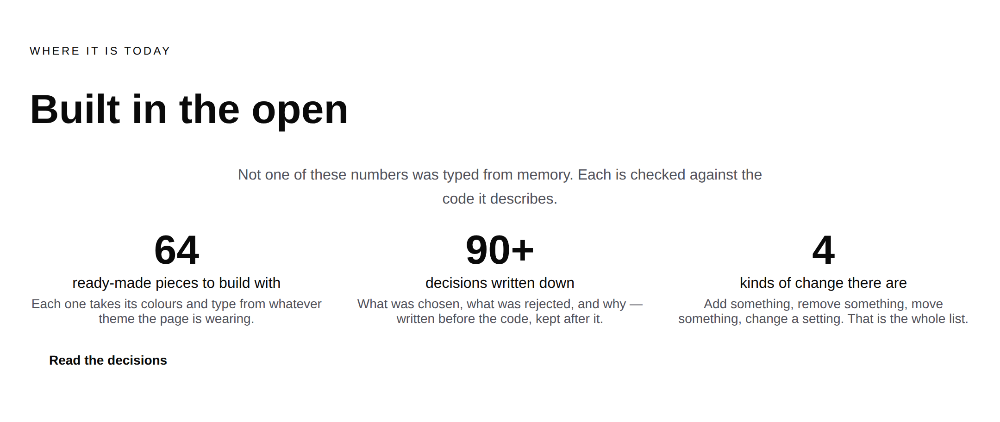
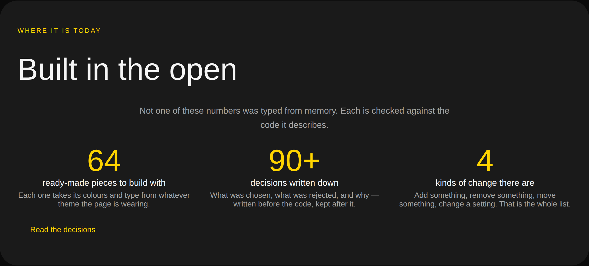
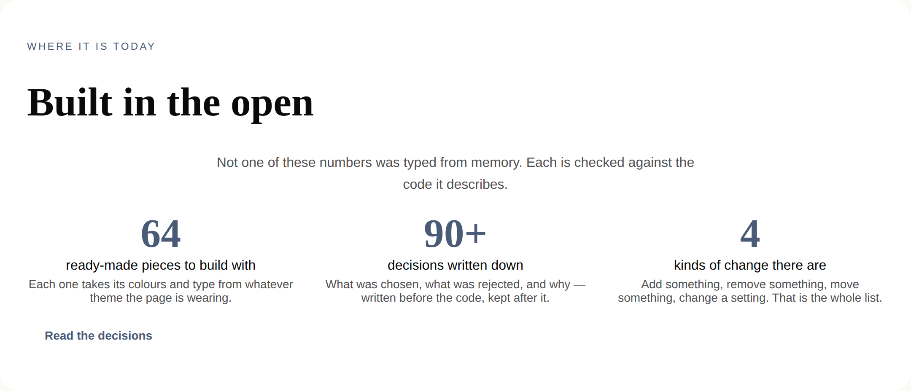
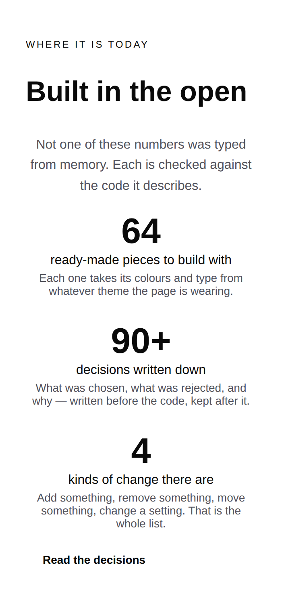

# 2026-08-27 — marketing: numbers that count themselves

Five consecutive marketing reports have ended with the same open question, and
it was never a marketing question. `FACTS` in this lane holds the numbers the
front door prints, a test holds them against the repository, and **every run in
three other lanes that registered a primitive or wrote a decision record left
all four surfaces red until somebody came and edited a digit in a marketing
file.** Six times in seven days.

This run closes it. Two of the three numbers now count themselves, the third is
a floor that nothing outside this lane can move, and the band says so on the
page.

---

## What shipped

One band, and the module behind it. The rule it now follows is three lines long
and is the whole of the change:

| | |
| --- | --- |
| A number the page can count | **it counts** — nothing needs a person |
| A number that would change the *claim* | **it goes red** — in this lane, deliberately |
| A number the page cannot count | **a floor it cannot overstate** |

### The two that count themselves

`FACTS.primitives` is `catalogueOf(siteRegistry).length` — the registry this
site already builds in order to render at all, so the count costs a request
nothing and no primitives run ever touches this file again.

`FACTS.operations` counts `DELTA_OPERATIONS`, which is the keys of
`treeOperationSchema.optionsMap`, read off the schema the runtime validates
against.

**Both of those were available the whole time, and five reports did not reach
for them.** Worth saying plainly, because the reason is instructive rather than
embarrassing: the 19 August finding framed this as *one* problem with *one*
fix — derive the counts, which means a filesystem read, which a dynamic route
cannot safely do. That framing was correct about the record count and it hid the
fact that the other two numbers are already in the process. Neither needs a
filesystem. Neither needs a build step. Neither needs the decision the finding
was waiting on.

### The one that cannot

`decisions/` is five directory levels above the application and `/` is a
**dynamic** route, so counting the records where the other two are counted would
be a `readdirSync` inside a serverless function against a directory the build
never traced. That has been true since 19 August and nothing here changes it.

So the page states **`90+`** and the test holds it in the one direction that can
damage the site: *the floor may never be higher than the truth.* There are 93
records today. Adding a ninety-fourth is now a no-op in this lane.

The cost is real and it is named in the code: the number understates itself as
records accumulate, and raising the floor is this lane's own periodic work. That
is the trade — an exact number kept true by three other lanes remembering to
edit a file that was not theirs, against a conservative number kept true by
nobody having to do anything.

### The asymmetry is the point, and it cuts both ways

`FACTS.operations` derives, but the caption beside it makes a completeness
claim — *"Add something, remove something, move something, change a setting.
That is the whole list."* A fifth delta operation would make that caption untrue
while the number quietly ticked to 5.

So the test does not check the count. It checks the four **names**, and a fifth
operation takes **this** lane red. A number that moves without changing the claim
should need nobody; a number that moves *because* the claim changed should need
the person who wrote the claim.

### One sentence on the page

> *Not one of these numbers was typed from memory. Each is checked against the
> code it describes.*

Worded to be true of all three figures rather than of the two the page works out
for itself — the floor is checked too, in the direction that matters. It is
`loom.prose`, muted, centred and measured, which is the composition the band at
the foot of this page already uses for the same job.

## Tests

`pnpm install && pnpm verify` — **green, exit 0. Nothing failed, nothing
skipped, no test weakened.**

| suite | before | after |
| --- | --- | --- |
| `@loom/runtime` | 1695 / 108 files | **1695 / 108 files** — `src/` was not opened |
| `@loom/app` | 1880 / 132 files | **1884 / 132 files** |
| marketing, within it | 537 | **541** |

`facts.test.ts` went from three tests to seven, and the three it had are gone
rather than kept, because two of them became tautologies the moment the literals
did. `expect(FACTS.primitives).toBe(String(catalogueOf(siteRegistry).length))`
is worth writing when the left side is a typed `"64"` and worth nothing when it
is the right side. So what is asserted moved to the properties that survive the
derivation:

- **The page shows the counted number.** Both derived figures are checked
  through the rendered front-door tree, not just in the module — so typing a
  literal back into a page tree fails.
- **The four names are the four the caption claims.** Above.
- **The floor is never higher than the truth.**
- **Every number the front door shows is checked here.** The three stat labels
  are pinned as a list, so a fourth figure cannot arrive on this band without
  somebody coming to this file to say what checks it. This is the assertion that
  replaces the old design's real virtue.

### Verified by mutation, and by the thing the finding is actually about

Four mutations, each caught by exactly one test: typing `"99"` back into
`FACTS.primitives`; raising the floor to 200; appending a fifth operation name;
and — the one that matters — **adding a file to `decisions/`.**

That last one was run on both sides of the change, and it is the result this run
exists for:

| | a 94th record lands |
| --- | --- |
| on `main` | `facts.test.ts` **fails** — 1 failed, 2 passed |
| on this branch | **541 passed**, nothing red |

`scrollWidth` is 390 at a 390px viewport and the band was looked at under all
three registered palettes.

## Decisions and findings

**No record written.** Nothing here constrains anything outside this lane, and
`src/` was not opened — the two runtime values used are public exports consumed
the way any host would consume them.

**Three findings closed**, all one finding: the 19 August original, its 24 August
instance, and its 25 August double. Six occurrences across three lanes.

**One filed**, and it is deliberately narrower than the one it replaces. The
exactness half is still not solved, and the question that would solve it is a
single sentence:

> May a surface add its own generation script to `apps/loom/package.json` — a
> `marketing:facts` beside the existing `docs:api` — emitting a committed module
> the page imports?

`(docs)` already has such a line. The 25 August ruling in `docs/routines.md` put
the MDX root files in the documentation lane on the principle that a file belongs
to the lane whose content it *decides* — and then said in terms that *"the rule
generalises and the exception does not."* So this lane is not going to read
itself a second exception out of it. One sentence either way closes it, and
until then the floor is the answer.

## Open questions

- **The generator-script question above.** A recommendation is in the finding:
  yes, on the `docs:api` precedent, with the same "one line in the report saying
  which file and why" that the documentation lane already lives under.
- **The eight-item menu**, raised on #166 and unanswered. Untouched here.
- **Positioning, audience and the licence line** (#96, restated on #134, #142,
  #150, #163, #166). Still the site's one placeholder and still the Phase 2 gate.

## Scope

`apps/loom/app/(marketing)/` only, plus `FINDINGS.md` and this report. No other
route group was opened and `src/` was not touched.

Nothing was scheduled and nothing was armed.
