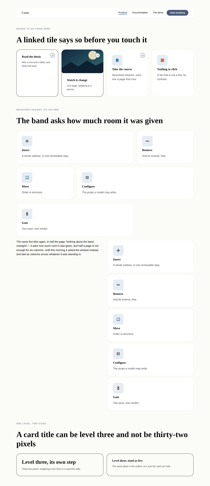
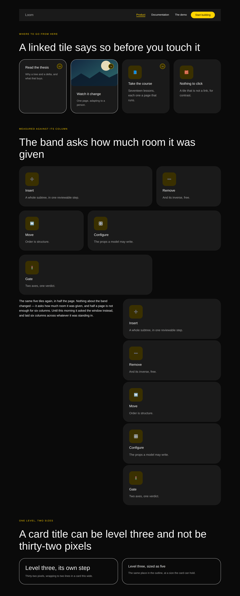
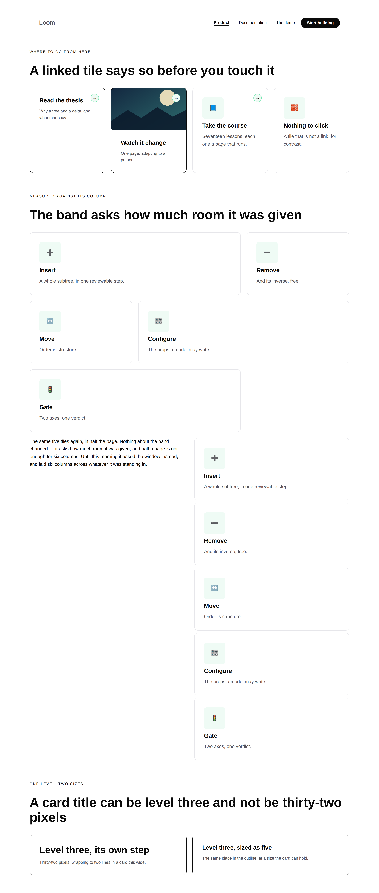
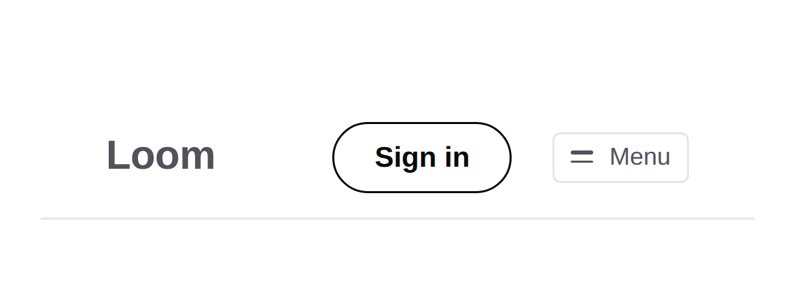
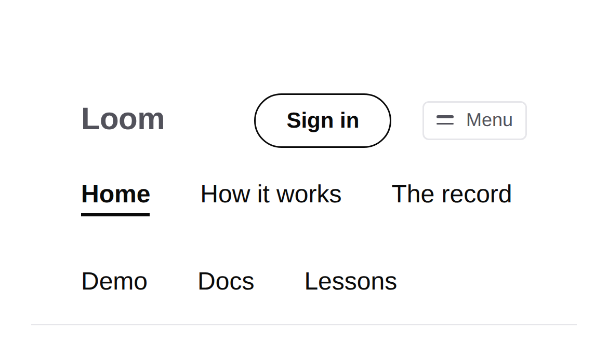
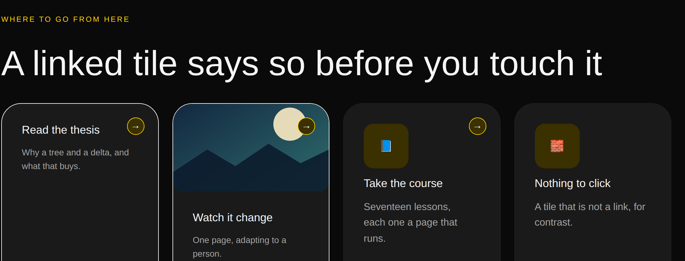
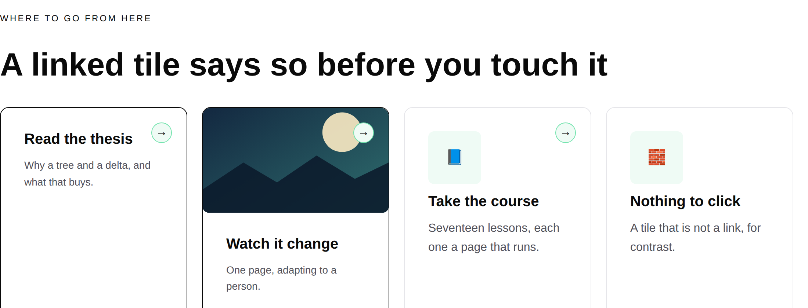

# 27 August 2026 — what a phone can see, and what a screenshot says

**Routine:** `Loom primitives` · **Section:** §4b · **Branch:** `primitives-15-what-a-phone-can-see`

No new primitives. **Four repairs to four that already exist** — `loom.nav`,
`loom.heading`, `loom.card` and `loom.feature`, and `loom.mosaic` — every one of
them an open finding another lane filed against this one, and every one of them
about the same thing: **what this library says to somebody who cannot point at
it.** Five findings closed, the oldest six days old and filed three times. One
decision record, `0094`. Two defects found by screenshots and by nothing else,
and the second of them is the same defect the library has now made four times.

## Why repairs and not breadth

The brief is a breadth mandate and I have spent five consecutive runs honouring
it — the library went 61 → 64 → 68 in the last three. This run does not, and the
reason is `docs/routines.md` rather than my own preference: **open findings owned
by a lane are an input queue, ahead of the plan and behind maintainer review
comments.** There were no maintainer comments on #164. The queue had five entries
that turned out to be one subject.

Read together they say something the individual entries do not:

- `Loom marketing`, 25 August: *nothing on a linked card says it is a link until
  you hover it, and a phone cannot.* Four destination cards on the front door,
  indistinguishable from four paragraphs in boxes on a touch device.
- `Loom marketing`, 25 August: *`loom.heading` welds size to level.* Card titles
  at 32px in a 290px card, all four wrapping to two lines.
- `Loom daily build`, 25 August: *the disclosure seam exists, and `loom.nav` is
  one declaration and one CSS rule from a phone menu.* A seam built for me and
  left unused.
- `Loom marketing`, 22 August: *the wrapping nav is now three rows on a phone.*
- This lane against itself, 21 August and restated 26 August: *`loom.mosaic`
  reads the viewport where it should read its container.*

Every one is a defect that only appears where there is no hover, no wide window,
or no interaction at all — which is to say **in a screenshot, on a phone, and in
a demo**. The brief says the surface has to pop and that it has to be looked at.
Five open findings said it does not, on the exact bands a demo stands on, and
none of them would have been fixed by a sixth pricing table.

The breadth work is not abandoned; it is next. The remaining Hermes pairs —
episodes, books, listings, events — are still the plan, and #164 left the port at
62/70.

## What shipped

### The bar collapses, and the paragraph saying it could not is gone

`loom.nav` declares `disclose`, declares the one string its control takes a name
from, declares itself a target, and places what the runtime hands it. Below 48rem
the links take a full flex basis and a line of their own, and a closed control
takes that line away.

The replaced reasoning was **right about its premises and wrong about the
conclusion**, which is worth keeping rather than deleting. It held that a
disclosure needs the links inside a `
` on a phone and outside it on a
laptop — one subtree in two places — and that the ways out were rendering the
menu twice, which gives a screen reader two copies, or client state the runtime
did not have.

The subtree never had to move. 0092's control stamps `data-loom-disclosed` on
*itself* and reaches for nothing, so the links stay exactly where they are and a
sibling selector in this library's own stylesheet decides what the state means.

**One departure from the handover note, and I owe it back.** The note's selector
is `[data-loom-disclosed="false"] ~ .links`, with the control placed bare. That
cannot work here, for the reason `stylesheet.ts` puts first in its own list of
mechanics: **an inline style beats a rule**, and the runtime's button sets
`display: inline-flex` on itself. A bare button is therefore a button that can
never be hidden — and on a laptop, where there is nothing to disclose, it has to
be. So it is wrapped in a `` this primitive owns, the attribute moves one
level down, and the rule becomes the `:has()` variant `behaviour.ts` names for
exactly this case. A browser without `:has()` gets a visible menu *and* a visible
button, which is the harmless half of the two failures.

Three properties of the arrangement are load-bearing and all three are asserted:

1. **The menu defaults to visible and the rule takes it away.** With scripting
   off there is no button, no attribute, nothing matching, and the menu is simply
   open — which is what the bar did yesterday. Written the other way round, that
   visitor gets every link behind a control that never arrives.
2. **`display: none`**, so a closed menu leaves the accessibility tree and
   `aria-expanded` describes something a screen reader can independently observe.
3. **One name, not two.** `aria-expanded` carries the state; the button is called
   *Menu* open and closed.

### A card title can be level three without being thirty-two pixels — [0094](../decisions/0094-a-headings-place-in-the-outline-and-its-size-are-two-questions.md)

`loom.heading` gains `scale`: *size this as though it were at this level, without
moving it in the outline.* It defaults to the heading's own level, so nothing
existing changes.

The part worth arguing is not that the prop exists — the marketing lane proposed
it and was right — but that it names **a level rather than a ramp step**. The
obvious shape is `scale: 1–8` naming the step directly, which is the library's
own token vocabulary and reaches two more sizes. It also runs backwards:
`level: 1` is the *largest* heading and step 1 is the *smallest* text on the
ramp, so the two numbers sitting beside each other in one prop bag point in
opposite directions. A model reading `level: 1, scale: 1` as *the biggest heading
at the biggest size* is being consistent; the schema would be the thing that is
not.

The library was already disagreeing with itself here, which is what settles it:
`loom.feature` renders its title as a hard-coded `<h3>` at step 4, so the same
level came out at 32px through `loom.heading` and at 20px through `loom.feature`,
and only the wrong one of the two was reachable from a tree. The seam existed. It
was private, and a primitive had helped itself to it.

**What `scale` cannot do is forge the outline.** It moves the size; the `h1`…`h6`
still comes from `level`, so a screen reader, a table of contents and a crawler
all still read what the tree says. A page can now look flatter than its outline —
a typographic choice — rather than *be* flatter than it looks, which is what the
old rule was protecting against and is still impossible.

### A linked tile says so at rest

`loom.card` and `loom.feature` carry a corner mark when the tree gives them an
`href`. The hover treatments are untouched and are now the second half of a
signal rather than the whole of it.

- **It is a chip, not a bare glyph**, because a card with a media region puts it
  over a photograph the primitive did not choose and cannot sample — the same
  thing that beat `loom.before-after`'s divider under `bold` two days ago. A
  solid fill inside a ring reads on a light picture and on a dark one.
- **It reserves its own room rather than floating over the words.** Where there
  is no media above it the body takes extra trailing padding, so a heading's
  first line stops short of the mark. Where there is media the mark sits on the
  picture and the body is untouched, because a picture has no line to collide
  with.
- **It is `aria-hidden` and `pointer-events: none`**, so it never becomes a small
  target inside the large one the tile exists to be.

The marketing lane's own workaround — putting each destination's *cost* in the
card footer, *costs you a click*, *costs you a read* — is not undone by this and
should not be. A price is information; a mark is only an affordance.

### The mosaic measures the band, not the window

`@media (min-width: 48rem)` became `@container (min-width: 48rem)`. A mosaic in
the end region of a `loom.split`, or inside a card, or in any column narrower
than the window, was laying six columns across four hundred pixels and reading as
a filing cabinet.

It cost one element: a container cannot answer a query about *itself*, only about
an ancestor, so the grid now sits inside a frame that declares `container-type:
inline-size`. Two things fall out, and the second was free:

- The rhythm selectors are unchanged — they were always `> *:nth-child(…)` on the
  element holding the cells, and that element is still the grid.
- **The `:nth-child` trap is gone rather than avoided.** The stylesheet used to
  be forced to the *end* of the mosaic's children, because a leading `<style>` is
  `:nth-child(1)` to any renderer that does not hoist it and would have shifted
  every cell in the cycle by one. It now lives in the frame, where it is not
  among the grid's children at all.

## Which fields became nodes, and which stayed props

Nothing became a node this run, and that is the correct answer rather than an
omission — no repair here touched what a tree can *contain*. Three new props were
weighed against 0052 and `docs/primitive-granularity.md`:

| Candidate | Verdict | Why |
| --- | --- | --- |
| `heading.scale` | **prop** | The sharper question, answered in one line: changing it adds no node, removes none, reorders none. It is `align` and `balance`'s kind of thing — a rendering of fixed content. |
| A `menu` prop on `loom.nav` turning the disclosure on | **refused** | There is nothing to configure. `loom.code`'s argument for its copy button, verbatim: a menu you cannot open on a phone is not a thing this library offers as an option. So `interactive: "always"` rather than `{ whenProps }`. |
| A `mark` prop on `loom.card` turning the corner mark off | **refused** | Same shape, and worse here. The prop's only use is *make this link not look like a link*, and a library that ships that has un-fixed the finding by default. |
| `loom.mosaic`'s frame | **not a node** | The extra element is markup, not tree. Identity stays on the frame and the grid carries none — asserted, because an extra wrapper is precisely how 0051's failure happens, where a portal resolves an id to something that is not the node the reviewer clicked. |

## Two defects the screenshots found and the tests did not

**Both of them are colour, both were invisible to every assertion, and the second
is the fourth time this library has made the same mistake.**

### The chip that vanished into the card it was on

The mark shipped in my first draft as `bg-surface` inside `border-subtle` — the
reasoning being that a palette's paper always contrasts with what is around it.
It does, with the *page*. Not with a **card**, which is `bg-surface` too. So on
the ordinary case — a surface card, which is the default and the one on the front
door — the fill disappeared into the card and left a hairline ring.

The fix is the accent: it is the palette's own word for *this responds to you*,
and it differs from every card tone by construction rather than by luck.

### The arrow that vanished into the chip

Which produced the *second* screenshot's defect immediately. Drawn as
`accent-strong` on `accent-subtle`, the glyph is one hue at two lightnesses, and
under `minimal` — a pale mint — it all but disappeared inside its own chip. It
was legible under `bold` and `editorial`, which is why only rendering all three
found it.

The glyph is now the palette's ink. And the general rule was already written
down, in `tokens.ts`, filed on 23 August after `loom.emphasis` rendered a
stressed word identically to the sentence around it:

> A token promises the value comes from the theme. It promises **nothing** about
> that value being different from the one beside it.

That is now four occurrences — `loom.emphasis`'s weight, the comparison table's
`fg-subtle` on `accent-subtle`, `loom.before-after`'s divider, and this chip
twice in one afternoon. The failure is always the same shape: reaching for a
second token from the same family and hoping the two differ, where the whole job
of the thing is to differ. Worth reading twice before drawing anything that has
to stand out.

## What the library still cannot express

- **A heading still asks the window how wide it is**, and after this run it is
  the only thing that does. `CAP_FOR_STEP` holds the top two ramp steps under a
  `vw`, and its own comment already admitted the limit. A heading is a leaf, so
  the element that knows how wide it is belongs to its parent — which makes the
  repair either *every container declares containment* or *a fluid ramp in the
  font pack*, and both are bigger than a heading. Filed with three ways out.
- **The collapsed menu is open for one paint** before hydration lands. That is
  0092's design and the right way round; filed for the three surfaces that will
  see it, with the one thing it makes untrue about their phone tests.
- **The corner mark points one way.** Every box model around it is a logical
  property, so the chip lands in the right corner in a right-to-left document.
  The arrow inside it does not, because there is no logical-property equivalent
  of an arrow. Filed as a note rather than a gap, with the two other things that
  would have to be decided at the same time.
- **A wipe cannot be dragged**, an embed cannot be checked against anything but
  its scheme, a `<tfoot>` and a spanning cell do not exist, a callout cannot be
  red, and an internal link cannot be expressed in a tree. All open, all from
  previous runs, none of them this unit's.

## Verification

`pnpm verify` green from the repository root, **exit 0**: 1,713 runtime
tests across 108 files, 1,880 application tests across 132
files, **0 skipped**. Nothing was weakened to get there.

Sixteen of the runtime tests are new, in a `what a phone can see` block with a
fixture built to be looked at where nothing can hover. **Three existing
assertions were rewritten**, and all three because this run reversed the decision
they were asserting rather than because they were in the way:

- *the nav wraps rather than collapsing it, because no render reads a viewport* —
  the replaced text is quoted in the new one, because the premises were sound and
  only the conclusion was wrong.
- *switches the mosaic's rhythm off below the breakpoint* — now asks the band.
- *declares nothing on a container, since a container is not a target* —
  `loom.nav` left that list by taking a control, and a second test says why:
  a container that places a `<button>` is a target anyway, and the registry
  refuses the declaration without it.

One assertion about the CSS text had to be widened: the block-balance test that
caught the swallowed rule on 22 August treats `@media`, `@supports` and
`@keyframes` as nestable and did not know about `@container`. Adding one word to
a regex is not weakening it — the property it holds, that no rule body contains a
`{`, is unchanged.

### The record is 0094, which is also #164's, and this time it could not be avoided

Sixth occurrence of the numbering collision. What this run adds is that **the
polite option is not available.** I wrote the record as `0095` deliberately, to
leave `0094` to the pull request already holding it, and `pnpm verify` went red:
`tools/decisions/decisions.test.ts` holds the records to *no duplicates and no
gaps*, and `0094` is a gap until #164 merges. The tool does not merely fail to
prevent the collision — it **requires** it.

That sharpens the recommendation five previous entries have made. The gap half of
the assertion is the half doing the damage and the half earning nothing:
duplicates are worth catching, and a hole between two open branches is the normal
state of a repository with six lanes in it. Filed. Not my file.

## Files outside `src/primitives/`

- **`apps/loom/app/(marketing)/_lib/copy.ts`** — `FACTS.decisions` `"93"` →
  `"94"`, held against the registry by that lane's own test. Eighth consecutive
  day. `FACTS.primitives` is untouched, because no primitive was added.
- **`decisions/README.md`** — regenerated with `pnpm decisions:index`.
- **`reference.generated.json`** — regenerated and **unchanged**, because it
  lists entry points and exports rather than declared props. Recorded because
  finding out it was a no-op is the useful half: four reports now say they
  regenerated it after changing a primitive's props, and that was never needed.

## 21st.dev

**Blocked for the tenth time**, from a sixth lane. `docs/routines.md` lists it
under `permissions.allow` and `WebFetch` returns `EGRESS_BLOCKED`. Tried once, at
the top of the run, before choosing work. Recorded rather than skipped quietly.

The recommendation is unchanged — fix the allowlist or drop the line — and there
is a cost to the second option worth naming: *"it really needs to pop"* is a
visual bar, and a routine with no external reference calibrates against the
library's own floor, which drifts towards whatever the library already does.
Calibration this run was against `loom.hero`, `loom.feature-grid` and `loom.card`,
plus the screenshots, which found both defects when no assertion did.

## The preview

PREVIEW_URL
