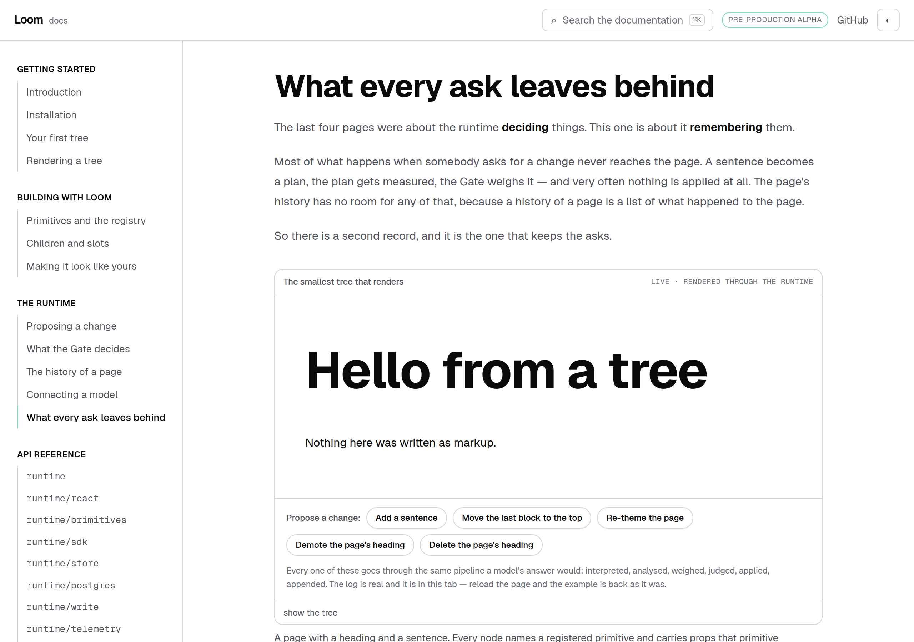
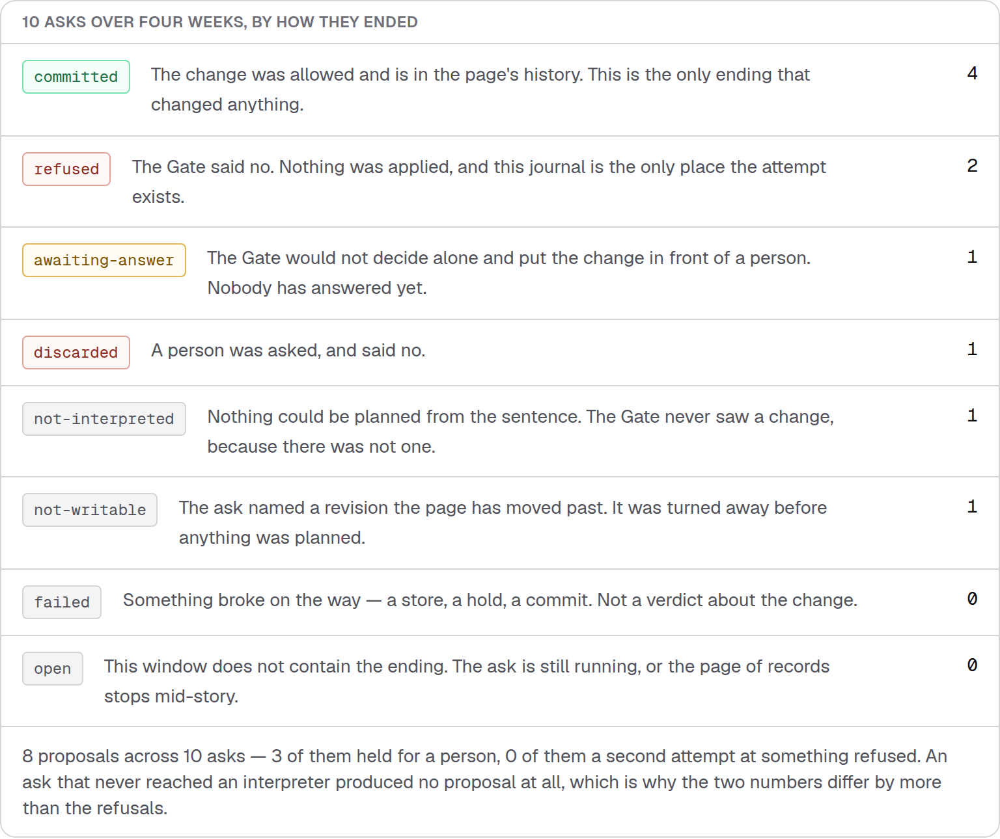
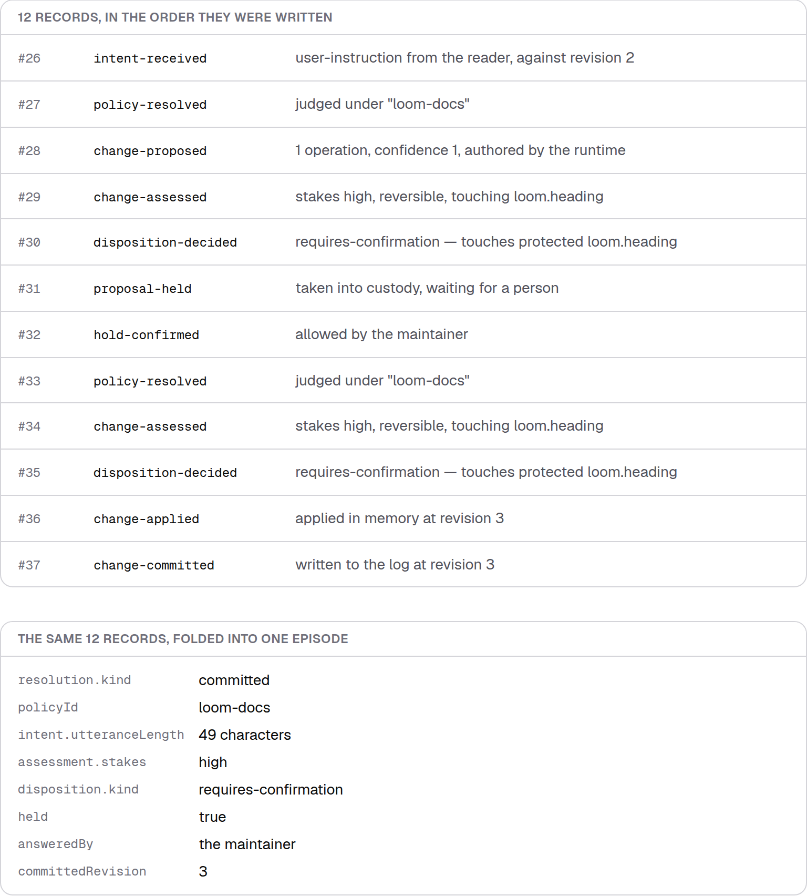
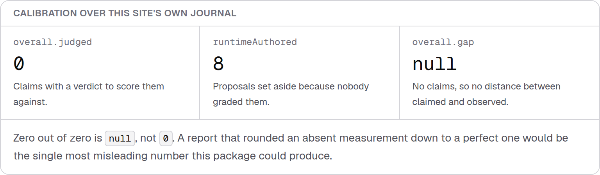
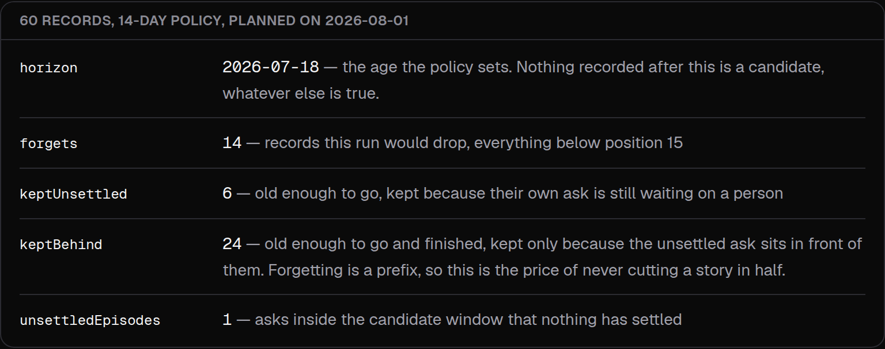
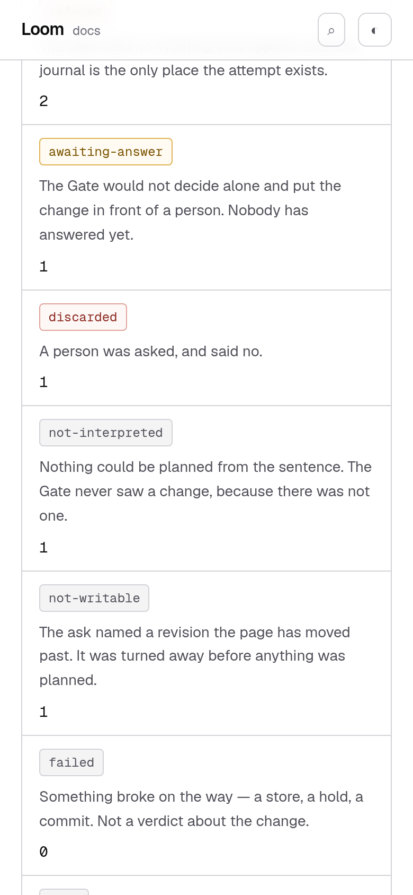

# 28 August 2026 — what every ask leaves behind

**Routine:** `Loom docs` · **Branch:** `docs-13-what-every-ask-leaves-behind` ·
**Section:** §4c

`@loom/runtime/telemetry` is the largest door on this site with no prose behind
it — **62 exports, described by their own signatures and nothing else**. It was
the second of the four zeroes measured on #167 and the one the last report said
to write next. This is that page.

## The problem the page had to solve first

Telemetry is the half of the runtime a reader **cannot see by clicking
anything**. Every other page on this site can put a live example in front of
somebody: press a chip, watch the Gate answer. The Gate's answer is on the screen
a second after the click. The *record* of that answer is what a deployment reads
next Tuesday, and no amount of clicking shows it to you.

A page written from the type signatures would have described a shape rather than
a thing that happened, which is exactly the failure §4c exists to prevent.

So the page does the only honest alternative. It opens a session on the same
tree the site has been rendering since *Your first tree*, **asks it for ten
changes across four weeks**, and wires the runtime's event sink to a real
collector writing into a real journal. The records, the fold, the tally, the
calibration and the retention plan are all read back out with the runtime's own
functions as the page builds. **Nothing on the page is a fixture.**

## Ten asks, and they reach six of the eight endings

The corpus is not a demonstration script. It is four of the site's own chips
judged by the site's own Gate policy, which protects `loom.heading` — so
*demote* is held, *delete* is refused, the other two are waved through, and
`link-the-card` finds no card on this tree and never reaches the Gate at all.
One ask is aimed at revision 0 on purpose: somebody's tab left open too long.

**The zeroes are printed rather than hidden**, and that is the same rule the
reference pages adopted on #167 for exports nothing names. An ending that has
never happened and an ending the table forgot are different claims, and a reader
looking at six rows cannot tell which they are being shown.

Four of the eight are **not verdicts**, and I think that is the most useful thing
on the page. A host that folds `not-interpreted`, `not-writable`, `failed` and
`open` into "it failed" builds the wrong error handling: a rising count of
`not-interpreted` is a signal about the planner rather than about your users, and
a page that moved under somebody is not an error at all.

## A record is not the story, and the page shows both

The section I would defend hardest is the one that walks a single ask twice —
once as the twelve records the journal holds, once as the episode `episodesOf`
folds them into.

Two things fall out of it that no prose I could have written would land as well.

**It is two requests, not one.** Records 26 to 31 are somebody clicking; record
32 is a different person, later, saying yes. `answeredBy` is *the maintainer* and
`provenance.actor` is *the reader*, side by side in the folded view, which is
0029's whole argument visible in two lines rather than argued in a paragraph.

**The Gate ran again.** Records 33, 34 and 35 are the policy being resolved and
the change being assessed a second time, after the confirmation. A person saying
yes is permission to proceed, not permission to skip the check. I did not plan
that paragraph — it is what came out of the journal, and it is now the clearest
statement of `confirmHeld`'s behaviour anywhere on the site.

Those positions are named in the prose, so **a test pins them**: the trace is
seqs 26–37, `hold-confirmed` is at 32, and the two dispositions are at 30 and 35.
Prose that points at a number has to be held to it.

## The calibration section is empty, and that is the point

*Connecting a model* ends by saying a self-graded confidence is trusted on one
condition — that it be calibrated. This page is where that promise is cashed, and
the report over this site's own journal looks like this:

`calibrationOf` **scores none of the eight proposals**, because every one was
authored by a deterministic interpreter that stamps `confidence: 1`, and it
reports the count it set aside rather than dropping them. A confidence nobody
graded is not a claim; scoring it would measure a constant the runtime stamps.

`overall.gap` is `null`, not `0.00`. That distinction is the single most
load-bearing thing in the block — **a gap of zero reads as a perfectly calibrated
model, and there is no model here at all** — so it is the mutation I checked by
hand rather than assumed.

The honest limit is filed rather than papered over: a reader finishes that
section without ever seeing what a real gap looks like, the page does the
arithmetic in words instead, and the three ways to close it are all worse than
leaving it. Details and a recommendation are in `FINDINGS.md`.

## Forgetting, with all four numbers meaning something

The corpus was deliberately arranged so that the **unanswered hold is early**.
Putting it at the back of the journal would have made retention look like a rule
with no consequences; putting it third makes `keptBehind` **24** — two dozen
records that are old enough to go and completely finished, kept only because one
ask from three weeks ago is still waiting for somebody.

That is the price of the two rules, and the page states both. Forgetting is a
**prefix**: a journal drops its oldest records or none, because a hole makes "is
this window complete?" unanswerable. And an episode is **never cut in half**,
because a window holding a commit without the proposal it committed is precisely
the fault `episodesOf` reports as `unattributed` — a journal that manufactured
the fault its own fold exists to detect would not be worth trusting.

`keptBehind` is therefore a **symptom**, and a host watching it grow has learned
something about their review queue rather than about their database.

## The utterance is not kept, and the page proves it rather than claiming it

The record is printed whole rather than paraphrased, because a reader who has
been told the sentence is not stored will go looking for it, and a trimmed
excerpt would leave them wondering.

A test asserts that the string *"Add a closing line"* appears nowhere in all
sixty records, which is the claim rather than a proxy for it.

The page also says plainly why `actor` **is** kept and is not an inconsistency:
an identity is something a query groups by, and a sentence is something you read.
A deployment that cannot hold an identifier for weeks puts a pseudonym there.

## Tests

`pnpm install && pnpm verify` at the repository root. **One test failed and it is
`main`'s, not this branch's** — see below. Nothing was skipped and no test was
weakened.

| Suite | Files | Tests | Change |
| --- | --- | --- | --- |
| `@loom/runtime` | 111 | 1741 | unchanged — `src/` was not opened |
| `@loom/app` | 138 | **2002 passed, 1 failed** | 134 / 1963 on `main` |

**40 new tests in four new files.** `next build` clean across all five route
groups, and the new page prerenders `○ (Static)` despite running the write path
as it builds.

Three were verified by mutation, because a test that has never failed is a claim
rather than a check:

- filtering the endings table to counts above zero fails *"prints the two
  endings that did not happen"* and *"has a row for every ending"*, in both the
  component suite and the reading suite, and nothing else
- printing `(gap ?? 0).toFixed(2)` fails *"prints null for the gap rather than
  rounding an absent measurement to zero"*, and only that one
- taking the first episode instead of the answered one fails *"shows the Gate
  judging twice"* and three others, and nothing else

The claims worth naming:

- **every named import in every fenced block on the page is checked against the
  module it names**, by importing that module and asking it. A code block is the
  one kind of prose on a documentation site a reader will paste.
- nothing is dropped and nothing is unattributed — a page reporting rates over a
  window that silently lost records would be reporting over a denominator it
  changed without saying so
- every proposal in the corpus is `authoredBy: "runtime"`, which is what makes
  the empty calibration report correct rather than broken
- the corpus reaches exactly six endings, in a fixed order — a corpus that
  quietly collapsed to two would leave the prose describing a table it no longer
  shows
- the four retention numbers are all non-zero, because each has a sentence beside
  it on the page
- `forgets + keptUnsettled + keptBehind` equals the number of records older than
  the horizon
- the clock is fixed, checked by pinning the first and last `recordedAt`, so the
  page prerenders the same bytes on every build
- the six event types this site never produces are still summarised, against
  handwritten records — a third of `recordSummary` would otherwise never have run

## The one failing check is `main`'s

`app/(marketing)/_lib/facts.test.ts > counts the decision records` — expected
`95`, got `94`. A ninety-fifth decision record landed on `main` and
`FACTS.decisions` is a hand-written literal nobody bumped, so **`pnpm verify` is
red on `main` itself**. This branch adds no decision record and does not open
that file.

I have **not** ported the fix, deliberately. `(marketing)/_lib/copy.ts` is not
this lane's, and the lane that owns it already carries the change on two open
branches — #182 bumps the literal, #174 deletes it and derives the number. A
third copy of a one-line bump buys nothing and hands the maintainer a merge
conflict against his own fix. Merging either turns this branch green with no
action from me.

This is the **seventh hand-edit of that literal in ten days**, and the finding
against it is now six occurrences old. #174 is the one that ends it. Re-filing it
a seventh time would be noise, so this paragraph is the record.

## Scope

`apps/loom/app/(docs)/` only — one file changed (`nav.ts`), four files added,
plus `FINDINGS.md` and this report. **`src/` was not opened and no file in
another lane was touched**, including the two at the application root this lane
owns by content, which did not need to change.

No new primitive was needed. The five blocks are docs-site chrome in 0067's
sense, on the same footing as `InterpretationFaults`, `ContrastAudit` and
`PaletteSlots` — generated tables arranging something the repository already
knows, rather than content composed for a reader.

Dark and a true 390px were both checked before the pull request rather than
after; `document.documentElement.scrollWidth` is exactly 390 at a 390px viewport.

## One thing I got wrong, and how

`retentionPlanOf` takes `(records, horizon)`. Reading `applyRetention(journal,
{ policy })` beside it, I wrote `retentionPlanOf(records, policy, now)` — the
signature a caller expects from the surrounding API rather than the one that
exists. It typechecked in `vitest`, which does not, and produced a plan claiming
54 of 60 records were forgettable: the object compared against a string as a
horizon, so every record fell inside the candidate window.

`pnpm typecheck` catches it, and it is the reason the corpus is probed before the
prose is written rather than after. Worth recording because the near-miss is the
lesson: a page that had reported those numbers would have been **confidently,
specifically wrong** about the one function on it a host would copy.

## Findings

- **For `Loom daily build`** — `TelemetryEvent` has eighteen types and no
  exported list of them, so this page counts them by reading
  `telemetryEventSchema.options.length`, which is a Zod internal. Third module
  with this hole; `EPISODE_RESOLUTION_KINDS` and `UNJUDGED_REASONS` are both
  inside `src/telemetry/` already, so the shape is settled.
- **Mine** — this site can never show a filled-in calibration report, because
  0057 makes its interpreter deterministic. The three ways to close it are all
  worse than leaving it. Recommendation and reasoning filed.
- **Mine** — two zeroes left. `telemetry/postgres` is closed by being named on
  this page; `cli` is last on purpose, and a *Deploying* page showing all four
  seams at once is worth more.

## Open questions

**What a page-writing routine does when the honest answer is an empty table.**
This run hit it twice: calibration scores nothing here, and two endings never
occur. Both times the answer was to show the emptiness and explain it, and both
times that turned out to be the strongest paragraph in the section. That is now
a pattern rather than a coincidence, and it is worth being explicit that this
lane will keep choosing it — a page that only prints what clears the bar is how
a documentation site tells a comfortable lie without writing a false sentence.

**`FINDINGS.md` is now a four-way append target.** This branch and #175 both
append to the end of it, so they will conflict, exactly as this branch and #167
did an hour ago. It resolves in thirty seconds by date order every time, and it
will happen on every pair of docs branches that are open together. Not proposing
a fix — a per-run file would be a worse trade than a predictable conflict — but
worth naming so it is not mistaken for a mistake.
