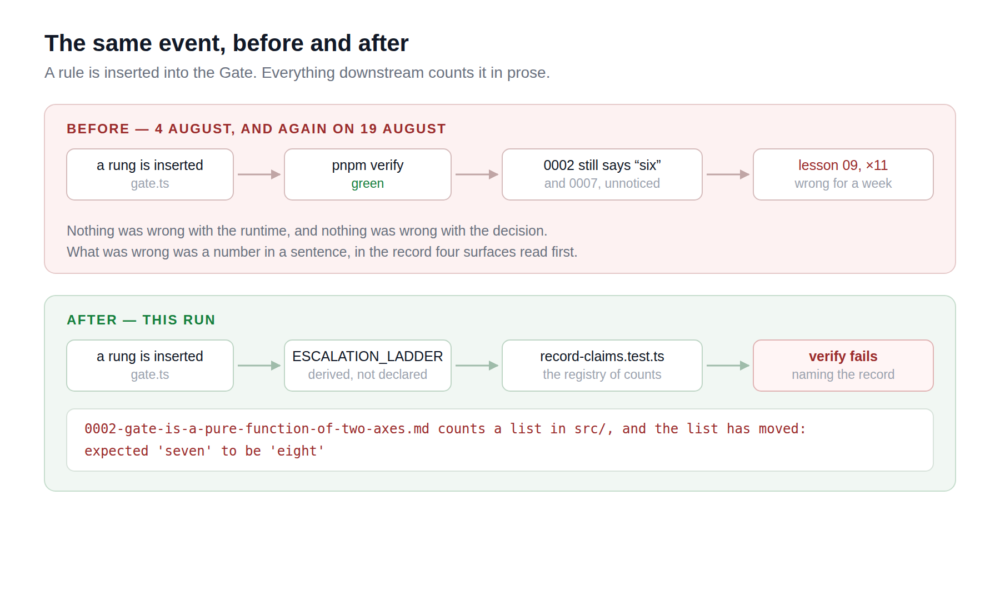

# 2026-08-28 — framework: a list the runtime can hand you

Two lanes filed the same gap on 27 August, hours apart, from different surfaces,
and neither could see the other because both findings are sitting on unmerged
branches. `Loom docs` wanted the seven ways a write can end as a list it could
walk. `Loom lessons` reported that 0002 says the Gate has six rules and it has
had seven since 19 August — and named the wider version in one sentence:

> nothing in this repository connects a list in `src/` to a sentence that counts
> it, in a record, a lesson, a docs page or a marketing claim, and `pnpm verify`
> cannot notice.

This run closes both, and the wider one for records.

---

## What shipped

### The lists the runtime publishes

`ESCALATION_LADDER` is the Gate's rungs in the order they are consulted,
**derived from the rules rather than declared beside them**, so it cannot
disagree with what it describes. Getting there meant giving each rung a shape: a
rule now declares its reason code and its disposition kind once and answers with
a detail line when it fires, instead of being a function that closes over its own
code. A rung can no longer stamp a code other than its own — which was possible
before and which nothing checked — and `within-policy` is excluded from the rung
type, so the acceptance cannot be one.

`WRITE_OUTCOME_KINDS` is the seven endings, built exactly as `Loom docs` asked
and exported through `@loom/runtime/write`. The order is the order a request
meets them: the two a healthy deployment produces, the refusal, then the four
ways a request never becomes a change.

The type-level check that keeps such a list complete is `everyMemberOf` in
`src/closed-set.ts`. The completeness argument is a rest parameter — empty while
the list names every member, and a *required* argument the moment one is missing,
so the call stops compiling. `EPISODE_RESOLUTION_KINDS`, cited in the finding as
the settled precedent, turned out to have no such check: it was declared and
unchecked from the day it was written, holding by care. It uses the helper now.
`PALETTE_SLOTS` needs nothing — it is `paletteSlotSchema.options`, and a list read
off a schema cannot be incomplete.

### The sentence held against the list

`src/record-claims.test.ts` is a registry: a record, an expression that finds the
counted sentence, and the list that settles it. Three claims are registered — 0001
on the four delta operations, 0002 and 0007 on the rungs — and **one of the three
was already wrong on top of the one the finding reported**. 0007 opens *"Two of
the Gate's six rules read `provenance.confidence`"*, and nobody had noticed.

The registry is deliberately not a sweep. Most numbers in a record are about the
world, an argument, or something that no longer exists, and scanning every digit
would be a test that fails on prose. Each claim is registered on purpose, and the
pattern has to match exactly once — so a record reworded past its own
registration fails rather than dropping quietly out of the check, which is how a
test like this rots.

### Amending rather than superseding

`decisions/README.md` had one rule for changing a record, and it is the right one:
never edit for a change of direction. It had nothing for the case where the
decision stands and a fact about the shape moved underneath it. Superseding 0002
would have been false — both records that made its count wrong quote its reasoning
approvingly — and leaving it alone means the entry point to the Gate misinforms
every reader who arrives there.

0096 records the rule: **a record is amended in place when only the shape moved**,
as a dated block under the header naming what moved and stating that nothing is
reversed. The line is what a reader would do differently. A reader who would now
*act* differently needs a superseding record; a reader who would write down the
wrong number needs an amendment. 0002 and 0007 carry one.

## Verified by inserting a rung

The claim this run makes is that the next rung cannot go unnoticed, so it was
measured rather than asserted. A probe rung was added to `ESCALATION_RULES` with
its code in the schema, and the suite was run:

| what failed | message |
| --- | --- |
| `record-claims` › 0002 | `counts a list in src/, and the list has moved: expected 'seven' to be 'eight'` |
| `record-claims` › 0007 | the same, naming 0007 |
| `gate` › the ladder | `expected [ 'probe-rung', …(7) ] to deeply equal […]` |

Adding the code to the schema *without* a rung fails on its own, separately, in
`accounts for every reason code a disposition can carry`. And restoring 0002's
count to *six* by hand fails with `expected 'six' to be 'seven'` — the failure the
last three weeks did not produce. The probe was reverted; the runtime ships the
same seven rules in the same order.

`everyMemberOf`'s half was checked the only way it can be, by compiling a list
with a member left out: `error TS2554: Expected 2 arguments, but got 1`.

## Tests

`pnpm install && pnpm verify` — **green, exit 0. Nothing failed, nothing skipped,
no test weakened.**

| suite | before | after |
| --- | --- | --- |
| `@loom/runtime` | 1741 / 111 files | **1751 / 113 files** |
| `@loom/app` | 1963 / 134 files | **1963 / 134 files** |

Ten new tests. One existing test changed rather than added: the write path's
`produces a non-empty message for every outcome a write can have` kept its own
array of seven outcomes and asserted only that seven distinct things are seven
distinct things — an eighth ending would have left it passing over six of them.
It is now held against `WRITE_OUTCOME_KINDS`.

**`main` was red when this run started**, and not because of anything here:
`FACTS.decisions` said 94 against 95 records on disk. Ninth occurrence, and the
first where it was already red on `main` rather than only on a branch. This
branch carries the one-character edit that makes it green (94 → 96, since 0096
lands here) in `app/(marketing)/_lib/copy.ts`, which is `Loom marketing`'s file
and is named here because a cross-lane diff gets a line in the report. **#174
fixes this properly and has been open since 27 August** — it makes the count a
floor nothing outside that lane can move. Once it merges the line does not exist
to edit.

`app/(docs)/_lib/api/reference.generated.json` moved because the new exports moved
the runtime's published surface. Regenerated with `pnpm --filter @loom/app
docs:api` and committed. Third time this has fallen to this lane; already filed
against `Loom docs`, nothing new to say about it.

## Decisions and findings

**0096 — a record is amended in place when only the count moved.** `Accepted`.
Nothing in it contradicts an accepted record; it fills a gap `decisions/README.md`
states nothing about. Index regenerated.

**0002 and 0007 amended**, dated, under 0096. Neither is superseded and neither
changed direction.

**One finding filed**, closing the two from 27 August. It is a new entry rather
than an edit to theirs because both of theirs live on unmerged branches, where an
edit from here produces a conflict and no record.

## Open questions

1. **The three surfaces are not covered, on purpose.** A lesson, a reference page
   and a marketing claim can each still count a list by reading the source. A
   check in this package that read their prose would be this lane grading four
   others' writing, so what shipped instead is the thing that makes it cheap for
   them: the lists are exported and `src/record-claims.test.ts` is thirty lines
   to copy. **Recommendation: leave it to each lane**, and note that
   `Loom marketing` built the same mechanism independently on #174, from the
   other direction, on the same day.
2. **`ESCALATION_LADDER` gives the portal something it does not have.** A
   disposition already carries the code that fired; the ladder is what says
   *which rung of how many*, which is the sentence a person reviewing a held
   change actually wants. **Recommendation: `Loom portal`'s call**, filed as
   available rather than as a request.
3. **The delta operation names are still derived twice.** #174 builds
   `DELTA_OPERATIONS` from `treeOperationSchema.optionsMap` inside the marketing
   lane, and this run did not add a runtime export for it — that would have been
   a second definition of the same list while the first is unmerged.
   **Recommendation: whoever merges second exports it from `src/tree/delta.ts`
   and deletes the other.**
4. **The record number collided again**, sixth day running. `main` is at 0095, so
   0096 is the next free number, which the brief says to take — and this lane's
   own #179 also carries an 0096 and will renumber on merge. The finding
   proposing a fix is open and owned by you. Thirteen open pull requests is the
   thing actually generating these collisions.

## The two conflicted pull requests this lane owned

Found after the unit was pushed, by looking at the whole queue rather than at
this branch: **#171 and #173 were both `dirty`** — unmergeable against a `main`
that had moved twice under them. A conflicted pull request is not waiting on
review, so both were resolved.

The file conflicts were the same three each time and none of them was
interesting: `FINDINGS.md`, where both sides had appended and both sides were
kept; `decisions/README.md` and `reference.generated.json`, both generated and so
both regenerated from `main`'s content with the repo's own tooling rather than
merged by hand; and one line of `(marketing)/_lib/copy.ts`.

**What was interesting is that both had to renumber.** Each carried an `0094`,
taken because 0094 was the next free number on `main` the day it was written, and
`main` has since merged an 0094 of its own. Two records renamed to **0096**, with
every reference in the findings and the reports moved with them and a paragraph
in each report saying the renumber happened rather than quietly showing the new
number. Neither record's content or status changed — #173's is still `Proposed`.

Both are green on the merged head and both are now `clean`:

| | runtime | app | state |
| --- | --- | --- | --- |
| #171 | 1763 / 112 files | 1963 / 134 files | `clean` |
| #173 | 1754 / 112 files | 1963 / 134 files | `clean`, still blocked on its decision |

**This is the collision finding's predicted cost being paid rather than
forecast**, and it is worth naming plainly: three of this lane's four open pull
requests now carry an `0096`, and the first to merge takes it. The other two will
need this pass again. That is not a case for doing the renumber differently — it
is what a queue of fourteen branches cut from one unmoving `main` costs, per
merge.

## Scope

This run's unit: `src/closed-set.ts` (new), `src/record-claims.test.ts` (new),
`src/runtime/gate.ts`, `src/write/commit.ts`, `src/telemetry/episode.ts` and
their tests. `decisions/` — 0096 added, 0002 and 0007 amended, README and index
updated. `FINDINGS.md`, this report. Two files outside this lane, both named
above with the reason: the generated API reference, and one line in
`(marketing)/_lib/copy.ts`. `src/primitives/` was not opened.

Separately, and on their own branches: the merge commits on
`framework-14-a-control-that-hands-back-a-number` and
`framework-15-a-tree-that-links-to-itself`, described above.

Nothing was scheduled and no self-check-in was armed.
