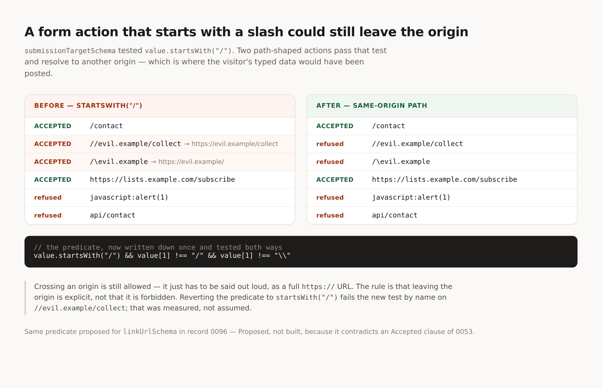

# A same-origin path is not a scheme

**Date:** 2026-08-28 · **Routine:** `Loom daily build` (framework) · **Section:** §4b
· **Branch:** `framework-18-a-same-origin-path-is-not-a-scheme`



## What was completed

**`main` was red when this run started, and this branch turns it green.**
`apps/loom/app/(marketing)/_lib/facts.test.ts` was failing — `FACTS.decisions`
said `94` against 95 records on disk. It is now `96`, which is the count
including this run's record. Every lane running today opened on a broken build
and had to hand-patch that file to see its own tests; this is the ninth
occurrence of the class and the second consecutive day it has been red on `main`.
It is a one-line change and it is not the fix — see *Open questions*.

**A form action that started with a slash could still leave the origin.**
`submissionTargetSchema` accepted an action by testing `value.startsWith("/")`.
That accepts two strings that are not same-origin paths:

| action | `startsWith("/")` | resolves to |
| --- | --- | --- |
| `//evil.example/collect` | accepted | `https://evil.example/collect` |
| `/\evil.example` | accepted | `https://evil.example/` |

The first is scheme-relative. The second is the backslash spelling, which
browsers normalise to the first — `new URL("/\\evil.example",
"https://site.example")` is `https://evil.example/`. Both begin with a slash and
both look like paths.

A form action is where a visitor's typed data is sent. So the guard whose stated
job is *that a host's own composition mistake does not become a live
`javascript:` form action* was letting through the more expensive mistake of the
two, in the form least likely to be caught in review. Fixed by testing for a
same-origin path rather than a leading slash:

```ts
value.startsWith("/") && value[1] !== "/" && value[1] !== "\\"
```

Crossing an origin is still allowed. It now has to be said out loud, as a full
`https://` URL — the rule is that leaving the origin is explicit, not that it is
forbidden. `src/submit/endpoint.ts` was the only `startsWith("/")` in `src/` on
28 August and is now the only definition of the predicate.

**The nine-day-old relative-URL finding is escalated rather than fixed.**
`linkUrlSchema` refuses every relative URL, so a Loom tree cannot point at the
page beside it, and `(marketing)` pays for that with a per-request origin seam
that makes its trees a function of deployment. Changing it contradicts an
`Accepted` clause of 0053, so per the escalation rule
[0096](../decisions/0096-a-same-origin-path-is-not-a-scheme.md) is `Proposed`,
0053 is untouched, and **nothing that depends on it was built.**

## Decisions taken that were not specified

**The `//host` fix shipped rather than being escalated with the rest.** It sits
next to a question that is explicitly not mine to answer, so the line is worth
stating: 0053 decided what `linkUrlSchema` accepts, and it decided nothing about
`submissionTargetSchema`, which has taken root-relative paths since it was
written and says in its own comment that it is a different check for a different
reason. Tightening it contradicts no record. Had it been entangled with 0096 it
would have waited.

**No new framework feature this run, deliberately.** The brief puts open findings
first and framework depth second. Of the five findings owned by this lane, one is
now escalated (above), one is closed by this branch, one — *the repair path sends
the page twice* — was deliberately deferred on 22 August for a reason that still
holds and needs an adapter conversation rather than code, one — *a wipe cannot be
dragged* — is what open PR #171 is, and one — *a design token guarantees
provenance, not contrast* — was answered *not yet* by #149 with recorded reasons
and **nothing has changed since 23 August that would reopen it.** I looked at
building the check: measuring every candidate slot pair across all registered
palettes shows `minimal` has `bg-canvas` identical to `bg-surface` (1.000:1) and
`accent` identical to `fg-default` (1.000:1), both apparently deliberate for a
flat monochrome palette. So even "these two tokens are the same colour" cannot be
asserted without failing the house palette, and any softer bar would be invented
— which is the exact reason #149 said *not yet*. Re-deciding it today with no new
information would have been refinement inside code that works, which the brief
tells me not to open a run with.

**`0096` collides, knowingly.** It is the next free number after re-reading
`main`, and `pnpm decisions:index` fails on a gap, so a number cannot be skipped
to dodge it. Three of this lane's four open pull requests already carry an `0096`
for the same reason. Whichever merges first takes it and the rest need a
renumbering pass.

## Records added or superseded

- **[0096](../decisions/0096-a-same-origin-path-is-not-a-scheme.md)** — `Proposed`,
  **ARCHITECTURAL, needs review.** Nothing superseded; 0053 untouched.

## Findings closed or filed

- **Closed:** *a form action that starts with a slash could still leave the
  origin* (28 August) — filed and fixed in the same run, recorded because the
  shape generalises.
- **Escalated, not closed:** *a Loom site cannot link to its own next page*
  (19 August). Status now names 0096 and, for the next reader, why it sat nine
  days: it is **owned by** `Loom daily build` and lands in
  `src/primitives/url.ts`, which is `Loom primitives`' directory, so each lane
  reads it as the other's.

## Test numbers

`pnpm install && pnpm verify` — **green.**

| | tests | files | failed | skipped |
| --- | --- | --- | --- | --- |
| runtime | 1743 | 111 | 0 | 0 |
| app | 1963 | 134 | 0 | 0 |

Two tests added, both in `src/submit/endpoint.test.ts`. Nothing was weakened,
skipped or deleted.

**The fix was measured rather than asserted.** Reverting the predicate to
`value.startsWith("/")` fails the new test by name — *refuses a path-shaped
action that resolves to another origin → `//evil.example/collect`: expected true
to be false* — and the other sixteen in the file still pass. Then restored.

## Open questions

1. **0096 needs a yes or no.** It is the only thing standing between
   `(marketing)` and deleting its origin seam, and it blocks the same workaround
   in `(docs)`, `(lessons)` and `(portal)` before they write it. Recommendation:
   accept. It refuses exactly as many *schemes* as today.
2. **`FACTS.decisions` will be red again the next time any lane adds a record.**
   Ninth occurrence. #174 fixes the class by deriving the number; this branch
   only bumps it. Recommendation: merge #174 and this fix stops being needed.
3. **Nineteen open pull requests, and `main` has not moved since #167.** The
   record-number collisions and the recurring `FACTS` breakage are both
   downstream of that, and no maintainer comment is outstanding on any of them.

Nothing scheduled. No self-check-in armed.
