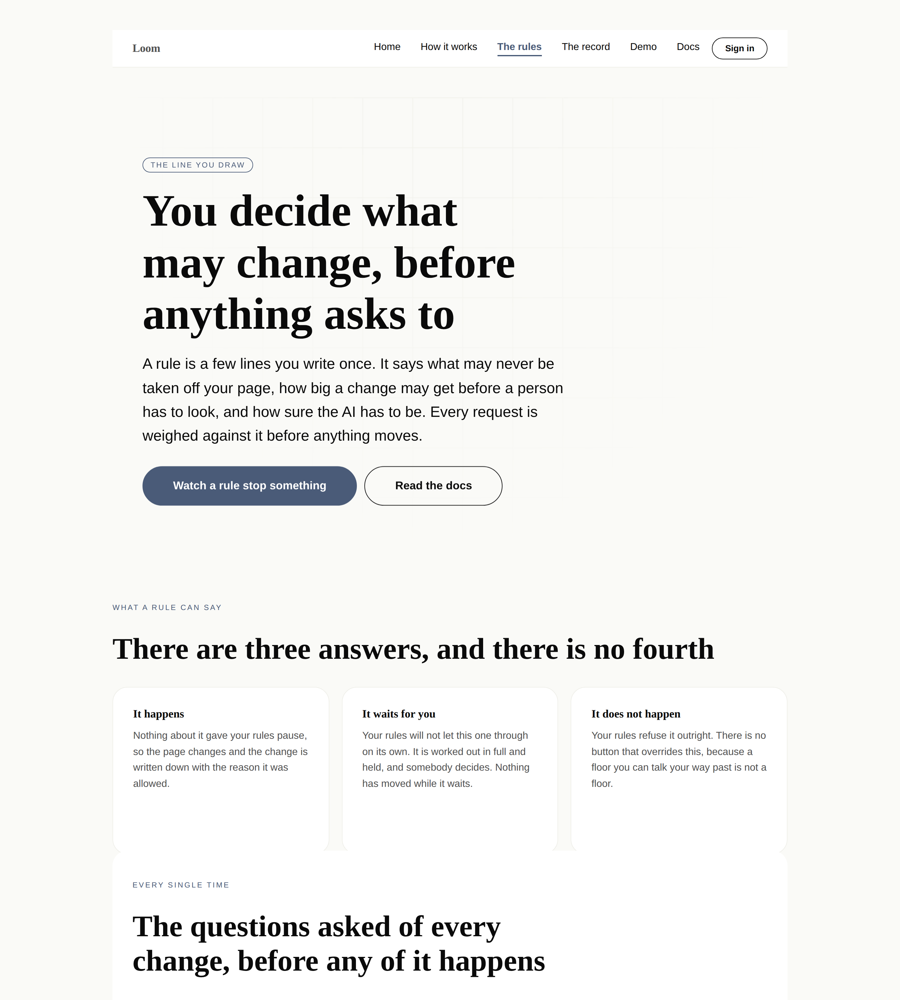
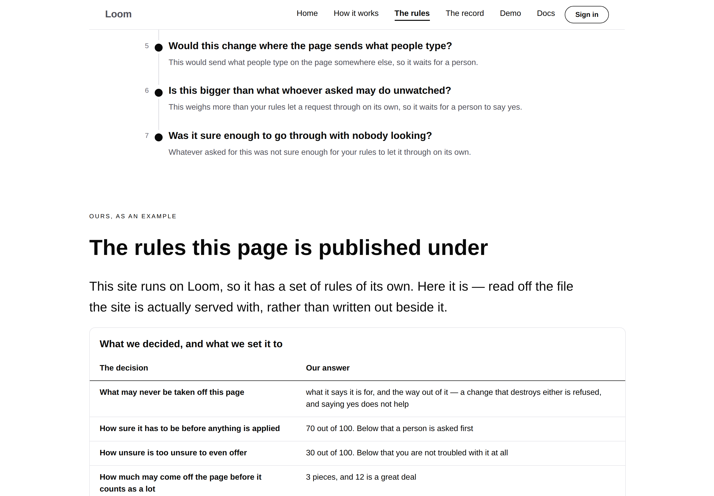
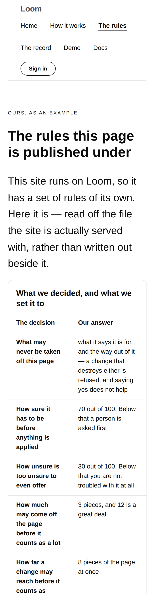

# 2026-08-28 — marketing: the line you draw

Every page on this site says some version of the same sentence: *nothing lands
until it has been checked against your rules.* Twelve runs have made that
sentence louder and none of them had answered the question it raises.

**What is a rule? Who writes it? What can it actually say?**

Until today the whole answer was one band of the mechanism page — three cards
titled *How much is at stake*, *Whether it can be undone*, *Which rules applied*
— and one line in a questions list. A visitor who believed the front door and
wanted to know what they would be signing up for had nowhere to go.

`/the-rules` is that page. It is the fourth route on the site and, per the
recorded positioning, the half of the pitch that is supposed to be the
differentiator: not that a page adapts — plenty of things adapt a page — but
that somebody decided in advance what it may do, and can prove which decision
applied.

---

## Before anything else: `main` was red

`pnpm verify` fails on `main` itself, and has since a ninety-fifth decision
record landed without the marketing site's checked count being bumped.

That is the **seventh** occurrence in ten days of the finding filed on 19 August,
and the first one to actually reach `main`. Since 0067 it is not one surface red,
it is four — every lane that cut a branch afterwards inherited a failing gate.

Bumped to `95` here, because a branch may not be opened on red and that is the
whole of the fix. It is not *the* fix. **#174 deletes that literal and derives
the counts**, and this run also found that branch carrying a merge conflict —
main had landed two more hand-edited literals into the very constant #174 exists
to remove. Resolved in favour of the derived values, verified green, pushed. The
branch is now clean, green and one review away from this class of failure being
over.

## What shipped

**One page, eight bands, and not one component.** Everything on it composes
registered primitives — `loom.hero`, `loom.feature-grid`, `loom.milestone-list`,
`loom.table`, `loom.faq-list`, `loom.section`, `loom.stack`. `loom.table` had no
consumer anywhere in the application before today; it needed nothing added to it.

### The claim the page makes, and how it is kept

The page says three things a reader can check, and each of them is a promise
this lane can break by writing a sentence. So none of them is written.

**"There are three answers, and there is no fourth."** The band is built from
`dispositionKindSchema.options`, and a fourth kind in the runtime fails the test
that holds the sentence.

**"Seven questions, asked in this order."** The seven are held against
`dispositionReasonCodeSchema` minus `within-policy`, which is the one code that
is not a rule but the note taken when none of them fired. The numeral in the
sentence is `RULES.length`. An eighth rule in `src/runtime/gate.ts` takes **this**
lane red, and that is the right side of the asymmetry #174 settled: a number that
moves without changing a claim should need nobody, and a number that moves
*because* the claim stopped being true should need whoever wrote the claim. This
page's claim is completeness.

**The rules this site is actually published under.** Every figure in the table is
read off `FRONT_DOOR_POLICY` — what it protects, both confidence lines, both
removal thresholds, the breadth threshold, the refusal floor, and what each of
the four kinds of asker may do before a person is involved. Nothing in that band
is typed.

### The property worth the whole run

**The sentence beside each question is the sentence the site will print at you on
the day that rule fires, because it is the same string.**

`BECAUSE` in `adapt/record.ts` is the map the front door's answer band uses to
say why a change was allowed or stopped. It is now exported, and this page prints
it. Writing the explanation out again over here would have been easier and the
drift would have been **invisible** — a reader never has this page and a live
verdict on one screen at the same time. Seven assertions hold each question's
body against the record's own sentence, and mutation-verified: hand-writing one
of them fails seven tests.

That is this site's own thesis applied to itself. A page explaining a mechanism
in words the mechanism does not use is a brochure.

### Two links that are not illustrations

The band near the foot offers *Watch it be refused* and *Watch it stop and ask*.
Both are the published front door with a real request in the address:
`?ask=drop-pitch` is refused by the first line of the table above it — it
destroys the band saying what this site is for — and `?ask=problem` moves the
same band rather than destroying it, so it is held for the visitor to answer.

Tested by address rather than by verdict: `adapt.test.ts` already holds those
verdicts against the served front door in all ten states, so what this page has
to get right is pointing at the request whose outcome it describes, and that is
what is asserted.

## The menu, which is the part to argue with

Adding a fourth page to a site whose eight-item bar the maintainer had already
questioned on #166 would have made nine. So the bar did not grow.

The header used to carry *every unguarded surface*, which is a rule about
permissions answering a question about attention — and it grew by one every time
another lane shipped a front door. `Surface.inMenu` carries that decision now,
with the reasoning beside it in `site.ts`, and **the course is what came out**:
of the four it asks the most of a visitor (*costs you an afternoon*), and the top
bar is for the first ten seconds.

Nothing was hidden. `Loom lessons` keeps the footer's map on every page, the
front door's band of cards, and the closing band of the mechanism page — three
placements of four — and `inMenu: true` puts it back in one word. Filed as a
finding so its owner hears it from a finding rather than from a chart.

**Two tests rather than one**, and the second is the one that matters: a surface
is in the menu **if and only if** `inMenu` says so, and every surface left out is
still reachable from the foot of every page. Without the second, `inMenu: false`
would be a quiet way to delete a surface from the site. Mutation-verified by
making the footer honour `inMenu` too — two tests fail.

The menu question itself is still the maintainer's. Eight is what it was; whether
eight is right is not a routine's call, and this run has only made sure adding a
page did not answer it by drift.

## Tests

`pnpm install && pnpm verify` — **green, exit 0. Nothing failed, nothing skipped,
no test weakened.**

| suite | before (on `main`) | after |
| --- | --- | --- |
| `@loom/runtime` | 1741 / 111 files | **1741 / 111 files** — `src/` was not opened |
| `@loom/app` | 1963, **1 failing** | **2039 passing / 135 files** |
| marketing, within it | 618, **3 failing** | **665** |

The `@loom/app` figure grows by more than the new file's 45 tests, and the extra
is worth naming because it is the lane system working rather than padding:
`pages.test.ts` and `voice.test.ts` are `describe.each(SITE_ROUTES)`, so a fourth
route inherited about thirty existing assertions the moment it was registered —
renders cleanly, mounts every palette slot, names no colour of its own, carries
the chrome as nodes, links every route, holds exactly one first-level heading,
and meets nobody in its opening band with a word they do not have. **None of that
is re-asserted in the new file.** A second copy is a second thing to keep in
step, and the one that drifts is the one nobody is reading.

**Two existing tests were re-pointed and neither was relaxed.** `chrome.test.ts`
asked for *every unguarded surface* in the bar and now asks for *every surface
marked `inMenu`* — the same shape of assertion against the field that now carries
the decision — and two new tests were added beside them, which is a stronger
statement than the one replaced. No test was deleted.

**Six mutations, each caught by the test it was aimed at:**

| the mutation | what fails |
| --- | --- |
| drop the seventh rule from the page's list | *is every reason the rules can give, and nothing else* — 1 failed |
| hand-write a rule's sentence instead of printing the record's | 7 failed, exactly the seven per-rule assertions |
| type `70 out of 100` into the page, then move the policy to 0.55 | *states how sure it has to be as this deployment set it* |
| hand-type what the site protects, then drop a protected type | *claims nothing it does not* |
| put a reserved word in the hero's copy | 4 failed — the whole-page check, and one per palette |
| make the footer honour `inMenu` as well | 2 failed in `chrome.test.ts` |

The fourth is the one worth having and it took two goes. The first version
compared the page against `protectedInPlainWords()` — both derived from the same
list, so dropping a protected type moved both and the check passed while the
page's promise quietly shrank. The assertion that replaced it is an exact match,
and it fails in the direction that could actually embarrass the site: a page
promising to defend something this deployment would in fact let a machine delete.

`scrollWidth` is exactly 390 at a 390px viewport, including both tables, and the
page was checked under all three registered palettes.

## The register, held harder than the rule requires

The site's rule is that the front door may use none of the twelve reserved words
and a mechanism page may use one once it has said the same thing plainly first.
This page is held to the **front door's** rule, on the whole page rather than on
its opening band, under all three palettes.

That is a promise about what the page is for rather than a style preference: it
is about a decision a reader makes, not about the machinery that carries it out,
and the moment it needs one of those words it has started explaining the
implementation instead. The test is where that would be noticed.

## Decisions and findings

**No record written.** The page is compositional, adds nothing to the library and
constrains nothing outside this lane. The one thing that could have warranted one
— `Surface.inMenu` — is a field on this lane's own data with its reasoning beside
it, reversible in a word, and filed for its affected lane instead.

**Three filed.**

- **`main` was red, and it is `FACTS` for the seventh time.** Owned here. Bumped
  to unblock; #174 is the fix and is waiting on review rather than on work.
- **The Gate's rule order is not exported.** For `Loom daily build`. The set is
  derivable and the precedence is not, and precedence is what the band claims.
  Three ways out, in preference order; recommendation is exporting the ordered
  reason codes with `gate.test.ts` holding the two together.
- **The course left the top bar.** For `Loom lessons` and the maintainer. A
  decision to confirm or reverse, not a defect.

**None closed.** Nothing in the queue was answerable from this lane this run.

## Open questions

- **Positioning, audience and the licence line** (#96, restated on #134, #142,
  #150, #163, #166 and #174). The licence line is still the site's one
  placeholder and still the Phase 2 gate. Nothing here touched it.
- **The menu**, above. Eight items is what it was and what it still is.
- **`marketing:facts`** — the question #174 asks: may a surface add its own
  generation script to `apps/loom/package.json`? Unchanged and unanswered.
- **The phone header is four rows** and this run did not improve it — the item
  count is the same, so the wrapping is the same. Filed against `Loom primitives`
  on 22 and 23 August and handed to them with 0086's disclosure seam on #157;
  visible in the phone screenshot above and not this lane's to fix.

## Scope

`apps/loom/app/(marketing)/` only, plus `FINDINGS.md`, this report and its
visuals. `src/` was not opened and no other route group was touched. The runtime
values the page reads — `dispositionKindSchema`, `dispositionReasonCodeSchema`,
`intentOriginSchema` and `ceilingFor` — are public exports of `@loom/runtime`,
consumed the way any host would consume them.
