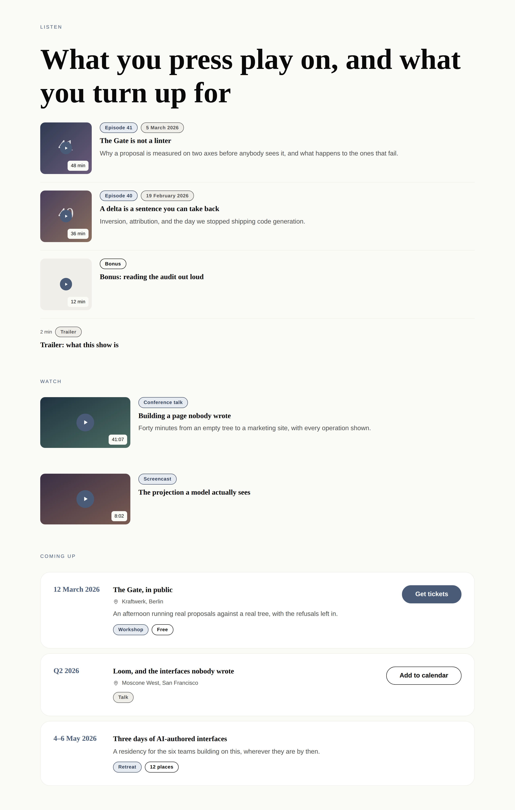
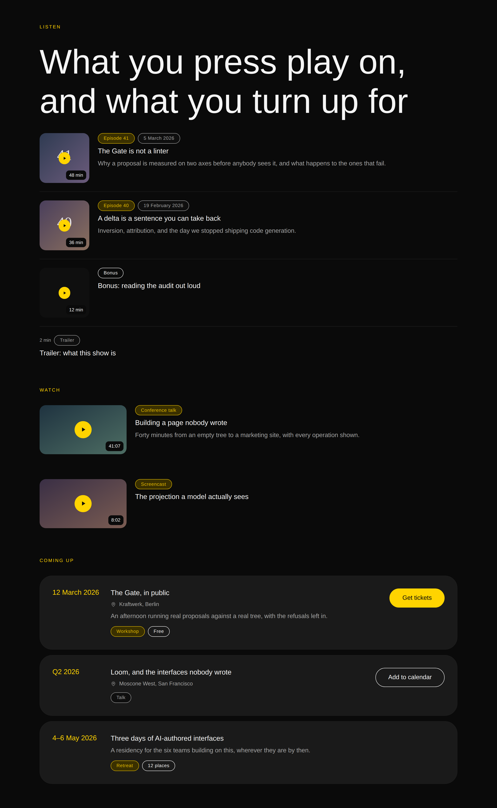
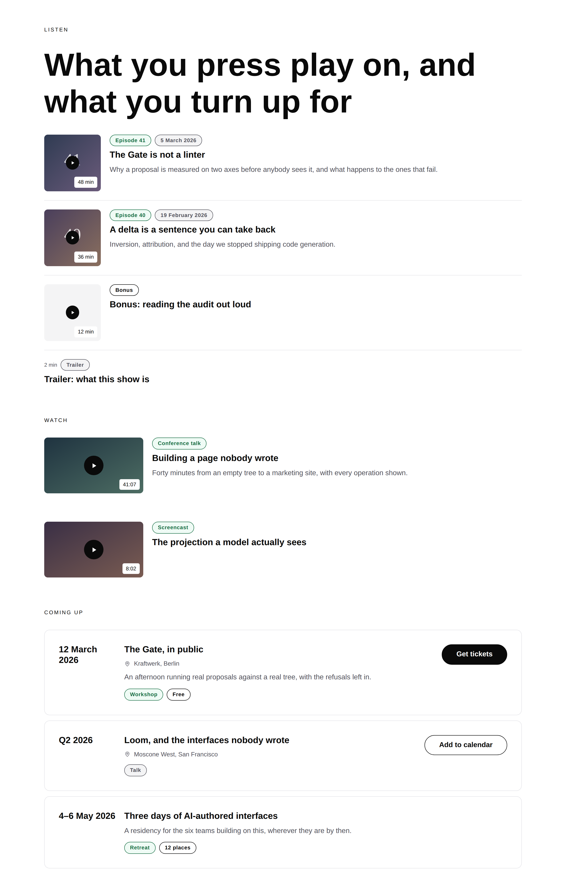
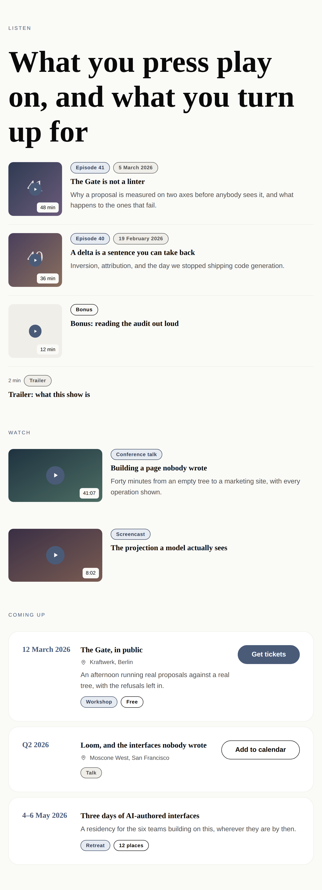
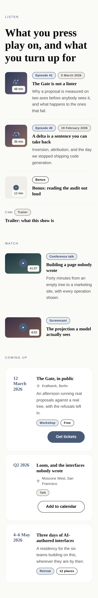

# 28 August 2026 — what you press play on, and what you turn up for

**Routine:** `Loom primitives` · **Section:** §4b · **Branch:** `primitives-16-press-play-and-turn-up`

Two pairs — `loom.episode-list` / `loom.episode` and `loom.event-list` /
`loom.event` — taking the library from **68 to 72** and the Hermes port from
**47 of 70 settled to 52 of 70**. Five blocks, and with them the *playable
media* and *dated things* rows of the port map's remaining four. One decision
record, `0096`, forced by noticing that the last run's container-query pattern
was two techniques wearing one name. **Three defects found by screenshots and by
nothing else**, and two of them set constants that no assertion could have
chosen.

## Which primitives, and why those

**Because the port map's *pairs to build* table had four rows and these two were
five of its eight blocks**, and because the previous run's own pull request said
in as many words that breadth resumes next with the four remaining Hermes pairs.
That is the plan this run inherited and it is the plan it followed.

Within the four, these two rather than books and property:

- **Playable media** is four blocks — `video`, `video-playlist`, `playlist`,
  `podcast-episodes` — the largest collapse left anywhere in the ledger, and the
  band a creator's site is *built around*. Nothing in the library could say
  *here is a thing you can play* at all. `loom.article` came closest and is
  wrong for it in three ways, all of them markup.
- **Dated things** is one block and it is the one a marketing site actually
  needs this month: a demo has a date, a conference talk has a date, a webinar
  has a date, and the library could show a history (`loom.milestone-list`) but
  had no way to say *this has not happened yet and here is how to get in*.

**What this deliberately is not:** books and property listings. Those are three
blocks over two pairs, both of them one card in one grid, and neither is a band
the demo or the marketing site stands on. They are what is left, and the ledger
now says so.

## Which Hermes fields became nodes, and which stayed props

| Candidate | Verdict | Why |
| --- | --- | --- |
| `episodeNumber`, `date`, `artist`, and the fifth one that has not arrived yet | **nodes** | 0052's opening clause, applied by the *sharper* test rather than by counting. There is exactly one artist and exactly one date on a record — but the **set of qualifiers is open**, and a fifth block would arrive with a sixth word. `loom.badge` in a `meta` region, which is `loom.offering`'s call about its nine qualifier fields. |
| The event's `Workshop` / `Free` / `Online` / `Two seats left` | **nodes** | The one place this port *adds* to Hermes rather than transcribing it. Hermes' `EventItem` has none of these and a real events band says all of them. Same open set, same answer. |
| `thumbnail` / `image` / `cover` on an episode | **prop** | And **not** `loom.credential`'s region, deliberately. That card took a region because its mark is a wordmark *or* a face *or* a glyph — four renderings, and a URL expresses one. An episode's artwork is always a picture, so the reason for the region is absent, and `loom.article`'s `image` prop applies unchanged. |
| `link` / `url` / `audioUrl` | **prop** | One destination, and 0066 says the whole row is the target — so it links the title and the title covers the row. A `loom.action` here would be the *event's* answer on the wrong card. |
| The event's ticket link | **a region** | A `loom.action` in `action`. 0066's other side: an event is acted on. A primitive that reimplemented a control as `btnText` + `link` would carry its own copy of 0053's allowlist and its own idea of what a button looks like. |
| `description` / `summary` on **both** cards | **props** | **0094, and this is the record's first application outside the pair that forced it.** Neither content model has a repeated part — no includes list, no chapter run — so neither card has a children flow, so a sentence held as a node could not be reordered against anything. 0094 explicitly deferred these two to port time rather than guessing; the answer read off the Hermes shapes is *prop* for both. |
| `title`, `name` | **props** | Exactly one per record. |
| `duration` | **prop, and it is the one worth arguing about** | See below. |
| `date` on an event | **prop** | One per record, and **free text, never parsed** — Hermes' own call, and `loom.milestone`'s `marker` and `loom.article`'s `kicker` both make it. A parsed date refuses "Q2 2026" and "March 12–14" and forces a locale decision onto a primitive with no business making one. |
| `location` | **prop** | One venue. There is no second one. |
| `aspect` on an episode | **prop** | Two renderings of however-many children there are. Changing it moves no node — the sharper question the granularity doc says to ask. |
| `density`, `separators`, `gap` on the containers | **props** | Arrangement of however-many children, never a count. Nothing truncates either band. |

## The three things the design turns on

### `duration` is a prop, and the argument is not the one it looks like

By the row above it, `duration` should be a badge: it is a short qualifier
beside a name, it is nobody's idea of prose, and there is a `meta` region right
there. Every other qualifier on the card went into it.

It is a prop because **it has a home in the markup that no node could occupy.**
The trailing corner of the artwork is a position the primitive *places*, not a
position in a flow, and no `insert` into `meta` can put a badge there. That is
0051's argument arriving from the other end: **a region exists when the
primitive places content it did not author; a prop is right when the primitive
places a value it alone knows where to put.**

The observable difference is the whole of it. As a badge, the running time joins
a strip of chips and the artwork has an empty corner. As a prop, the card reads
as a player — which is what every one of the four blocks it ports actually is.

And the primitive proves it holds the placement rather than the author: a card
with no artwork has no corner, so the duration falls into the leading strip
instead. One value, two placements, both chosen by the primitive, neither
sayable by a delta. That is the licence a prop carries and a node does not.

### The frame follows a picture *or* a destination — which the screenshots decided

`loom.episode` first shipped drawing the artwork frame only when there was
artwork, which is the obvious reading and is wrong. The specimen has a bonus
episode with no cover, and in the rendered page **its title started at the
page's left edge while its neighbours started theirs a hundred and forty pixels
in.** A list with two leading edges reads as a mistake before anyone works out
which row is the odd one.

The repair is that the frame is drawn whenever there is *either* a picture or
somewhere to go: tinted, with the glyph in it and nothing behind. That is what
every podcast client does with a missing cover, it keeps the column, and it
keeps the affordance. The frame disappears only when there is neither — and the
specimen has that row too, a trailer with no art and no link, which takes the
full width because there is genuinely nothing to draw.

Inside that repair was a second defect, and it is the more embarrassing one. The
duration chip is drawn on `bg-canvas` **because it sits on a photograph whose
colours no palette knows** — canvas against `fg-default` is a pair every palette
guarantees. Off the photograph, a `bg-canvas` chip on a `bg-canvas` page is
**invisible**. It shipped that way and no test could see it. In the strip the
duration is now a quiet `fg-muted` label with no ground of its own, so there is
nothing for it to vanish into. `tokens.ts` has warned about exactly this since 23
August — *a token promises the value comes from the theme and promises nothing
about it differing from the one beside it* — and this is the fifth time the
library has been bitten by it.

### 0096: the last run's pattern was two techniques wearing one name

`loom.offering` reads its own width with a container query, and the 26 August
report named that as a pattern the next primitive should pick up rather than
re-derive. `loom.episode` is the next primitive and it wants its own width too,
so the precedent said: declare `container-type`, emit an inner element for the
rule to reach, write an `@container` block in the stylesheet.

**It needed none of them.** What varies here is a *length* — how wide the
artwork is — and a length has a halfway value. `clamp(5.5rem, 24%, 8rem)`
resolves its percentage against the flex container, so the picture is 88px
beside a title on a phone, 128px in a full-width row, and every width in
between, **continuously** — where a query would have jumped between two of them
at a threshold somebody had to pick. No containment declaration, no frame
element, no rule in `stylesheet.ts`.

The three shots at 1280, 768 and 390 are the same tree with the same props; put
them beside each other and nothing has snapped.

So [0096](../decisions/0096-a-container-query-is-for-what-cannot-be-interpolated.md)
is the rule the fifth primitive needs before it copies the fourth:

> **A container query is for what CSS cannot interpolate. When the thing that
> varies is a length, write it as a function of the container's width and set it
> inline.** The test is one question: *is there a halfway value?* A width has
> one. A `flex-direction` does not.

`loom.offering` stays exactly as it is — a column becoming a row is the case the
query is for. What the record stops is the fifth primitive paying for the
machinery to express a number, and the accumulation that follows: five inner
elements that are markup rather than nodes, five stylesheet blocks, five
thresholds, and five comments explaining why a `
` nobody can see must not
be refactored away.

The record also says where a `clamp()`'s outer terms come from, because this run
learned it the hard way — see below.

## Two containers that are deliberately different, and the difference is 0066

`loom.episode-list` rules its rows with a hairline and varies their rhythm with
a `density`. `loom.event-list` takes a `gap` and nothing else. That is not two
runs' worth of drift; it follows from which side of 0066 the child is on.

An episode band is **scanned** — you are looking for one row out of thirty — so
its rows are borderless and a rule is enough to separate them. An event band is
**acted on**: every card carries a control, and a control needs an edge around
it to say where the card it belongs to begins. Cards with edges want space
between them, which is a gap; borderless rows want a rule, which is a border.
Neither container would be improved by growing the other's prop.

The episode list's selectors are `:first-of-type` and `article + article` rather
than `:first-child` and `* + *`, and that is load-bearing rather than fussy: a
primitive emits the library stylesheet **as its own first child**, and a
renderer that does not hoist it leaves a `<style>` element sitting exactly where
`:first-child` looks. Matching on the element type is true under both renderers.

## The two sides of 0066, on one page

0066 named playable media as one of the seven pairs it was deciding in advance
for, and this run is the first to build two pairs that land on opposite sides of
it in the same specimen:

- **An episode is consumed** — playing is reading with your ears — so the whole
  row is the target, by way of a stretched title anchor. The accessible name is
  the title; the click target is the row; the play glyph is `aria-hidden`,
  because a second announced control would be a second thing to tab to that goes
  to the same place.
- **An event is acted on** — you register, you book, you buy a ticket — so no
  overlay is emitted at all, the name is an ordinary link to a page about it, and
  the control in the `action` region is the only target.

Both are asserted in one test, because the failure the record prevents is
invisible: a card whose surface is clickable *under* its own ticket button
screenshots perfectly.

## The colour that could not be used, and the number that says it was safe

`loom.event` set its date in `accent-strong` and `pnpm verify` went **red** —
correctly. The card paints its own `bg-surface`, so any ink on it is a
**painted** pairing, and `PALETTE_TEXT_PAIRINGS` carries `accent-strong on
bg-surface` as **composed**. Painting it would have demoted a row the audit
*asserts* to one it merely *reports*, without deleting anything, which is
precisely the edit `pairings.test.ts` exists to catch.

The honest repair is one word in `src/theme/contrast.ts`, which is not this
lane's file. So the date is `accent`, already declared painted, and the card
lost nothing.

**Measured before settling, so the answer is on the record rather than in
somebody's judgement:** across all 21 registered palettes the worst
`accent-strong on bg-surface` is **4.83:1** and the worst `accent` is
**4.75:1**. Both clear 0074's 4.5. The promotion would be safe today, and the
next primitive that wants `fg-subtle` or `accent-strong` on a surface it paints
may not have a declared neighbour to fall back to. Filed.

Worth naming beside it: under `minimal`, `accent` and `fg-default` are close
enough that the date does not read as a different colour from the name — the
same property that makes `loom.section`'s eyebrow quiet under that palette. The
date is still unmistakably a date, because its **column** carries the
distinction rather than its colour, which is the more robust of the two and is
why the layout was built that way.

## The defects the screenshots found and twelve assertions did not

**Three, all of them from looking at the page**, which is the fifth consecutive
run in this lane to say so.

1. **`41:07` sat across the play button on a phone.** The floors were `4.5rem`
   for a square cover and `7rem` for a 16:9 still — perfectly reasonable
   numbers, both wrong. The frame holds two overlays and its *height* is its
   width times its aspect ratio, so a 7rem still is 65px tall on a 390px screen
   and the centred glyph and the corner chip cannot both fit. The floors are now
   `5.5rem` and `9rem` — **the widths at which the two clear each other**, which
   is a defensible way to pick a `clamp()`'s outer terms and the only one this
   run could defend.
2. **The row with no cover started its title in a different place.** Fixed by
   the frame rule above.
3. **The invisible chip.** A `bg-canvas` chip on a `bg-canvas` page, described
   above.

Nothing about any of the three is expressible as an assertion over markup: every
value was a token, every pairing was declared, no diagnostic fired, and all
three would have shipped.

## What the library still cannot express

- **There is no three-across band of episodes, and there cannot be with this
  child.** A `loom.episode` is a row; three of them across is three squeezed
  rows, not three cards. A grid of playable cards is a different arrangement of
  a different shape, and giving the container a `columns` prop would be the
  arrangement-versus-count confusion arriving from the container's side. Written
  into the port map so a later run does not have to find it.
- **An episode cannot actually play.** `href` goes somewhere; there is no
  inline `<audio>`, because that is a control with client state and the runtime
  has no seam for one. The same wall `tabs` hit, and this is now a third block
  behind it.
- **An event cannot say it has passed, or sold out.** `loom.perk`'s `state` is
  the shape the answer takes — a closed set of renderings, one `configure` to
  switch — but *which* closed set (`upcoming`, `sold-out`, `cancelled`, `past`?)
  is a real content decision that should be made against a real page rather than
  guessed at. Left out rather than invented, which is the call `loom.offering`
  made about the same question five days ago.
- **A band still cannot sort or filter itself.** An events list is the second
  band in the library a reader would plausibly want to narrow — by month, by
  city — and that is client-side state.
- **A mosaic still measures the screen where it should measure its container.**
  Filed 21 August, filed again on 26 August, and 0096 now says which of the two
  techniques it should be using. Still not fixed here on purpose: it is a change
  to a shipped primitive's rendering under a width nobody has photographed, and
  it belongs in a run with the screenshots to prove it.
- **A `<tfoot>`, a cell spanning two columns, a red callout, a relative internal
  link, a draggable wipe, an embed checked against more than its scheme** — all
  still open, all from previous runs, none of them this unit's.

## Verification

`pnpm verify` green from the repository root, exit 0: **1,754 runtime tests
across 111 files, 1,963 application tests across 134 files, 0 skipped.** Nothing
was weakened to get there. Thirteen of the runtime tests are new, all in the new
`what you press play on, and what you turn up for` block, plus three updated
where the change made an older assertion false — the registry's roll call, its
count, and the audit's leaves list.

Two files outside `src/primitives/` changed and both are counts another lane
holds against the repository with its own test: `FACTS.primitives` `"68"` →
`"72"` and `FACTS.decisions` `"94"` → `"96"` in
`apps/loom/app/(marketing)/_lib/copy.ts`, with `reference.generated.json`
regenerated by `pnpm --filter @loom/app docs:api`.

**`FACTS.decisions` was already wrong on `main`** — it said 94 against 95
records, because #165 added `0095` without bumping it — so `main`'s own
`pnpm verify` fails `facts.test.ts` independently of this branch. That turns
eight days of filing this as tedium into a correctness finding, and it is filed
again with that observation.

## The preview

Opened with the pull request; the address is the `vercel[bot]` comment's alias,
which `pull_request_read` with `method: "get_comments"` returns in full. Read it
from there rather than from the commit status, which carries only the inspector
URL.

The five screenshots above are the primary evidence: the library's own specimen
under all three registered starter themes and at three real viewport widths.
**All three of this run's defects came from them and from nothing else.**

The artwork in them is generated placeholder SVG served from a local origin,
because this sandbox has no egress — that is stated rather than implied, so
nobody reads a gradient as a design decision. Everything else on the page is the
library rendering the tree.

## 21st.dev

**Not attempted, which is itself the finding.** Ten consecutive runs across six
lanes have each spent a call discovering that `docs/routines.md` lists the
domain under `permissions.allow` and that the fetch returns `EGRESS_BLOCKED`.
Saying so rather than quietly skipping it, so nobody reads this and assumes the
visual standard was consulted. Calibration was against `loom.hero`,
`loom.feature-grid`, `loom.article` and `loom.offering` — the floor the brief
names — and against the screenshots.
