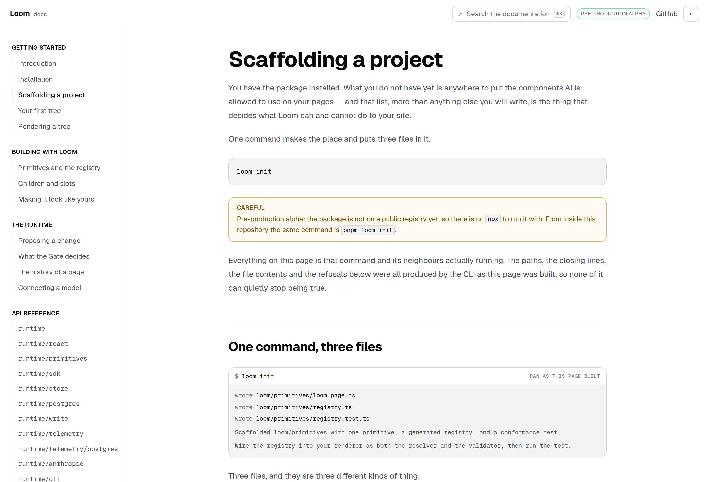
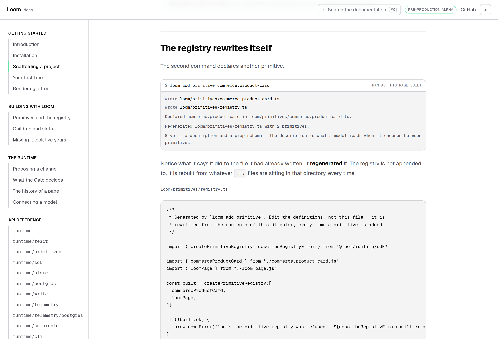
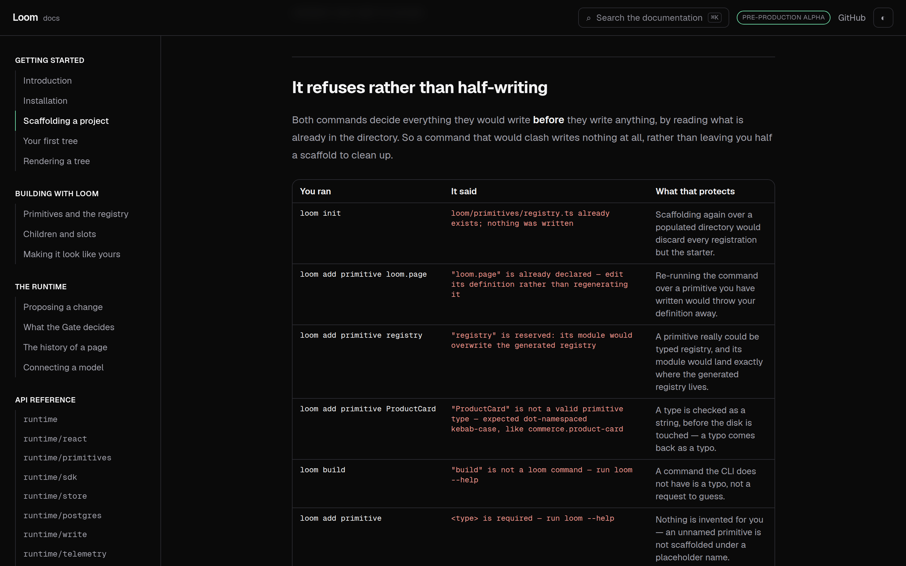
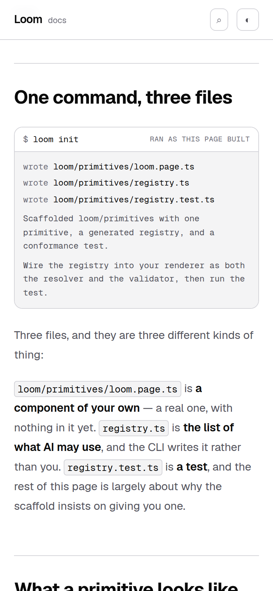

# 29 August 2026 — scaffolding a project

**Routine:** `Loom docs` · **Branch:** `docs-14-scaffolding-a-project` · **Section:** §4c

`@loom/runtime/cli` was the last of the four doors with no prose anywhere on this
site, and the smallest — 23 exports against `telemetry`'s 62. The 26 August
finding said it might belong as a section of *Installation* rather than a page of
its own, "since it is scaffolding rather than a subject".

Reading `src/cli/` changed my mind, and the reason is the third file it writes.

## What shipped

**A page in *Getting started*, between *Installation* and *Your first tree*.**
It is where the reader now goes the moment they have the package and nothing
else, and it is on the exact path §4c's exit condition names: install Loom,
register a primitive, get a proposal accepted.

Every `loom …` line on it is **executed as the page builds**. The written paths,
the closing notes, the generated file contents, the usage text and all eight
refusal sentences are read back out of a real `runCli` against an in-memory
disk. Nothing on the page is a transcript somebody pasted in.

That is not decoration. A reader meets this page before they have any way to
tell a wrong instruction from a right one, so it is the page on the site where a
stale command costs the most — and a documentation site is exactly where a
terminal session goes stale without anything going red.

## Why it is a page and not a paragraph

The scaffold writes three files. Two of them are what anyone would expect: a
primitive of your own, and the registry that lists it. The third is a **test**,
and the argument for it is the most useful thing the CLI knows.

A primitive that does not spread `loom.editable` renders perfectly. Its schema
is valid, its props typecheck, the page looks right, and no diagnostic anywhere
mentions it. The only symptom is that nobody can ever edit that part of the
page. `auditRegistry` can find it — and it only ever *reports*, never refuses a
registry and never fails a build (0012), so it is worth nothing unless something
runs it. A host is far more likely to keep a test that was in the first commit
than to add one later.

So `loom init` ships the test. That is a real position about how a framework
should behave on first contact, it is stated nowhere else on the site, and it
does not fit in a paragraph under *Installation*.

## The registry rewrites itself, and the page shows it happening

The session runs `loom init` and then `loom add primitive commerce.product-card`
against the **same** disk, in order — the second command's plan is a function of
what the first left behind, so it could not be parallel and the code says why.
What the page then prints is the registry as it stands afterwards: both
primitives, sorted, imported by filenames nobody typed.

The two consequences a reader has to leave with are that **you do not edit that
file**, and that **a primitive is registered by existing** — delete the module,
run the command again, and the registration goes with it. There is no second
list to keep in step, which is the same argument the site's own `nav.ts` makes
about itself.

## Eight refusals, and a ninth would be a type error

The table is built from a `Record<CliError["code"], RefusalSpec>`. That is the
whole guard: **a ninth refusal added to the runtime does not compile against
this page.** No test, no list to maintain, no way to describe seven of eight
quietly.

It is worth naming because this is the third documentation run in a row to meet
the same hole from a different direction. `WriteOutcome` has seven kinds and no
exported list (#175); `TelemetryEvent` has eighteen and no exported list (#183);
`CliError` has eight and no exported list. Both earlier pages worked around it —
one kept a local reading order, one read a Zod internal. **The `Record` trick
needs neither**, and it is a better answer than the exported constant those two
findings ask for, because it fails at compile time rather than when a test
happens to run. The two findings still stand on their own merits; this is only
to say that a page does not have to wait for them.

Each row is a command really run against a disk really in that state, and the
message is `describeCliError`'s own sentence. Two rows are the same command —
`loom init` clashing, and `loom init` on a disk that refuses writes — which is
honest rather than tidy: the command is the same and the situation is not.

## Tests

`pnpm install && pnpm verify` at the repository root. **One test fails and it is
`main`'s, measured on a clean checkout.** Nothing was skipped and no test was
weakened.

| Suite | Files | Tests | On `main` |
| --- | --- | --- | --- |
| `@loom/runtime` | 111 | 1741 pass | 111 / 1741 — unchanged, `src/` was not opened |
| `@loom/app` | 136 | 1986 pass, **1 fail** | 134 / 1962 pass, **same 1 fail** |

**24 new tests**, 15 in `_lib/cli/scaffold.test.ts` and 9 in
`_components/scaffold.test.tsx`. `pnpm typecheck` clean. `next build` clean
across all five route groups, with the new route prerendered static.

The failure is `app/(marketing)/_lib/facts.test.ts > counts the decision
records` — expected `95`, got `94`. I stashed this branch, ran `pnpm verify` on
`main` with nothing of mine on disk, and got the identical failure and no other.
It is filed with those numbers. The fix exists twice in the lane that owns the
file (#174, #182) and I have not ported it, for the reason the last two runs
gave: a third copy of a one-line bump conflicts with the owning lane's own fix.

Three tests were verified by mutation, because a test that has never failed is a
claim rather than a check. Each broke **exactly one** test and no others:

- dropping `"unexpected-argument"` from the refusal reading order fails *"reads
  every refusal the CLI can produce, once each"*
- putting `loom deploy` in a fenced block on the page fails *"prints no command
  that was not run"*
- pointing `<ScaffoldedFile>` at `README.md` fails *"asks only for files the
  scaffold wrote"*

The last two are the ones I care about. They are what stops the prose drifting
from the runs: a command written into the page and never executed, or a file
asked for that the scaffold never wrote, is a red test rather than a broken page
a reader finds first.

Deliberately **not** asserted: the text of the generated templates. That is
`src/cli/templates.test.ts`'s job in the lane that owns it, and a second copy of
those expectations here would turn an ordinary framework improvement into a red
documentation suite — the failure mode the lessons routine filed against this
directory on 24 August. What is asserted is only what the page says out loud.

## Two things a screenshot found and the tests did not

**`run loom --help` wrapped as `run loom -` / `-help`.** Line breaking is allowed
after a hyphen, so a browser may split a flag after its first character, and
none of `whitespace`, `overflow-wrap` or `hyphens` prevents it. In the one column
whose job is to quote a command exactly, that teaches a reader a flag that does
not exist. Fixed with one `whitespace-nowrap` span per word and the spaces left
outside them — putting the space *inside* the span looks equivalent and removes
the only break opportunity, so the sentence stops wrapping at all. Filed, because
three other surfaces print flag-shaped text and no test can see this.

**Backticks in a component string are just backticks.** One "what that protects"
sentence was written with `` `registry` `` in it and rendered with the backticks
showing. Component props are not markdown; only MDX is. Rewritten as prose.

Dark and 390px were both checked before the pull request rather than after.
`document.documentElement.scrollWidth` is exactly 390 at a 390px viewport.

## A finding the page had to document rather than fix

`loom init` writes a starter primitive typed **`loom.page`** — and
`@loom/runtime/primitives` registers a `loom.page` too, the one that mounts a
theme. Two different components, one name, and `createPrimitiveRegistry` refuses
the pair.

The collision is on the site's own reading order: *Installation* → *Scaffolding
a project* (you now own a `loom.page`) → *Rendering a tree* (build a registry
with `createStarterPrimitiveRegistry()`). Combine what those three pages hand
you and the registry is refused, naming a type you did not choose to conflict
with.

`STARTER_TYPE` is in `src/cli/plan.ts` and that is not this lane's file, so the
page carries a callout saying it plainly and the finding names the change I would
make: scaffold `app.page` instead. It is one string, it reads as *yours* rather
than as the framework's, and that is the lesson the file exists to teach anyway.

## Scope

`apps/loom/app/(docs)/` only — one file changed (`_lib/nav.ts`), four added.
**No file in another lane was opened**, `src/` was not opened, the generated API
reference was not regenerated because the runtime's surface did not move, and no
new primitive was needed: the terminal blocks and the refusals table are docs-site
chrome in 0067's sense, the same footing the reference pages have been on since
they shipped. No decision record was written — nothing here decides anything the
runtime does not already do.

## Where the zeroes stand now

Three of the four doors with no prose have been written in three runs — `write`
on #175, `telemetry` on #183, `cli` here. **All three are still open pull
requests**, so `main` has none of them.

What I would write next is the page none of the three could: **Deploying** — the
tree store, the hold store, the journal and the retention run, in one place. Every
deployment needs all four seams and there is nowhere on the site that shows them
together. It reads much better once #175 and #183 have merged, because it wants to
link to both; until then it would be a page pointing at pages that do not exist on
`main`, which is why this run wrote the one unit that depends on neither.

## Open questions

**Whether the scaffold should stop writing `loom.page`.** Filed for
`Loom daily build` with the change I would make. Nothing on this site is blocked
by it — the callout is correct either way and should be deleted by whoever
changes the type.

**Nothing else.** With this branch, `cli` is no longer a zero. The other three
zeroes are closed on branches rather than on `main`, so the reference pages
still print four doors with no prose until #175 and #183 land.
