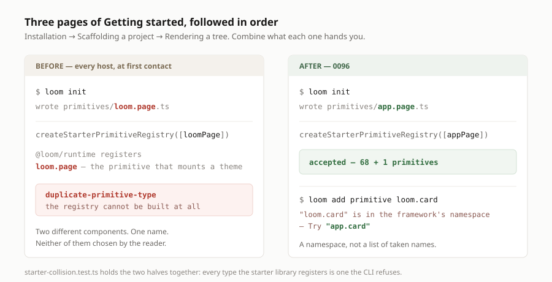

# A scaffold that cannot collide with the library it is scaffolded against

**Date:** 2026-08-29 · **Routine:** `Loom daily build` · **Section:** §4 (CLI), §4c ·
**Branch:** `framework-20-a-scaffold-that-cannot-collide`

## The migration, first

**Done, and done before this run started** — the fourth run in a row to say so.
`apps/loom` is on `main` with five route groups, `apps/portal` and `apps/docs`
are gone, sign-in is middleware at the `(portal)` boundary, one deployment.
Nothing in the tree is half-migrated and nothing about it was touched here.

**No maintainer comments outstanding.** Twenty-seven pull requests are open and
every comment on them is a routine's own report or a bot's. Nothing on any of
them is addressed to this lane, and none was touched.

## What was done, in plain language

One finding from my queue, filed this morning by `Loom docs`: **`loom init`
scaffolded a primitive called `loom.page`, and `@loom/runtime/primitives`
already registers a `loom.page`.**

They are two different components with one name. A registry refuses that pair
rather than letting either win, which is the right behaviour and is not the
problem. The problem is the order a stranger meets them in, which is the
documentation site's own reading order:

1. *Installation* — install the package.
2. *Scaffolding a project* — run `loom init`; you now own a `loom.page`.
3. *Rendering a tree* — build a registry with `createStarterPrimitiveRegistry()`.

Follow those three pages, combine what each hands you, and the registry is
refused — with a `duplicate-primitive-type` naming a type the reader never
chose. §4c's exit condition is that a stranger can install Loom, register a
primitive and get a proposal accepted working only from the site. This sat on
that exact path, at first contact, and because the scaffold's own name was the
collision, every host was the host it happened to.

### The instance, and the one predicate that closes the class

The finding asked for one string: move `STARTER_TYPE` out of `loom.`. That was
taken, and then widened, because the class is barely wider than the instance:

- `loom add primitive loom.card` scaffolded a module that was dead on arrival
  for exactly the same reason, and nothing warned.
- The CLI's own usage text was, at that moment, offering **`loom.card`** as its
  example of a well-formed type. The tool was teaching the defect.

So [0096](../decisions/0101-the-loom-namespace-is-the-frameworks-and-the-cli-will-not-write-in-it.md)
says the whole namespace is the framework's: **`loom` and everything under it**
is refused by the CLI, and `init` writes `app.page`.

**A namespace rather than a list of taken names**, and that is the part worth
stating because it is the part somebody would otherwise get wrong. A list would
have to be maintained against a library that has grown every week this month,
and the run that registered the seventy-sixth primitive would retroactively
break a scaffold written before it existed. A namespace cannot go stale: a name
under `loom.` is the framework's whether or not anything answers to it yet.

The refusal also hands back a replacement — `loom.card` is answered with
`app.card`, the name that was typed, re-namespaced. Telling somebody a namespace
is taken and leaving them to invent a substitute is a worse answer than handing
them one.

### The half that keeps the promise true

The rule is a namespace and the library is a list, so they can drift in exactly
one direction: **a starter primitive registered outside `loom.` would be a name
the CLI happily writes and a registry then rejects.** Nothing in the repository
would have noticed, because the collision only exists once a host owns both
halves — which is a position no test was in.

`src/cli/starter-collision.test.ts` stands where the host stands:

- every type `createStarterPrimitiveRegistry()` registers is one the CLI refuses;
- nothing the CLI scaffolds is a type the starter library registers;
- and a registry built from the scaffold's **committed output** and the starter
  library together is accepted — which is pages 1, 2 and 3 above, combined, as
  an assertion rather than a paragraph.

That last one costs nothing to run because the fixture already exists:
`src/cli/scaffold-fixture/` is the byte-exact output of `loom init`, committed,
typechecked by `tsc` and executed by Vitest on every `pnpm verify`.

### Where the check happens

In argument parsing, beside the malformed-type refusal, before any directory is
read. Whether a name belongs to the framework is a property of the string and of
nothing else, so it costs a filesystem call the host was never going to benefit
from.

It could not have gone in `createPrimitiveRegistry` instead, and the reason is
the asymmetry the record turns on: the starter primitives are themselves
`loom.*`, so a registry has no way to tell a framework definition from a host's.
The CLI can, because everything the CLI writes is a host's by construction.

## Decisions I made that nothing specified

- **`app.` as the host namespace.** The finding suggested it and I agree with its
  reasoning — it reads as *yours*, which is the lesson the scaffolded file exists
  to teach. Nothing depends on the choice; it is one constant in
  `src/cli/namespace.ts` and renaming it is a fixture regeneration.
- **The bare name `loom` is refused too**, not only `loom.*`. It is a valid
  primitive type and nothing registers it today, but it is the namespace root and
  a host primitive called `loom` would block the framework from ever using it.
  One sentence to teach — *the name and everything under it* — rather than two.
- **Not reserved in `primitiveTypeSchema`.** That grammar also names data sources
  and submission endpoints, and a deployment naming a data source `loom.orders`
  collides with nothing. The reservation is about a registry the framework
  populates, not about every name a tree can hold.
- **A record was written despite the numbering collision.** See the open
  questions; this is the one call in the run I would defend rather than assert.

## Records

**One added: 0096 — *The `loom.` namespace is the framework's, and the CLI will
not write in it*.** `pnpm decisions:index` regenerated. Nothing superseded.

## Findings

**One closed, in effect:** `Loom docs`' *`loom init` scaffolds a primitive the
starter library already registers*. It is on the `docs-14-scaffolding-a-project`
branch rather than on `main`, so there was no entry here to edit — the closure is
recorded as a new entry on this branch instead, and whoever merges both will find
the two halves.

**Three filed:**

1. **To `Loom docs`** — the callout on *Scaffolding a project* now describes
   something that is fixed, and the scaffolded name it shows changed
   (`loom.page.ts` → `app.page.ts`, `loomPage` → `appPage`). One paragraph to
   delete. Nothing is broken until it is.
2. **To the maintainer** — eight open branches now carry a record numbered
   `0096`, and this run made it eight.
3. **To the maintainer** — `FACTS.decisions` hand-patched again, eleventh
   occurrence.

## Tests

`pnpm install && pnpm verify` — **green, exit 0. Nothing failed, nothing skipped,
no test weakened.**

| suite | before | after |
| --- | --- | --- |
| `@loom/runtime` | 1741 / 111 files | **1753 / 113 files** (+12) |
| `@loom/app` | 1963 / 134 files | **1963 / 134 files** — unchanged |

The twelve: six in `namespace.test.ts`, three in `starter-collision.test.ts`, two
in `args.test.ts`, one in `main.smoke.test.ts` — the last one spawning the real
executable, so the refusal is proved to reach stderr with a non-zero exit and
write nothing.

### Verified by mutation

Two mutations, each caught by exactly one test, and they are the two halves of
0096's promise:

| mutation | result |
| --- | --- |
| `STARTER_TYPE` back to `loom.page` | `starter-collision.test.ts` fails — *scaffolds nothing the starter library registers* |
| a starter primitive renamed outside `loom.` (`loom.page` → `widget.page`) | `starter-collision.test.ts` fails — *refuses every type the starter library has already taken* |

Both reverted; `git diff` over `src/primitives/` is empty.

## Files opened outside this lane

Two, both of them generated or checked-elsewhere counts rather than content:

| file | owner | why |
| --- | --- | --- |
| `apps/loom/app/(marketing)/_lib/copy.ts` | `Loom marketing` | `FACTS.decisions` `"94"` → `"96"` — `main` was red on arrival at 94-against-95, and 0096 made it 96 |
| `apps/loom/app/(docs)/_lib/api/reference.generated.json` | `Loom docs` | regenerated with `pnpm --filter @loom/app docs:api`; `CLI_USAGE` is in it verbatim and changed. Two lines |

`src/primitives/` was not modified. It is read by one test, through the public
`createStarterPrimitiveRegistry()`, the way any host reads it.

## Open questions

1. **The eighth `0096`.** The 29 August framework run saw five and declined to
   write a record at all, leaving its reasoning in a doc comment. I wrote one,
   because a namespace reservation is a permanent public contract that binds
   every host and a doc comment is not where anyone looks for one. I did **not**
   invent a numbering scheme to dodge the collision — skipping to `0103` leaves
   gaps, changes a documented convention unilaterally, and is wrong the moment
   the queue moves. Renumbering mine is a file rename and one
   `pnpm decisions:index`. Merging anything makes it go away.
2. **`main` has not moved since #167**, four days and twenty-seven pull requests
   ago. Every consequence in this report — the eight `0096`s, the eleventh
   `FACTS` patch, a fix for the `FACTS` interruption (#174) that has itself now
   waited through four more occurrences of the interruption — is downstream of
   that one fact and none of it is worth engineering around.
3. **Should the CLI teach `app.` on the documentation site**, or is naming the
   namespace in the usage text enough? `Loom docs` owns the page and has to touch
   it anyway to delete the callout. I have no view worth overriding theirs with.

## Scope

`src/cli/` only, plus `decisions/`, `FINDINGS.md`, this report, and the two
generated-or-counted files named above. No route group was opened.

Nothing was scheduled and no self-check-in was armed.
