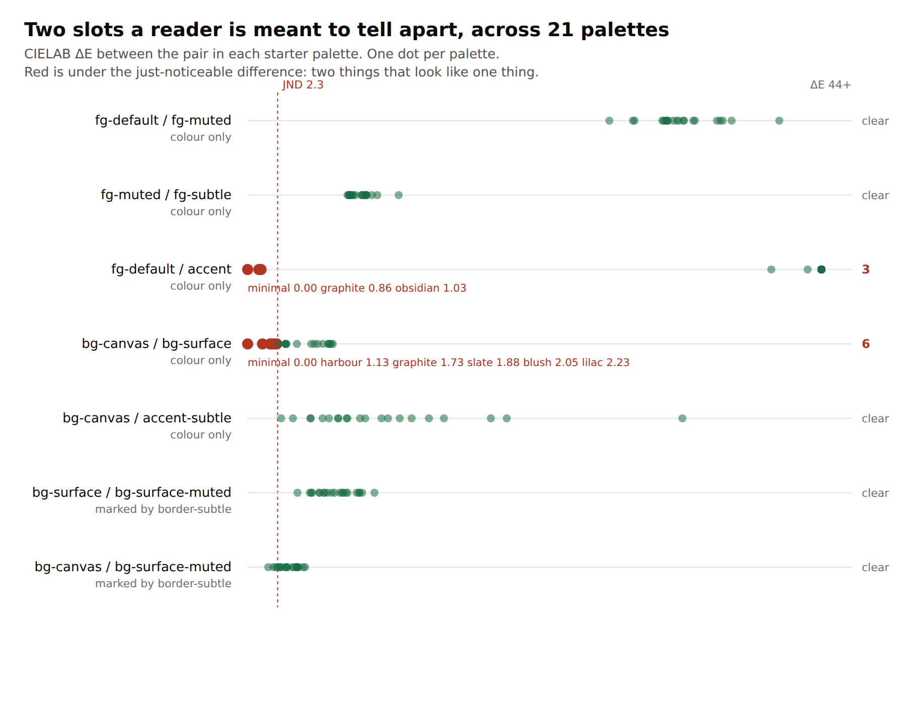

# Two inks a reader is meant to tell apart, and the three palettes where they are one ink

**Date:** 2026-08-29 · **Routine:** `Loom daily build` · **Section:** §4b ·
**Branch:** `framework-19-two-inks-a-reader-tells-apart`

## What was done, in plain language

A palette makes two promises to a page and only one of them was checked.

The one that was checked is **legibility**: can this ink be read on that ground.
`auditPalette` has measured it since 0074, against a list derived from the
components since #149, and every palette Loom ships clears it.

The one that was not is **difference**: two things a reader is meant to tell
apart from each other — a link inside the paragraph it sits in, a quiet note
under a less quiet one, a card against the page behind it. Nothing measured that,
and the reason it matters is the instance that produced the finding on
23 August: `loom.emphasis` asked for `weight("heading")`, got a font pack that
declares the same weight for headings and body, and rendered a stressed word
identical to the words either side of it. Every test passed, because every test
asked whether the token was *real*. **A token is a promise about provenance, not
about difference.**

`src/theme/separation.ts` measures the second promise. It declares the pairs the
library actually asks a reader to distinguish, measures the CIELAB ΔE between
them in every registered palette, and reports the ones no reader could separate.

**What it found, on the palette every published surface wears.** `minimal` sets
`accent` to `#0a0a0a`, which is its own `fg-default`, and says why in a comment:
*"Black, so the green is a highlight and not the biggest thing on the page."*
`loom.link` with `tone: "accent"` — documented as *"the one link in a paragraph
that is the point of the paragraph"* — renders that colour, at body weight, with
no underline at rest: the underline wipes in on hover. **In `minimal` a link
inside a paragraph is the paragraph.** `graphite` and `obsidian` are within a
just-noticeable difference of the same thing.

Nine collapses across twenty-one palettes, pinned by name. Nothing is fixed,
because neither fix is this lane's: the primitive is `Loom primitives`' file and
the palette is worn by four surfaces.

## The decision this had to make, and why it is not an invented bar

0089 recorded why the check did not exist: *"contrast between two inks is a
different question from legibility of one ink on a ground, and the bar for it
would be invented rather than borrowed from WCAG."* That objection is right, and
it is answered by changing the space rather than by choosing a number.

**A contrast ratio is the wrong instrument here.** It compares luminance, so two
slots can differ plainly in hue and report 1.00:1 — identical, according to a
measure that never looked at colour. Asking WCAG's question about two inks would
report pairs as the same that a reader separates at a glance.

CIELAB ΔE is the measure of *perceived difference*, and it comes with a
threshold nobody in this repository chose: the just-noticeable difference, 2.3,
a published property of human vision. Borrowed, not invented — which is exactly
what 0089 said the missing check would have to manage.

**CIE76 rather than CIEDE2000, deliberately.** CIE76 is twelve lines a reviewer
can check against the formula; CIEDE2000 is a page of rotation terms nobody
reviewing a palette would verify. Its known weakness is overstating differences
among saturated blues, and that error runs in the safe direction for the only
thing asserted here: a pair CIE76 calls collapsed is collapsed under any metric.

## The second basis, and the palette that argued for it

A naive version of this check fails `minimal` immediately and wrongly.
`bg-canvas` and `bg-surface` are the same white there, on purpose, because every
card in that palette is defined by its border instead of by a change of
background. Six palettes put those two within a JND.

So a peer declares **how** the reader is told the two apart. `colour-only` means
nothing else does the work. `also-marked` names the border that does — and it
names it as a slot rather than as prose, so the claim is measured too: the mark
has to be visible against *both* sides of the boundary it draws. All twenty-one
palettes clear that, `minimal` included. The card's outline is doing exactly what
its comment says it does, and that is now a measurement rather than an intention.

Two rules keep the list honest, both borrowed from `PALETTE_TEXT_PAIRINGS`:
every row names somewhere the library really puts the two together, checked
against the registry rather than trusted; and **nothing may be demoted.** A pair
that is `colour-only` anywhere is `colour-only` here, whatever else marks it
elsewhere — which is why `bg-canvas` / `bg-surface` is colour-only despite
`loom.card`: `loom.section tone="surface"` paints the same fill on the same
canvas with no border at all.

## Unspecified decisions, and why they went this way

- **Pinned, not fixed.** The three-palette link collapse has a fix I would take
  — `loom.link` underlines at rest for `tone: "accent"` — and it is in
  `src/primitives/`, which is another lane's directory. The alternative fix moves
  `minimal`'s `accent`, which is a visual change to the palette all four surfaces
  wear. Both are filed, neither is made here.
- **No decision record, and this is the one I would most like overruled.** This
  answers a question 0089 explicitly deferred and it deserves a record. It does
  not have one because **five open pull requests already carry an `0096`** —
  `main` has not moved since #167 — and a sixth would add a renumber to whatever
  merge order you choose, for a decision that is a file you can delete. The
  reasoning is in the module's doc comment instead, which is where the next
  reader will be. Say the word and the next run writes the record.
- **`derivePaletteChecked`'s `clean` was left alone.** Folding separation into it
  would flip five derived palettes from clean to not clean, which is a change to
  what the function promises rather than a bug fix. Its doc comment now says
  what `clean` does not cover; the choice is filed.
- **`loom.mosaic`, container queries, and the danger slot were not opened.**
  Open findings, none of them this lane's, and none of them this run's work.

## Records

**None added, none superseded.** See above for why, and for what I would do
instead if you say so.

## Findings

**Closed:** the 23 August entry, *"a design token guarantees the value comes from
the theme, and nothing about it being different from the one beside it"* — the
call it asked this lane to make is made, in the affirmative, with the objection
answered rather than waived.

**Filed:** four.

1. **A link inside a paragraph is the paragraph's own colour** in `minimal`,
   `graphite` and `obsidian` — `Loom primitives` and the maintainer, with three
   fixes and a recommendation.
2. **A surface-toned band is invisible on six palettes**, because
   `loom.section` paints a tone with no border where `loom.card` outlines one —
   `Loom primitives`.
3. **`main` was red on `FACTS.decisions` again**, tenth occurrence — hand-patched
   here for the fifth time by a routine. #174 ends the class and is unmerged.
4. **`derivePaletteChecked`'s `clean` does not consider separation** — this
   lane's own, recorded rather than changed.

## `main` was red when this run started

`pnpm verify` on `main` at 09:11: **1 failed, 1962 passed** —
`app/(marketing)/_lib/facts.test.ts`, `expected '94' to be '95'`. #167 merged a
decision record and the hand-maintained count did not move. Every lane that
started work today opened on that.

Patched to 95 on this branch, in another lane's file, following the precedent
four earlier runs set. It is one line and it is the wrong fix, and the right one
is open at #174.

## Test numbers

| | before | after |
| --- | --- | --- |
| runtime tests | 1741 in 111 files | **1758 passed in 112 files** |
| app tests | 1962 passed, **1 failed** | **1963 passed, 0 failed** |
| skipped | 0 | 0 |

**17 tests added**, all in `src/theme/separation.test.ts`. Nothing weakened,
nothing skipped, no test disabled. `pnpm verify` exits 0 on this branch — the
whole of it, build and typecheck included, not the test step alone.

The *before* runtime figure is this run's total minus the tests it added, not a
number measured on `main`: `main`'s own run failed in the app suite before the
runtime summary was worth recording, and the app row is what was measured there.

Two of the seventeen are the ones worth looking at: the pin that names all nine
collapses palette by palette, so a tenth fails the build rather than joining
quietly, and the assertion that no marked pair has lost its mark as well, which
is the claim the `also-marked` basis makes and would otherwise be a comment.

## Open questions

1. **Which fix for the invisible link** — the primitive underlines, or the
   palette moves, or neither and the pin stands as the record. Recommendation:
   the primitive underlines.
2. **Should this be a decision record**, once the `0096` queue clears.
3. **Should `clean` widen** to cover separation, at the cost of five derived
   palettes no longer being clean.
4. **Is a hairline right for a toned `loom.section`** — it would close the
   six-palette band collapse the way `loom.card` already closes its own.
