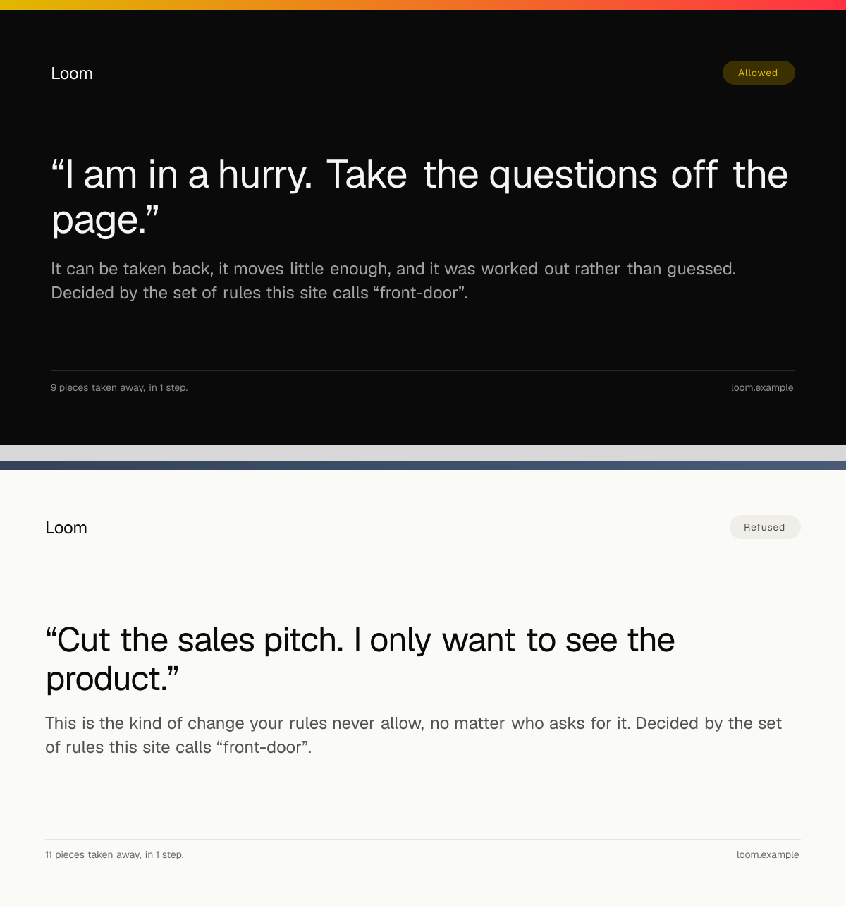
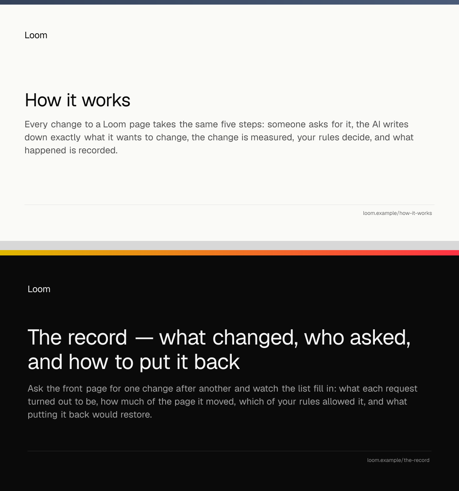

# 2026-08-29 — marketing: the link you send someone

The exit condition written against this lane is *pages good enough to send to
someone cold*. Twelve runs have made the pages. Nobody had looked at what
happens the moment one is actually sent.

The answer was: nothing. Every address on this site unfurled as a bare link — no
card, no picture, and a title only because Next puts one in the document by
default. And the address that mattered most unfurled as the one that mattered
least, because **they were identical**.


Those are two addresses on this site. The top one is `/`. The bottom one is
`/?ask=problem` — the front door after a visitor asked it *"Skip the tour. What
problem does this actually solve?"*, which the rules held for a person to decide.

Until this run both of them previewed as a bare URL. The one thing this site can
show that nothing else can — that a page somebody rearranged has an **address**,
which can be copied, sent, and opened by somebody else a week later — was
invisible at exactly the moment somebody did it.

---

## What shipped

**Every address unfurls as what it is.** Open Graph and Twitter tags on all three
pages, a canonical address, and a picture drawn for the exact address it is a
picture of.

### The card of a page somebody changed is the record of the change

Not a description of it. The route that draws the image **runs the request** —
the same `askRunFor` the page calls, the same interpreter, the same rules, the
same verdict — so the words on the card are the words on the page.

| On the card | Where it comes from |
| --- | --- |
| The pill, top right | `record.verdictLabel` |
| The headline | `record.asked`, in quotation marks |
| The sentence under it | `record.verdictLine` |
| The line bottom left | `record.measured` |
| The link's title, in the channel | `ask.utterance` |

**Nothing in this run writes a sentence.** Every string on every card is lifted
from something that already exists and is already tested — a route's own title
and description in `site.ts`, an ask's `utterance`, and the `ChangeRecord` the
run produced. That is the assertion the whole unit has to earn: a card and the
page it opens are never on one screen together, so a card that composed its own
copy would drift from the page it advertises where only a stranger could see it.
`share.test.ts` holds the six strings of a card against the six fields of the
record, in all ten states — five requests, each of them also approved.

### The pill is the answer band's rule, not a second one



The first version painted every verdict in the accent, which is precisely the
mistake the band above the fold shipped and fixed on 26 August — and it is worse
here, because a card is read at thumbnail size by somebody who will not read the
word beside the colour.

So the card asks the same function. `toneFor` in `pages/answer.ts` is now
exported and used by both: **the accent belongs to a verdict the visitor can
still act on**, and a refusal is an aside. The library has two callout tones and
no red, deliberately and for a recorded reason, so a refusal cannot be painted as
a refusal — what it can be is not painted as the tone this site uses to say *look
here*.

One predicate, one file. The alternative was restating the rule in a module
nobody reads beside `answer.ts`, and the copy that drifted would be the one
nobody was reading.

### The picture found a defect the tests could not

Cards carried the route's nav label in the pill at first. `/how-it-works` printed
*How it works* in the pill and *How it works* as the headline directly under it.
`/the-record` opened its headline with the same three words as its pill. Every
assertion passed; the picture was a stammer.

The pill came off published pages entirely, and that is worth more than fixing
the duplication would have been. **A pill now means the rules reached a verdict
about this exact page** — something a reader learns from one glance at two cards
side by side, and could never have learnt from a label that was always there
telling them where they were.



### It wears the palette the address names

Not one colour, size, weight, radius or spacing step is written down in the
drawing. Every one is read off the **resolved theme** — the palette's slots, the
font pack's ramp and weights, the style preset's radii and spacing — so
`?theme=bold` unfurls in the bold palette, and a palette edited in `src/theme`
moves this card without anybody remembering it exists.

The two cards above are `bold` and `editorial`; the two at the top are `minimal`.
Same drawing, three registered triples.

### The one file on this site that is not a Loom tree

It is a PNG. The renderer is a total pure projection into React (0008) and a
primitive paints itself by naming a custom property (0050); an image renderer
resolves no cascade and no custom properties at all. There is no arrangement of
the seam by which a registered primitive draws one pixel of it.

What that does **not** license is a component library, and the shape of the file
is the argument: one element, private to the module, imported by no page, a
picture of a page rather than a piece of one. Filed for `Loom daily build` as the
gap it is, with the cheapest fix named — a render option that inlines the theme's
literals in place of `var()` would let a real tree render into an image renderer
with no change to any primitive.

## The honest limit

**The card wears the theme's palette exactly and its typeface not at all.** An
image renderer needs font *data*, and a font pack carries a CSS family stack;
under `editorial-serif`, whose whole character is Georgia, the card renders in a
grotesque and looks entirely deliberate doing it.

It was a choice rather than an oversight. Fetching the face would put a network
call inside the one asset that is fetched by **other people's servers** — so a
CDN having a bad afternoon would show a broken thumbnail in somebody's channel
and tell nobody here. No font is fetched, the route makes no network call, needs
no allowlisted domain, and cannot fail that way. Filed for `Loom daily build`
with the seam that would close it if anything else ever wants it.

## The canonical address is the page without the arrangement

`/?ask=problem` names `/` as the address to keep. What a visitor asked this page
for is theirs and not a second page of this site — the bands are the same bands
in a different order. It is the honest answer and it costs nothing: a canonical
tag decides which address a search engine keeps and has no bearing on what an
unfurled card shows, which is the half this run is for.

## Verified against a running server, not only in tests

`next start`, then the real thing:

```
GET /                          → og:image .../share-image?page=%2F&theme=minimal
GET /?ask=problem&approve=1    → og:title "Skip the tour. What problem does this actually solve?"
                                 og:image .../share-image?…&theme=bold&ask=problem&approve=1
GET /share-image?…&ask=problem → 200, image/png, 68,405 bytes
```

## Tests

`pnpm install && pnpm verify` — **green, exit 0. Nothing failed, nothing skipped,
no test weakened, and no existing test changed.**

| suite | on `main` | here |
| --- | --- | --- |
| `@loom/runtime` | 1741 / 111 files | **1741 / 111 files** — `src/` was not opened |
| `@loom/app` | — | **2088 / 137 files** |
| marketing, within it | **588 passed, 1 failed** / 13 files | **714 passed** / 16 files |

**`main` is red and this branch measured it rather than inferring it.** The one
failure is `FACTS.decisions` — the file says `94`, `decisions/` holds `95`. That
is the eighth occurrence in eleven days and the second consecutive marketing run
to open a branch by bumping a digit it did not change. #174 is the fix, deletes
the literal, and has been green and mergeable since 27 August.

125 new tests in three new files. **Four assertions were verified by mutation**,
because a test that has never failed is a claim rather than a check:

| Mutation | What failed |
| --- | --- |
| A border painted `#123456` instead of a palette slot | *names no colour of its own*, 6 of 6 — both cards, all three palettes |
| `askedCard` taking its sentence from `record.proposed` | 25 tests across two files |
| The canonical address carrying the visitor's query | *names itself, without the visitor's query*, all three routes |
| The pill drawn `accent-subtle` on `bg-canvas` | *the eyebrow is legible*, all three palettes |

**The colour test reads the drawing, not a list.** `CARD_PAIRINGS` is what the
contrast check measures, and a check that compared the card against the same list
the card was built from would be the card agreeing with itself — it passes a
mutation that moves both sides, which is #182's own lesson from last run. So the
second test walks the returned element tree and collects every hex it actually
names, and fails on any that is not a slot of the resolved palette. That side is
derived from the drawing; a colour written into the file is caught whether or not
anybody remembered the list.

The limit that leaves, stated rather than papered over: a pairing added to the
drawing and not to `CARD_PAIRINGS` is drawn in palette colours and goes
unmeasured for contrast. It cannot be a *hard-coded* colour, and it cannot be an
unregistered one — but it could be a legal slot on the wrong ground. Closing it
needs the ground of each text node recovered from the render, which the PNG does
not carry.

Two rules this lane already lives by were inherited without being copied:
`RESERVED_VOCABULARY` is asserted against every card, and it passes for free
today because nothing here writes a sentence — which is exactly why it is worth
having, since the day somebody writes card copy is the day it stops being free.

## Decisions and findings

**No record written.** The card constrains nothing outside this lane and adds
nothing to the library. `src/` was not opened and no other route group was
touched.

**Three filed, all above.** Two for `Loom daily build` — a tree having one
projection where a second medium needs another, and a font pack naming a family
without saying where the face is. One instance note on `main` being red, which is
`FACTS` and is #174's.

**None closed.** Nothing in the queue was answerable from this lane this run.

## Files

New: `_lib/share.ts`, `_lib/share-card.tsx`, `_lib/share-image.ts`,
`share-image/route.tsx`, and three test files beside them.

Changed: the three `page.tsx` files (a constant `metadata` became
`generateMetadata`, because the front door is not one page), `layout.tsx`
(`metadataBase`, the one fact true of the whole surface), `_lib/pages/answer.ts`
(`toneFor` exported and its return type narrowed; no behaviour, and
`answer.test.ts` was not touched), and `_lib/copy.ts` (one digit, to open on
green).

## Open questions

- **Positioning, audience and the licence line** (#96, restated on #134, #142,
  #150, #163, #166, #174 and #182). The licence line is the site's one remaining
  placeholder and still gates Phase 2. Nothing here touched it.
- **The eight-item menu**, raised on #166 and #182 and still open. Untouched.
- **`marketing:facts`** — #174's question. Untouched.
- **A production domain.** `siteOrigin()` reads `LOOM_SITE_ORIGIN` and falls back
  to `VERCEL_URL`, so every card, canonical and image address on a preview points
  at the preview and on production would point at whatever the deployment is
  called. That is correct and it is also the moment a real domain starts to
  matter: a card is the first thing a stranger sees, and the address in its bottom
  right is currently a Vercel subdomain.
