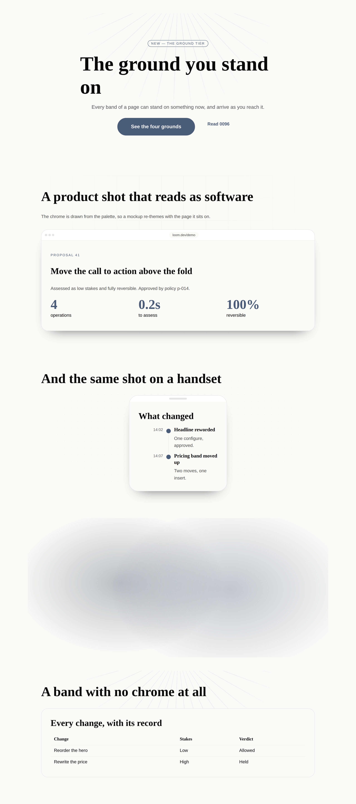
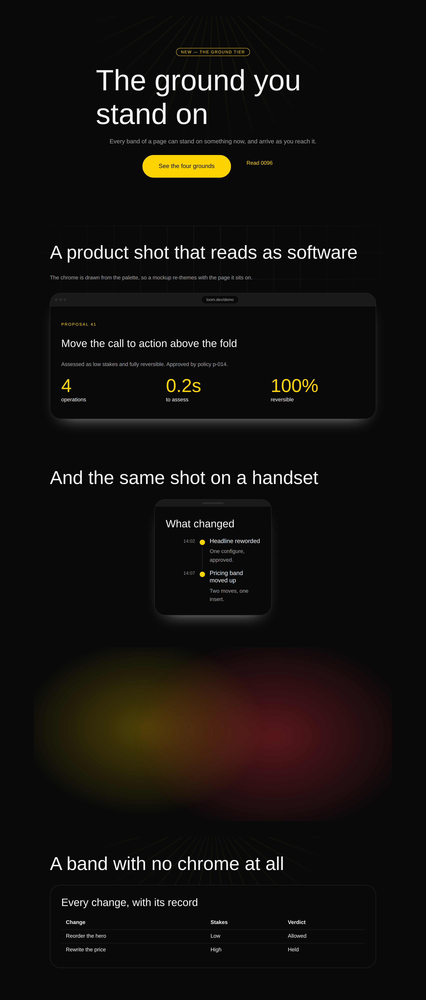
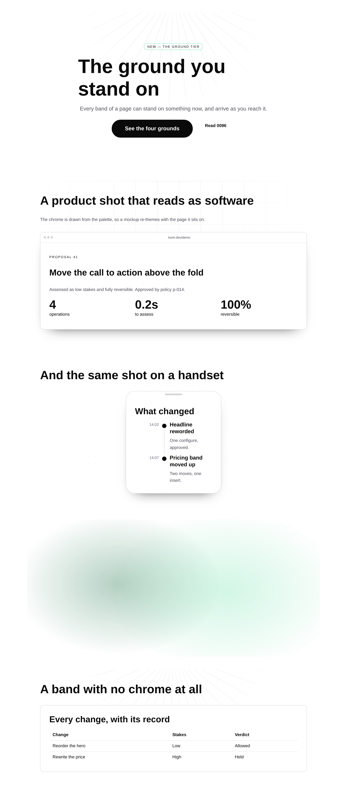
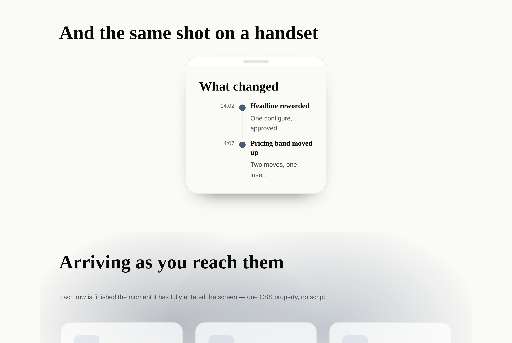
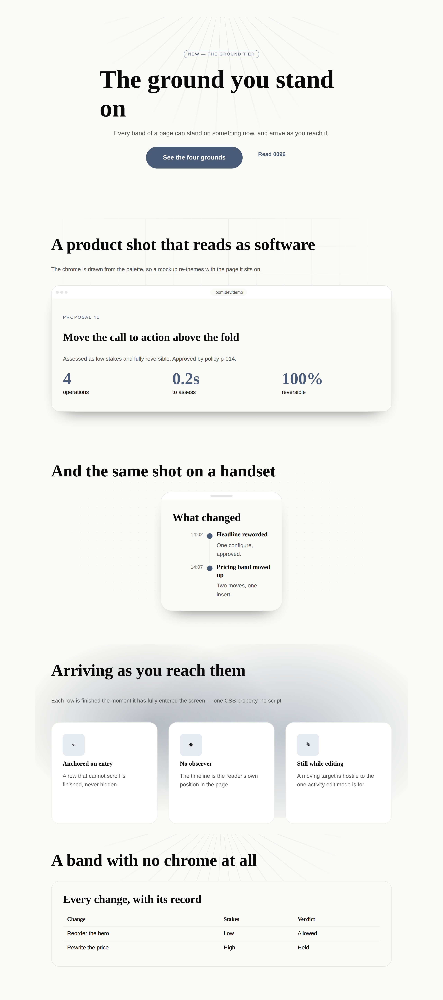
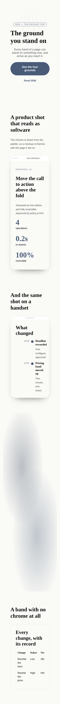

# 29 August 2026 — the ground you stand on

**Routine:** `Loom primitives` · **Section:** §4b · **Branch:** `primitives-17-the-ground-you-stand-on`

Three primitives — `loom.backdrop`, `loom.reveal` and `loom.mockup` — taking the
library from **68 to 71**. They are the first here that **decorate** rather than
arrange, and they are the brief's *atomic complex* tier, which had exactly one
member (`loom.marquee`) for a week. One record, [`0096`](../decisions/0096-a-scroll-driven-entrance-is-anchored-to-entry.md).
Three defects found — two by screenshots, and **one by a probe of the live page
that no screenshot could have shown**, in a primitive that looked like it worked.

## Which primitives, and why those

**Because the brief lists four tiers and three of them are full.** Working down
it against the registry: *structural* has `stack`, `grid`, `card`, `section`,
`split`, `mosaic`; *leaves* has `badge`, `icon`, `avatar`, `kbd`, `code` and
twenty more; *bands* has pricing, testimonials, comparison, timeline, bento, nav,
footer, and gallery and CTA are compositions the port map already settles. The
fourth tier — **"marquees, canvas effects, anything self-measuring"** — had one
member.

That is not a gap in the catalogue so much as a gap in what the catalogue can
*look like*. The library could lay out any page on the maintainer's list and
every one of them came out as bands of flat colour, because the only backdrop in
it belonged to `loom.hero` — welded to the one primitive a page uses once, at the
top, before the reader has decided to care. A demo that "really needs to pop"
pops below the fold or not at all.

The alternative was the port map's last four Hermes rows — books, property
listings, and two more card-in-a-grid pairs. The previous run deferred them for
the same reason I am deferring them again: **a bookshelf is not a band the demo
or the marketing site stands on**, and the port is at 47 of 70 blocks with
nothing structural left in it. Three primitives that make every one of the other
sixty-eight look better beat two more that look like the four before them.

**What this deliberately is not:** a `loom.banner`, a `loom.spotlight` and a
`loom.tilt`. The first is a composition (`section` > `prose` + `link`, and the
port map's rule about `cta`); the other two need a pointer position, which is
client state the runtime has no seam for and which `tabs` is already filed
behind.

## Which fields became nodes, and which stayed props

There is no Hermes ancestor here, so 0052's usual question — *which of this
block's fields are repeated content* — has a different answer than usual, and
the honest one is worth stating: **these three primitives have almost nothing to
decompose, and that is the finding rather than a shortcut.**

| Candidate | Verdict | Why |
| --- | --- | --- |
| `ground` — which of five grounds is painted | **prop** | The granularity doc's second atomic exception, reached by a container. A dot matrix has no interior: there is nothing in it to address, no `insert` anybody would aim at it, and changing it changes no node. It is `loom.hero`'s `backdrop` enum, which 0052 already settled as a display mode. |
| `shape`, `padding` on a backdrop | **props** | Arrangement of however-many children, not how many. `padding` is `loom.card`'s call unchanged. |
| The ground's **layers** | **not nodes at all** | Two `aria-hidden` divs a reader cannot reach and a tree cannot address. Making them nodes would put decoration in the projection a model reads and in the record a reviewer weighs, for no reachability at all. |
| `effect` on a reveal | **prop** | Three renderings of however-many children. `loom.marquee`'s `direction` is the same shape. |
| **`stagger`** on a reveal | **refused outright** | Not a prop and not a node. `animation-delay` is *ignored* on a scroll-driven animation, so it would do nothing in every browser that supports what the primitive is for. The sequencing comes free and is better: each child has its own view timeline, so a column arrives a row at a time and a row of three arrives together, because it genuinely did. |
| `shell` on a mockup | **prop** | Browser, phone, or bezel with no chrome. Three closed renderings; no child moves. |
| `address` | **prop** | One per shell, free text, and never a URL — nothing here is navigable and `linkUrlSchema` would refuse the thing a page actually writes, which is a bare host with no scheme. |
| The mockup's **screen** | **children** | The decision worth arguing, below. |
| The mockup's **chrome** | **neither** | Three dots, a pill and a rule. Nothing a tree would reorder; the one thing anybody would change about it is the address, and that is the one thing that is a prop. |
| `elevation` | **prop** | A shadow is not a node. |

## The three things the design turns on

### A mockup's screen is children, not a `src`

The obvious shape for a browser mockup is an image URL and an address beside it:
one leaf, no interior, done. It is refused on 0052's test, and the argument is
the same one `loom.credential`'s mark region made a fortnight ago — **a URL can
express exactly one rendering.**

The screen of a mockup is a region a page *composes*, and the compositions this
product actually wants are not images. A Loom page inside a Loom mockup is the
demo's own hero. A `loom.code` panel inside a phone is a terminal. A `loom.form`
inside a browser is a signup flow being pointed at. A `src` prop makes every one
of those unsayable to save one node — and it also makes the shot un-themeable,
which is the whole reason the chrome is drawn from the palette rather than baked
into a screenshot of somebody's real browser with somebody's real tabs in it.

The specimen shows what falls out: **every screen in it is a tree**, and the
three of them re-theme with the page they sit on. That is a claim you can only
make by looking at the three palettes side by side.

One consequence is worth writing down because it looked like a defect the first
time I photographed it: **the screen adds no padding.** Content in a viewport
starts at the viewport's edge, and a shot whose content is inset from the shell
is a shot of a window inside a window. So a composition brings its own margins —
the specimen wraps each screen in a `loom.card` with `tone: "plain"` — and the
primitive stays a viewport.

### A ground is a wrapper, not a prop on `loom.section`

The cheaper change would have been a `ground` prop on `loom.section`, and it was
rejected for one reason: the ground would then be reachable only where a section
is. A page wants one behind a `loom.split`, behind three cards in a
`loom.grid`, and behind a band that is a single `loom.marquee`. Adding it to each
is four copies of one idea and four schemas to keep in step; wrapping is one node
and one `insert`.

That puts `loom.backdrop` beside `loom.card` rather than beside `loom.stack`: a
card is a **raised** surface holding whatever is put on it, and this is a
**decorated** one. Neither says anything about what it holds.

`loom.hero` gains from the same move. Its four backdrop layers went to
`ground.ts` unchanged, so the enum is now six — and `dots` and `rays` arrived in
the hero without anybody writing them for a hero, which is the payoff of a shared
module stated as a fact a test asserts.

### The entrance is one CSS property, and where it is anchored is the safety argument

`loom.reveal` needs no `IntersectionObserver`, no measurement and no script:
`animation-timeline: view()` hands the browser the element's own position in the
scrollport as the clock. That is 0055 read literally, and it is the first motion
in this library whose clock is a position rather than a duration.

The clock being a position changes the *failure mode*, and that is what 0096 is
about. A time-driven entrance always finishes. A scroll-driven one holds its
element at the animation's first keyframe until the timeline advances, and the
first keyframe of every entrance worth having is `opacity: 0` — so a range that
never advances does not look wrong, it renders **a page with a hole in it**: the
content present in the DOM, addressable, announced to a screen reader, and
invisible.

`entry 0%` to `entry 100%` is the anchor that makes that impossible, because an
element that already fills its scrollport has by definition finished entering it.
The worst case of putting a reveal somewhere it does not belong is that its
motion does not play.

And the fallback is **what remains rather than what is written**:
`animation-timeline` is one declaration, an unknown declaration is dropped, and
what is left is the ordinary `animation` above it. A browser that has never heard
of a scroll timeline plays `loom.hero`'s entrance once on load. Nothing in this
library is ever hidden by a feature the browser does not have.

## Three defects, and the third one is the interesting one

### The hero has been painting its ground over its own headline since the library's first band

**Found by:** reading the first specimen, then confirming in the markup.

`loom.hero` renders its backdrop layers, then its text column. The layers are
absolutely positioned; the text column asked for no position at all. CSS paints
positioned descendants *after* the inline content of unpositioned ones, whatever
their document order — so the aurora's `accent-strong` field, at 32% opacity, has
been sitting **on top of** the headline rather than behind it. Under `bold`,
whose `accent-strong` is a saturated gold, that is a visible tint across the
first thing on the page.

No contrast measurement would ever find it, because nothing is wrong with the two
colours; the palette is not what is being asked. The fix is one declaration —
the content is positioned too, so document order decides and the content is last
— and it moves no box. `loom.backdrop` was written with it from the start, and a
test now asserts that every ground layer is followed by a positioned wrapper.

### Every card and every badge in the library was outlined in the page's text colour

**Found by:** a dark palette and a photograph, and by nothing else.

`loom.card` and `loom.badge` both spread a tone's `borderColor` into a style
object and then wrote `border: "1px solid"` after it. A style object is
serialised in key order, and **the `border` shorthand resets `border-color` to
`currentColor`**. So four card tones and three badge tones drew the same
rectangle, in `fg-default`, and every `border-subtle`, `border-accent` and
`transparent` those tones named was dead code.

Nothing could see it. The render is correct, the diagnostics are empty, the
re-theme guarantee holds because `currentColor` is not a literal, and on a light
palette a near-black hairline around a card reads as a design decision. It took
`bold` and a `loom.card` with `tone: "plain"` inside a mockup, drawing a
near-white rectangle where it had promised to draw nothing.

Repaired with longhands, which cannot be reordered into the same mistake. The
test is the **general** invariant across six fixtures rather than the two
repairs: in any serialised style, a `border:` shorthand must come before any
`border-color:`. Filed, because the same trap is available with `background`,
`font`, `margin`, `padding`, `inset` and `flex`, and every lane writes inline
styles.

### `loom.reveal` did not animate at all, and it looked exactly like a primitive that works

**Found by:** `element.getAnimations()[0].timeline.currentTime`, read off the
live page. **Not** by a screenshot, an assertion, or a diagnostic.

`loom.backdrop` was written with `overflow: hidden` — a rounded band with a
ground in it wants to clip — and the specimen put a `loom.reveal` inside one.
`overflow: hidden` makes an element a **scroll container**, and a `view()`
timeline resolves against the nearest one. So every child of that reveal was
being measured against a box that never scrolls: fixed progress of **81.4%**, past
the end of its range, at every scroll position on the page. Finished. Opaque.
Motionless. Correct-looking in all six screenshots.

Two things came out of it. The primitive is repaired — the clip belongs to the
ground now, every layer carries `border-radius: inherit`, and `aurora` (the one
ground whose fields grow past their own box, at `scale(1.25)`) clips itself — so
`loom.backdrop` is transparent to scrolling and a reveal inside one is driven.
And 0096 carries the evidence rather than the hypothesis, because this is the
exact failure the record was written to bound, discovered *after* it was written,
by the person who wrote it.

The method is the part worth keeping. Four consecutive runs in this lane have
reported that screenshots find defects assertions do not. **This run adds a third
instrument:** a rendered page can be interrogated — computed styles,
`getAnimations()`, `getBoundingClientRect()` — and a five-line probe answered in
one attempt a question no amount of looking would have. It also disproved a
fourth "defect": the 390px shot appeared to overflow horizontally, and
`scrollWidth === clientWidth === 390` said it did not. Headless Chromium refuses
to make a window narrower than about 500px, so the phone shot had been a 485px
page cropped to 390. That is a screenshot artefact this lane has no way to notice
by eye, and it would have been reported as a layout bug.

## What the library still cannot express

- **A palette has no shadow slot**, so an elevation on a dark palette is a pale
  bloom rather than a shade. It reads as a light source, which dark UIs often
  want, but that is luck: a primitive can ask for ink and cannot ask for depth.
  Filed for `Loom daily build`; every elevation in the library is held at one
  blur in the meantime.
- **A reveal inside anything that clips will not animate**, in four places in
  this library. 0096 makes that degrade to visible-and-still rather than to a
  hole, and there is no way for a primitive to detect it.
- **No ground responds to a pointer.** A spotlight that follows the cursor is the
  one 21st.dev effect that is genuinely out of reach, and it is the same client
  state wall `tabs` hit.
- **A mosaic still measures the screen where it should measure its container.**
  Filed 21 August, filed again on 26 August, not this unit's, still open.
- **A schedule cannot sort or filter itself**, an offering cannot say it is sold
  out, a credential cannot be verified, a `<tfoot>`, a spanning cell, a
  draggable wipe — all open, all from previous runs.

## Verification

`pnpm verify` green from the repository root, exit 0: **1752 runtime tests across
111 files, 1963 application tests across 134 files, 0 skipped.** Nothing was
weakened. Nine of the runtime tests are new, all in the `the ground a page stands
on` block, plus three updated where the change made an older assertion false —
the registry's roll call, its count, and the leaves list.

Two files outside `src/primitives/` changed. `FACTS.primitives` `"68"` → `"71"`
and `FACTS.decisions` `"94"` → `"96"` in
`apps/loom/app/(marketing)/_lib/copy.ts`, with `reference.generated.json`
regenerated by `pnpm --filter @loom/app docs:api`. **`FACTS.decisions` was already
wrong on `main`** — 94 against 95 records, because #165 added `0095` without
bumping it — so `main`'s own `pnpm verify` fails `facts.test.ts` independently of
this branch. #180 reported the same thing yesterday. That turns eight days of
"tedium" into a correctness finding, and the fix is to derive both counts from
`STARTER_PRIMITIVES.length` and a directory listing, which `facts.test.ts`
already computes. Not this lane's file.

`0096` collides with #173's and #180's `0096`, for the sixth time. Both are
unmerged, `decisions.test.ts` forbids gaps as well as duplicates, and a lane
therefore *cannot* politely leave a number free. Filed before; unchanged.

## The preview

Opened with the pull request; the address is the `vercel[bot]` comment's alias,
which `pull_request_read` with `method: "get_comments"` returns in full.

The six screenshots are the primary evidence: the specimen under all three
registered palettes, mid-scroll with a row that has not finished arriving, in
edit mode, and at a true 390px. Two of this run's three defects came from them.
The third came from a probe, which is new, and which the report above argues is
worth adding to this lane's habits.

## 21st.dev

**Blocked for the tenth time**, from a sixth lane. `docs/routines.md` still lists
it under `permissions.allow`; `WebFetch` returns `EGRESS_BLOCKED`. Recorded
rather than skipped quietly — and it stings more this run than most, because the
unit is the one the brief describes in 21st.dev's own terms. Calibration was
against `loom.hero`, `loom.feature-grid` and `loom.tier`, and against the shots.
