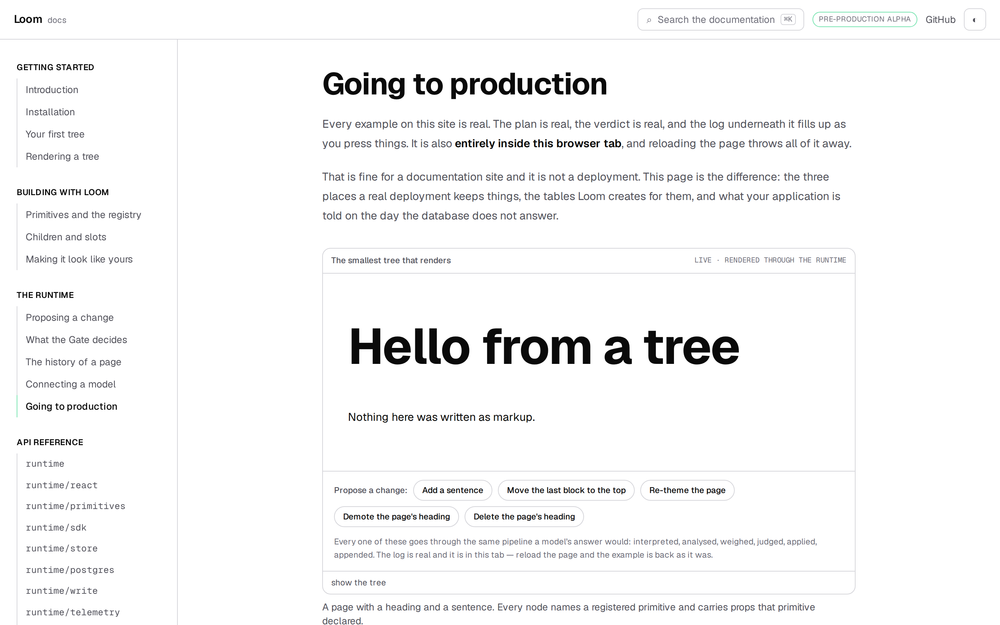
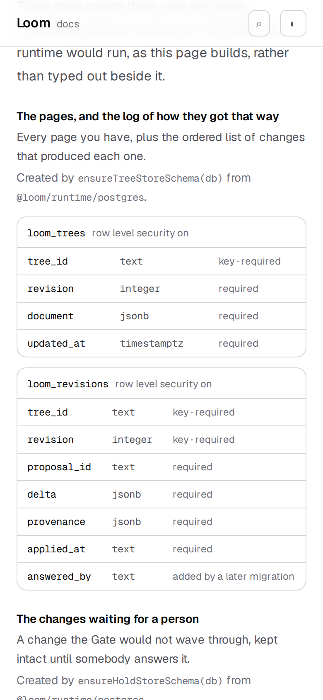
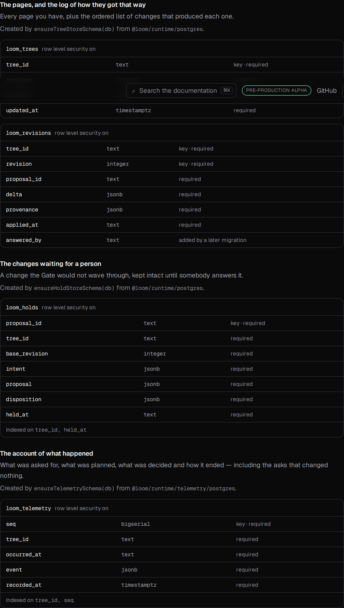

# 30 August 2026 — going to production

**Routine:** `Loom docs` · **Branch:** `docs-15-going-to-production` · **Section:** §4c

The site could tell a stranger how to build a page, how to change one, and how
the Gate decides. It could not tell them **where any of it goes**. Every example
on this site lives in a browser tab and is gone on reload, which the pages say
plainly — and until now the sentence after that one was missing.

This is the page both of the last two documentation runs named as the next thing
worth writing, and it is the last operational gap on the site: the three places a
deployment keeps state, the tables Loom creates for them, and what an application
is told when the database does not answer.

## What shipped

**One page — `/docs/the-runtime/going-to-production`** — and two generated tables
behind it. It opens with the three things a deployment keeps and the fact that
you can lose any one of them without losing the others: the pages and their log,
the changes waiting for a person, and the account of what happened. Each is an
interface with a memory implementation and a Postgres one, held to the same
contract by the same suite, so choosing is a line of wiring.

Then the part a reader cannot get anywhere else: **the tables, read out of the
statements that create them.**

## The columns are not typed, and that is the whole design

`docs/deployment.md` describes this database for *this repository's* deployment,
in prose, maintained by hand. It is good and it is the right shape for what it
is. A public page could not be that shape: the reason the API reference is
generated is that a hand-written one is wrong within a week and **nothing goes
red when it happens**, and a schema is worse than a signature — a reader acts on
it against their own database.

So the page reads the runtime's own DDL and parses it. A column added to Loom
appears here in the same commit. A column renamed cannot be described under its
old name. Nobody is asked to remember anything.

Two rules in the parser are decisions rather than mechanics:

**An unrecognised statement throws.** The failure worth preventing is a page that
quietly stops mentioning something the runtime does to a host's database, so a
statement this parser has never seen takes the build down where somebody is
looking, rather than shortening a table nobody re-reads.

**A column that is both created and altered is one column.** `answered_by` is in
the `CREATE TABLE` *and* in an `ALTER TABLE … ADD COLUMN`, deliberately: the
first is what a new database gets, the second is the only way the column reaches
one that already exists, because `CREATE TABLE IF NOT EXISTS` leaves an existing
table alone, columns and all. The first version of this parser listed it twice —
a table Postgres never makes — and the test against a real database is what
caught it. It is now one row, marked *added by a later migration*, and the
callout beside it is the page's clearest paragraph, because it is the mistake a
deployment actually makes: upgrading Loom and not re-running the migration.

## Held against a real Postgres, not against my reading of the SQL

`schema.test.ts` proves the parser reads SQL correctly. That is not the claim a
reader depends on. The claim they depend on is that **the columns printed on the
page are the columns their database ends up with**, and those are different
things — only the second catches a statement the parser reads perfectly and
Postgres declines.

So `schema.live.test.ts` stands up PGlite — Postgres compiled to WebAssembly, the
same thing the runtime's own store suites use — runs all three migrations into
one database, and checks the page against `information_schema` and `pg_class`:
every table exists, every column matches in name and order, every column the page
marks required is `NOT NULL` in Postgres, every index the page names is there,
and **every table the page shows as locked really has row level security on**.

That last one is the only claim on the page that is about safety rather than
shape. A table the page shows as locked and Postgres does not would be a
paragraph telling a host their trees are private while a public key can read
them — acted on, and silent. It is checked against the catalogue rather than
against having run the statement.

## Where the tests are deliberately split

The 24 August lesson-15 finding is that another lane's ordinary work should not
turn this one red, and the answer to it is *what* a test is held against:

- **`schema.test.ts`** runs against SQL written in the test to exercise the
  parser. A column added to `src/` is ordinary work and does not touch it.
- **`claims.test.ts`** runs against the runtime's real statements, and is
  *supposed* to go red when `src/` changes — each test there stands behind a
  sentence a reader would act on. If a table ships without row level security,
  this lane's security paragraph is false, and being the thing that notices is
  the job.

Both belong; conflating them is what makes a suite people re-run rather than
read.

## Tests

`pnpm install && pnpm verify` at the repository root. **Nothing skipped, nothing
weakened, no test disabled.** One test fails and it is `main`'s — below.

| Suite | Files | Tests | Change |
| --- | --- | --- | --- |
| `@loom/runtime` | 111 | 1741 | unchanged — `src/` was not opened |
| `@loom/app` | 138 | 1 failed, 1993 passed | 1 failed, 1962 passed on `main` |

**31 new tests** across four files. `next build` clean across all five route
groups, and the page prerenders static.

Three were verified by mutation, because a test that has never failed is a claim
rather than a check:

- making `withAddedColumn` always append fails *"does not list a column twice
  when it is both created and added"* and the live *"have exactly the columns the
  page prints"* — and nothing else
- dropping `unavailable` from the failure order fails both `StoreFailures` tests
  and no `StorageSchema` one
- rendering the row-security label as an empty string fails *"says of every table
  whether row level security is on"*, and only that one

## `main` is red, and it is the fifth run in a row

On a clean `main` at `3a57feb`, measured with nothing of this branch on disk:
`(marketing)/_lib/facts.test.ts > counts the decision records` expects `95` and
`FACTS.decisions` says `94`. Red since 25 August. That is **the merge gate for
four surfaces**, so every branch cut since inherits it.

Not ported, for the reason the three runs before this gave: `copy.ts` belongs to
`Loom marketing` and the fix is already open twice — **#174** derives the number,
**#182** bumps the literal. A third copy would conflict with both.

The number is no longer the interesting part. Four routines in a row have
correctly declined to fix a one-line literal that has held every lane's merge
gate for five days, because the rule they all read says work in another lane is
filed rather than done. The rule is right. Filed again, with that said plainly.

## Findings filed

- **`StoreError` has five codes and no exported list of them** — the fourth union
  in eight days with this hole (`WriteOutcome`, `TelemetryEvent`, `CliError` are
  the others, all filed). This page keeps a `Record` keyed by the union so a
  sixth code is a compile error here; four pages now carry that workaround
  independently, which is the argument for doing it once in `src/`.
- **`.prose h3` outranks a utility class inside `.not-prose`** — this lane's own,
  filed rather than fixed. The table selectors were narrowed with
  `:not(.not-prose *)` in #155 and the heading selectors were not, so
  `architecture-ideas.tsx` asks for `text-lg` and renders at 1.25rem today. The
  fix changes every page's headings and wants its own run.
- **The decisions count, fifth consecutive docs run.**

## Scope

`apps/loom/app/(docs)/` — one route added, two library files, one component, four
test files, and one line in `nav.ts`. **One file outside the route group**:
`apps/loom/mdx-components.tsx`, which registers the two new components. That is
the case `docs/routines.md` settled on 25 August at the maintainer's instruction
— Next requires the file at the application root and everything in it is about
how a `(docs)` page renders — and it gets this line because a cross-lane diff
still gets one.

`src/` was not opened. `reference.generated.json` was not regenerated: the
runtime's published surface did not move. No new primitive was needed — the two
tables are docs-site chrome in 0067's sense, on the same footing as `EntryPoints`
and `DecisionRecords`.

## Checked in a browser, not reasoned about

Dark and 390px both before the pull request. `document.documentElement.scrollWidth`
is exactly 390 at a 390px viewport, and each table scrolls inside its own
container rather than the page.

## Open questions

**Retention is named here and explained on #183.** This page says the three
things a host must know before scheduling a pass — an hour is the floor, it never
splits an unfinished episode, it cannot touch a page — and stops. The page that
goes deeper is open, and if it merges after this one the two want reading
together once.

**What I would write next.** Nothing on this site tells a reader what to do when
they have shipped and something looks wrong: `auditSnapshot` disagreeing with the
log, a hold nobody answered, a journal that is not shrinking. Every piece of that
exists in the runtime and none of it is on a page. That is the next run.
