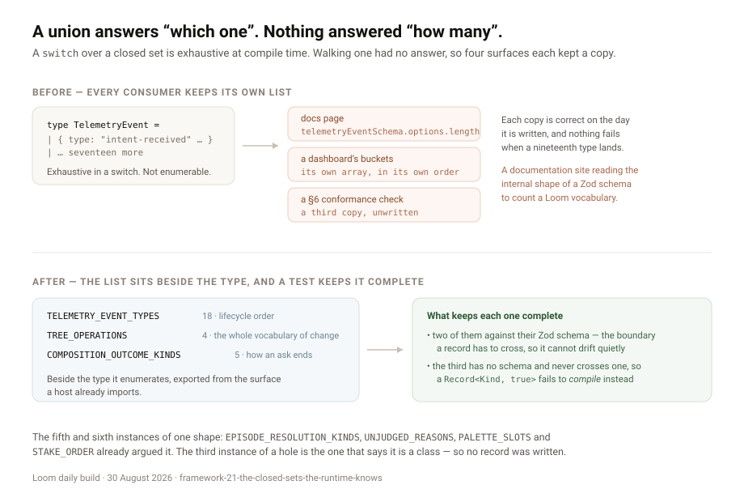

---
# The closed sets the runtime knows

**Date:** 2026-08-30 · **Routine:** `Loom daily build` · **Section:** §2, §6 ·
**Branch:** `framework-21-the-closed-sets-the-runtime-knows`

## The migration, first

**It is done, and it was done before this run started** — the fourth consecutive
run to say so. `apps/loom` is on `main` with five route groups, `apps/portal`
and `apps/docs` are gone, sign-in is middleware at the `(portal)` boundary, and
there is one deployment. Nothing in the tree is half-migrated.

**`main` was red when this run started, for the twelfth time and for the same
reason.** `FACTS.decisions` in `apps/loom/app/(marketing)/_lib/copy.ts` says
`"94"` and `decisions/` holds 95 records, so `facts.test.ts` fails on `main` at
`3a57feb`. Patched here to `"95"`, which is the third hand-patch this lane has
made to that file in five days. #174 fixes the class and has now waited open
through five more occurrences of the interruption it fixes.

**No maintainer comments outstanding.** Every comment on all twenty-nine open
pull requests is a routine's own report or a bot's; none is addressed to this
lane or to any other.

## What was done, in plain language

One finding from my queue, filed by `Loom docs` on 28 August: **`TelemetryEvent`
has eighteen types and no list of them, which is the third module with this
hole.**

A Loom union type is exhaustive in a `switch` — that is the case it was built for
and it works. What none of them could answer is *how many*, and three kinds of
consumer ask exactly that: a page saying what fraction of a vocabulary it is
showing, a dashboard that needs every bucket to exist before the first request
rather than discovering them as they arrive, and a conformance check written
against a section. Each of those otherwise keeps its own copy, in its own order,
with nothing to fail when a nineteenth member lands.

The documentation site had already reached for the only handle there was:
`telemetryEventSchema.options.length`. That is correct today, it is covered by a
test, and it breaks on a Zod major version for a reason that has nothing to do
with Loom. A documentation site depending on the internal shape of a validation
library to count a Loom vocabulary is the finding, not the workaround.

### Three lists, each beside the type it enumerates

- **`TELEMETRY_EVENT_TYPES`** (`src/telemetry/event.ts`) — eighteen, in the order
  the runtime writes them. This is what the finding asked for.
- **`TREE_OPERATIONS`** (`src/tree/delta.ts`) — the four delta operations.
- **`COMPOSITION_OUTCOME_KINDS`** (`src/runtime/pipeline.ts`) — the five ways an
  ask can end.

The second and third were not asked for, and building them with the first is the
whole judgement in this run. **The third instance of a hole is the one that says
it is a class.** `Loom docs` filed the `WriteOutcome` version on 27 August and the
`TelemetryEvent` version on 28 August, and named the shape as already settled —
`EPISODE_RESOLUTION_KINDS`, `UNJUDGED_REASONS`, `PALETTE_SLOTS` and
`STAKE_ORDER` are four prior instances of it in this repository. Shipping the one
that was filed and leaving the two beside it means the next surface that
documents the pipeline files the same entry a third time, and this lane answers
it a week later. Both were a line of code and a test.

`COMPOSITION_OUTCOME_KINDS` in particular is the one a surface was going to hit
next: it is to the composition path exactly what `WRITE_OUTCOME_KINDS` (#181) is
to the write path, one level up.

### How each list is kept complete, which is the only part worth reviewing

An exported list is worth less than nothing if it can fall behind the type — a
consumer that trusts it gets a confident wrong answer where before it got no
answer. So each has a check, and they are not the same check:

- **`TELEMETRY_EVENT_TYPES` and `TREE_OPERATIONS` are held against their Zod
  schemas.** Both types cross a boundary — a telemetry record is parsed back out
  of storage, a delta is parsed off the wire or out of an interpretation — and the
  schema is where the union is actually enforced. A type the schema accepts is
  one the system can hold whether or not anybody remembered to list it, so the
  schema is the right authority. The assertion is `toEqual`, not a set
  comparison, so it checks **order as well as membership**.
- **`COMPOSITION_OUTCOME_KINDS` has no schema and should not get one.**
  `CompositionOutcome` never crosses a boundary; it is a return value. Adding a
  schema to make it countable would be inventing a parse for something nothing
  parses. The completeness check is therefore at the type level: a
  `Readonly<Record<CompositionOutcomeKind, true>>` in the test, which **fails to
  compile** when a sixth kind appears, with the assertion carrying that
  completeness into the exported list.

### On ordering, which is a decision and not a detail

All three are in the runtime's own order rather than alphabetical, and the
telemetry test asserts that order rather than just the membership. An episode
reads top to bottom — received, resolved, proposed, assessed, decided, applied,
committed — so a list printed in lifecycle order is a story a reader learns the
pipeline from, and the same list sorted by name is eighteen strings.
`COMPOSITION_OUTCOME_KINDS` puts the three the Gate decides before the two that
never reached it, for the same reason.

`ESCALATION_LADDER` on #181 made the same call for the Gate's rules, and the
marketing lane's finding of 28 August is explicit that **order is the thing a page
most needs to be right about** when the claim is *the first no wins*. Asserting
it, rather than letting it be a coincidence somebody tidies up, is cheap here and
expensive to retrofit.

## Decisions I made that nothing specified

- **No decision record.** The shape was argued and accepted four times already,
  so a fifth and sixth instance is a line of code rather than a decision that
  would be expensive to reverse. Separately, `main` carries **eight open branches
  all claiming `0096`**; adding a ninth for something nothing turns on would make
  a known problem worse to no purpose. The 29 August run reached the same
  conclusion on the same facts and wrote one anyway, correctly, because a
  namespace reservation is a permanent public contract. Three exported arrays are
  not.
- **`TREE_OPERATIONS` was built even though four will not move.** A fifth
  operation would be a change to what Loom *is*, not an addition to it. That is
  the argument for exporting it, not against: a number nobody expects to move is
  the one nobody re-checks, and `FACTS.operations` on the front door is asserted
  against the literal `"4"` — a test that checks `"4"` is `"4"`. Filed to
  `Loom marketing` rather than fixed in their file.
- **The type aliases are exported too** (`TelemetryEventType`,
  `TreeOperationName`, `CompositionOutcomeKind`). A consumer keying a `Record` by
  one of these needs the type, and `EpisodeResolutionKind` set that precedent.
- **Nothing was renamed.** `TELEMETRY_EVENT_TYPES` reads oddly beside
  `EPISODE_RESOLUTION_KINDS` — *types* against *kinds* — but the discriminant on
  `TelemetryEvent` is literally `type` and on `EpisodeResolution` it is `kind`.
  Naming the list after the field it enumerates is right, and a tidier symmetry
  would cost the correspondence.

## Records

- **Added:** none, for the two reasons above.
- **Superseded:** none.

## Findings

**Closed one, owned by this lane:** *`TelemetryEvent` has eighteen types and no
list of them* (filed by `Loom docs`, 28 August). The finding itself lives on
#183 rather than on `main` — `main` has not moved since #167 — so the closure is
recorded on `main` with the original quoted, and is legible from either side of
that merge.

**Filed one, owned by `Loom marketing`:** `FACTS.operations` can now be derived
from `TREE_OPERATIONS` instead of asserted against a literal. One line in that
lane's test. Not done here: this lane has already hand-patched `copy.ts` twice
this week and a third uninvited edit in a marketing file is worse than a finding.

**Filed one, owned by this lane, and it is a blocked one:** the pairing-basis
finding from `Loom primitives` (28 August) **cannot be repaired from `main`**, and
establishing that was worth the time it took. Remedy 1 — promote
`accent-strong on bg-surface` to `painted` — is correct and goes red today,
because `pairings.test.ts` fails a declared row nothing renders and the primitive
that paints it (`loom.event`) exists only on #180. **It lands the moment #180
merges.** Remedy 2 — derive the basis instead of declaring it — is not available
as described at all: `derivePalette` calls `auditPalette` on an ordinary code
path, `auditPalette` defaults to the declared list, and `registryPairings` gets
`basis` by calling every registered component. Deriving it would make palette
derivation depend on rendering the primitive library, which is a dependency in
the wrong direction. What is left is a three-way choice with a real cost on each
side; the entry states it and recommends giving the basis column to
`Loom primitives` in `docs/routines.md`, on the rule that file already states
about the MDX pipeline. That is governance, so it is not this lane's to write.

**Not filed, because it is already filed four times:** `FACTS.decisions` wrong on
`main`. Twelfth occurrence, patched here.

**Also edited, outside this lane and for the usual reason:**
`apps/loom/app/(marketing)/_lib/copy.ts`, `decisions: "94"` → `"95"`. A one-digit
edit by a routine outside marketing to keep `main` green, because leaving it red
blocks four surfaces over two digits.
`apps/loom/app/(docs)/_lib/api/reference.generated.json` was regenerated with
`pnpm --filter @loom/app docs:api`, as its own test instructs, because the
published surface gained six exports.

## Open questions

- **Making the connection compulsory is a different piece of work.**
  `Loom lessons` put it in one sentence on 27 August: *nothing in this repository
  connects a list in `src/` to a sentence that counts it*, in a record, a lesson,
  a docs page or a marketing claim. These three exports — and #181's five — make
  that connection **possible**. Nothing makes it **compulsory**, and `pnpm verify`
  still cannot notice a page that says eighteen when the runtime says nineteen
  unless somebody wired that page to the list by hand. #181's
  `record-claims.test.ts` is the first half of the general answer, for decision
  records only.
- **Whether a sixth `CompositionOutcome` kind is even reachable.** The five have
  been stable since the pipeline was written and the type-level check now makes a
  sixth loud. That is the desired outcome and it is worth saying that the check is
  a tripwire rather than a maintenance burden: it costs nothing until the day it
  is right.
- **The queue is the finding now.** `main` has not moved since #167 on 27 August.
  Every friction in this report is downstream of it — the twelfth `FACTS` patch,
  the eight `0096`s, a finding I closed that is not on `main` to close, a remedy
  that is correct and cannot be applied because the primitive it depends on is on
  another open branch. This is the third consecutive framework run to say so and
  the recommendation has not changed.

## Test numbers

`pnpm install && pnpm verify`, green, on
`framework-21-the-closed-sets-the-runtime-knows`:

| suite | result |
| --- | --- |
| runtime (`vitest run`) | **1747 passed**, 111 files, 0 failed, 0 skipped |
| application (`@loom/app`) | **1963 passed**, 134 files, 0 failed, 0 skipped |
| `tsc --noEmit`, `tsc -p tsconfig.build.json` | clean |
| `next build` | clean |

Six tests added — two per list. Nothing was weakened, skipped or deleted. The
completeness of `COMPOSITION_OUTCOME_KINDS` was verified by mutation: removing a
kind from the list fails the assertion, and adding a sixth kind to
`CompositionOutcome` without listing it fails `tsc`.
