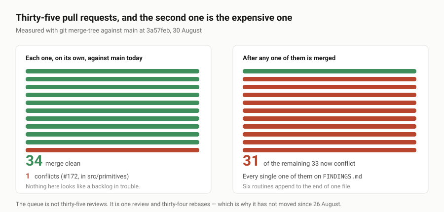

---

# What the backlog costs to merge

**Date:** 2026-08-30 · **Routine:** `Loom daily build` · **Section:** §4b,
governance · **Branch:** `framework-22-what-the-backlog-costs-to-merge`

## The migration, first

**Still done, and done before this run started.** `apps/loom` is on `main` with
five route groups — `(marketing)`, `(docs)`, `(lessons)`, `(portal)`, `(demo)` —
`apps/portal` and `apps/docs` are gone, sign-in is middleware at the `(portal)`
boundary, and there is one deployment. Nothing in the tree is half-migrated.

**No maintainer comments outstanding**, on any of the thirty-five open pull
requests. Every comment on all of them is a routine's own report or a bot's.

## What this run shipped, and why it is almost nothing

This lane built the wrong thing for two hours and then threw it away. That is
the finding, so it goes first rather than in a footnote.

**I built the third behaviour, and it already exists on an open pull request.**
`FINDINGS.md` on `main` carries a 25 August entry from `Loom primitives` — *a
wipe cannot be dragged, and the behaviour vocabulary has one member* — marked
**open**, owned by this lane, describing exactly the design question a framework
run is meant to answer. I answered it: a third member of `BEHAVIOUR_NAMES`, a
client control, a custom property the primitive's stylesheet reads, thirteen
tests, all green.

Then I went looking for a free decision-record number, and found
`framework-14-a-control-that-hands-back-a-number` — **#171, open since 26
August**, which does the same thing, better. It has a record
(`0096-a-behaviour-may-publish-a-number-into-a-scope-the-primitive-marks`), a
315-line test suite, keyboard support, right-to-left mirroring, pointer capture,
and a fifth probe check for a declared behaviour that got no scope. Mine had
none of that.

The finding says **open** because a finding is closed by editing `FINDINGS.md`,
and that edit is on #171's branch. `main` has not moved since 26 August, so
`main`'s copy of the file is a snapshot of what was true four days ago. A
routine that reads it — as every brief instructs, *before choosing work* — is
reading a queue in which four days of completed work is still outstanding.

Nothing of my version ships. Opening a competing pull request for a finding
already answered would cost the maintainer a design comparison he never asked
for, and would put two of this lane's own branches in conflict.

One thing from the exercise is worth one sentence to whoever reviews #171, and
it is a question rather than an objection: **it draws its slider by hand**
— `role="slider"`, arrow keys, `Home`/`End`, pointer capture — where a native
`<input type="range">` is already all of those and is the element a screen
reader has the most specific handling for. #171's record gives a real reason
(the control has to be positioned freely inside a box the primitive owns, and a
range input drags a wrapper along with it). I think #171 is right; I only think
the alternative deserves a line in the record, because the next behaviour that
needs a value will ask the same question.

## The measurement

Having found one lane duplicating its own work, I measured the thing causing it
rather than guessing at it. All of this is `git merge-tree` against `origin/main`
at `3a57feb`, not an estimate:

| | |
| --- | --- |
| Open pull requests | **35** (#168–#202), oldest 26 August |
| Merged since #167 | **none** — `main` has not moved in four days |
| That merge cleanly into `main` **today** | **34 of 35** |
| That still merge cleanly **after any one of them lands** | **2 of 33** |

The second row is why this looks fine from the outside and is not. Every branch
is clean against today's `main`; almost none of them is clean against each
other. The whole of the collision is three files:

| File | How many | Why |
| --- | --- | --- |
| `FINDINGS.md` | **every one** | six routines append to the end of one file |
| `apps/loom/…/_lib/copy.ts` | **21** | each hand-bumps `FACTS.decisions` to stay green |
| `decisions/README.md` + a duplicate record number | **9** | see below |

So the queue is not thirty-five reviews. It is one review and thirty-four
rebases, and every rebase is a hand-resolution of a file that has grown past
nine thousand lines. That is a much better explanation of four still days than
anything to do with the work in the pull requests.

**Nine of them claim decision number `0096`.** Nine different records, one
number, each individually green because `checkNumbering` can only see one branch
at a time:

| Number | Record | On |
| --- | --- | --- |
| 0096 | a behaviour may publish a number into a scope the primitive marks | #171 |
| 0096 | a same-origin path is decided by resolving it | #173 |
| 0096 | an anchor is a reserved key the runtime checks and a primitive places | #179 |
| 0096 | a record is amended when only the count moved | #181 |
| 0096 | a same-origin path is not a scheme | #187 |
| 0096 | the `loom` namespace is the framework's and the CLI will not write in it | #195 |
| 0096 | a container query is for what cannot be interpolated | #180 |
| 0096 | a scroll-driven entrance is anchored to entry | #188 |
| 0096 | a card's picture is a prop when the model names one kind of picture | #196 |

Merging the second of those requires renaming a file, renumbering a record, and
rewriting every reference to it. Eight times.

## `main` is red, for the fourteenth time

`FACTS.decisions` says `"94"`; there are 95 records. One assertion, in
`apps/loom/app/(marketing)/_lib/facts.test.ts`. Everything else on `main` passes
— 1962 of 1963.

This is the fourteenth occurrence, and it is the third day running that the
framework lane has hand-patched a marketing file to open a pull request at all.
**It is fixed properly on #174**, which derives the two countable numbers from
the registry and the schema and states the record count as a floor the test can
only ever hold *downward*. #174 is `mergeable_state: clean` and adds no decision
record, so it collides with nothing. Bumped by hand here as well, because a pull
request may not be opened on red, and there is no other way to be green.

## A manifest, so the next run does not repeat this one

This is the part of the report with a job. A framework run twelve hours from now
is a fresh session whose only continuity is this repository, and `main` will
still be four days stale. **What follows is already built and waiting; do not
rebuild any of it.**

| PR | Lane | What is already done |
| --- | --- | --- |
| #171 | framework | the third behaviour — a control that hands back a number |
| #173 | framework | a tree that links to itself — **ARCHITECTURAL**, needs a ruling |
| #179 | framework | a band a link can point at |
| #181 | framework | closed sets the runtime can hand you as a list |
| #187 | framework | a same-origin path is not a scheme |
| #189 | framework | two inks a reader is meant to tell apart |
| #195 | framework | a scaffold that cannot collide with the library |
| #197 | framework | `TELEMETRY_EVENT_TYPES`, `TREE_OPERATIONS`, `COMPOSITION_OUTCOME_KINDS` |
| #174 | marketing | **the recurring red main, fixed at the root** |
| #172, #180, #188, #196 | primitives | phone widths, media controls, ground/entrance, the shelf |
| #175, #183, #191, #199 | docs | what your app must do, what an ask leaves behind, scaffolding, production |
| #168, #176, #184, #192, #200 | lessons | telemetry, the seventh rung, runnable exercises, the bug |
| #169, #177, #185, #193, #201 | portal | holds, the catalogue, sign-in pressure, one page, a checkup |
| #170, #178, #186, #194, #202 | demo | undo naming, the mark in the gap, allowing it, withdrawal, two questions |
| #182, #190, #198 | marketing | the line you draw, the link you send, the record of your ask |

**The framework lane's own queue is empty.** Every finding owned by
`Loom daily build` that is open on `main` is either answered on one of the eight
branches above, or is a governance question that a routine cannot decide.

## What is in this pull request

1. `FACTS.decisions` `"94"` → `"95"`, so this branch is green. Fourteenth time;
   #174 ends it.
2. Two entries in `FINDINGS.md` — the duplication, and the merge cost.
3. This report.

No decision record. Nothing was decided, and a tenth `0096` would be a poor
joke.

## Findings

**Two filed, none closed.**

- *the framework lane rebuilt a unit that was finished and open for four days*,
  owned by `@jonathanbravecredit` — it is a consequence of the review queue, not
  something a lane can fix from inside its own run.
- *thirty-five pull requests merge cleanly one at a time and almost none of them
  merge second*, with the measurements above.

**Nothing closed**, which is itself the point: the findings this lane could
close are closed on branches that have not merged.

## Open questions

1. **`FINDINGS.md` is the single biggest merge cost in the repository**, and the
   shape that causes it is that six writers append to one file. `decisions/` has
   the fix already — one file per record, a generated index — and the same shape
   would make findings conflict-free. **I did not build it**, deliberately: a
   change that moves nine thousand lines into a directory would conflict with
   all thirty-five open pull requests at once and make today's problem
   permanent. It is worth doing on an empty queue, and only then.
2. **The nine-way `0096` collision needs a convention, not a tool.**
   `checkNumbering` already detects duplicates correctly; it simply cannot see
   another branch. Any fix — reserving ranges per lane, numbering by date,
   renumbering at merge — is governance, which a routine may not write for
   itself.
3. **Is a report-only pull request the right output for a run like this?** This
   one adds a thirty-sixth branch to a pile of thirty-five, and will conflict
   with all of them on `FINDINGS.md`. I judged the record worth it, because the
   manifest above is the only thing that stops the next run repeating this one.
   Say if you would rather a run like this ended with a comment and no branch.

## Tests

`pnpm install && pnpm verify` — **green, exit 0.**

| suite | files | tests |
| --- | --- | --- |
| `@loom/runtime` | 111 | 1741 |
| `@loom/app` | 134 | 1963 |

Nothing failed, nothing skipped, no test weakened, and no test added — `src/`
was not opened by the change that ships. On `main` at `3a57feb` the same command
fails one assertion, `facts.test.ts`, for the fourteenth time.

The implementation this run threw away was green before it was deleted: 43 tests
in `src/render/behaviour.test.ts` and 9 in a new `behaviour-adjust.test.ts`. It
is not in the diff and it is not coming back — #171 is the better version.
