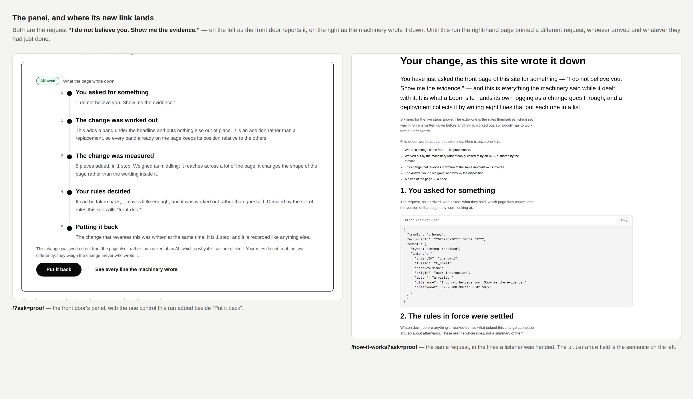
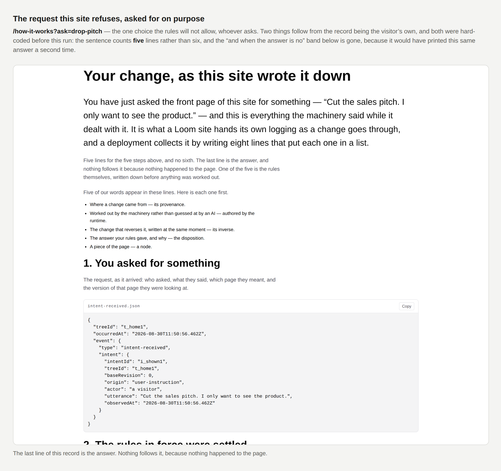
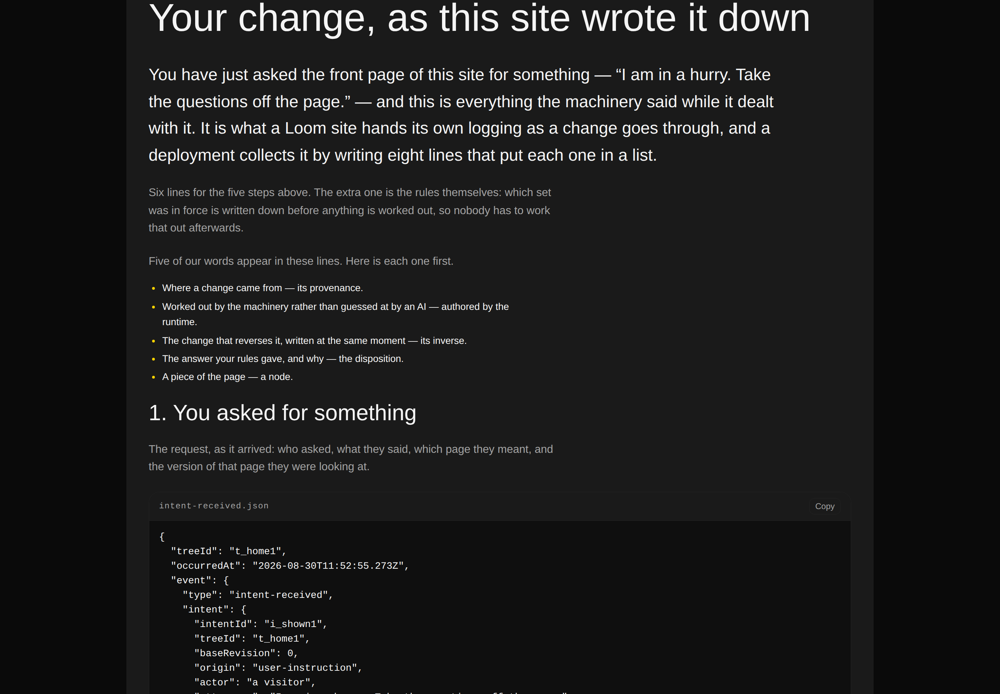
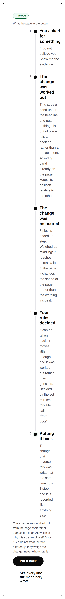

# 2026-08-30 — marketing: the record of the change you actually made

The front door has let a visitor rearrange it since 22 August, and the mechanism
page has printed the raw lines the machinery wrote since it was built. Both were
true. What nobody had checked is what happens when somebody uses the first and
then follows the link to the second — and the answer is that **they were shown
the record of a different request.**

A visitor who asks the front door *"I do not believe you. Show me the evidence."*
watches a band appear and reads five plain steps about it. One level down,
`/how-it-works` prints every line a listener was handed for a request — and until
this run that request was always *"The top of this page is shouting at me. Calm
it down."*, chosen when that page was written, whoever had arrived and whatever
they had just done.

The two claims a stranger has to believe are that **the record is real** and that
**it is of the thing that just happened to them.** The first was checked six ways.
The second was quietly false at the one moment it could be checked.

---

## What shipped

**`/how-it-works` reads an ask off its address, and the front door's panel hands
it one.**

One new control in the panel, beside *Put it back*: **See every line the
machinery wrote**. It points at `/how-it-works?ask=<theirs>`, and that page now
runs *that* request against the published front door and prints what came out.

Nothing about the record's construction changed. It is still a real run through
the whole sequence with an ordinary listener attached, still `JSON.stringify` of
the envelopes in the order they were handed over, still not a fixture. The only
thing that moved is **which request** it is a record of.

### Four things had been welded to one choice, and all four had to bend

The page could only ever print `calmer`, so four things were written as though
that were a fact about the world rather than about a default:

| Was | Is |
| --- | --- |
| `paperTrailFor` **threw** if the run did not land | it reaches a verdict, and says whether anything followed |
| *"Six lines for the five steps above"* | counted off the run — six, or five and no sixth |
| *"A moment ago somebody asked"* | *"You have just asked"*, when they did |
| stage 1: *"Somebody asked for something"* | *"You asked for something"*, when they did |

The first is the substantive one. Three of the five choices land on their own,
**one is held for the visitor to decide, and one is refused outright** — so a
function that treated a run without a `change-applied` line as a fault was a
function that could only ever be handed a third of the states its own page
demonstrates. The guard is now on the run reaching an *answer*, which every run
does and which is the invariant actually worth holding.

### The refusal, asked for on purpose

The most interesting address on this site is now `/how-it-works?ask=drop-pitch` —
the one change the rules will not allow, with its whole record printed. Five
lines and no sixth.

The contrast band below it, *"And when the answer is no"*, is **gone in that one
state**. It exists to print a refusal beside an answer that was not one; when the
visitor asked for the refused change themselves it would print the same answer
twice, captioned as though it were a different one. That is a page losing track
of what it just said, and it is the sort of thing only a reader who followed the
link would ever see.

### The one the screenshot caught and the tests did not

The first version got the lead sentence right — *"You have just asked…"* — and
left the first stage's heading saying *"Somebody asked for something"*, eight
hundred pixels below it. Both halves were defensible on their own, which is why
it passed everything, and the front door's own panel says *"You asked for
something"* for the same line. So the page a visitor arrives from and the page
they arrive at disagreed about who they were.

It is fixed and it is now a test. Only the title varies — the line under it is
the runtime's and says `"actor": "a visitor"` whoever is reading, which is
correct and stays.

## What did not change

**The page a stranger arrives at.** `/how-it-works` with nothing in its address
is the page it has been since it was written, held against the named default
rather than against `calmer` spelled a second time in a test. That matters more
than it sounds: it is the page every crawler and every share preview gets.

**The other three links to it.** The hero's first call to action, the menu item
and the closing band all point at `/how-it-works` bare, and a test holds them
there. A header item carrying somebody's request would put the record of a change
nobody made on every page of the site.

**`src/` was not opened.** No other route group was touched. No primitive was
added — the link is `loom.action` with `variant: "quiet"`, which the band two
lines below it already uses.

## Tests

`pnpm install && pnpm verify` — **green, exit 0. Nothing failed, nothing skipped,
no test weakened, and no existing test changed.**

| suite | on `main` | here |
| --- | --- | --- |
| `@loom/runtime` | 1741 / 111 files | **1741 / 111 files** — `src/` was not opened |
| `@loom/app` | 1962 passed **+ 1 failed** / 134 files | **2022 passed / 135 files** |
| marketing, within it | 589 | **648** |

Fifty-nine new tests in one new file, `pages/the-record-of-your-ask.test.ts`. No
existing test file was opened.

**Four mutations, run and recorded**, because a test that has never failed is a
claim rather than a check:

| mutation | what failed |
| --- | --- |
| `trailFor` ignores the visitor's ask — **the original bug** | 9 tests, across four of the five choices |
| the link drops the approval | 1 — *carries the approval, so an allowed change does not replay as a held one* |
| the contrast band always renders | 2 — both on `drop-pitch` only |
| the line count always says six | 2 — on the held choice and the refused one, and only those |

The first is the one worth naming: the defect this run fixes had been live for
eight days, was invisible in every screenshot, and is now nine failing tests.

**Measured rather than asserted:** `scrollWidth` is exactly 390 at a 390px
viewport on **all ten addresses** — five asks × two pages — and every state was
rendered under all three registered palettes with no diagnostics and no colour
named below the root.

## Decisions and findings

**No record written.** The change is compositional, adds nothing to the library,
and constrains nothing outside this lane.

**Two filed, both for the maintainer, both about things a routine cannot fix.**

- **The record count, ninth occurrence in twelve days.** `main` was red when this
  run started — measured, 1 failed / 1962 passed on `3a57feb` — on
  `FACTS.decisions`, in this lane's file. The digit is bumped here so this run
  opens on green, exactly as the two runs before it did. **#174 deletes the
  literal and has been green, mergeable and unreviewed since 27 August.** The
  finding is filed against the queue rather than the count: 29 pull requests are
  open, nothing has merged since 27 August, and `docs/rollout.md` already names
  review latency as the second-largest lever on the schedule.
- **Vercel refused to start a build.** `Deployment was blocked` on both commits
  of #190 — an account setting, not a build failure. Second consecutive marketing
  run with no preview URL. Every picture here is the real route's real output,
  rendered from the production build and captured against a running `next start`
  at the addresses in the captions, which is honest and is not the same thing.

**None closed.** Nothing in the queue was answerable from this lane this run.

## Open questions

- **Positioning, audience and the licence line** (#96, restated on #134, #142,
  #150, #163, #166, #174, #182, #190). The licence line is the site's one
  remaining placeholder and still gates Phase 2. Nothing here touched it.
- **The eight-item menu** (#166, #182) and **`marketing:facts`** (#174). Both
  untouched.
- **A free-text ask on the front door.** Unchanged and still the right call:
  five prepared choices keep the whole sequence running with no model in the way,
  and the band says so and points at `/demo`. Worth restating only because this
  run makes the prepared half considerably more valuable — a visitor can now
  follow any of the five all the way down to the bytes.

## One thing worth carrying beyond this lane

**A default that only one caller ever exercises stops reading as a default.**

`SHOWN` was a module constant with a good comment explaining why `calmer` was the
right choice to display. It was right. What nobody noticed for eight days is that
it had also become the *only* choice, and four separate things downstream —
a thrown error, two sentences and a heading — had quietly been written as facts
about `calmer` rather than as facts about a run.

None of them was wrong. Each was a correct statement about the only input that
had ever arrived. That is the failure mode: not a bug anybody introduced, but a
constant hardening into an assumption one honest sentence at a time, with a
passing suite the whole way. The tell was available and cheap — *what does this
say if the input is the other one?* — and the four answers were: it throws, it
says six when there are five, it calls the reader somebody else, and it prints
the same refusal twice.

Nothing scheduled and nothing armed.
