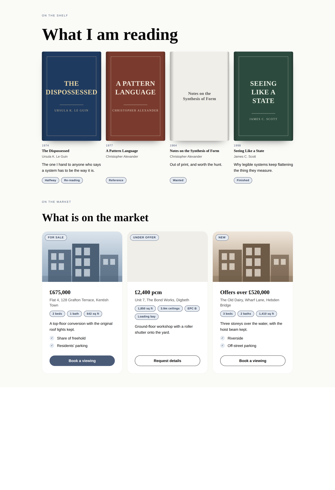
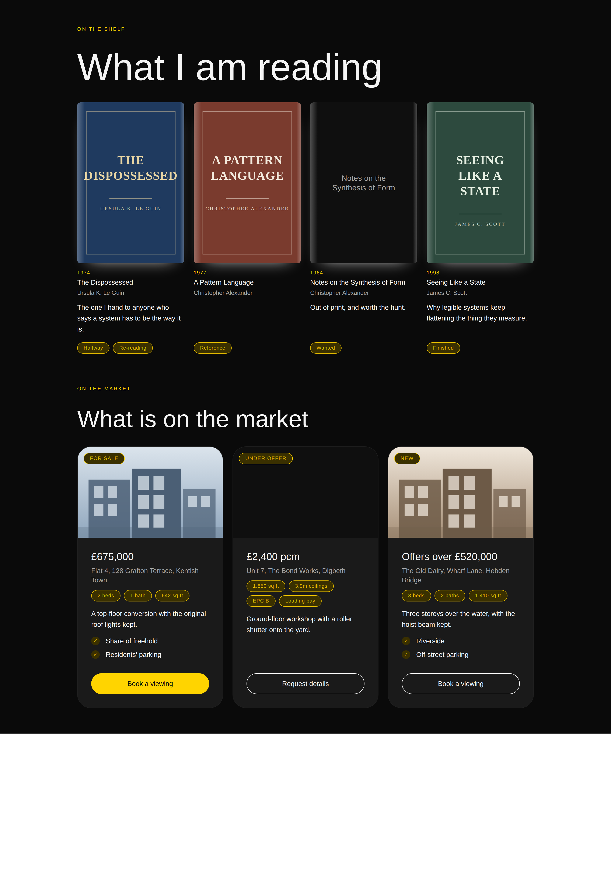
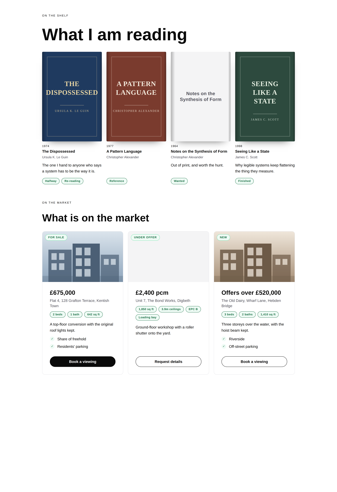
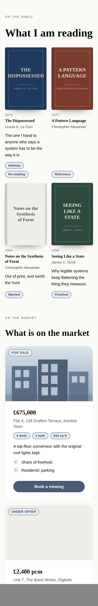

# 30 August 2026 — what is on the shelf, and what is on the market

**Routine:** `Loom primitives` · **Section:** §4b · **Branch:** `primitives-18-the-shelf-and-the-market`

Two pairs — `loom.book-grid` / `loom.book` and `loom.listing-grid` / `loom.listing`
— taking the library from **68 to 72** and the Hermes port from 47 blocks to
**50**. One decision record, `0096`, which had been asked twice in two files and
answered differently both times without anybody noticing. Two defects found by
screenshots and by nothing else, one of them the kind that would have shipped
onto the demo page in 24-point type.

## Which primitives, and why those

**Because they are what is left of the port that `main` does not have, and
because they are the two the demo can actually stand on.** The *pairs to build*
table had four rows when this run started. Two of them — episodes and events —
were written on 28 August and are sitting in **#180**, unmerged along with
everything else since #167. Building them again off `main` would have been two
primitives of duplicated work and a merge conflict for whoever lands second.
So this run took the other two, and the table now holds only what #180 already
answers.

Within the two, they are also the right two on their own merits:

- **A property wall** is the band the `realestate` template exists for, it is
  the most 21st.dev-shaped thing left in the Hermes catalogue — a photograph, a
  price, a flag, a spec row and a button — and nothing in the library could say
  it. `loom.product` is the nearest and it is a shop: its name leads, its price
  trails, and a listing wants the opposite.
- **A shelf** is two Hermes blocks that turn out to be one record, it is the
  band with the strongest picture in it, and it is the one place in the library
  where a *portrait* image is the point. Every framed image the library had was
  16 / 10 or square.

**What this deliberately is not:** the four remaining atomic-complex ideas from
last run's tier, and any of the framework gaps in `FINDINGS.md`. The port had
five blocks left in it; three of them are here.

## Which Hermes fields became nodes, and which stayed props

| Candidate | Verdict | Why |
| --- | --- | --- |
| `beds`, `baths`, `sqft` (`PropertyListing`) | **nodes** | The clearest 0052 case in the whole port and the same one the record itself makes about `hours-of-operation`'s seven weekday fields: **repeated content that never got to be a list.** There is not always three. A commercial unit has floor area and no baths; a plot has acreage and neither; a rental has an EPC band and a loading bay, and Hermes could say neither without shipping two more fields. `loom.badge` nodes in `meta`. The specimen's second listing has **four** metrics and no bed among them, which is a shape Hermes cannot express at all. |
| `status` (`ReadingItem`) | **nodes** | Hermes' own examples are *"Halfway"*, *"Started this week"*, *"On hold"* — one free-text string, and never exactly one thing. A book is *Halfway* **and** *Re-reading*. Badges in `meta`, which is `loom.product`'s call about `format` and `loom.offering`'s about its nine qualifiers. |
| `description` (`BookItem`) / `note` (`ReadingItem`) | **nodes** | 0094, which named this card in advance. The tags are a repeated part, so the card has a flow, so its sentence is a node **in** that flow. |
| The listing's blurb | **node** | Same, and the flow it creates is where the amenities list goes — a `loom.perk-list` that costs this primitive no prop, because it is `children`. That is the field Hermes never had and every real listing carries. |
| `status` (`PropertyListing`) | **prop** | **The one that reads the wrong way until you see it drawn**, and the interesting call of the run. Every other qualifier on this card is a node because there is never exactly one — and a listing has exactly one status, because *For sale*, *Under offer* and *Sold* are states of one thing. The rendering is the other half: the status is the flag **on the photograph**, which is a place the card *places* and no `meta` badge could reach. 0052's fourth clause, and `loom.perk`'s `state` is its nearest relative. |
| `cover` / `image` on both | **props** | **0096**, below. Not the call `loom.credential` made about its mark, and the difference is stated rather than felt. |
| `title`, `author`, `year`, `address`, `price` | **props** | One per record. `year` is free text and never parsed — `loom.credential`'s call and `loom.milestone`'s before it, because a parsed date refuses *"1974 (2016 edition)"*. `price` is free text for the reason three primitives already give: *"Offers over £400,000"*, *"£1,250 pcm + bills"* and *"POA"* are all things agents write. |
| `columns` on either container | **prop** | A floor and never a count. Nothing truncates either band. |
| `id` on all three shapes | **dropped** | A re-render key for a list Hermes walked. The tree has node identity; this is a field that exists because the old renderer had none. |

## The three things the design turns on

### 0096, which neither pair could have found alone

`loom.credential` holds its mark as a **region**. `loom.article` and
`loom.product` hold their images as **props**. Both were argued at the time and
both arguments are good — and read either one on its own and it decides every
card in the library, in opposite directions.

The credential's is the more forceful of the two and it is written out at
length in that file: Hermes holds the same field three ways — `badge`, `logo`,
`image` — and every one is a bare URL, so a prop could express exactly one of
the four renderings the content actually wants. Generalise it and a book cover
becomes a slot too.

Building the book and listing pairs together forced the question, because a
book cover is the most picture-like field in the entire port — portrait, framed,
the thing the eye lands on first — and the honest answer for it is *prop*.
[0096](../decisions/0096-a-cards-picture-is-a-prop-when-the-model-names-one-kind-of-picture.md):

> **Ask how many kinds of picture the content model names. One kind is a prop;
> several are a region.**

A book cover is a photograph of the front of a book. A property photograph is a
photograph of a property. There is nothing for an author to choose between, and
a region would buy a node per card to say the one thing the prop already says —
sixty nodes on a thirty-book shelf. A credential's mark can honestly be a
wordmark, a face, a glyph or a photograph, so no URL can carry it.

The test is about the **content model**, not the picture's importance: a book
cover is two-thirds of the cell and is a prop; a credential's mark is a 96px
square and is a region. And it decides `loom.episode`'s artwork and
`loom.event`'s poster in advance, the way 0094 decided their prose — which is
the whole point of writing it down now rather than after five more cards.

### `-grid`, for the third time, and this one was the tempting one

The port map proposed **`loom.book-shelf`**. It shipped as `loom.book-grid`,
which is the third time this lane has made that correction after
`loom.offering-list` and `loom.credential-list` on 26 August.

It was the hardest of the three to give up, because *shelf* is a better word and
this is a band that wants to be beautiful. It is also the plainest lie about the
layout of the three, which is exactly what 0054 exists to stop: the arrangement
word names *what the container does with its children*, and what this does is
`repeat(auto-fit, minmax(…))` with `align-items: stretch`, the same expression
every other `-grid` in the library uses. A real shelf is a wrapping row of
natural-width covers with a ragged last row. If the library ever wants one, it
is a different container with a different name — not this one with a prop,
because 0054's cost is that a container which changes its arrangement changes
its name, and a rename is a breaking change to every stored tree.

**The shelf feeling is the child's, not the container's**, and that is the part
worth keeping. Every cover is one fixed 2 / 3 box and the first thing in its
cell, so in a `stretch` grid they all stand on the same line without the
container doing anything. The spine — a `::before` gradient drawn from
`--loom-fg-default` at 0.28 opacity — is what stops a wall of covers reading as
a wall of thumbnails, and it is in the stylesheet because no inline style has a
`::before`. Under `bold` it lights the edge rather than shading it, which is the
correct answer under a dark palette rather than a lucky one.

### The price leads and the address follows

`loom.product` sets its name and price on one baseline with `space-between`,
which is right for a shop. It is wrong on a listing twice over: a buyer scans a
wall by price first, which is how every estate agent in the world sets a card;
and an address is routinely eight words — *"Flat 4, 128 Grafton Terrace,
Kentish Town"* — so a price sharing its line loses in a three-column grid
exactly the way `loom.credential`'s year did four days ago, and for the same
flexbox reason: **a wrapping row decides wrapping before it decides shrinking.**

That defect was found by a screenshot last time and fixed the same way — stop
holding the competition rather than resolve it. This time it was designed out
before the first render, which is the only evidence that the previous report was
worth writing.

## Two defects the screenshots found and eighteen assertions did not

**The fifth consecutive run in this lane to say so**, and this time one of them
would have been on the demo page in 24-point type.

### The blank cover that said "NO"

A book with no `cover` gets a jacket rather than a hole, for the reason the
shelf makes obvious: a grid where three books have covers and two do not stops
lining up, and the eye reads the gap as a photograph that failed to load. That
part was right from the first render.

What went in the jacket was `monogramOf(title)` — `loom.avatar`'s fallback,
reused because reuse looked like consistency. *Notes on the Synthesis of Form*
came out as **"NO"**. Centred, in the heading face, on a blank cover.

Every assertion in the block passed. The test even asserted the *initials*,
because the test was written from the same wrong idea as the code.

The interesting part is that the helper is not broken and needed no change. It
is built for **names**, where the first letters of the first two words are the
convention a reader recognises and `monogramOf` is exactly right. **A title is
not a name.** It starts with an article half the time, its first two words are
routinely *"The"* and *"Art"*, and the two letters that fall out carry no
information and occasionally carry the wrong one. The fix was not to change
`monogramOf` but to stop calling it: the jacket sets **the title**, which is what
the front of a book without a picture of it actually looks like, and it is
`aria-hidden` so a listening reader hears the title once from the heading below
— 0093's bargain for a decorative duplicate, reached from a prop rather than
from children.

The assertion is now the *absence* of the helper's output, which is the only
shape that would have caught this.

### The listing wall with a hole in it

The second listing in the specimen has no photograph, which is most of an
agent's wall on any given Tuesday. It rendered with no box at all, so its body
started at the top of the cell while its neighbours' started below their
pictures. In the three-column shot the middle card reads as **broken** — not as
a listing without a photograph, but as a photograph that failed to load.

Fixed the same way the jacket was, and the symmetry is the argument: the box is
always drawn, and with no `cover` it is an empty plate on the muted surface.
A plate reads as deliberate; a gap reads as a failure.

It also deleted a branch. The status flag sits on the photograph, so a card that
sometimes had nowhere to put it needed a second arrangement for the same prop —
a fallback into the flow, above the price. That code existed, was tested, and is
now gone, because a box that is always there is a place the flag can always go.
**A branch that exists only to be got wrong is worth more removed than
covered.**

## The phone shot, and the trap the last run filed

The 390px screenshot above is a real 390px viewport, and getting one took a
second attempt. The first looked like a serious overflow — a clipped headline, a
two-column shelf running off the right edge — and it was an artifact:
**headless Chromium will not make a window narrower than about 500px**, so
`--window-size=390` produces a wider page cropped to 390. #188 filed exactly
this on 29 August after mistaking it for a defect, and this run mistook it for a
defect again before remembering.

The fix is one line of HTML: render the specimen inside a 390px `<iframe>`. An
iframe is a real viewport, so `vw` units resolve against it — which matters,
because `loom.heading` sizes its top step in `11vw` and a `width: 390px` div
would have got that wrong while looking right.

At a true 390px the shelf is two covers across, the wall is one listing per row,
and nothing overflows. **Two columns of books on a phone is the correct
behaviour rather than a tolerated one**: `columns: "four"` is a floor of 10rem,
so it wraps to as many as fit, and two portrait covers side by side is what a
phone has room for.

## What the library still cannot express

- **A wall of listings cannot be sorted or filtered**, which is the second band
  in a month to want it after the class schedule, and the same wall `tabs` hit.
  Client-side selection has no seam. This is now three blocks behind one gap.
- **A listing cannot say when its viewing is**, and a shelf cannot say where the
  book came from. Both are bindings (0058) rather than props, and both are the
  right shape for it.
- **A book has no rating**, deliberately. Stars are a closed set of renderings
  and would be a real `loom.rating` leaf, but the content decision — out of five,
  out of ten, half stars? — should be made against a real page rather than
  guessed at. Left out rather than invented, which is the call the offering pair
  made about `sold out`.
- **A mosaic still measures the screen where it should measure its container.**
  Filed 21 August, filed again on 26 August with the pattern named. Untouched
  again; it is a shipped primitive's layout and belongs in a run with the
  screenshots to prove it.
- **A palette has no shadow slot**, so this run's cover shadow and every `lift`
  in the library is a bloom rather than a shade on a dark palette. Filed by #188
  for the framework lane; this run is a second primitive depending on it.
- **A `<tfoot>`, a spanning cell, a red callout, a relative internal link, a
  draggable wipe** — all still open, all from previous runs, none of them this
  unit's.

## Verification

`pnpm verify` green from the repository root, exit 0: **1,755 runtime tests
across 111 files, 1,963 application tests across 134 files, 0 skipped.** Nothing
was weakened to get there.

`library.test.ts` goes from **180 tests to 194**. All fourteen new ones are in
the `what is on the shelf, and what is on the market` block. Four existing tests
were **extended rather than weakened**, and all four for the same reason — they assert lists that a new primitive must
join or the check silently stops covering it:

- the registry roll call, `68` → `72`
- `the composed vocabulary`, which fails if any registered primitive appears in
  no fixture — the new fixture is what keeps that true
- `the targets the library declares`, where `loom.book` joins the declared list
  and `loom.listing` joins the undeclared one
- the container/child pairing check, which strips the arrangement word off every
  container and requires the remainder to be registered

Two files outside `src/primitives/` changed and both are counts another lane
holds against the repository with its own test: `FACTS.primitives` `"68"` →
`"72"` and `FACTS.decisions` `"94"` → `"96"` in
`apps/loom/app/(marketing)/_lib/copy.ts`, with `reference.generated.json`
regenerated by `pnpm --filter @loom/app docs:api`. **`FACTS.decisions` was
already wrong on `main`** — 94 against 95 records — so `main`'s own verify fails
`facts.test.ts` independently of this branch, which #180 and #188 have now both
reported. Filed again, with the same recommendation: derive both counts, since
`facts.test.ts` already computes them.

## The decision number, which is going to collide

`0096` is claimed by **three open branches**: #173 proposes one, #188 shipped
one, and this is the third. There is no way to avoid it — `tools/decisions/build-index.ts`
requires the numbers to run unbroken from 0001, so taking 0097 and leaving a gap
fails the index build. Whichever of the three merges first keeps the number and
the other two renumber.

This is a **fifth** consecutive day of nothing merging, and it is the mechanical
cost of that rather than a mistake by any of the three runs. Filed.

## 21st.dev

**Blocked for the eleventh time**, across six lanes. `docs/routines.md` still
lists it under `permissions.allow`; `WebFetch` returns `EGRESS_BLOCKED`.
Recorded rather than quietly skipped, so nobody reads this and assumes the
visual standard was consulted. Calibration was against `loom.hero`,
`loom.feature-grid`, `loom.product` and `loom.credential` — the floor the brief
names — and against the four screenshots above, which found both defects.
