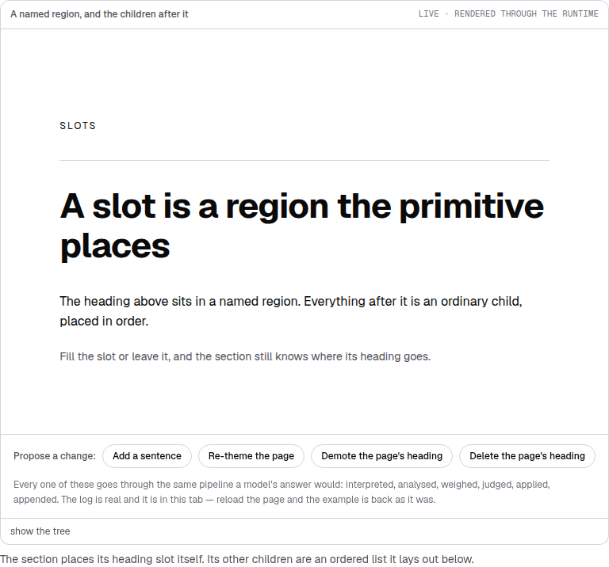
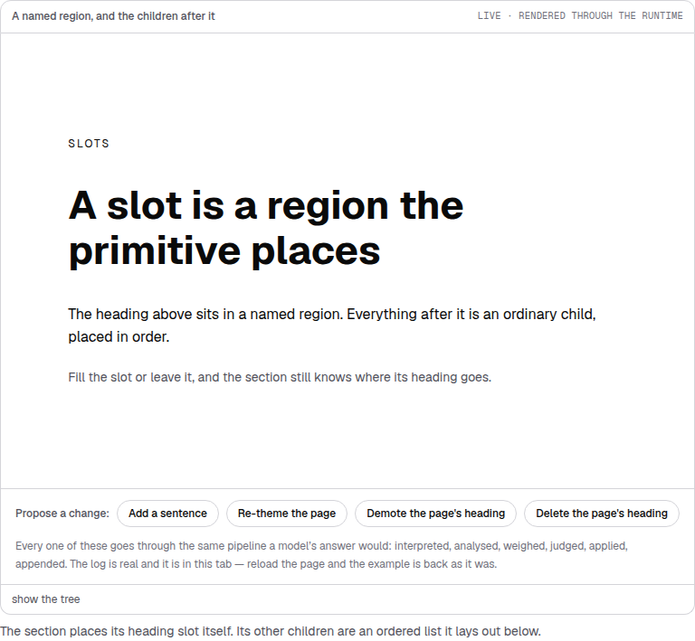
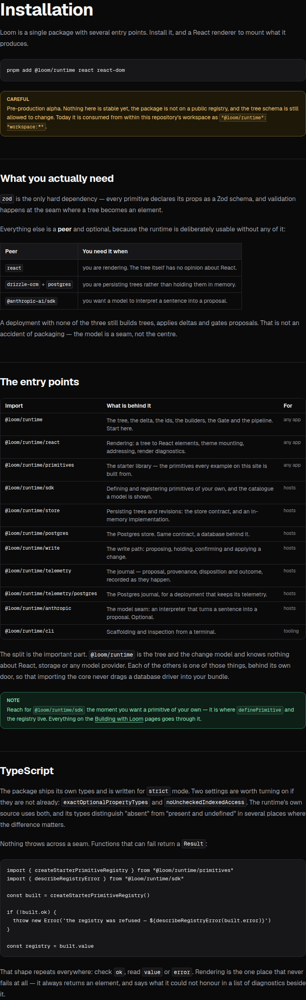
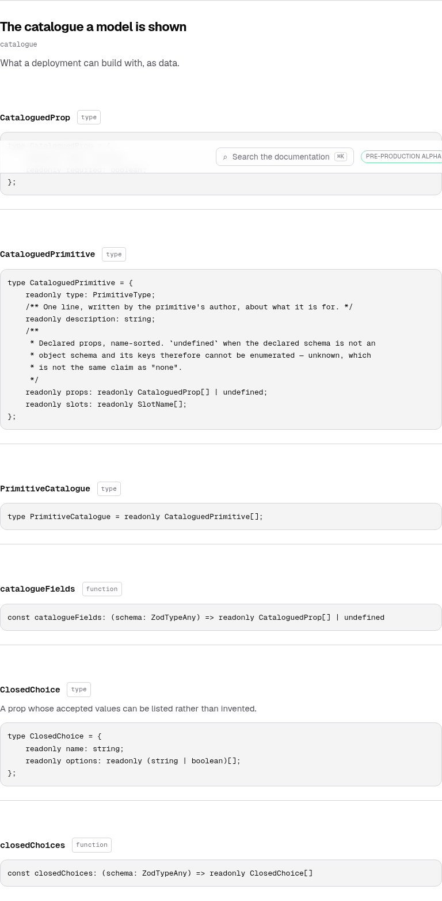
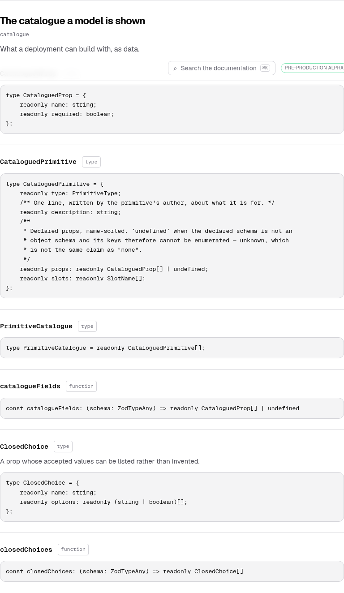
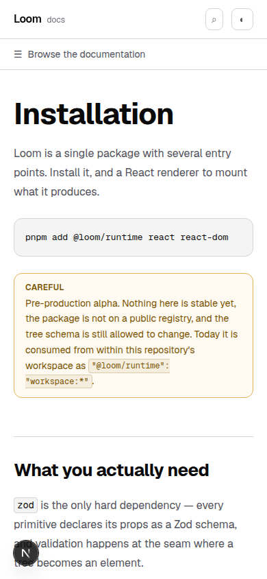

# 31 August 2026 — a real cascade barrier

**Routine:** `Loom docs` · **Branch:** `docs-16-a-real-cascade-barrier` · **Section:** §4c

The site's stylesheet opens with a paragraph about what it must never do:

> *None of this reaches an example. A primitive styles itself from the theme
> mounted on the tree it belongs to (0049/0050), so everything inside a
> `<figure data-example>` is drawn from `--loom-*` custom properties this file
> never sets and **must never set** — a docs site that tinted its own examples
> would be showing the reader a page they cannot reproduce.*

It was a description of the file, and it was false. This run makes it true and
adds the test that keeps it that way.

## The line that was not in the tree

That rule under **SLOTS** is `.prose h2 { border-top: 1px solid var(--edge) }`,
a rule about markdown headings, landing on a `loom.heading` inside a rendered
`LoomTree`. **A reader who copied that tree got no line.**

The heading also gets its own tracking back, which is why it now wraps
differently — the docs site had been setting `letter-spacing: -0.02em` on it,
and the theme's value is what a reader reproduces.

Measured across all 24 pages: **17 headings inside 9 examples** were taking
declarations from this stylesheet, and three of them took the border.

## Why nothing caught it

Every check the site has was passing, and every one was right to pass.

The example **rendered**, so the rule this project settled early — an example
that cannot render is a failing test rather than a stale snapshot — was
satisfied. Eighty-one assertions about those pages passed, because none of them
is about a computed style. And the screenshots looked fine: a rule above a
heading looks like a design decision, which is precisely what made it invisible.
It is the same rule the *prose* on that page uses.

What was missing is a test of the sheet. That is the unit.

## The mechanism, and a correction

I said on #199 that `.prose h3` outranks a utility class inside `.not-prose`.
**That is wrong**, and since it went out on a pull request it is worth stating
the right version plainly:

> Tailwind v4 orders the cascade `theme, base, components, utilities`. A later
> layer beats an earlier one **whatever the specificity**, so `.text-lg` — one
> class — beats `.prose h3` — a class and a type. A utility always wins.
>
> **What leaks is every property the component does not name.**

Measured in Chromium rather than reasoned about, because the guess is wrong in
both directions. A component asking for `text-lg` gets its 18px *and* prose's
`margin-top`, `font-weight` and `letter-spacing`, none of which anybody chose
for it. The failure is quiet by construction: nothing looks broken, the values
are simply not the component's.

Both workarounds the codebase had grown were aimed at the wrong thing:

- **`block!` in `api-reference.tsx`** carried a `!` it never needed. Plain
  `block` already won; what it was fighting was a rule that should not have
  matched at all. Gone.
- **`.prose .not-prose > * + *`**, zeroing every direct child's top margin, was
  a reset for the leak rather than a layout decision. Removing it moved **0 of
  1,957** elements, which is how I know it was dead rather than load-bearing.

## What shipped

`:not(.not-prose *)` on every element-scoped rule in the block — #155's table
guard, generalised — and `prose-barrier.test.ts` holding it.

The test reads `globals.css` as rules and asserts that no selector under
`.prose` can reach a descendant of a `.not-prose` region. It is a check on the
*class* of defect rather than on today's instance, so the fourteenth rule added
to that block cannot quietly reopen this.

Two smaller pieces fell out of it and both are the same idea — a region that
draws itself has to *ask* for what it wants:

**The code chip is now defined once and reachable two ways.** Markdown gets it
without asking; a component asks for it by name with `.code-chip`. One rule
block rather than a class and a copy of its declarations, so the two cannot
drift.

**`Callout` is the one `.not-prose` region whose content is authored markdown**,
so it asks back for the two treatments that content needs — an underline on a
link, a chip on a backtick span — in its own colour. `currentColor` is what does
it, and the amber callout now gets an amber chip where the shared grey sat on
both and belonged to neither.

## What the reference gained, which I did not expect

Every one of 429 symbol headings was carrying 40px of margin from `.prose h3`,
on top of the `py-6` its own component declares.

Six symbols now sit where five did, and a name sits with its signature rather
than adrift between two dividers. Nobody chose the 40px; it is the gap between
two paragraphs of prose, applied to a list of type declarations.

The contents box lost its `block!` and its links gained an underline they never
had — those links had been getting one from prose, and the barrier would have
taken it away silently.

## How this was checked

The census is the part I would reuse. Two scripts: walk all 24 pages in a
headless Chromium, record the computed value of all 15 properties this
stylesheet sets on every element inside a `.not-prose` region, then change the
sheet and diff. **1,957 elements, before and after.**

That is what separates a leak that was doing nothing from one something had come
to depend on — and it is what found the three false workarounds, none of which
any assertion could see. Every change in the diff was then either kept
deliberately or answered in the component; the report above is that list.

## Tests

`pnpm install && pnpm verify` at the repository root. **One test fails and it is
`main`'s** — below. Nothing of mine failed, nothing was skipped, no test was
weakened.

| Suite | Files | Tests | Change |
| --- | --- | --- | --- |
| `@loom/runtime` | 111 | 1741 | unchanged — `src/` was not opened |
| `@loom/app` | 135 | 1984 | 134 / 1963 on `main` |

**21 new tests** — 20 in `prose-barrier.test.ts`, 1 added to `example.test.tsx`.
`pnpm typecheck` exit 0 and `next build` clean across all five route groups, both
run separately because the red test short-circuits `verify` before the build.

Four verified by mutation, each caught by exactly one test:

- dropping the guard from `.prose h3` fails *"has no prose rule that can reach
  inside a .not-prose region"*
- stopping `needsBarrier` from stripping the barrier before testing fails
  *"still has prose rules to guard, so an empty result is not an empty parse"* —
  this one caught a real bug in my first draft, which would have shipped a check
  that called every sheet clean
- splitting `.code-chip` into its own rule fails *"defines the code chip once"*
- removing `not-prose` from the example figure fails *"wraps the tree in the
  region the site's prose rules cannot reach"*

That last one is new and it is the load-bearing one: the whole barrier protects
examples only because `example.tsx` puts `not-prose` on the figure, and **nothing
anywhere asserted that class** until this run.

`document.documentElement.scrollWidth` is exactly 390 at a 390px viewport on all
four pages this touched.

## `main` has been red for six days

On a clean `main` at `3a57feb`: `facts.test.ts > counts the decision records`,
expected `95`, got `94`. 1,962 other tests pass.

`main` last moved on **26 August** (#167). **#168 through #205 are all open** —
38 pull requests, every routine, six days, with `pnpm verify` green as the merge
gate for four surfaces.

This is the sixth consecutive documentation run to report it. The fix is written
and open: **#174** derives both figures instead of holding them as literals and
reports `mergeable_state: clean`; #182 raises the literal and buys until the
ninety-sixth record. I have not ported it — `(marketing)/_lib/copy.ts` is not my
lane, and that is the fourth routine in a row to reach the same correct
conclusion.

What I did differently is send it to the maintainer's phone rather than only
writing it in a report he is not reading while he is away. Five previous reports
of this did not, and the cost of that is roughly forty runs of work that cannot
land.

## Scope

`apps/loom/app/(docs)/` only — three files changed, two added. **No file in
another lane was opened**, `src/` was not opened, and no new primitive was
needed: the stylesheet and the reference components are docs-site chrome in
0067's sense.

## Open questions

**Three surfaces render Loom trees inside their own chrome** — docs, marketing
and lessons — and this guard is only this stylesheet's. I have not looked at the
other two, because they are not my lane and a measurement made from outside one
would be a guess. The method is cheap and transfers directly; it is written down
in the finding.

**Whether a written page should declare what it teaches** is still the open
question from #167, unchanged and still not worth doing until the derived index
is visibly wrong.
