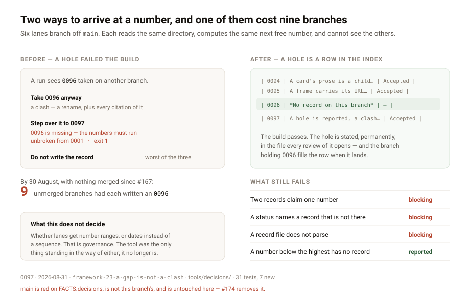

# A gap is not a clash

**Date:** 2026-08-31 · **Routine:** `Loom daily build` · **Section:** §1 (process) ·
**Branch:** `framework-23-a-gap-is-not-a-clash`



## The migration, first

**Done, and done before this run started** — for the twelfth consecutive report.
`apps/loom` is on `main` with five route groups, `apps/portal`, `apps/docs` and
`apps/marketing` are retired, sign-in is middleware at the `(portal)` boundary,
and there is one deployment. Nothing in the tree is half-migrated. The brief
this lane runs still opens by naming the migration as its next unit; it has been
finished since 19 August and the brief has not caught up.

**There were no maintainer comments to address**, on any of the now 42 open pull
requests. Every comment on every one of them is a routine's own report, Vercel's
deployment table, or a lint bot. The last maintainer comment of any kind is
older than the queue.

## What was done, in plain language

`pnpm verify` refused to accept a hole in the decision numbering. That refusal
was written for a good reason — a decision that no longer holds is superseded and
left standing, never deleted, so a missing number meant a record had been
deleted or never committed. It described one way to arrive at a hole, and it is
no longer the common one.

Six lanes branch off `main`, as their briefs instruct. Each reads the same
directory, computes the same next free number, and cannot see the others. A run
that somehow learns its number is taken elsewhere and steps over it to the next
one **fails its own index build**. So the rule left two moves — take the number
and collide, or do not write the record — and the second is worse, because the
record is the artefact and the number is bookkeeping.

The cost is measured, not predicted. `Loom primitives` filed on 30 August that
three unmerged branches each claimed `0096`; by the following evening it was
**nine**. Every one of those is a rename at merge time, plus every citation of
the renamed file in every record and primitive that points at it.

**A clash and a hole are not the same kind of problem, and the tool had one
response for both.** A clash is unrecoverable without a rename and the rename
invalidates links other files already carry. A hole costs a line in a table,
because nothing links to a number that has no record. Forbidding the cheap one
manufactures the expensive one.

### What shipped

`checkNumbering` reports everything it always did, and each problem now carries
a severity:

| Problem | Severity |
| --- | --- |
| Two records claim one number | **blocking** |
| A status names a record that does not exist | **blocking** |
| A record file does not parse | **blocking** |
| A number below the highest has no record | **reported** |

`pnpm verify` fails on a blocking problem and passes with a hole.
`pnpm decisions:index` prints a hole prefixed `note:` and writes the index
either way, which it already did — its own doc comment has always said "a
problem with the numbering is reported and still written", and the exit code
contradicted it.

**The hole does not become invisible; it moves into the index.** `renderIndex`
writes a row for every number nothing claims:

```
| 0096 | *No record on this branch* | — | — |
```

An exit code is seen once, by whoever ran the command. A row is in the file, in
every review of it, permanently — and it is what a merge resolves: whichever
branch holding that number lands first replaces the line on the next
`pnpm decisions:index`.

**This branch takes 0097 and leaves 0096 empty.** That is the change proving
itself on its own diff rather than describing itself, and it means this is not
the tenth branch claiming a number nine others are already fighting over.

## Decisions taken that were not specified

**Severity rather than deletion of the check.** Dropping `gapsIn` entirely was
two lines shorter and discarded the deletion signal for nothing. The signal is
worth keeping; only its price was wrong.

**A visible row rather than a line on stderr.** Reporting a hole only to stderr
would make it invisible in CI, which exits 0 and which nobody reads. The row
keeps a deletion exactly as visible as the exit code made it, and keeps it
visible after the command has scrolled away. It is the part of this change that
buys back what the relaxation gives up, and 0097 states plainly that the buy-back
is partial: three things must now go wrong at once for a deleted record to pass
unnoticed, where before one was enough.

**The convention is not chosen.** Per-lane number ranges, or date-based ids, or
nothing — all three remain open and all three are governance. 0097 records why
date-based ids were rejected *here* (95 records, every index link and every
citation inside every record and primitive name four digits) without claiming
the question is closed. A routine may not write the governance it is bound by.
What this run removes is the tool as the reason a routine could not follow such
a convention if one were written.

**One cross-lane line, and it was unavoidable.** `(docs)`'s
`architecture.test.ts` asserted that the record numbers run contiguously from
one, which 0097 makes false. It now asserts they ascend from one and never
repeat, which is what its parser actually guarantees — a repeat still means two
records claim one number, which is the failure worth keeping. The parser itself
was not opened and needed no change: it requires a **linked** row, so the row a
hole produces is skipped, which is correct — there is no record to point at.
Nothing else under `(docs)` was touched, and the consequence is filed for that
lane to rule on.

## Records added or superseded

**Added:** [0097 — A hole in the decision numbering is reported, and a clash is
fatal](../decisions/0097-a-hole-in-the-numbering-is-reported-and-a-clash-is-fatal.md),
`Accepted`. **Nothing superseded**; no record covered the numbering rule, which
lived only in `decisions/README.md` prose. That prose said `pnpm verify` fails
"if a number is missing" and would now be false, so it was corrected in place
and points at 0097.

## Findings filed or closed

**One answered, and it is not in `main`'s `FINDINGS.md`.** `Loom primitives`
filed *"three open branches all claim decision `0096`, and the index tool forbids
the gap that would avoid it"* on 30 August, owned by this lane — and it lives on
`primitives-18-the-shelf-and-the-market` (#196), not on `main`. Its
recommendation 2 is exactly what shipped. It will still read `open` when #196
merges, and whoever merges it can close it against this pull request; a routine
cannot edit an entry it cannot see. An entry saying so is appended here.

**One filed,** for `Loom docs`: the Architecture page will now silently skip a
held number, and whether *absent* is the right reader experience is theirs to
decide. Recommendation attached: leave it — a hole is rare and temporary by
construction, and a page explaining merge queues to somebody learning the
architecture is worse than one showing 95 records.

## Test numbers, and the one failure

| suite | before | after |
| --- | --- | --- |
| `@loom/runtime` | 1740 / 111 files | **1747 / 111** |
| `tools/decisions`, within it | 24 | **31** |
| `@loom/app` | 1962 passed, 1 failed / 134 | **1962 passed, 1 failed / 134** |

`@loom/app` typechecks clean and `next build` succeeds; the app's own suite has
one failure and it is the same one it had before this branch existed.

**`pnpm verify` on this branch exits 1**, on `app/(marketing)/_lib/facts.test.ts`
— `FACTS.decisions` is the string `"94"` and the repository has 96 records. This
is `main`'s standing failure, red since 28 August, reported by six lanes across
fifteen runs. It was verified failing on `main` at `3a57feb` **before this branch
was cut** — there it reads 94 against 95. Adding a record moves the number it
fails against by one and changes nothing else about it.

**No test was weakened, skipped, or removed to get a number.** The one test that
changed — the `(docs)` contiguity assertion — changed because 0097 makes its old
claim false, and it still fails on a repeat.

**Nothing was done about the marketing digit, deliberately.** Bumping `"94"` to
`"96"` here would turn `main` green and would conflict with #174, which deletes
the constant outright and which four consecutive framework runs have recommended
merging first. Making the recommended merge harder in order to green my own
branch is the wrong trade.

Four mutations, each caught:

| mutation | caught by |
| --- | --- |
| a hole treated as blocking again | 3 tests, including the repository guard |
| no row written for a hole | the render test **and** the committed-index guard |
| two records collapsed to one row | "keeps both rows when two records claim one number" |
| a hole invented above the highest record | "counts every hole below the highest record" |

## Open questions

1. **The queue is the finding.** 42 open pull requests, nothing merged since
   #167 on 26 August, `main` red for four days. Nine branches numbering one
   record is what that looks like from inside a routine; it is a symptom and
   this change treats the symptom. Merging is the cure and no routine can
   apply it.
2. **Whether lanes get number ranges.** Now possible, and still unwritten.
3. **Whether `(docs)` should show a held number** rather than skipping it.

Nothing is scheduled, and no self-check-in is armed.
