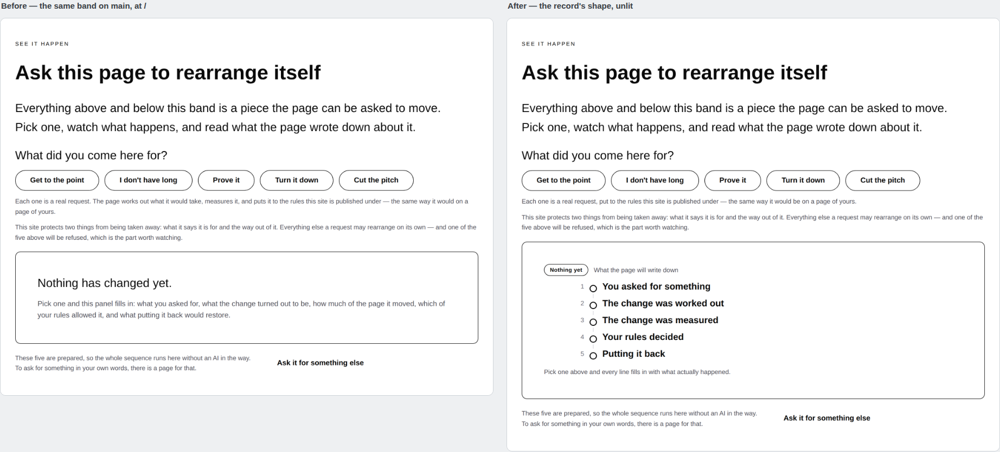
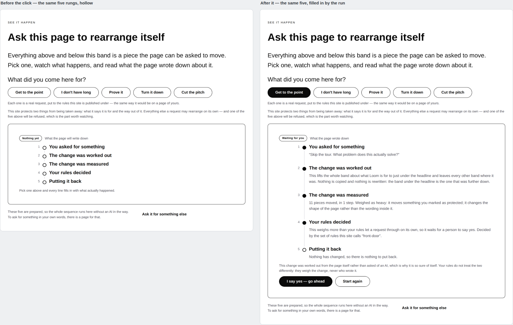
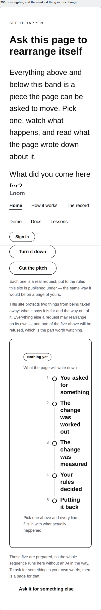
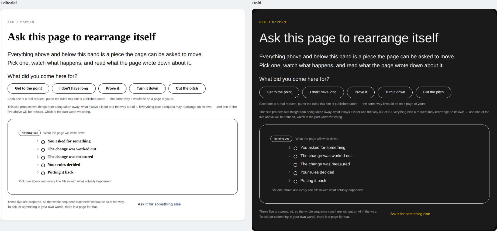

# 2026-08-31 — marketing: the shape of the record, before there is one

Sixteen runs have made this site deeper. This one looked at the state **every**
visitor meets — the front door before anybody has clicked anything — and found
the site's most important band opening as an empty box.

Both of those are `/`, with nothing in the query string. On the left is `main`.
The band promises *pick one, watch what happens, and read what the page wrote
down about it* — and the thing directly under that promise is a bordered
rectangle with two sentences in it and three hundred pixels of nothing beneath
them.

That rectangle is not a corner of the page. It is the panel the whole site is
built around, in the only state a crawler, a share preview and a first-time
visitor ever see.

---

## What shipped

**The waiting panel is now the record's own shape, unlit.** The same five rungs
in the same order, each one hollow and carrying its title and nothing else.

A visitor who clicks nothing has still been shown the five things this product
writes down — what you asked for, what the change was worked out to be, how much
of the page it moved, which rule decided, and what putting it back would restore.
That list is the one thing on this site a competitor cannot copy, and until today
it was a sentence in a box rather than something a reader could see.

### The morph is the demonstration

Left is `/`. Right is `/?ask=problem` — the visitor asked *"Skip the tour. What
problem does this actually solve?"*, the page worked the change out, measured it,
and the rules held it for a person.

**Nothing is added between those two screens and nothing is taken away.** The
five rungs the reader was looking at are the five that fill in. The dots go from
hollow to filled, each title grows the line that belongs to it, and the badge
stops saying *Nothing yet* and starts saying what the rules decided.

That only means something if the two panels are genuinely one thing rather than
two hand-built lists that currently agree. So they are one thing: `PANEL_STEPS`
holds the five titles and the way each reads its own line off the record, and
both states of the panel are built from it.

### What that replaced, and it is the part worth naming

The five steps were written out **twice** in this file, and the second copy is
the one that was going to drift:

> *Pick one and this panel fills in: what you asked for, what the change turned
> out to be, how much of the page it moved, which of your rules allowed it, and
> what putting it back would restore.*

Every clause of that is a rung's title said again in different words, by hand,
two hundred lines from the rungs. It is the copy a visitor reads **before there
is anything on the page to check it against**, which is exactly the copy nobody
would notice going stale. A sixth step, or a re-worded fourth, and the sentence
and the rail would have disagreed with a passing suite the whole way.

A third recital sat above the panel — *"The page works out what it would take,
measures it, and puts it to the rules this site is published under"* — and is
gone for the same reason. What is left of that line is the part the panel cannot
say for itself: that these are real requests, and the rules judging them are the
site's own.

**The sequence is now written down once.** `waiting.test.ts` holds each of the
five titles as appearing in the band exactly once, so a future run reaching for a
prose recital of the steps meets a failing test rather than a reviewer who might
not be looking.

## The honest costs, both measured

**The band is 121px taller** at 1440 — 828 to 949. That is the price and it is
not free: it buys the emptiest three hundred pixels on the site turning into the
sequence the band exists to demonstrate. The first draft of the code comment
claimed the panel was *no taller than the box it replaces*; that was a guess, the
measurement disproved it, and the comment now carries the number.

**The phone is the weakest thing in this change, and this lane has no lever on
it.**

`loom.milestone` lays each rung out as `5.5rem auto 1fr` — an 88px marker column
reserved at every viewport, and reserved whether or not a marker is set. At
390px, after the card's padding, a rung is 188px wide and 88 of those go to the
number, leaving **101px for the title**. *You asked for something* wraps to three
lines.

Three things are true about that and all three are in the finding:

- **It is not fixable from here.** Dropping the numbers reclaims nothing, because
  the column is unconditional. The workaround is a local component and this lane
  does not get one (0067).
- **It is not new.** The same gutter already shapes the filled panel and every
  rung on `/how-it-works`, both of which are on `main` today. This change makes
  an existing weakness more visible; it does not introduce it.
- **It is cramped rather than broken.** `scrollWidth` is exactly 390 at a 390px
  viewport, the order is right, and the hollow dots read correctly.

I tried the one lever this lane does have — the card's own padding — and reverted
it. Dropping `roomy` to `normal` returns 56px, which takes the title from 101px
to 116px and still wraps to three lines. It does not fix the problem and it is a
design change made to chase something it cannot reach, so the panel keeps the
padding it was designed with.

## Under the other two palettes

Not one colour, size, weight or spacing step is written anywhere in this change.
The hollow dot is `loom.milestone`'s `planned` state, which takes its border from
the theme's `border-strong` and its fill from `bg-canvas`; the badge is the
library's outline tone.

**The badge is the outline and not the accent, deliberately.** The rule this site
settled on 26 August is that the accent and a primary control are the same claim —
a band wears one if and only if it offers the other. A waiting panel hands the
visitor nothing to decide, so it does not wear the accent, and it also cannot
read as a verdict beside the four the same badge wears once there is a record.
`waiting.test.ts` holds that.

## Tests

`pnpm install && pnpm verify` — **green, exit 0. Nothing failed, nothing skipped,
and no test weakened.**

| suite | on `main` | on this branch |
| --- | --- | --- |
| `@loom/runtime` | 1741 / 111 files | **1741 / 111 files** — `src/` was not opened |
| `@loom/app` | 1962 passed, **1 failed** / 134 files | **1978 passed / 135 files** |
| marketing, within it | 589 passed, 1 failed | **604 passed** |

Fifteen new tests: fourteen in one new file, and one net in `adapt.test.ts`.

**One existing test was replaced, and it is the only existing test this run
touched.** `adapt.test.ts` asserted *"shows no steps at all before the visitor
has asked for anything"* — `countOf(basePage(), "loom.milestone") === 0`. That
was a fact about the old panel rather than a property of the site, and the panel
it described no longer exists. It is replaced by two assertions that are strictly
stronger and hold what it was actually protecting:

- the waiting panel names the same steps, **in the same order**, as the filled
  one, and
- every one of its rungs is unlit and carries no body.

Neither reads `PANEL_STEPS` for both sides. Both walk the two **rendered** trees,
because a test that read the table twice would pass however either panel was
built — and that both panels are made from the table is the whole claim.

**Five mutations, each caught by the tests that should catch it:**

| mutation | result |
| --- | --- |
| waiting rungs `planned` → `done` | fails *leaves every rung unlit and empty* |
| the badge `outline` → `accent` | fails *wears no accent* |
| a waiting title that differs from the filled title | fails the morph, on all five choices |
| a rung dropped from the waiting panel | fails 8 assertions |
| the old prose recital put back | fails *says … once and nowhere else*, on all five titles |

**The last one failed to fail the first time, and the reason is worth keeping.**
The new test file had a local `wordsOf` that read `node.text` where the runtime
holds `node.value` — so it walked the band, collected the empty string, and
passed against a mutation that put the entire recital back. `_lib/words.ts`
exists precisely because a second copy of that helper drifts, and says so in its
own comment. The fix was to delete the copy and import the site's. Had I not run
the mutation, this run would have shipped a test whose whole purpose was to catch
a thing it could not see.

## Decisions and findings

**No record written.** The change is compositional, adds nothing to the library,
and constrains nothing outside this lane.

**Two filed.**

- **`loom.milestone` reserves 5.5rem for its marker column at every viewport**,
  for `Loom primitives`, with the measurements above and three ways out named.
- **`FACTS.decisions`, tenth occurrence**, for the maintainer. `main` has been
  red on this single assertion since 27 August — which means red for all four
  surfaces — and this is the fourth consecutive marketing run to open by changing
  a digit it did not cause. 94 → 95.

**None closed.** Nothing in this lane's queue was answerable from this run.

## Scope

`apps/loom/app/(marketing)/` only, plus `FINDINGS.md` and this report. `src/` was
not opened, no other route group was touched, and the two runtime values used are
public exports consumed the way any host would consume them.

## Open questions

- **The merge queue, and it is the one thing worth your attention.** Thirty pull
  requests are open and nothing has merged since 27 August. **#174 deletes the
  literal that has been holding `main` red, and has been green, mergeable and
  unreviewed since the 27th.** This branch does not duplicate that fix on
  purpose: a competing derivation in the same file would make the pull request
  that fixes it properly un-mergeable, which is worse than a digit.
- **Positioning, audience and the licence line** (#96, restated on #134, #142,
  #150, #163, #166, #174, #182, #190, #198). Still the site's one placeholder and
  still the Phase 2 gate. Untouched.
- **The commit-identity trap.** Not hit this run — the branch is authored by the
  environment's default identity and nothing set `user.email`. The one-paragraph
  fix for `docs/routines.md` recommended on 25, 26 and 30 August is still the
  cheapest open item in the repository, and is not a routine's to write.
