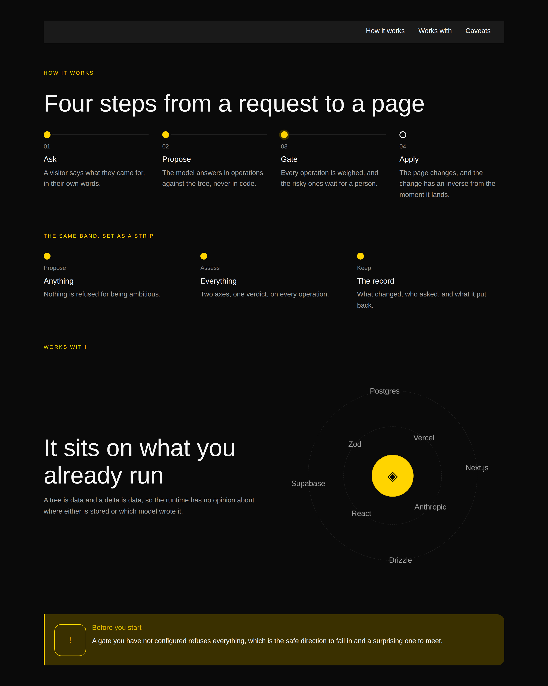
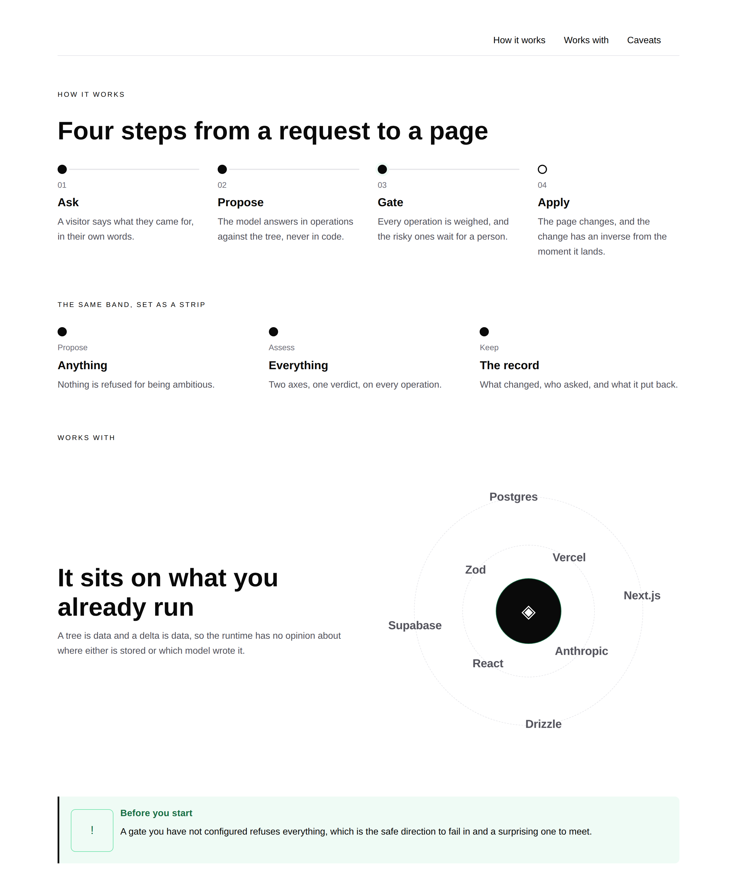
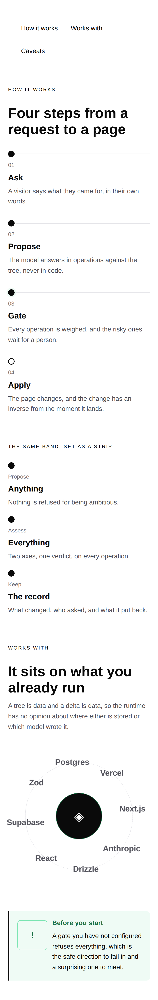

# 31 August 2026 — how it works, what it works with, and how to point at either

**Routine:** `Loom primitives` · **Section:** §4b · **Branch:** `primitives-19-how-it-works`

Two primitives — `loom.milestone-row` and `loom.orbit` — taking the library from
**68 to 70**, and an `anchor` on the three bands a menu points at, which is the
first `id` this library has ever rendered. **No new decision record**, on
purpose. Two defects found by the screenshots and by nothing else, and one
non-defect the screenshots claimed and a measurement disproved.

## Which primitives, and why those

**Because the Hermes port has run out of rows.** The four *pairs to build* are
built — episodes and events on #180, books and listings on #196 — so the ledger's
remaining eight blocks are all on open branches and there is nothing in the port
map for this lane to pick up. What the brief asks for after that is explicit:
*fill the gaps a marketing page needs that Hermes never had.*

Two of those gaps are the two bands a page reaches for **after** it has made its
claim, and a creator-profile toolkit never needed either:

- **How it works.** Every landing page has a band of three or four numbered
  steps. This library had a *rail* — one column, marker on the left, dots joined
  by a vertical line — which is right for a history and wrong for a process. A
  roadmap is read down because time runs that way; three steps are read across
  because they are meant to be taken in at once.
- **What it works with.** `loom.logo-cloud` says *these companies exist*.
  `loom.marquee` says *there are a lot of them*. Neither can say **these things
  move around that thing**, which is a claim about a product rather than a list
  of customers, and it is the only one of the three with a centre.

The third piece is not a primitive. **A page could link to any document on the
web except itself**, which the marketing routine filed on 26 August after its
front door wanted a *read the whole record* control pointing at a panel 1,200px
below the reader and had to send them to a different page instead. Both of this
run's bands are exactly what a menu points at, so the finding was in the right
run rather than merely in the right lane.

**What this deliberately is not:** a `loom.rating`, a `loom.progress` and the
other small leaves that would have made the number four. They are real gaps and
none of them is a *band*; four thin leaves would have read as a bigger run and
been a smaller one.

## What became a node, what stayed a prop, and what stopped being inline

There are no Hermes fields to rule on this run — neither band ports a block — so
the equivalent table is about where each decision *lives*, which turned out to
be the more interesting question.

| Candidate | Verdict | Why |
| --- | --- | --- |
| The steps of a process | **nodes, and the ones that already existed** | 0052's opening clause was answered in July: a marker, a title and a sentence is a `loom.milestone`. What was missing was an arrangement, not a content model. |
| A step's number (`marker`) | **prop, unchanged** | One per entry, free text, and the same field that holds `v0.4` and `Q1`. A `loom.step` with a `number` would have been a fourth set of words for it. |
| `loom.milestone`'s own grid, its rail direction, its dot offset, its connector's thickness | **moved from inline to the stylesheet** | The finding this run turns on — see below. |
| `density`, `rail` on the row | **props, and the list's own two** | Both change how however-many entries are drawn and neither changes the set of them. They are the *same words* as `loom.milestone-list`'s because the two containers are one family. |
| The things in orbit | **nodes** | A logo in a ring is a logo, and it means the same thing standing still — `loom.marquee`'s correction to the port map, applied before the mistake rather than after. |
| The thing in the middle | **a slot** | 0051 read straight: the primitive *places* it, dead centre and outside the turning layer, at a position no reordering of children can reach. "The first child is the middle one" is a rule no schema states and every `move` breaks. |
| `rings`, `direction`, `guides` | **props** | One ring or two changes where however-many marks are drawn; a direction is a *variant* of a motion, which 0055 permits and a duration is what it does not. |
| A seat's **angle** | **computed per node, inline** | A fact about one child among its siblings — the third of six — which no static rule can express. `loom.hero` computes an `animationDelay` per row the same way. |
| A seat's **radius** | **the stylesheet's** | A fact about the arrangement, which a rule has to be able to change. This is what let a `@container` query save the phone rendering. |
| `anchor` | **prop** | Exactly one of it, it labels the node rather than being its content, and changing it is exactly a `configure`. On three primitives rather than seventy, for the grammar budget's reason (0014). |

## A child that lays itself out inline cannot be rearranged by its container

This is the run's finding and it decides whether 0054 is available at all.

The tempting shape for a *how it works* band is `loom.step`: a numeral, a title,
a sentence. It would have been a third primitive rendering the three fields
`loom.milestone` already renders, and 0054 says what to build instead — **a
container is its child's name plus the arrangement**. So a run of milestones laid
across is a `loom.milestone-row`, exactly as a run of them down a rail is a
`loom.milestone-list`.

Except that it was not possible. `stylesheet.ts` states the rule in one line —
**an inline style beats a rule** — and `loom.milestone` set its own
`grid-template-columns`, its rail's `flex-direction`, its dot's optical offset
and its connector's `width` as inline styles. Every one of them was therefore
unreachable from any parent, and the only *reachable* answer left was the
duplicate child. Four declarations moved into the stylesheet under a class the
entry carries, and the second arrangement became possible with no new child type
and nothing about the rail rendering changed.

The class sits on the **entry** rather than on the list, which preserves the
property the inline version was there to protect: a milestone that finds itself
outside a list still lays itself out, because the class travels with the child.

**The general form, filed for every other pair in the library:** a child's inline
styles should be what *no arrangement of it would ever vary* — its typography,
its colours, its own internal gaps. Anything an alternative container might want
differently belongs in the stylesheet under a class, whether or not a second
container exists yet. It costs nothing to write it that way first and it costs a
primitive to fix afterwards.

## The orbit, and the one thing it computes

A ring that rotates rotates everything on it, so a wordmark would go round upside
down. The seat sits inside the turning layer and the item inside the seat runs
the same animation in reverse at the same rate, which holds every logo upright
while the ring moves under it. The two durations have to stay equal — a mismatch
is a logo tumbling slowly rather than staying upright — so they are one multiple
of `--loom-motion-slow` written twice in one file, and neither is expressible on
an element.

Everything else about the band follows the two rules already in the library.
It **holds still while the page is being edited**, which is `loom.marquee`'s
rule for its second reason: a moving target is hostile to the one activity edit
mode exists for, and a logo drifting away from the pointer is worse here than in
a marquee because it is going round a corner rather than off the side.
`loom.editable` is present only in edit mode, so that is the whole test. Reduced
motion takes the same still rendering, and it is not a degraded one — the ring is
a composition, not an animation, and it reads as one stopped.

**The mark is placed by its own middle, not stretched across the band.** Both
render identically and only one of them is right: `inset: 0` with
`place-items: center` draws the mark in the correct place *and* lays a
transparent box over every logo on the ring that eats the pointer. Asserted,
because a screenshot cannot see it.

## Three things the screenshots found, and one they got wrong

**Four runs in this lane have now said this and it keeps being true.** What is
new is the fourth item: a defect the screenshots *claimed* and a measurement
disproved, which is the same instrument working in the other direction.

### The fourth step sat higher than the other three

In the first render, steps 01–03 lined up and 04 floated about 24px above them.
Nothing was wrong with the row: the four entries are flex items on one line, so
they are all stretched to the tallest, and each entry is a **grid** whose rows
are `auto`. A grid container taller than its content distributes the slack into
those rows, so the three *shorter* entries had their marker and title pushed
down while the tallest sat tight. One declaration — `align-content: start` — and
the extra height stays at the bottom where it belongs.

It is worth naming because the failure scales with content: it appears exactly
when one step's sentence is longer than its neighbours', which is every real
process band and no fixture anybody would write.

### The orbit's inner ring landed on top of the mark it circles

At a true 390px the band is about 350px wide, the inner ring's radius is 22% of
that — 77px — and the mark in the middle is a fixed 3rem icon whose own radius is
48px. So *Vercel*, *Anthropic*, *React* and *Zod* were drawn across the disc they
were meant to be orbiting, half of each label unreadable.

The fix is the one `loom.offering` established: a `@container (max-width: 26rem)`
rule that opens the inner ring out to the outer one and drops its now-empty
guide, so a narrow band is **one ring of eight** rather than two rings of four.
This is the third primitive in the library to want a measurement of its own
container rather than of the viewport, and the first where it cost nothing —
because the radius was never a per-node fact, moving it into the stylesheet took
nothing away and left the `@container` hook where a media query would otherwise
have had to go. A media query would have been wrong here for `loom.offering`'s
reason: this band is as likely to be one half of a `loom.split` on a laptop as
the whole width of a phone, and the viewport cannot tell those apart.

### The page overflowed on a phone, and it did not

The first phone screenshot showed every line of body copy running off the right
edge. It was not overflow. **Headless Chromium will not make a window narrower
than about 500px**, which `primitives-17` reported on 29 August — so a
`--window-size=390` screenshot is a 500px page cropped to 390, and cropped text
looks exactly like clipped text. Driven properly, through Playwright with
`viewport: { width: 390 }, isMobile: true`, the measurement is
`scrollWidth === innerWidth === 390`: no overflow at any width, at 1280 either.

The same instrument settled two things an image cannot show, both quoted here
because they are the assertions behind the pictures:

| | measured |
| --- | --- |
| the ring, published | `loom-orbit:running`, `currentTime` advancing (383ms, 400ms) |
| the ring, in edit mode | `document.getAnimations()` is **empty** |
| the page at 1280 and at 390 | `scrollWidth === innerWidth` |

That is `primitives-17`'s third instrument used the way it was meant to be: a
still animation and a finished one are the same picture, and only the timeline
tells them apart.

## The anchor, and the half of it that is not this lane's

`loom.section`, `loom.hero` and `loom.callout` take an `anchor` and render it as
an `id`. The 26 August finding left three questions open with it and
`src/primitives/anchor.ts` answers all three:

- **Which primitives carry one.** The bands a page's own navigation points at,
  and nothing else. A prop on seventy schemas to serve the three things a table
  of contents lists is a cost rather than a kindness (0014), and a tree that
  needs to point at something finer wraps it in a section — a node it can
  already make.
- **What it accepts.** A fragment: lower case, digits, single hyphens. An anchor
  is the one value in the library a model writes *straight into the document as
  markup*, so it is the one place to keep narrow — `id="my section"` is two
  attributes to a parser. A sanitiser that quietly rewrote it would leave every
  link to it pointing at a name nobody wrote, so the seam reports it instead.
  The cost is stated rather than hidden: an invalid anchor makes the node
  invalid, so the **band does not render at all**. That is every prop's rule
  (0011) rather than something an anchor makes worse, and it is why the message
  says what a valid one looks like.
- **Whether `loom.decorative()` must strip it.** It must — 0093 exists so a copy
  carries no identity, and an anchor is identity — and that is the render seam's,
  filed for the framework lane along with uniqueness, which is a fact about a
  *tree* that a per-node schema cannot see and should not pretend to.

**The address half is refused, and deliberately not fixed here.**
`linkUrlSchema` parses with `new URL`, so a bare `#how-it-works` comes back as
*must be an absolute URL* — the same clause of 0053 that #187 escalated as
`Proposed` 0096 for root-relative paths. A fragment-only href is the **narrowest
slice of that question** and does not raise 0053's objection at all: the
objection is that a relative destination means something different per
deployment, and `#how-it-works` means the same thing in every deployment, at
every path, forever. It carries no scheme, so it cannot be `javascript:`; it
names no host, so `//evil.example` is unreachable through it.

That is an escalation rather than a fix, so nothing was built and **no competing
record was written**: 0096 is already claimed nine ways across open branches, and
a second proposal against the same clause would be noise rather than
information. It is filed as a paragraph for whoever answers 0096 to read beside
it. Until then a page links to its own band with its own absolute URL, which
works — the specimen's menu does exactly that, and the screenshots show it.

## Why there is no decision record this run

Three of the four calls above are **applications of accepted records rather than
new ones**: 0054 produces the container, 0051 makes the mark a slot, 0055 keeps
the duration out of the tree. The fourth — where an anchor lives and what it
accepts — is written to a stranger in `anchor.ts`'s own doc comment, which is
0080's whole point, and `loom.list-item` set the precedent for arguing a decision
in a comment rather than in a record when the numbering makes a record cost more
than it carries.

It costs more than usual today. `pnpm decisions:index` refuses a gap, so the next
free number is 0096 whatever anyone does, and **nine open branches already hold
one**. A tenth would have bought discoverability from `decisions/` and paid for
it with another renumbering at merge, for a rule that contradicts nothing and
constrains no schema. If the maintainer would rather have the record, it is one
file and I will write it.

## What the library still cannot express

- **A page cannot link to its own band without knowing its own URL.** Above, and
  the narrowest fix is blocked behind 0096's review.
- **A `loom.mosaic` still measures the screen where it should measure its
  container.** Filed 21 August, 26 August, and again today — there are now *two*
  primitives doing it correctly to copy from.
- **A ring cannot say what the marks on it have in common.** An orbit of eight
  logos is eight logos; an orbit of eight logos with a line drawn from each to
  the centre is a diagram, and the line is a connector no primitive can draw.
  Left out rather than guessed at: it is a real design question about whether
  the band is decoration or a diagram, and it should be answered against a page.
- **A step band cannot number itself.** The markers are `01`…`04` because a
  person typed them. A counter would be one CSS declaration and it would be
  wrong: the same prop holds `v0.4` and `Q1` on a rail, and a container that
  overwrote its children's content would be a container the tree no longer
  describes.
- **A palette still has no shadow slot, no danger colour, and no `<tfoot>`** —
  all from previous runs, none of them this unit's.

## Verification

`pnpm install && pnpm verify` green from the repository root, exit 0: **1751
runtime tests across 111 files, 1963 application tests across 134 files, 0
skipped.** Nothing was weakened. Ten of the runtime tests are new, all in the
`how it works, and what it works with` block, plus three updated where the change
made an older assertion false — the registry's roll call, its count, and
`loom.callout`'s prop list.

Two files outside `src/primitives/` changed and both are counts another lane
holds against the library with its own test: `FACTS.primitives` `"68"` → `"70"`
and `FACTS.decisions` `"94"` → `"95"` in
`apps/loom/app/(marketing)/_lib/copy.ts`, with `reference.generated.json`
regenerated by `pnpm --filter @loom/app docs:api`. **`main` was red before this
branch** for the fifteenth time on the same single assertion — `FACTS.decisions`
said 94 against 95 records on disk — and this branch turns it green. #174 is
still the fix for the class.

## The preview

Opened with the pull request; the address is the `vercel[bot]` comment's alias.
The four screenshots above are the primary evidence, because they are the
library's own specimen under every registered palette and at a true phone
viewport — and **both of this run's defects came from them and from nothing
else**, for the fifth consecutive run in this lane.

Screenshot filenames are kept under fifty characters, which is #196's finding
about GitHub stripping the `src` from a long image URL in a pull request body.
The longest here is 37.

## 21st.dev

**Blocked for the twelfth time**, across six lanes. `docs/routines.md` still
lists it under `permissions.allow`; `WebFetch` returns `EGRESS_BLOCKED`.
Recorded rather than quietly skipped, so nobody reads this and assumes the
visual standard was consulted. Calibration was against `loom.hero`,
`loom.feature-grid` and `loom.milestone-list` — the floor the brief names — and
against the screenshots.
