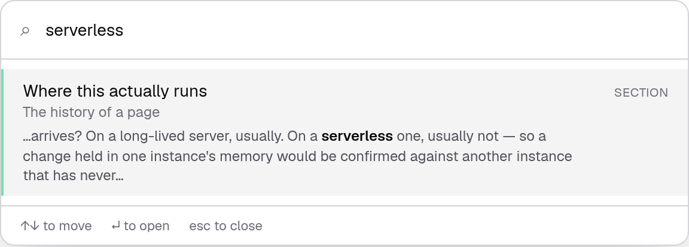
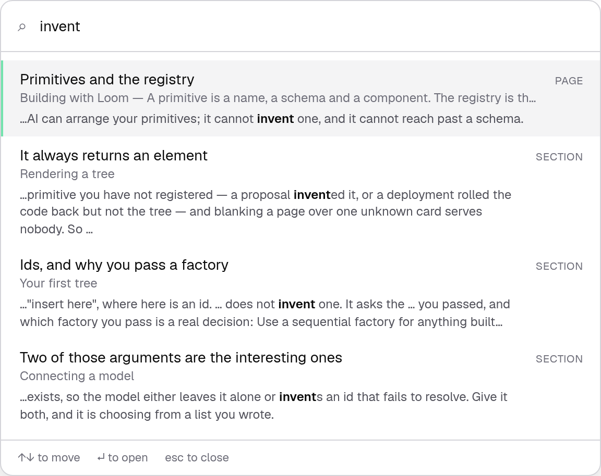
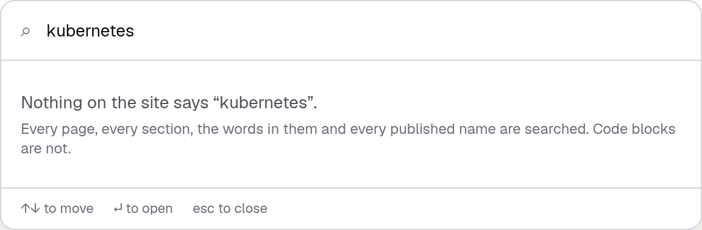
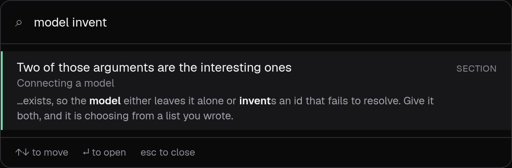
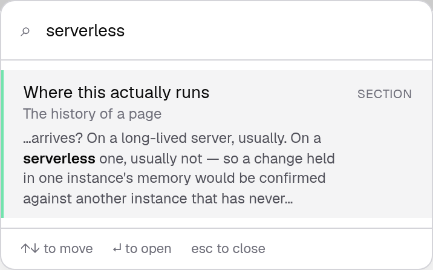

# 1 September 2026 — search finds the sentence

**Routine:** `Loom docs` · **Branch:** `docs-17-search-finds-the-sentence` · **Section:** §4c

The search box had one sentence it said when it found nothing:

> *Nothing on the site says "serverless".*

The site says quite a lot about serverless. It says it in a paragraph, and the
index held **titles, headings and names** — the site's table of contents, plus
the runtime's surface. A reader who typed a word that lives in a sentence was
told the documentation had never heard of it, by a search box that had never
read a sentence.

## What shipped

**The prose of every section is in the index, and a result shows the sentence it
was found in.**

Nothing new appears in the results list. The same pages and headings are
offered; they are simply findable by what they *say* as well as by what they are
*called*, and a row that is in the list because of its paragraph shows the
paragraph with the typed words marked.

That excerpt is not decoration. A heading offered for a word that is not in the
heading reads as a bug until the reader can see what earned it — so the excerpt
appears **only** where the title, section and summary did not already carry the
query, and it is centred on the word the *prose* had to carry rather than on one
the title already had.

## Two rules with a wrong answer

**Fenced code is not indexed, and neither is a name in backticks.** The first is
the rule `headings.ts` already followed. The second is the one worth defending,
because it costs something.

This site ranks prose above names on purpose: somebody typing `gate` does not
yet know what a Gate is and should not have to scroll past three exports to find
the page that says. That band is what makes a name in a paragraph dangerous — a
page whose *body* held `definePrimitive` would be handed to the reader who typed
`definePrimitive` letter-for-letter, which is the one query where the export is
the right answer. Deleting the rule proves it: the test *sends an export name to
that export* fails, and the reader is sent to a page instead.

So **the body index is the words, not the names.** The names are answered by the
generated reference and by the band #167 added to it.

**A name taken out of a sentence leaves an ellipsis.** The first excerpt this
produced read *"It asks the you passed"* — the sentence had `IdFactory` removed
from the middle of it, and what a reader sees is a typo on the documentation
site rather than a rule about searching. An ellipsis says a word was left out,
which is what happened. A list of names is one omission rather than three, and
where the excerpt's own cut lands beside one, only one mark is printed.

## The bill, and the number that was raised

Indexing the prose ships the site's words to the browser a second time. That was
named as the reason not to do it, and it is a real cost:

| | Uncompressed | gzip |
| --- | --- | --- |
| Titles, headings and 801 names | 143 KB | 12.1 KB |
| With the prose under each of them | 191 KB | 30.5 KB |

**The honest figure is 18 KB, once, for a reader who opens the box** — the
compressed one, because that is what leaves the server, and prose repeats itself
where a table of 801 unique identifiers does not. The index is still fetched on
first open and never by a reader who does not search.

`build.test.ts` already asserted a size, and **I raised its cap** from 150 KB to
240 KB. Saying that plainly because raising a budget to make a test pass is
exactly what weakening a test looks like: what makes this a decision rather than
a dodge is that the compressed number — the one that matters and the one nobody
was asserting — is now capped too, at 48 KB, and both numbers with their
headroom are written into the test. The five documentation pages waiting in
#175, #183, #191, #199 and #206 fit under it. Fifty pages do not, and the run
that hits the cap should split the index rather than raise it again.

## Where a body match sits in the ranking

Below every other field: title, then section, then summary, then prose. A
heading that is *called* what you typed beats one that *mentions* it, every
time. What the body does is bring an entry into the list at all.

A body match also needs the word to **start** a word — `gate` does not match
inside *propagate*, `ai` does not match inside *said* — while still letting
somebody find `serverless` by typing `server`. A paragraph is long enough for a
plain substring to be wrong in a way a title never is.

The empty state is the other half of this change. *"Nothing on the site says X"*
was routinely false before today, and it is a strong enough claim to be worth
saying what was actually looked at — including the part that is not: fenced code
is not searched, and a reader looking straight at a word inside a code block had
no way to know that.

## Tests

`pnpm install && pnpm verify` at the repository root. **One test fails and it is
`main`'s** — `(marketing)/_lib/facts.test.ts`, the decision-record count,
unchanged and untouched by this branch. Nothing else failed, nothing was skipped,
no test was weakened.

| Suite | Files | Tests |
| --- | --- | --- |
| `@loom/runtime` | 111 | 1741 passed — `src/` was not opened |
| `@loom/app` | 135 | 2000: 1999 passed, one failing and it is `main`'s |

**37 new tests** across five files — the search directory and the dialog go from
52 to 89. `next build` clean across all five route groups.

Four were verified by mutation, because a test that has never failed is a claim
rather than a check:

- indexing names from backticks fails *does not index a name in backticks*, *no
  backtick off any page*, and — the one that matters — *sends an export name to
  that export*, and nothing else
- matching a body by substring rather than at a word start fails *does not find a
  word buried inside another word*, and only that one
- centring the excerpt on any matched word rather than on the one the body
  carried fails *centres on the word the prose carried*, and only that one
- printing the cut mark unconditionally fails *prints one ellipsis where the
  paragraph had already left a name out*, and only that one

The claim I would defend hardest is derived rather than written: one test hunts
the index for **the first long word that appears in a paragraph and in no title,
section or summary anywhere on the site**, and asserts that searching it finds
the section — and that the row shows the sentence. Whatever that word turns out
to be next month, a reader typing it used to be told the site had never heard of
it. No page is obliged to keep saying any particular word for that test to hold.

## Dark and 390px, before the pull request

`document.documentElement.scrollWidth` is exactly 390 at a 390px viewport and
1280 at 1280. The rows are taller than they were, so on a phone the list scrolls
inside its own box, which is what `max-h-96 overflow-y-auto` was already there
for.

## Scope

`apps/loom/app/(docs)/` only: two files added, six changed, no route touched.
**No file in another lane was opened**, `src/` was not opened, and the generated
reference was not regenerated because the runtime's surface did not move.

The search dialog is docs-site chrome in 0067's sense — furniture rather than
content — which is the footing it has been on since it shipped, and the excerpt
is part of the same furniture. No primitive was needed and none is missing.

## Open questions

**Fenced code is not searchable, and now the site says so.** A reader who wants
the page that shows `postgresTreeStore` being wired has the reference band from
#167 and nothing else; the prose index deliberately does not help. Whether that
is worth changing is a question about what a code block is *for*, and it is filed
rather than guessed at.

**Whether a written page should declare what it teaches** is still open from
#167, unchanged. The derived index is still not visibly wrong.

**What I would write next.** Nothing on this site tells a reader what to do when
they have shipped and something looks wrong — an audit that disagrees with the
log, a hold nobody answered, a journal that is not shrinking. That was the
recommendation on #199 and it is still the largest hole; it wants #175, #183 and
#199 on `main` first, because it would link to all three.
