---

# A behaviour that hands back a number

**Date:** 2026-09-01 · **Routine:** `Loom daily build` · **Section:** §4b ·
**Branch:** `framework-24-a-behaviour-that-hands-back-a-number`

## The migration, and the brief

**It is done, and it was done before this run started** — as it was for the two
runs before this one, which said so in the same words. `apps/loom` is on `main`
with five route groups, `apps/portal` and `apps/docs` do not exist, `apps/` holds
exactly one workspace, and `pnpm-workspace.yaml` is `apps/*` with one member.
Nothing in the tree is half-migrated.

The brief still opens with that migration marked **⚠**, says it outranks
everything else, and says three routines are blocked on the shape it produces.
That is now filed as a finding for the maintainer rather than restated in a
fourth report: a routine may not rewrite the brief it is bound by, and the cost
is that every run spends its opening establishing that its highest-priority
instruction was satisfied days ago. If the other three briefs carry a matching
"blocked until the migration" clause, they have been clear to start for days and
do not know it.

**There were no maintainer comments to address.** Every comment on every open
pull request is a routine's own report. Nothing was touched on another lane's
branch.

## What was done, in plain language

One finding from my own queue, filed by `Loom primitives` on 25 August: **a wipe
cannot be dragged, and the behaviour vocabulary has one member.**

`loom.before-after` places its divider where `position` says and leaves it there.
Dragging it is a pointer handler; a handler is a function; a primitive's props are
JSON. That much 0086 already settled — a behaviour is a control the runtime builds
and a primitive places, and `src/primitives/` declares and never implements. So
the primitives lane could not build it and filed it here, which was right.

What made it more than a fourth member of a list is the thing the entry spotted
and could not answer from its own lane: **this is the first control that has to
hand something back.** `copy` acts on the node's text, which is in the tree.
`disclose` acts on a region of the render, and says so by stamping a boolean on
its own button that the primitive's stylesheet selects on. Neither gives the
primitive a *number*, and a wipe divider is a number — the thing it drives is a
`clip-path`.

It cannot be an attribute. There is no portable way to read an attribute's value
into a length: `attr()` outside `content` is not something a library may rely on,
and the quantised alternative is a hundred CSS rules to say what one `calc()`
says. So it has to be a custom property — and a custom property brings the
problem the diagram above is about. `data-loom-disclosed` is read **sideways**, by
an ordinary sibling selector, which is what lets a disclosure own exactly one
element and touch nothing. `var()` resolves by **inheritance**, which runs
downwards only. A property this control set on its own element would be readable
by nothing at all, least of all the sibling region it exists to drive.

**So `adjust` writes `--loom-adjust` to its parent — the element the primitive
placed it in — and that is the first time the runtime has written to an element it
did not create.** That is the cost, it is why there is a record, and three things
bound it: exactly one property, namespaced like every other variable this package
emits; written only on the element the control is already inside; and removed on
unmount, so a stale value cannot outlive the control and suppress the primitive's
own fallback forever. The parent is *chosen, not discovered* — the control does
not search for the region, take a ref to it, or get told where it is. The
primitive picked it by deciding where to place the control.

**The still version is untouched, and that was the point rather than a
consolation.** The property is absent until the control mounts and proves
scripting runs, and absent again when it unmounts, so the primitive reads
`var(--loom-adjust, 50)` with its own declared position as the fallback. A page
served with scripting off renders exactly what it renders today. The entry said
the still version "is what most pages using this actually are", and nothing is now
hidden behind a control that may never arrive.

The control is an `<input type="range">`. The entry had weighed and rejected one,
correctly, on the grounds that CSS cannot read an input's value — which is true of
*pure CSS* and is exactly the gap a behaviour fills. Read the value in a
component, write it where a stylesheet can reach it, and dragging, the arrow keys,
Home and End, the announced role and the announced value are all the browser's to
get right. A `role="slider"` div reimplements every one of them worse.

**Placing it is the primitives lane's and it is three lines**, recorded in the
closed finding: declare `adjust` and an `adjust` text key, place
`loom.behaviours.adjust` inside the element that should read the value, and put
`var(--loom-adjust, …)` into the clip `loom.before-after` already writes.

## Decisions I made that nothing specified

**The name is `adjust`, not `drag` or `wipe`.** The vocabulary is closed and
shared, so a name tied to one primitive would push the second use — a zoom, a
split panel, a comparison of two renderings that are not images — into asking for
a fourth member instead of reaching for this. The consequence is recorded: the
variable name is now reserved in the space `theme/apply.ts` emits into.

**The range is 0–100 and unitless.** A percentage rather than a unit interval,
because every use multiplies by `1%` and a stylesheet author reading
`var(--loom-adjust)` should see the number they would have typed. Unitless so one
value serves a clip, a width and a background position alike.

**The resting position is the control's, not the primitive's.** `build` receives
a node's text and its content, not its props, so nothing here could read a
declared position — and nothing needs to. The primitive supplies its position as
the `var()` fallback, which covers the case that actually matters: the page where
the control never mounts.

**Two adjust controls in one element is unguarded.** The second would overwrite
the first, silently. Nothing checks it because nothing can — the seam hands a
primitive one node per declared *name* — so it is recorded rather than defended.

## Records

**0096 added** — *A behaviour publishes a value on the element the primitive
placed it in*, Accepted, §4b. Five alternatives recorded with the reason each was
rejected: a wrapper component (undoes 0086's shape for every behaviour, not just
this one), writing to `document.documentElement` (two comparisons on one page
would drive each other), quantised attribute steps (twenty rules per primitive
and visibly stepped), a callback prop (makes the primitive a client component and
the closed set stops being checkable), and simply declining the finding
(defensible, but the seam did not need widening to allow it).

**Nothing superseded.** `pnpm decisions:index` run; `decisions/README.md` updated.

**0096 is the tenth branch to claim that number, and it is claimed deliberately.**
Nine other unmerged branches have written an `0096` because `main` has 95 records
and `tools/decisions/numbering.ts` on `main` treats a hole as a failure — *"the
numbers must run unbroken from 0001"*. Taking 0097 or 0098 to dodge the collision
would leave a hole and turn **this branch** red. #210 fixes exactly this and is
unmerged, so the fix cannot be relied on from here. This is the sixth consecutive
run in which the numbering has cost something.

## Findings

**One closed.** The 25 August entry from `Loom primitives`, with two corrections
to it that do not change what it asked for: the vocabulary had grown to *two*
members before this run, not one, and the range input it ruled out is what ships,
because the objection was to pure CSS and not to the control.

**One filed, for `@jonathanbravecredit`** — the brief's ⚠ headline unit was
finished before it was written, and three routines may still believe they are
blocked on it.

**The `FACTS` red and the merge queue were not filed again.** Both are already on
the record from six lanes across fifteen runs and a sixteenth entry is noise.
They are in *Open questions* below instead.

## Tests

`pnpm install && pnpm verify`.

| suite | before | after |
| --- | --- | --- |
| `@loom/runtime` | 1741 / 111 files | **1751 / 112** — green, nothing skipped |
| `@loom/app` | 1962 passed, 1 failed (1963) | **1962 passed, 1 failed (1963)** — the same one |

**The runtime is green: 112 files, 1751 tests, exit 0 on build, typecheck and
test.** Ten new tests: eight in the new `behaviour-adjust` suite, and two added to
`behaviour.test.ts` for the seam around it. One existing assertion changed rather
than being added to — the vocabulary pin, which names the members as a list so
that growing it is a visible edit in the test as well as the source.

Four mutations, each caught by exactly one test:

| mutation | result |
| --- | --- |
| publish on the control's own element instead of the parent | **4 failed** |
| drop the unmount cleanup | **1 failed** |
| publish `"37%"` instead of `"37"` | **4 failed** |
| render before proving scripting runs | **1 failed** |

**One test fails, it is not mine, and it is the one `main` already fails.**
`app/(marketing)/_lib/facts.test.ts` holds `FACTS.decisions` against the number of
records on disk; the constant says `"94"`. It failed on `main` at `3a57feb` before
this branch existed, reporting 95. Adding 0096 moves the expected number to 96 —
it does not add a failure, it renumbers one.

**I did not bump the digit, and this run has a checkable reason beyond the one
the last five gave.** #174 deletes that constant outright and replaces it with
counts that derive themselves. It is the *only* pull request in the queue whose
`mergeable_state` is `clean`. Editing that line here would put a conflict into the
one PR that has none, and it is the PR that fixes this class of failure for good.

Two files outside `src/` changed and both are generated or counted:
`decisions/README.md` (by `pnpm decisions:index`) and
`apps/loom/app/(docs)/_lib/api/reference.generated.json` (by
`pnpm --filter @loom/app docs:api`, which its own test instructs you to run —
835 exports, up by the six this branch adds). No hand-written file in another
lane was opened.

## Open questions

1. **`main` has been red for five days and it is one hardcoded digit.**
   `FACTS.decisions` is `"94"` against 96 records. Red since 28 August. **#174 is
   `clean` and fixes it properly.** Recommendation, for the sixth consecutive
   framework run: **merge #174 first.**

2. **Nothing has merged since #167 on 26 August, and the queue is now 44 pull
   requests** — #168 to #211, six lanes adding roughly one a day. A prior run
   measured 34 of 35 merging cleanly, with conflicts confined to `FINDINGS.md`,
   the `copy.ts` digit and duplicate `0096`s. The standing offer holds and will
   not be started uninvited: **say the word and one whole run will do nothing but
   rebase the queue onto a moving `main`.**

3. **A per-lane number range is still unwritten**, and this run is the tenth
   claimant on `0096` because of it. It is a paragraph in `docs/routines.md`, and
   a routine may not write the governance it is bound by.

4. **The `Loom daily build` brief needs its ⚠ section deleted** and the list under
   *After the migration* promoted to be the queue. Filed above.

Nothing scheduled, no self-check-in armed, and this pull request is not
subscribed.
