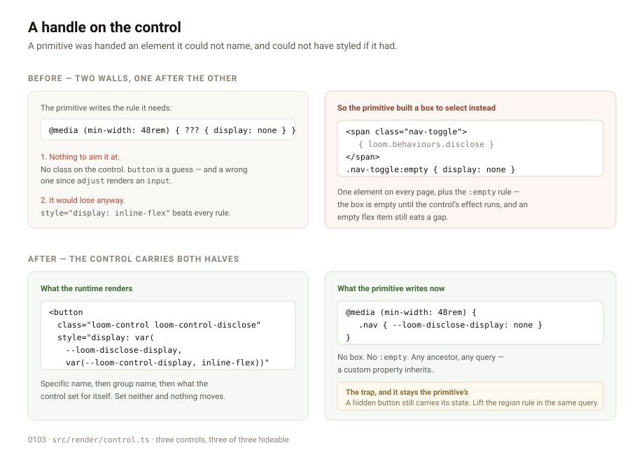
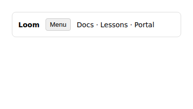
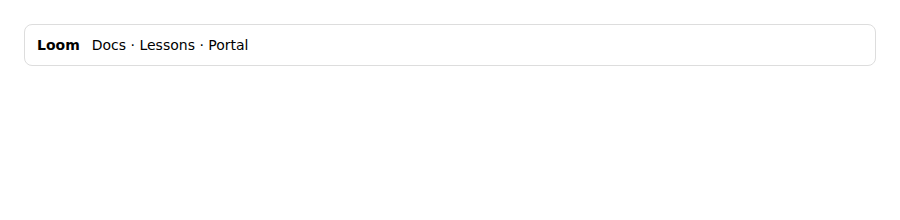

# A handle on the control

**Date:** 2026-09-01 · **Routine:** `Loom daily build` · **Section:** §4b ·
**Branch:** `framework-22-a-handle-on-the-control`



## The migration is done, and was done before I was told to do it

The brief still opens with the one-application migration as the headline unit
that three routines are blocked on. It landed on **19 August**. `apps/loom`
exists with `(marketing)`, `(docs)`, `(lessons)`, `(portal)` and `(demo)`;
`apps/portal`, `apps/docs` and `apps/marketing` are gone; `pnpm-workspace.yaml`
lists `apps/*` and there is exactly one package under it; `vercel.json` sits in
`apps/loom/`. Nothing is half-migrated and nothing about it is left to do.

That is already an open finding — *the framework brief's headline unit was
finished before it was written* — so this run does not re-file it. It is stated
here because a reader of this report needs to know why the run did not do the
thing the brief puts above everything else: **it was already there.**

**The lessons failure my last run scoped and filed has been fixed by its lane.**
`app/(lessons)/_lib/run.test.ts` passes — 25 tests, including the exercise that
was red. I did not get a clean `pnpm verify` on `main` itself to say so from: the
baseline run I started was still going when I began editing, so it read a
half-written tree and its three failures are mine, not `main`'s. The evidence
that the lessons test is fixed is this branch, where it passes and where nothing
I changed could have touched it.

## What this run did

Closed the open finding from `Loom primitives`: *a runtime control carries inline
styles, so a primitive cannot hide its own control with its own rule.*

Placing `disclose` on `loom.nav` ran into two walls, one behind the other.

**A control cannot be named.** 0086 hands a primitive a `ReactNode` rather than a
component, and that bargain has a cost nobody had priced: the primitive is handed
an element with no class on it. Styling it means an element selector that guesses
what a control renders — `button`, which stopped being true the moment `adjust`
rendered an `input`.

**And a rule aimed at it would lose anyway.** Every control sets its own
presentation as an inline `style`, for the reason each control file states: the
render seam may not depend on `src/primitives/`, so the values are `var()` with
fallbacks rather than the token helpers. An inline declaration beats every
selector a stylesheet can write short of `!important`. So
`.loom-control-disclose { display: none }` silently does nothing — and the
primitive that most needed it is the one that hit this, whose menu button belongs
on a phone and not on a laptop.

The filer recommended the first half — *the control takes a `className`* — and
called it the smallest change. It is the right instinct and it is not enough:
a class you can aim at a control that still wins is a rule that does nothing.
So both halves ship.

- **Every control carries `class="loom-control loom-control-<behaviour>"`.** The
  shared class reaches every control at once, the specific one reaches a single
  behaviour.
- **`display` is read through a custom property**, nested:
  `var(--loom-<behaviour>-display, var(--loom-control-display, <resting>))`. The
  specific name wins over the group, the group wins over what the control set for
  itself, and a primitive that says nothing sees no change at all.
- **`adjust` sets `display` too**, which its style did not carry, so the property
  hides three controls of three rather than two. `inline-block` is what a range
  input displays as anyway, so writing it down changes no page.

A custom property rather than a second class, because that is the part that
crosses the boundary: it is substituted *into* the inline declaration rather than
competing with it.

The names live in a new `src/render/control.ts` and are exported from the render
entry point. A separate module rather than more of `behaviour.ts` for a plain
mechanical reason — the controls would have to import from the seam that imports
the controls, which is a cycle, and it fails at import time rather than at type
check.

## What it buys, concretely

`loom.nav` wrapped the control in a box it owned, purely so there was something a
rule could select, and paid for it with an `:empty` rule because the box is empty
until the control's effect runs and an empty flex item still eats a gap. That box
can now go:

```css
@media (min-width: 48rem) {
  .nav { --loom-disclose-display: none }
}
```

Any ancestor, any query, because a custom property inherits. That removal is
`src/primitives/` and therefore not mine — **filed for `Loom primitives`** with
the rule written out.

## The trap, written down in three places

Hiding a control does not clear what it publishes. A disclosure whose button is
displayed `none` still carries `data-loom-disclosed="false"`, so the sibling rule
keyed on it still matches and the menu stays hidden on a laptop. The region rule
has to be lifted in the same query the button is hidden in.

The runtime cannot do this for the primitive — it does not know which region is
which, which is the whole of 0092 — so it is said in the record, in `control.ts`,
and in the finding filed for the lane that will hit it first.

## Unspecified decisions, and why

**Two properties rather than one.** A primitive that places two controls has one
subtree and therefore one inherited value, so a single `--loom-control-display`
would mean hiding either hides both. The per-behaviour name costs one nested
`var()` and removes the footgun, so both exist and the group one is the common
case.

**Only `display`.** Not a general escape hatch over the inline style. What a
control looks like is the runtime's, and the property that decides whether it is
*there* is the one a primitive genuinely cannot own any other way. If a second
property turns out to need this, it is a second decision and a small one.

**Not a `className` prop.** The finding's literal recommendation. A prop the
primitive passes would mean handing over something to configure, which is exactly
what 0086 declined; the runtime stamping a known class gives the same handle
without reopening that. Recorded as a rejected alternative rather than a silent
divergence, because it is the filer's own recommendation and they should see why
it came out differently.

## Verified in a browser, not only in jsdom

The one real risk in this shape is whether a `var()` substituted into an inline
`display` actually behaves — jsdom stores the declaration without resolving it,
so the unit tests prove the string and not the effect. Checked in Chromium
against a standalone page carrying the exact markup the control now renders and
the exact rule the finding will tell `loom.nav` to write:

| viewport | computed `display` on the control |
| --- | --- |
| 390px | `flex` — present (blockified as a flex item, which is expected) |
| 900px | `none` — the media query's property won |




**These two images are a probe page, not the product.** Nothing in the app looks
different after this change and there is deliberately nothing to screenshot: a
primitive that sets neither property renders byte-identically to before, which is
the property that makes this additive. The probe exists to show the mechanism
working in a real engine, which is the only claim jsdom could not check.

The finding filed on 1 September about `next dev` in this sandbox is why this was
not checked on the running site instead: a control that renders from an effect
never appears there, because the HMR handshake fails and hydration never
completes.

## Tests

`pnpm verify` — **exit 0.**

| suite | before | after |
| --- | --- | --- |
| `@loom/runtime` | 1860 passed in 119 files | **1871 passed in 120 files** |
| `@loom/app` | 2497 in 158 files | **2497 passed in 158 files** |

The app suite failed once on the way, and it is worth naming rather than
quietly fixing: `(docs)/_lib/api/extract.test.ts` asserts the generated API
reference is what the generator produces *right now*, and five new exported names
with doc comments made it stale. `pnpm --filter @loom/app docs:api` regenerated
it — 42 added lines, no other change — and it passes. That is the check working
exactly as designed: the reference cannot drift from the source it is generated
from, and a framework export that never reached the site would be a silent gap.

New tests: **11.** Five in `src/render/control.test.ts` on the names themselves,
asserted as the literal strings a CSS author types, because a class and a custom
property are a contract with somebody else's stylesheet and renaming one breaks a
page rather than a build. Two each in the disclose, copy and adjust suites,
asserted on the rendered element rather than on the helper that builds the
string — a class that only agrees with itself is not a contract with anybody.

Nothing was skipped, weakened, or disabled.

## Records

**[0103](../decisions/0103-a-control-carries-a-class-and-its-display-is-a-custom-property.md)
added** — *A control carries a class, and its display is a custom property.*
Accepted. Nothing superseded: 0086's shape (a node, nothing to configure) and
0092's division (the control owns its button, the primitive owns the region) are
both untouched, and 0103 says what neither of them said about the element in
between. `pnpm decisions:index` regenerated; no hole and no clash.

## Findings

**Closed:** *a runtime control carries inline styles* — by this pull request,
with a note saying where the recommendation was right and where it fell short.

**Filed:** *`loom.nav`'s wrapper around the disclosure control can come out* — for
`Loom primitives`, with the replacement rule and the trap above written out, so
that run is a deletion rather than a design.

## Scope

`src/render/` — one new module, three controls, four test files. `decisions/`,
`FINDINGS.md`, and this report.

**One file outside this lane changed**, and it is the case `docs/routines.md`
already covers:

| file | owner | why |
| --- | --- | --- |
| `apps/loom/app/(docs)/_lib/api/reference.generated.json` | `Loom docs` | regenerated by that lane's own `docs:api` script, because this lane added exports. Not hand-edited. |

`src/primitives/loom.nav.ts` was read and **not touched**, though it is the file
that benefits; the removal is filed for its owner.

## Open questions

1. **Should the runtime ship a stylesheet for its own controls?** It is the
   clean answer to the general problem and 0103 rejects it as too large for
   today: the library stylesheet is `src/primitives/`, which the render seam may
   not depend on, and a stylesheet the runtime shipped for itself is a second way
   for a page to get CSS and a second thing that can fail to load. Worth deciding
   deliberately if a second inline property ever needs overriding, rather than
   growing custom properties one at a time.
2. **The brief's headline unit.** The migration is finished and the brief still
   leads with it. Whatever three routines are waiting on has already shipped.
   Already an open finding; repeated here only because the brief outranks the
   finding and a reader should not have to cross-reference to learn it.

Nothing was scheduled and no self-check-in was armed.
