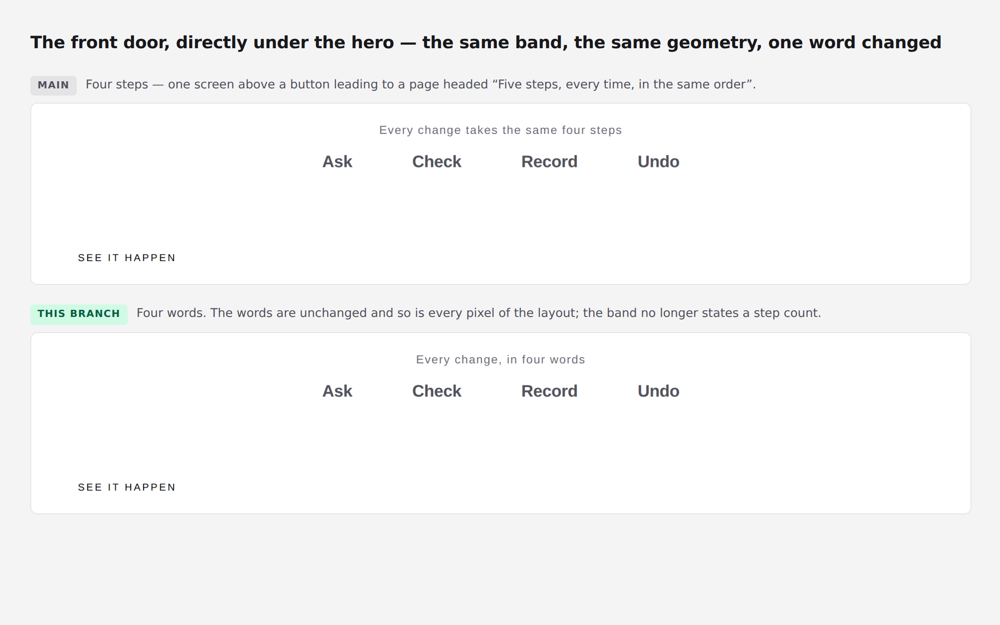
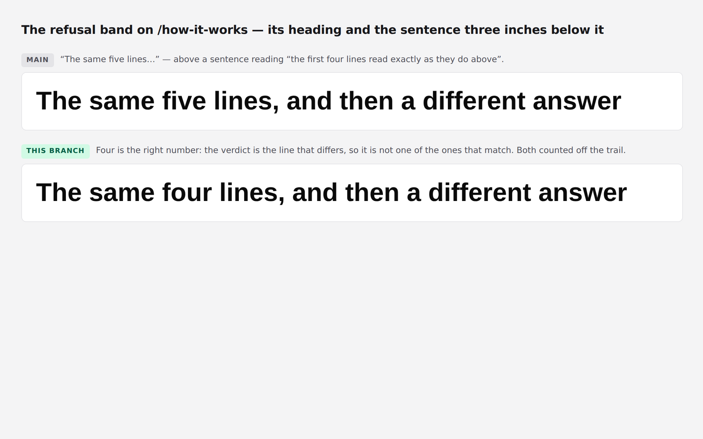



# 2026-09-01 — marketing: one number for one thing

The front door told a stranger there were **four steps**. The button directly
above that sentence leads to a page headed **“Five steps, every time, in the
same order”**.

Both of those sentences were true. The four words are the four nouns — proposal,
gate, revision, inverse — put into plain English in August so that nobody would
have to be taught our vocabulary on the first screen. The five steps are the
pipeline. *Undo* was never one of the five; it is what the fifth step leaves
behind.

Nothing was wrong anywhere, which is why **sixteen runs, 589 marketing tests and
every screenshot review since 20 August went past it.** A stranger does not get
to know that the two lists are different lists. They read four, press the button
under it, and read five — on a site whose entire argument is that it can tell
them exactly what happened.

---

## What shipped

**One module, and the rule it enforces.** `_lib/journey.ts` holds the five steps
as data and spells the count off `JOURNEY.length`. No sentence on this site
states a step count of its own any more.

Seven typed counts were removed. Six of them said five and were right; one said
four and was the defect:

| where | said | now |
| --- | --- | --- |
| `/` — the band under the hero | “Every change takes the same **four steps**” | “Every change, in **four words**” |
| `/how-it-works` — the h1 | “**Five** steps, every time…” | `${STEPS_CAPITALISED} steps, every time…` |
| `/how-it-works` — the trail | “**Six** lines for the **five** steps above” | both counted, off the trail and off the list |
| `/how-it-works` — refusal heading | “The same **five** lines…” | “The same **four** lines…” — off the trail |
| `/how-it-works` — refusal body | “the first **four**… the **fifth**… no **sixth**” | three positions in the trail |
| `/how-it-works` — the glossary | “**Five** of our words appear” | `GLOSSARY.length`, which was already exported |
| `/how-it-works` — the closing band | “The **five** steps above…” | off the list |

The milestone list is built by mapping `JOURNEY` rather than by five literal
`loom.milestone` blocks, so the steps and the sentences counting them cannot
come apart. The copy is moved, not rewritten — the words were not what was
wrong with them.

### The band kept its words and lost its claim

The fix on the front door is deliberately the smallest one available. *Ask ·
Check · Record · Undo* are four good plain words and dropping *Undo* to force
the band to five would have thrown away the most reassuring word this product
owns in order to win an argument with a page one click away.

So the words stay and the label stops being a step count. The band is not a
shorter version of the pipeline and never was; calling it one was the whole
defect. The geometry is unchanged — measured, not assumed: the band's box is
`{x: 100, y: 420.359375, width: 1080, height: 59}` on both branches.

### A second contradiction, eighty pixels apart

Found while deriving the first. The refusal band was headed *“The same five
lines, and then a different answer”* directly above a sentence reading *“the
first four lines read exactly as they do above”*.

Four is right. A refusal produces the identical request, rules, list and
measurement, and then a verdict that differs — so the verdict is not one of the
lines that match, and the heading was counting it among them. Both numbers are
now positions in the trail the band is holding while it speaks.

## Tests

`pnpm install && pnpm verify` — **green, exit 0. Nothing failed, nothing
skipped, no test weakened, and no existing test file opened.**

| suite | before | after |
| --- | --- | --- |
| `@loom/runtime` | 1741 / 111 files | **1741 / 111 files** — `src/` was not opened |
| `@loom/app` | 1962 passed, **1 failed** / 134 files | **1974 passed, 0 failed / 135 files** |
| marketing, within it | 589 | **600** |

Eleven new tests in one new file. The failing test on `main` is the record count
below, not something this change repaired.

Everything is asserted against the **rendered pages**, never against
`journey.ts`. A test that read the list and compared it with itself would pass
however either page was built, and passing however the page was built is exactly
what the seven literals did for sixteen runs.

**Three assertions verified by mutation**, because a test that has never failed
is a claim rather than a check:

| mutation | result |
| --- | --- |
| `PLAIN_WORDS_LABEL` back to *“Every change takes the same four steps”* | **2 failed**, 8 passed — the two front-door tests, and only those |
| refusal heading counting the verdict again (`spell(verdict)`) | **1 failed**, 9 passed — the heading-versus-sentence test alone |
| a sixth `GLOSSARY` entry | fails *counts the glossary it is introducing* |

The negative assertion is deliberately wider than the answer: it searches for
every English count from *two* to *seven* followed by *steps* and requires all of
them absent, because checking only that the right number is present would pass a
page that said both.

## The state of `main`, which is the thing I would ask you to act on

`main` at `3a57feb` is **red**, and has been since 27 August. `facts.test.ts`
fails on *expected '94' to be '95'* — 1 failed, 1962 passed, measured this run.
Under 0067 that is four surfaces red, not one.

**#174 deletes that literal for good. It is green, `mergeable_state: clean`,
based on the current head of `main`, and has been unreviewed for five days.**

This run bumped the digit to `95` rather than re-deriving it, for the reason the
31 August run gave and which still holds: a second derivation in the same file
would put #174 into conflict, and the queue does not need another way to not
merge. Thirty pull requests are open and none has merged since 27 August.

## Decisions and findings

**No record written.** The change is compositional, adds nothing to the library,
constrains nothing outside this lane, and touches no Accepted record. `src/` was
not opened; no other route group was touched. Nothing outside
`apps/loom/app/(marketing)/` changed except `FINDINGS.md` and this report.

**Four filed.** Two are this run's own defects, recorded for how they survived
rather than because they are still open; one is the record count as the tenth
occurrence; one is new.

- The front door's number, and the pattern behind it. This lane has now hit the
  same shape three runs running — two individually correct sentences that had
  never been read next to each other. The tell is cheap and is the same each
  time: **read the site across a link, in the order a visitor reads it, rather
  than a file at a time.**
- The refusal band's heading against its own sentence.
- The record count, tenth occurrence, with the arithmetic rather than a new
  argument.
- **`fonts.googleapis.com` is not on the egress allowlist**, so every screenshot
  this lane has published is in the fallback face rather than Geist. It changes
  no assertion — but you judge this surface by eye, and you have been judging it
  in a font it does not ship in. Two static font hosts; neither can receive a
  credential.

**None closed.** Nothing in the queue was answerable from this lane this run.

## Open questions

- **Positioning, audience and the licence line** (#96, restated on #134, #142,
  #150, #163, #166, #174, #182, #190, #198, #205). Still the site's one
  placeholder and still the Phase 2 gate. Untouched.
- **The eight-item menu** (#166, #182). Untouched, and worth naming as a reason
  this run added no fourth page: a ninth menu item makes a flagged problem
  worse, and the front door contradicting itself was the better use of a run.
- **The commit-identity trap.** Not hit — this branch is authored by the
  environment's default identity, `Claude <noreply@anthropic.com>`, which is the
  one on the Vercel team. The one-paragraph note for `docs/routines.md`
  recommended on 25, 26, 30 and 31 August remains the cheapest open item in the
  repository and is not a routine's to write.

`scrollWidth` is exactly 1280 at 1280 and exactly 390 at 390.

Nothing scheduled and nothing armed.
