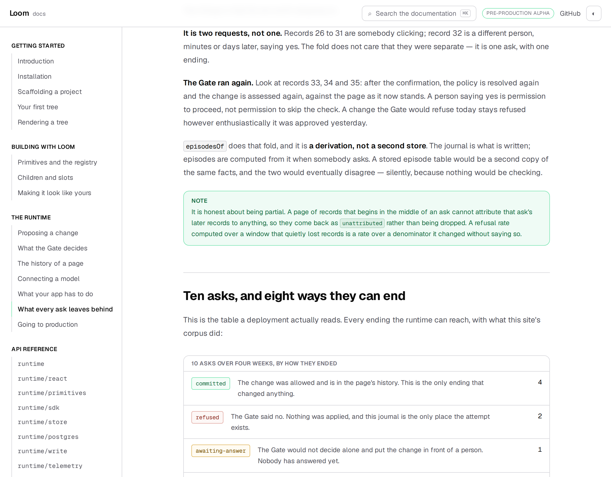
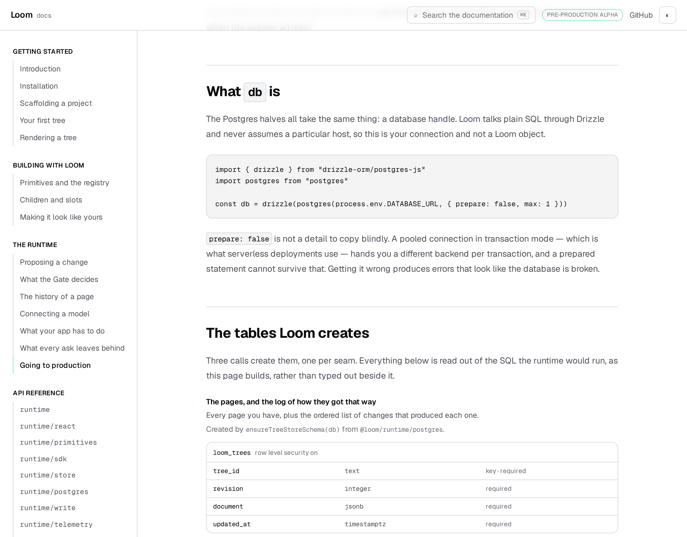
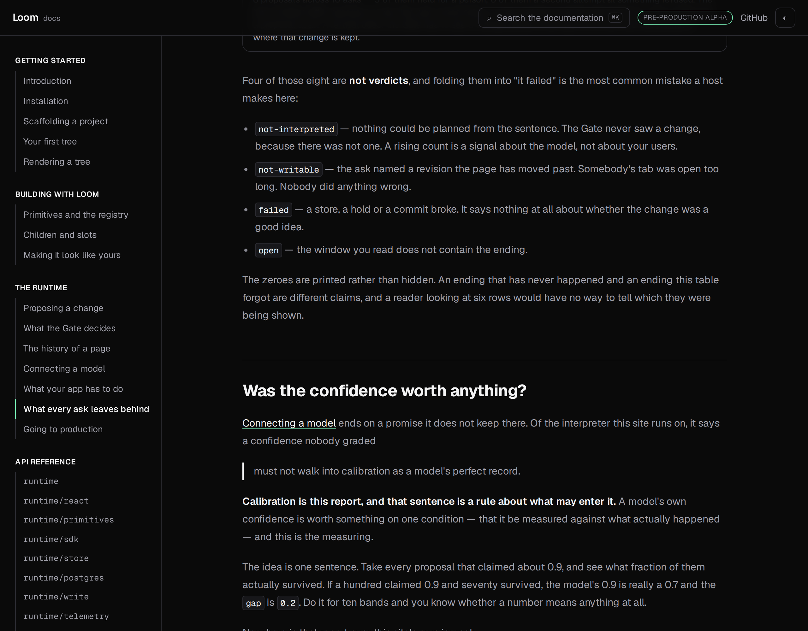

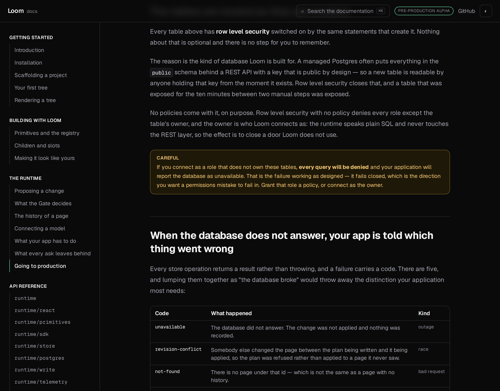

# 2 September 2026 — the two pages the backlog dropped

**Routine:** `Loom docs` · **Branch:** `docs-18-the-two-pages-the-backlog-dropped` · **Section:** §4c

Sixteen pull requests were closed unmerged on 28 August, and two of them were
mine: **#183, *what every ask leaves behind***, and **#199, *going to
production***. The instruction attached to that record is to redo the work
against current `main`.

The reason they could not be merged is the reason they are one branch now.
Neither conflicted with another lane; they conflicted with **each other**, both
having been cut from `main` and both adding a page to the same section of
`nav.ts`. Rebuilding them one at a time would recreate that conflict on purpose.

## What shipped

**Two pages, and the section now ends where a reader actually ends.**

| | |
| --- | --- |
| *What every ask leaves behind* | The record of what was **asked**, as opposed to the log of what **happened**: what a telemetry record keeps and what it deliberately throws away, the eight ways an ask can end, whether a model's confidence was worth anything, and how a journal is allowed to forget. |
| *Going to production* | The three places a deployment keeps state, the tables Loom creates for them, why memory is a real answer for exactly one shape of deployment, and what your app is told when the database does not answer. |

They sit after *What your app has to do*, in that order, so *The runtime* reads
as build it → connect it → handle the answer → see what was recorded → ship it.
The closed branches had each inserted themselves after *Connecting a model*,
which was the last page in the section when they were written; it no longer is.

Every table on both pages is generated. The endings table is folded from a real
journal of ten asks; the schema tables are read out of the SQL the runtime would
actually run against a host's database, as the page builds.

## The tests were fine. The prose was not.

This is the part worth the report.

**All 71 tests came across unchanged and all 71 passed** against a `main` with
4,035 lines of new `src/` under it. The runtime surface those pages check had
not moved. On that evidence the rebuild was a file copy.

It was not, because **three claims had gone false while the branches sat**, and
nothing in the repository could have said so:

1. *What every ask leaves behind* opened with **"the last four pages were about
   the runtime deciding things."** It is the sixth page in its section now.
2. It rested its entire calibration section on a sentence it said *Connecting a
   model* **ends by saying** — that a confidence is trusted *"on one condition:
   that it be calibrated."* That page has since been rewritten and says nothing
   of the kind.
3. Its retention rules and *Going to production*'s were written independently by
   two runs that could not see each other. Read in one order they are a
   duplicate.

None of these breaks a build, changes a render, or fails a test. A reader is the
only thing that finds them.

## So a page's claim about another page is now checked

`(docs)/_lib/cross-references.test.ts`, six tests, and the second half is the
one that earns the file.

**Every `/docs/…` address in any page must resolve.** Cheap, and catches a
rename.

**A page quoting another page must quote words that page still contains.** The
convention is a link followed by a blockquote — a citation a test can follow
rather than a paraphrase nobody can check. The calibration section is now
written that way: it links to *Connecting a model*, quotes the sentence it
actually rests on, and if that page is rewritten again **the failure lands on
the page making the claim** rather than on the reader who believed it.

Both rules were verified by mutation rather than assumed:

- shortening the quoted sentence by two words fails *are still in the page they
  say they came from*, and only that one
- misspelling one character of one link fails *point at something the site
  serves*, and only that one

The asymmetry is the argument for the file. `claims.test.ts` and `page.test.ts`
already hold each page against the **runtime**, and they are good tests. Nothing
held a page against **another page**, which is the harder half: a broken link is
at least visible to whoever clicks it, while a misquotation reads beautifully
and is simply wrong.

## Two things I changed rather than restored

**The deployment page imports its own components.** The closed branch added
`StorageSchema` and `StoreFailures` to the root `mdx-components.tsx` as globals.
Six pages on current `main` — including three written after that branch — import
their own components instead, so that is now the site's convention rather than
an open question. Following it means **this branch touches no file outside
`(docs)/`**, which is the better outcome for a lane boundary regardless.

**The event-type count reads the list the runtime now publishes.** The telemetry
page originally counted event types with `telemetryEventSchema.options.length`,
and filed the fact that it had to as a finding. That finding was **closed on
`framework-21`** while the branch sat: `TELEMETRY_EVENT_TYPES` is exported. The
restored code was still reaching into the Zod schema, so it now reads the list —
asking the schema again would have left a hole open that somebody had already
gone and filled.

## Tests

`pnpm install && pnpm verify` at the repository root. **Green.** Nothing failed,
nothing was skipped, no test was weakened, no budget was raised.

| Suite | Files | Tests |
| --- | --- | --- |
| `@loom/runtime` | 119 | 1860 passed — `src/` was not opened |
| `@loom/app` | 167 | 2574 passed |

Against `main` that is **+9 files and +77 tests**: 71 restored from the two
closed branches, and 6 new in `cross-references.test.ts`. `next build` clean
across all five route groups.

The one failure the last docs report recorded as `main`'s —
`(marketing)/_lib/facts.test.ts` — is gone, as is the lesson-9 runner failure
`FINDINGS.md` had open. `main` is green under this branch.

## Preview

**https://loom-git-docs-18-the-two-pag-69b826-jpizzolato36-6341s-projects.vercel.app**
— Vercel reports *Deployment has completed*, and it is the only check on the
pull request.

I have not opened it. `*.vercel.app` is still not on the sandbox egress
allowlist — `curl` gets `CONNECT tunnel failed, response 403`, which is the
standing finding and unchanged. **The URL and the screenshots are two different
claims** and worth keeping apart: the URL is Vercel's, reported by the bot on the
pull request; every screenshot below is `next build && next start` served
locally, which is the same build from the same commit but is not the deployment.

## Dark and 390px

`document.documentElement.scrollWidth` is exactly 390 at a 390px viewport and
1280 at 1280. The generated schema tables are the widest thing on either page
and scroll inside their own box rather than the document.

## Scope

`apps/loom/app/(docs)/` only. **No file outside the lane was opened** — not
`src/`, not the application root, not another route group. Two files added
(`cross-references.ts` and its test), sixteen restored, one page-order change in
`nav.ts`.

No primitive was needed and none is missing. Both pages are prose, generated
tables and a real `LoomTree` example; the tables are docs-site furniture in
0067's sense, generated from the repository rather than typed, which is the bar
`mdx-components.tsx` already sets for that category.

## Findings

**Filed.** *`StoreError` has five codes and no way to list them* — refiled,
because it was on #199 and #199 never reached `main`. It is the second of four
in this exact shape, and **two of the four are now closed**
(`WRITE_OUTCOME_KINDS`, `TELEMETRY_EVENT_TYPES`), which makes the remaining two
a pattern with a known fix rather than a complaint.

**Filed and closed in the same entry.** The staleness class above, so that the
next lane rebuilding closed-unmerged work reads its prose rather than trusting a
green suite.

## Open questions

**Whether *Going to production*'s retention section should shrink to a pointer.**
It now sits after the page that treats retention properly, and repeats three of
its rules in short form. I kept them and added the pointer, because a person
writing a cron job should not have to leave the page they are on — but two pages
stating the same three rules is two places to keep true, which is the argument
this site makes about everything else.

**Fenced code is still not searchable**, unchanged from the last run. Both new
pages are heavy on code blocks, so the reader who wants the page that shows
`postgresTreeStore` being wired still cannot find it by typing that.

**What I would write next.** Unchanged and now unblocked: nothing on this site
tells a reader what to do when they have shipped and something looks wrong — an
audit that disagrees with the log, a hold nobody answered, a journal that is not
shrinking. That page wanted these two on `main` first, and it links to both.
