---

# A page where there is no CSS

**Date:** 2026-09-02 · **Routine:** `Loom daily build` · **Section:** §3 ·
**Branch:** `framework-24-a-page-where-there-is-no-css`



## Before anything else: the tree, and the brief

**`main` was green when this run started.** `pnpm verify` at `d7375ef` reaches
the end: 119 test files, 1860 tests, exit 0.

**The migration the brief opens with is finished, and was finished before the
section was written.** `apps/loom` holds five route groups, `apps/portal` and
`apps/docs` do not exist, the workspace has one package. This is the third
consecutive framework run to open by establishing that, and the finding asking
for the section to be deleted is already filed for the maintainer. It is
repeated under **Needs your input** because a fresh session with no memory reads
that brief every twelve hours and is pointed at work that does not exist.

**There were no maintainer comments to address.** Every comment on every open
pull request is a routine's own report. Nothing on another lane's branch was
touched.

**Two of my own pull requests are open and unmerged** — #221 (a handle on the
control) and #223 (the fixtures a host can import). This branch is cut from
`main` and stacks on neither.

## What this run did

`Loom marketing` filed a finding on 29 August that begins with a sentence worth
quoting: the share card *"is the only file on this surface that is not a Loom
tree, and it is not for want of trying: there is no arrangement of the seam by
which a registered primitive can draw one pixel of it."*

Two accepted decisions meet there and neither is wrong. 0008 makes the renderer a
total pure projection into React. 0050 mounts the theme once, on the root, as
custom properties, so a primitive paints by *naming* a slot and never learns
which palette answered — which is what makes a re-theme one `configure` and
nothing else. Together they assume a cascade. An image renderer has none: it
takes inline styles and literal values, resolves no custom properties, and a
projection whose every colour is a `var()` comes out a blank rectangle.

**A render can now be asked for the theme's values instead of its references.**

```ts
renderLoomTree(tree, { resolver, themes, themeValues: "literals" })
```

Every `var(--loom-…)` in an inline style is replaced by what the mounted theme
says it is — the substitution a browser would have done, done before the page
leaves. The default is unchanged and a browser render is byte-identical to
yesterday's. It is on `renderRequest` too, and belongs to the request rather
than the deployment: one route serves a page and the next draws the same tree
into an image, off the same registry.

Recorded as
[0105](../decisions/0105-a-render-can-hand-back-values-instead-of-references.md).

### The mistake this run made first, because it is the interesting part

The obvious implementation is a pass over what `renderLoomTree` returns: walk the
elements, rewrite the styles. It was built, and twenty-two of its
twenty-six tests passed — every one that walked a hand-built element tree.
**Against a real tree it silently did nothing.**

A projection is a tree of *component* elements. `renderLoomTree` hands back
`<loom.page><loom.card>…`, and what a primitive paints does not exist until
something renders it. A walk over the projection sees no styles at all — not
few, none — so the pass reported nothing unresolved and changed nothing, and
every assertion that did not go through a real render agreed with it. The
failing test was the one that rendered a themed tree of registered primitives to
markup and looked for `var(`.

So the substitution happens **one node in**. In literals mode the seam stands a
substituting component in front of each node's primitive, calls it, and resolves
what it produced — stopping at the child elements, which are the next nodes'
stand-ins and resolve their own output when they are rendered. Every node pays
for itself, nothing is walked twice, and the element count is unchanged: one
stand-in *replaces* the primitive element rather than wrapping it, which matters
because a wrapper changes what `>` and `:first-child` select, and 0050 already
refused a wrapper for the theme mount for exactly that reason.

Calling a primitive rather than mounting it is sound for the reason 0008 gives —
a primitive is a pure function of the props the seam hands it and holds no
state. A primitive that broke that would already have broken rendering the same
tree twice.

### Three limits, all one shape

It resolves the values a render *produced*; it does not run the parts of CSS
that are not values.

| | |
| --- | --- |
| **The library stylesheet** | `:hover`, `:last-child`, keyframes, `::after`. No cascade-less renderer was going to evaluate them either. |
| **Inside a control** | A behaviour's control renders on the client, so its subtree does not exist yet. Its own `style` prop is resolved; what it returns is not there to walk. |
| **An unanswered property** | Left exactly as the primitive wrote it, which is what a browser does with it too. A reference with a *fallback* takes the fallback and is not reported — `--loom-mono-family` is written that way on purpose (0085). |

A render asked for values with **no theme mounted** says so on the root
(`theme-values-unmounted`) rather than quietly handing back a page of
references. Who asks is the reason: a caller wants values when whatever it is
feeding cannot resolve one, and in that medium nothing downstream would notice
they never arrived.

### Decisions nobody specified, and why they went this way

- **The mode is `"variables" | "literals"`, not a boolean.** A boolean names the
  exception; this names both states, and a caller reading the call site learns
  what the default is without opening the type.
- **A declared value is written through and not walked again.** Every variable a
  theme mounts is a literal, so there is nothing to re-resolve — and not
  re-entering is what makes a theme that somehow referred to itself a value
  rather than a hang. There is a test that says so.
- **Quotes are parsed.** A font stack is the value most likely to carry a
  parenthesis and `'Foo (Text)'` is a family somebody has shipped; reading that
  as structure would close the reference early and emit a declaration nobody
  wrote.
- **An unclosed `var(` is copied through verbatim** rather than repaired.
  Guessing where it ends invents a value.
- **Per-property diagnostics were wanted and are not reachable.** The
  substitution happens while React renders and `renderLoomTree` has returned its
  diagnostics by then. `inlineThemeVariables` hands the unanswered names back to
  a caller driving it directly, and the one case knowable synchronously — asked
  for values, no theme — is the one reported.
- **`literalThemeElement` is exported from the module and not from
  `@loom/runtime/react`.** It is how the seam wires the mode into its own walk;
  a host reaching for it has one node's primitive and no render around it. The
  two things a host would want — `substituteVariables` and
  `inlineThemeVariables` — are named one at a time in `render/index.ts` rather
  than swept in with `export *`, for the reason #223 gave this morning: a
  published entry point is API, and `export *` is how a directory becomes one
  without anybody deciding to make it one.
- **`asCallablePrimitive` moved** from `sdk/conformance.ts` to
  `render/primitive.ts`, beside the type it is about. Two things in this package
  now call a primitive rather than mounting one — the conformance probes and
  this — and both have to decline a class the same way. The probe's behaviour and
  its two distinct reasons are unchanged; `conformance.test.ts`'s 34 tests pass
  untouched.

## Tests

`pnpm verify` **green, exit 0**. The runtime package: 120 test files and 1888
tests, up from 119 and 1860 on `main`. The application: 158 files, 2497 tests.
**28 new tests**, all in `src/render/inline-variables.test.ts`, and one
regenerated file — `(docs)`' API reference, which now carries the seam's four
public names.

It did not pass first time and the failures are worth naming rather than
smoothing over:

1. **Four failed on the first run.** Two were a real defect — the fallback in
   `var(--x, red)` kept the space after the comma, so the value came out
   `" red"`. Two were the design failure above, and they are the reason the
   end-to-end assertions exist.
2. **Two failed in `pnpm verify` after the unit tests were green**, both from
   rules this repository already had and this run had to learn.
   `documentation.test.ts` refuses a decision-record number in a published
   doc-comment sentence, and a new one-line comment cited 0008 in its summary.
   `extract.test.ts` holds `(docs)`' generated API reference against what the
   generator produces now, so new exports in `src/` are a red build until it is
   regenerated — `pnpm build` first, because the generator reads the declaration
   files rather than the source.

The load-bearing assertions: a themed tree of registered primitives renders to
markup with **no `var(--loom-` anywhere**; the same tree under two palettes
produces two different pages, which is 0049's guarantee checked in a second
medium; and a primitive that names a property the theme does not declare keeps
its reference rather than losing the declaration.

## Records

- **0105 added** — *A render can hand back values instead of references*.
  Accepted. Nothing superseded; it is additive to 0008 and 0050 and contradicts
  neither.
- `pnpm decisions:index` regenerated. It notes 0103 and 0104 as holes, which is
  correct: both are claimed by my own open branches (#221, #223).

## Findings

**Closed three:**

- *a tree has one projection, and a share card needs a second* (`Loom marketing`,
  29 Aug) — option 2 taken, as recommended.
- *the Gate asks its rules in an order nothing outside the runtime can read*
  (`Loom marketing`, 28 Aug) — this was already closed by #181 and nobody had
  marked it. `ESCALATION_LADDER` has been exported since `e7c8494`, derived from
  `ESCALATION_RULES` rather than a second copy. `/the-rules` can drop its
  hand-written order whenever that lane next opens the file.
- *0002 records six ordered rules, and the Gate has had seven* (`Loom lessons`,
  27 Aug) — closed by #181 and #205: 0002 amended under 0099, and
  `record-claims.test.ts` now holds the counted sentence against the list.

One file outside `src/` changed:
`apps/loom/app/(docs)/_lib/api/reference.generated.json`, regenerated by that
lane's own `pnpm docs:api` because a new export in `src/` turns its drift test
red. It is generated output, not documentation written by hand, and nothing else
on `(docs)` was touched.

**Filed two:**

- **For `Loom marketing`** — the seam exists, here is exactly what it does and
  does not carry, and the recommendation is to retire the hand-drawn card when
  that lane next opens the file rather than as a change of its own. Nothing on
  `(marketing)` was touched.
- **Against my own lane** — `WRITE_OUTCOME_KINDS` still does not exist, six days
  after `Loom docs` asked and three days after the same addition was made three
  times in one run, with a comment in `pipeline.ts` saying it was next. It is one
  exported line and a type-level completeness check. It is not on this branch
  because it belongs to nothing this branch built, and it is the first thing on
  the next run's list.

## Open questions

- **The font is still a family name, not a face.** A card drawn through this
  seam wears the palette exactly and the typeface not at all, because a
  `FontPack` says what to *ask for* and never where the face *is* — the 29 August
  finding beside the one this closes, still open, still mine. It is the obvious
  next piece of the same problem and it is a bigger one: an optional `source`
  beside each family, and a decision about whether the runtime fetches anything.
- **Nothing consumes the mode yet.** The seam is tested against a real tree, and
  the first real consumer will be a surface. That is the right order, and it does
  mean the first person to draw a card this way will find something this run did
  not think of.
