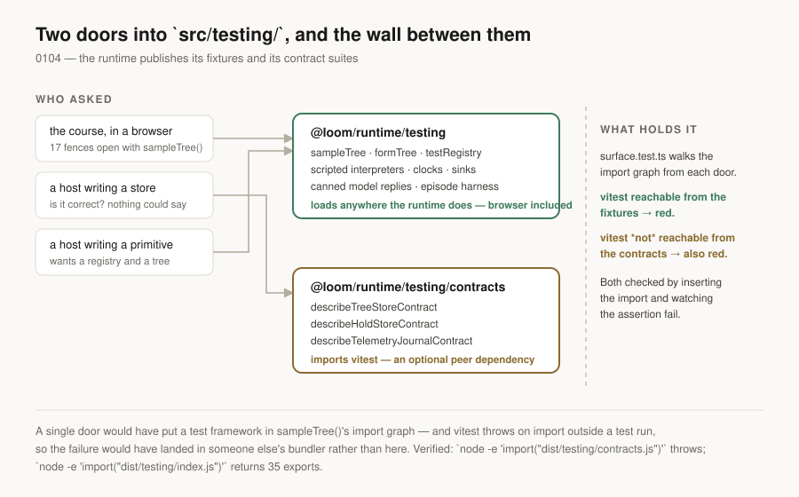

# The fixtures a host can import

**Date:** 2026-09-02 · **Routine:** `Loom daily build` · **Section:** §1, §2, §6 ·
**Branch:** `framework-23-the-fixtures-a-host-can-import`



## Before anything else: two things about the tree

**`main` was green when this run started.** The one failure the 1 September
report left open — `(lessons)/_lib/run.test.ts`, lesson 09's preamble — is gone.
`pnpm verify` on `main` reaches the end.

**The migration in the brief's headline section is finished, and was before the
section was written.** `apps/loom` holds five route groups, `apps/portal` and
`apps/docs` are retired, the workspace has one package and `vercel.json` is in
`apps/loom/`. Nothing is half-migrated. This is the second consecutive run to
open by establishing that; the ask to delete the section is repeated under
**Needs your input**, because a fresh session with no memory reading that brief
is being pointed at work that does not exist.

## What this run did

**`src/testing/` is published.** It was excluded from the build, so
`dist/testing/` did not exist and no entry point could have named it — which was
right while the only consumer was this package's own suite, and stopped being
right when three consumers outside it appeared.

`Loom lessons` filed the ask on 28 August, having built a runner that executes
every Try it section in all sixteen lessons and found it could only run at build
time. `./testing/fixtures.js` is the single most-imported specifier in the
course — seventeen fences, more than `./ids.js` and more than `./tree/delta.js`
— because `sampleTree()` is the tree every lesson reasons about. They refused to
reimplement it, and were right to: a `sampleTree` that agrees with the lesson and
disagrees with Loom is worse than no lesson.

Two entry points, not one:

| | |
| --- | --- |
| `@loom/runtime/testing` | fixtures, doubles, test primitives and definitions, canned model replies, the episode harness, the in-memory filesystem |
| `@loom/runtime/testing/contracts` | `describeTreeStoreContract`, `describeHoldStoreContract`, `describeTelemetryJournalContract`, their fixtures, and `rowSecurityOn` |

**The split is the whole design decision, and it is forced.** The contract suites
*are* `describe` blocks — that is what makes them runnable against a host's own
store rather than a description of one to write — so they import `vitest`, and
`vitest` throws on import outside a test run. Measured rather than assumed:

```
$ node --input-type=module -e 'import("./dist/testing/contracts.js")'
    at createExpect (…/vitest/dist/chunks/vi.bdSIJ99Y.js:426:16)

$ node --input-type=module -e 'import("./dist/testing/index.js")'
fixtures ok function 35
```

One entry point would have put that in `sampleTree()`'s import graph and the
failure would have surfaced in somebody else's bundler. `vitest` is now an
**optional** peer dependency: required of anyone importing the contracts, absent
and unmissed for everyone else.

**Each entry point names its exports one module at a time** rather than
re-exporting the directory. A published entry point is API, and `export *` is how
a scaffolding directory becomes API without anybody deciding to make it one. A
module added to `src/testing/` is internal until a line in `index.ts` or
`contracts.ts` says otherwise.

### What holds it

`src/testing/surface.test.ts` walks the import graph from each entry point and
fails three ways: `vitest` reachable from the fixtures; `vitest` **not** reachable
from the contracts; a bare specifier the fixtures reach that the manifest does
not declare. The second exists because the first would pass just as happily
against an empty set if the graph walker broke.

Both were verified by breaking them — an `import { expect } from "vitest"` added
to `fixtures.ts` turns the first assertion red, and it was removed again.

The graph walker itself took two attempts, and the first attempt is worth one
sentence because it is a trap anybody writing this would fall into: a single
`import[\s\S]*?from "…"` pattern will start at an `import` and end at a `from
"…"` **inside a string literal three functions down**. It reported two sentences
of a render diagnostic's prose as dependencies of the fixtures. The version that
shipped uses three bounded patterns instead, none of which can cross a statement.

`dist.smoke.test.ts` loads `dist/testing/index.js` under plain Node the way a
consumer would. It cannot do that for the contracts, for the reason above, so it
checks that entry point's emitted module graph resolves on disk instead — which
is the failure that suite was actually written for.

## The second half: three records citing numbers that had stopped being true

Not planned, and found by a check written for a different reason.

A cross-reference between decision records is written twice — once as the number
a reader sees, once as the file a click opens — and a rename moves only the
second. Four links across three records had drifted:

| record | said | opened | actually |
| --- | --- | --- | --- |
| 0002, 0007 | `[0096]` | `0099-a-record-is-amended-…` | right file; `0096` is the number that record held **before** #217 renumbered it |
| 0057 | `[0005]` | `0005-interpretation-is-the-only-non-deterministic-step.md` | no such file — 0005 is *Model access is a narrow seam with an optional adapter* |
| 0087 | `[0010]`, twice | `0010-conformance-is-probed-not-proven.md` | no such file, and 0010 is *Edit mode decorates*. The record the paragraph is reasoning from is **0012**, *Conformance is probed and reported, never enforced by registration* |

Nothing could have caught these. `checkNumbering` reads a record's **status**
line, which is where a supersession is declared; these are citations in prose.
Two of the four resolved to a real file under a wrong number, so a reader
following them landed somewhere plausible.

`tools/decisions/decisions.test.ts` now reads every record and fails when a
link's label disagrees with its target, or when the target is not a record. It is
the counterpart to [0097](../decisions/0097-a-hole-in-the-numbering-is-reported-and-a-clash-is-fatal.md)
aimed at prose: **0097 makes a clash fatal, this makes a stale citation fatal.**
Verified by re-introducing one and watching it fail by name.

**No argument in any of the three records changed.** 0087's `0010` became `0012`
in a link and in the sentence beside it, because both name the reasoning that
paragraph is already using — the sentence around the link reads *"Nothing is
refused at registration"*, which is 0012's decision word for word.

## Files opened outside this lane

| file | owner | why |
| --- | --- | --- |
| `(docs)/_lib/entry-points.ts` | `Loom docs` | two rows, one line of summary each. `entry-points.test.ts` reads the runtime's `exports` off disk and fails on any difference in either direction — by design — so publishing a door without describing it takes the docs site red |
| `(docs)/_lib/api/reference.generated.json` | `Loom docs` | regenerated with `pnpm --filter @loom/app docs:api`, which is what its own failure message instructs. 476 lines, all of them the two new entry points |
| `decisions/0057`, `decisions/0087` | whoever wrote them | four broken citations, above. No argument altered |

I wrote no prose on any docs page. The summaries in `entry-points.ts` are two
sentences in a data table that the docs site's own test requires to exist; if
`Loom docs` wants different words, they are one edit and no test stands in the
way.

## Tests

`pnpm verify` — **exit 0.**

| suite | before | after |
| --- | --- | --- |
| `@loom/runtime` | 1860 / 119 files | **1866 / 120 files** |
| `@loom/app` | 2497 / 158 files | **2497 / 158 files** |
| `pnpm decisions:index` | clean | clean, with `0103` reported as a hole |
| `next build` | passes | passes |

Six new runtime tests: four in `surface.test.ts`, one in `dist.smoke.test.ts`,
one in `decisions.test.ts`. The app count is unchanged because the four `(docs)`
tests that went red on the new entry points are the same four, now green against
a regenerated reference.

Nothing was weakened, skipped or disabled. `0103` is a reported hole rather than
a clash because this run took `0104` deliberately — `0103` is claimed by #221,
which is open and unmerged, and 0097's rule is that a hole is stated and a clash
is fatal. Taking the free number over the contested one is the trade that record
exists to make.

## Records

**One added: [0104](../decisions/0104-the-runtime-publishes-its-fixtures-and-its-contract-suites.md)**
— the runtime publishes its fixtures and its contract suites. None superseded,
none amended.

## Findings

**Four closed**, all owned by this lane:

- *the course can run its own exercises, but not in the reader's browser* — by
  this branch. Two of its three facts are gone; the third (`zod` in
  `apps/loom`'s dependencies) is not needed to import the fixtures and is
  `Loom lessons`' own file when a fence needs it.
- *the Gate asks its rules in an order nothing outside the runtime can read* — by
  #181, never marked. `ESCALATION_LADDER` is derived from the rules rather than
  declared beside them, and reaches `@loom/runtime`. `(marketing)`'s
  `the-rules.ts` can now derive its order and delete its hand-written list.
- *`WriteOutcome` has seven kinds and no list of them* — by #181, never marked.
- *0002 records six ordered rules* — by #181, never marked. The remedy taken was
  the one that ends the class: `record-claims.test.ts` holds counted sentences in
  `decisions/` against the lists they count.

**One filed and closed:** the four stale citations above, with the mechanism, so
the three lanes whose records were opened know why.

## Open questions

1. **Delete the migration section from the framework brief.** Second run in a
   row reporting this. Nothing is broken; the cost is that a fresh session's
   opening minutes go to establishing that its headline task was finished on 19
   August, and the risk is that one of them tries to "finish" it.
2. **Should `@loom/runtime/testing` be documented, or only listed?** It is in the
   docs site's door table now and the generated reference describes its 35
   exports. Whether it earns a written page is `Loom docs`' call and I have not
   made it for them.
3. **`(marketing)/_lib/pages/the-rules.ts` can stop hand-writing the escalation
   order.** Named here because the finding that asked for the seam is closed, and
   the lane that filed it may not re-read a closed entry.

## Scope

`src/testing/` (three new files), `tsconfig.build.json`, root `package.json`,
`src/dist.smoke.test.ts`, `tools/decisions/decisions.test.ts`, four records,
`decisions/README.md`, the two `(docs)` files named above, `FINDINGS.md` and this
report. No primitive was added or restyled. No surface content was written.

Nothing was scheduled and no self-check-in was armed.
