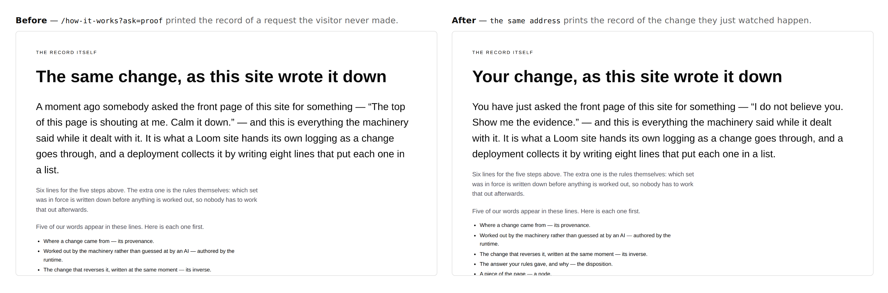
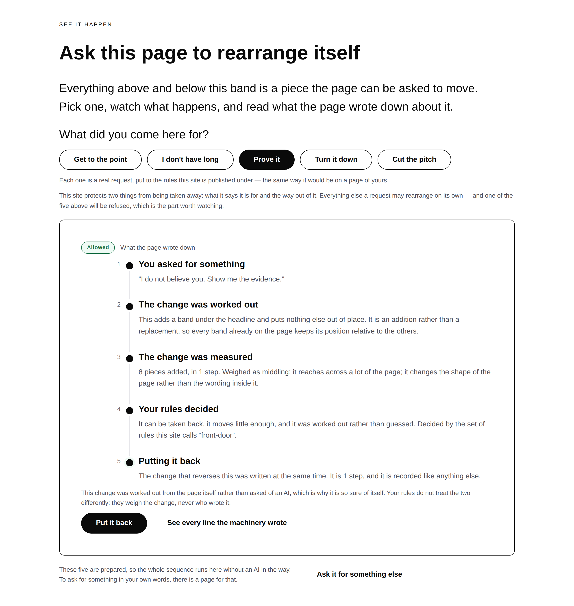
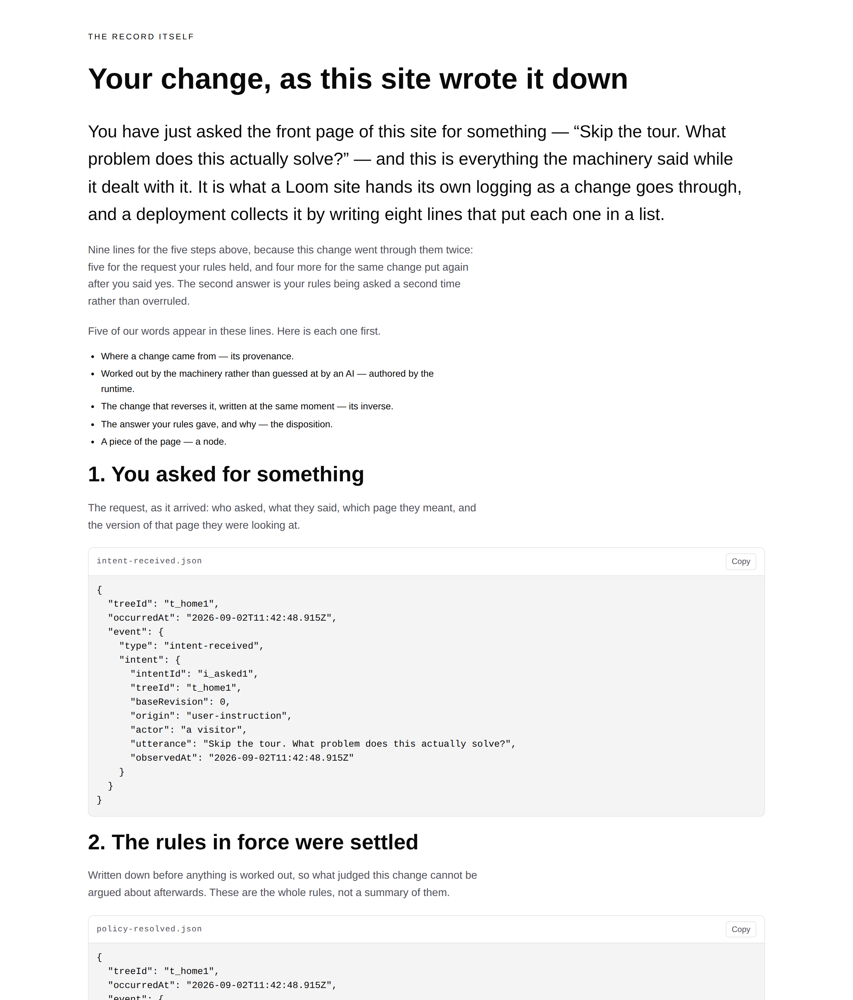
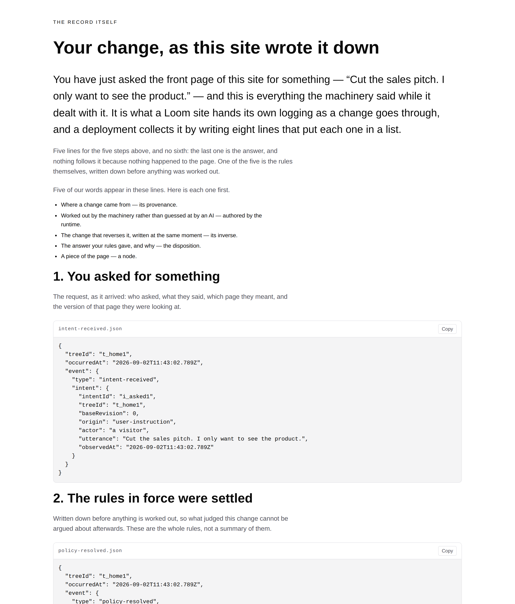
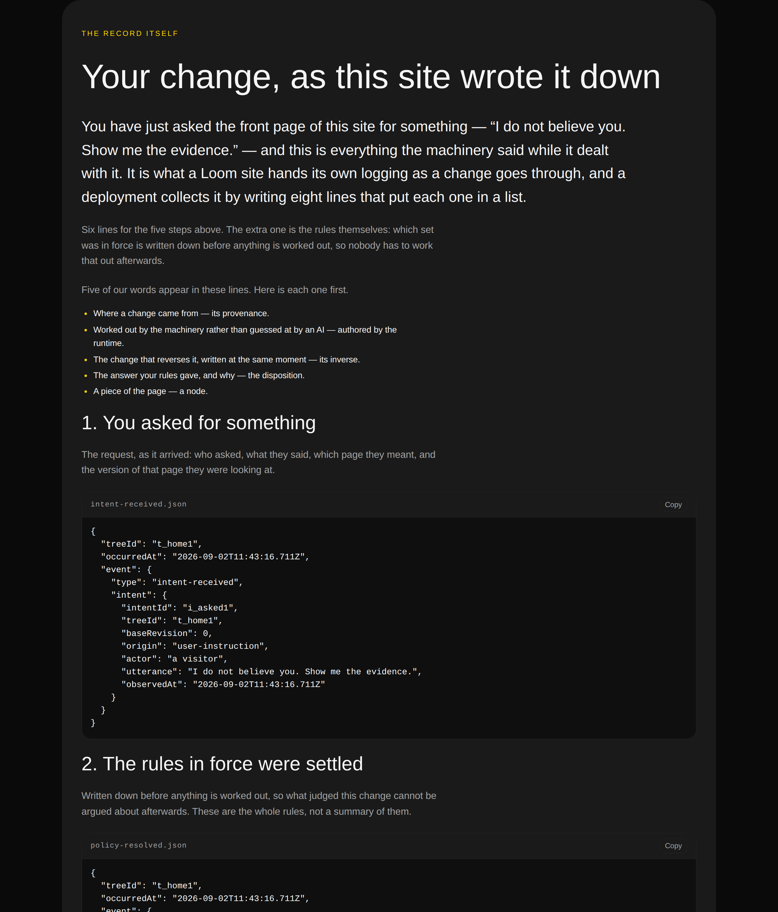
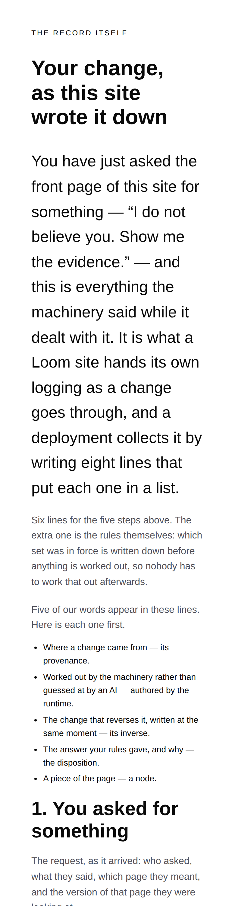

# 2026-09-02 — marketing: the record of the change you actually made

The front door has let a visitor rearrange it since 22 August. The mechanism
page has printed the raw lines the machinery wrote since it was built. Both were
true, and nobody had checked what happens when somebody uses the first and then
follows a link to the second — because until this run there was no such link.

**They would have been shown the record of a different request.**

A visitor who asks the front door *"I do not believe you. Show me the evidence."*
watches a band appear and reads five plain steps about it. One level down,
`/how-it-works` prints every line a listener was handed for a request — and that
request was always *"The top of this page is shouting at me. Calm it down."*,
chosen when the page was written, whoever had arrived and whatever they had just
done.

The two claims a stranger has to believe are that **the record is real** and that
**it is of the thing that just happened to them.** The first is checked six ways
in `paper-trail.test.ts`. The second was quietly false at the one moment it could
be checked.

This is #198 rebuilt against current `main`, per the 28 August entry: the branch
`marketing-16-the-record-of-your-ask` was closed unmerged with the other fifteen.
Nothing has been revived — the branch was read for what it was trying to do, and
three things it got wrong are fixed below.

---

## What shipped

**`/how-it-works` reads an ask off its address, and the front door's panel hands
it one.**

One new control beside *Put it back*: **See every line the machinery wrote**. It
points at `/how-it-works?ask=<theirs>`, carrying the approval when there was one,
and that page runs *that* request against the published front door and prints
what came out.

Nothing about the record's construction changed. It is still a real run through
the whole sequence with an ordinary listener attached, still `JSON.stringify` of
the envelopes in the order they were handed over, still not a fixture. The only
thing that moved is **which request** it is a record of.

### Four things had been welded to one choice

The page could only ever print `calmer`, so four things were written as though
that were a fact about the world rather than about a default:

| Was | Is |
| --- | --- |
| `paperTrailFor` **threw** if the run did not land | it reaches a verdict, and says whether anything followed |
| *"A moment ago somebody asked"* | *"You have just asked"*, when they did |
| stage 1: *"Somebody asked for something"* | *"You asked for something"*, when they did — the front door's own words for that line |
| *"The same change, as this site wrote it down"* | *"Your change"*, when it is |

The first is the substantive one. Three of the five choices land on their own,
**one is held for the visitor to decide, and one is refused outright** — so a
function that treated a run without a `change-applied` line as a fault could only
ever be handed a third of the states its own page demonstrates. The guard is now
on the run reaching an *answer*, which every request the rules see does.

### Three things #198 got wrong, found by rebuilding rather than reviving

**1. The refusal band was counting the wrong run.** The band below the record
says three numbers — how many kinds of line match, which one is the answer, which
one is missing — and every one of them is a position in the **refused** run. All
three were read off `trail.lines`, the run printed *above* the band. That gave
the right three numbers for exactly as long as the page above could only ever be
six lines long, and would have made every one of them one too small the first
time a visitor arrived having asked for a change the rules held. Two individually
correct things that had never been read next to each other, which is this lane's
recorded failure three runs running. `refusedLines` is now on the trail and the
band counts that.

The band's sentence also claimed the first four lines *"read exactly as they do
above"*. That was true when the run above was fixed; it is false the moment it is
the visitor's. It reads *the same four kinds of line* now — the request, the
rules, the list, the measurement — which is the claim actually worth making: a
refused change is measured and weighed exactly as thoroughly as an allowed one
before the answer differs.

**2. A visitor's address could take the page down.** #198's guard threw when a
run reached no answer, on a value that arrives in a query string. `runFor` now
returns nothing rather than throwing, and the caller decides: the visitor's
request falls back to the default, and the site's own two runs — the default and
the refusal — keep the error that has always been right. `PaperTrail.ask` names
whichever request was actually printed, and *"You have just asked"* is the trail
agreeing with the address rather than the address alone, so a fallback cannot
leave the page naming a request it is not showing.

**3. The approved run is nine lines, not six.**

This is the one the rebuild found that nothing on either branch had looked at. A
change the rules hold and the visitor then allows is put to the rules a **second**
time, and `confirmChange` narrates the whole second pass — so the record is
**five lines, then four more**. #198's sentence had two branches, six and five,
and would have called this six.

It is now three, and the third is the best thing on the page: *"Nine lines for
the five steps above, because this change went through them twice: five for the
request your rules held, and four more for the same change put again after you
said yes. The second answer is your rules being asked a second time rather than
overruled."* Every number in it is counted. A person approving is not the rules
being skipped, and this is the only place on the site that can show it.

### The refusal, asked for on purpose

The most interesting address on this site is now
`/how-it-works?ask=drop-pitch` — the one change the rules will not allow, with
its whole record printed. Five lines and no sixth.

The contrast band below it, *"And when the answer is no"*, is **gone in that one
state**. It exists to print a refusal beside an answer that was not one; when the
visitor asked for the refused change themselves it would print the same answer
twice, captioned as though it were a different one. That is a page losing track
of what it just said, and only a reader who followed the link would ever see it.

## What did not change

**The page a stranger arrives at.** `/how-it-works` with nothing in its address
is the page it has been since it was written. That matters more than it sounds:
it is the page every crawler and every share preview gets, and it has a test of
its own for exactly that reason.

**The three other links to it.** The hero's call to action, the menu item and the
closing band all point at `/how-it-works` bare. A header item carrying somebody's
request would put the record of a change nobody made on every page of the site.

**`src/` was not opened.** No other route group was touched. No primitive was
added — the control is `loom.action` with `variant: "quiet"`, which the band two
lines below it already uses. Nothing outside `apps/loom/app/(marketing)/` changed
except `FINDINGS.md` and this report.

## Tests

`pnpm install && pnpm verify` — **green, exit 0. Nothing failed, nothing skipped,
no test weakened.**

| suite | before | after |
| --- | --- | --- |
| `@loom/runtime` | 1860 / 119 files | **1860 / 119 files** — `src/` was not opened |
| `@loom/app` | 2497 / 158 files | **2530 / 159 files** |
| marketing, within it | 827 | **860** |

Thirty-three new tests in one new file, `_lib/pages/the-record-of-your-ask.test.ts`.
The two marketing figures and both *after* figures are measured. The `@loom/app`
*before* is subtraction — 2530 less this run's 33 — because no other suite was
opened; only the marketing one was run against `main` directly.

**Two existing assertions in `journey.test.ts` were re-pointed, not weakened.**
They match the refusal band's heading against its own sentence, and its three
positions against each other. Both still do exactly that; the sentences they
match are the reworded ones. The count they compare is now the refused run's,
which is what they were always meant to be reading.

Everything new is asserted against **built and rendered pages**, never against
`paperTrailFor`. A test that read the trail and compared it with itself would
pass however the page was written, and passing however the page was written is
what let the old arrangement stand for eight runs.

**Five assertions verified by mutation**, because a test that has never failed is
a claim rather than a check:

| mutation | result |
| --- | --- |
| `trailFor` ignores the address again (the defect, restored) | **13 failed**, 20 passed |
| refusal band counts `trail.lines` instead of the refused run | **1 failed** — that band's test alone |
| the page never addresses the reader (`theirs` always false) | **2 failed** — both voice tests, and only those |
| the contrast band is printed beside the refusal itself | **1 failed** — the duplicate-answer test alone |
| the panel's link drops the visitor's approval | **1 failed** — the approval test alone |

The length assertion is deliberately wider than any one answer: for every choice
it requires **every** English count from *four* to *ten* absent except the one the
run actually is, because a page that stated both a right and a wrong length would
satisfy a test that only looked for the right one.

## Under both palettes, and on a phone

No hard-coded colour; the band is the same tree wearing a different registered
triple. `scrollWidth` is exactly 1280 at 1280 and exactly 390 at 390, measured on
every address photographed above.

## Decisions and findings

**No record written.** The change is compositional, adds nothing to the library,
constrains nothing outside this lane, and touches no Accepted record.

**Three filed.** One is a defect this run found in its own predecessor and is
recorded for how it survived; one is the approved run's length, which nobody had
looked at; one is the font host, restated with a measurement rather than a new
argument.

**One closed.** The 28 August backlog entry, for this lane's share of it — #198
is the only marketing branch on that list.

## Open questions

- **Positioning, audience and the licence line** (#96, restated on #134 through
  #213). Still the site's one placeholder and still the Phase 2 gate. Untouched.
- **The eight-item menu** (#166, #182). Untouched. This run added no page and no
  menu item, which is the second run running that the flagged problem is a reason
  to go deeper rather than wider.
- **`fonts.googleapis.com` is not on the egress allowlist**, so every screenshot
  above is in the fallback face rather than Geist. It changes no assertion — but
  you judge this surface by eye, and you have been judging it in a font it does
  not ship in. Two static font hosts; neither can receive a credential.

Nothing scheduled and nothing armed.
