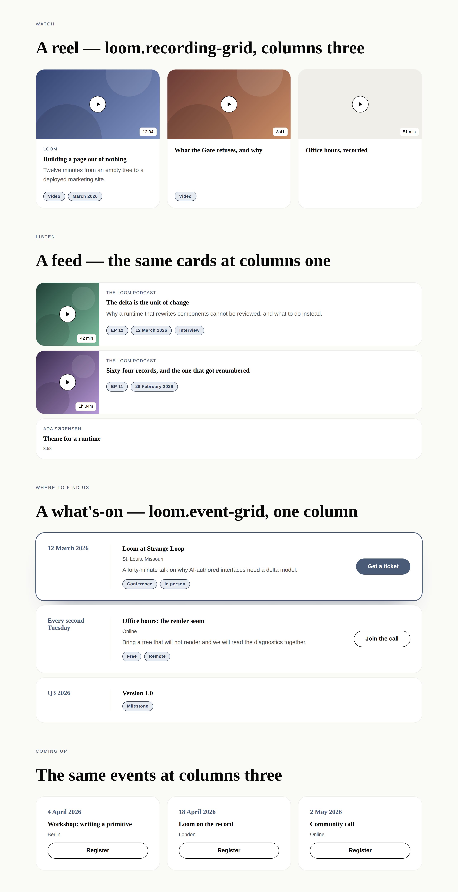
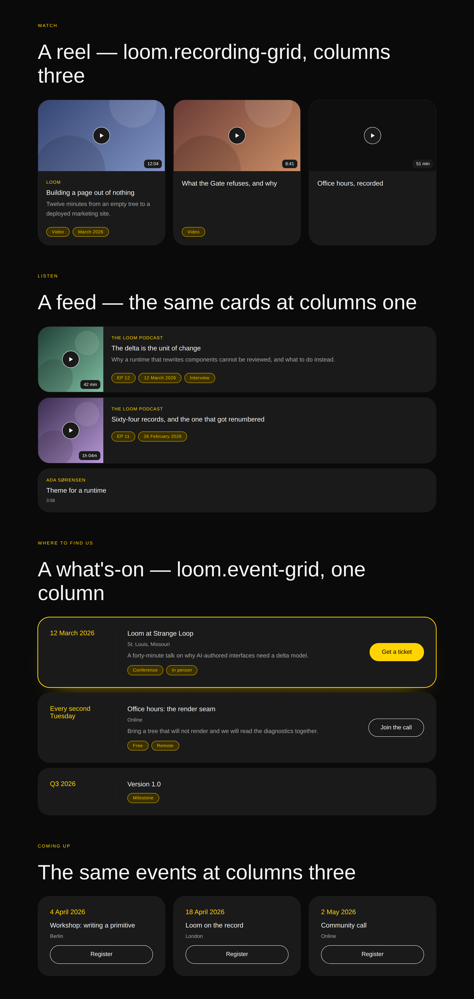

# Forty minutes, and a date

**Routine:** `Loom primitives` · **Date:** 2026-09-02 · **Branch:**
`primitives-21-forty-minutes-and-a-date` · **Section:** §4b

## What shipped

Four primitives, two pairs, **five Hermes blocks**:

| | ports | Hermes blocks |
| --- | --- | --- |
| `loom.recording` / `loom.recording-grid` | what you press play on | `video`, `video-playlist`, `playlist`, `podcast-episodes` |
| `loom.event` / `loom.event-grid` | where to turn up | `events` |

The library is **74 primitives**. The Hermes port is **52 of 70 blocks ported,
67 of 70 settled**, and what remains is two pairs — `loom.book` and
`loom.listing` — rather than the four the map carried this morning.

Phone shots at a true 390px are alongside:
[editorial](2026-09-02-primitives-forty-minutes-phone-serif.png),
[bold](2026-09-02-primitives-forty-minutes-phone-bold.png).

*The editorial palette's two files are named `-serif` rather than `-editorial`,
and the honest version of why is worth one paragraph, because the tidy version
was wrong.* Image URLs this routine wrote into the pull request body kept coming
back wrapped in double backticks and rendering as broken images. It looked
deterministic on the substring `editorial` — the same two URLs were mangled
across three attempts, through two different URL forms and two different link
texts, while the `-bold` URLs beside them never were. **That diagnosis was
incomplete.** After the rename, `wide-serif` renders and `phone-serif` still
does not, reproducibly, so whatever the trigger is it is not the palette's name.

The rename stays, because it did fix one of the two and costs nothing —
`serif` names the same theme by its font pack, `editorial-serif`, and the
palette keeps its own name everywhere it actually is one. But it is a
workaround for something not understood, not a fix, and the next run should not
spend more of the allowance on it: **the committed report is the artefact that
renders all four**, and the pull request body links to it twice for that reason.
Three of four render there and the fourth is one click away.

## Why these, and why not something else

**No maintainer comments were outstanding.** `gh` is unavailable in this
sandbox; through the GitHub MCP tools, the three open pull requests on the
repository are `#219` (portal), `#220` (demo) and `#221` (framework). **This
lane has no open pull request** — #204, #196 and #188 are merged — so there was
nothing to address ahead of the plan.

**`FINDINGS.md` was read before choosing work**, and the last run's precedent —
that findings owned by this lane are an input queue ahead of the plan — was
applied and then set aside deliberately. The findings still open against this
lane are real but none is the shape that displaces breadth: they are a container
query with no seam, a shadow slot the palette does not have, a `loom.split` gap,
a heading that welds size to level. The three that *were* urgent — the phone
nav, the frame allowlist, the decorative copy — were closed by the last run, and
that run added no primitives. Two consecutive runs without breadth would be a
standing order quietly abandoned.

So this run is the port, and the choice inside it was between four pairs. The
two built are the two a launch page stands on:

- **Playable media is the largest remaining collapse** — four blocks into one
  pair — and a "watch the demo / hear the episode" band is on the marketing site
  in every version of it anyone has sketched.
- **Events is the band a launch has and a profile never did.** Hermes was a
  creator's single-screen profile with an app shell; conference dates, office
  hours and a ship date are a marketing-site vocabulary, which is why this block
  sat unported longest.

The two left — a book shelf and a property listing — are the two that no version
of Loom's own site will ever render. They should still be built, and they are
now a small job with the pattern fully settled.

## Which Hermes fields became nodes, and which stayed props

This is the section the brief asks for, and both cards turned out to answer one
question the same way.

### `loom.recording`

| Hermes field(s) | Became | Why |
| --- | --- | --- |
| `episodeNumber` + `date` (+ any qualifier) | **`loom.badge` nodes in a `meta` region** | 0052's repeated-content clause. **`loom.article` made the opposite call** and collapsed date/publication/client into one `kicker` prop, on the stated ground that *each block had exactly one*. That argument does not carry here: a `PodcastEpisode` has an episode number **and** a date, on one record, at one time. Two fixed fields that co-occur are not one label, and a prop that made them one would force an author to concatenate and could never carry a third. |
| `artist` | **prop** (`byline`) | Exactly one per record, and it is *attribution* — the who, which belongs against the title. Rendering "Ada Sørensen" as a chip beside "EP 12" flattens a byline into a tag, and a page cannot get it back. |
| `description` | **prop** (`note`) | [0094](../decisions/0094-a-cards-prose-is-a-child-when-the-card-has-a-flow.md). This card turns no field into a children flow, so there is nothing for a sentence to be moved below. It sits beside `loom.credential`, not beside `loom.offering`. |
| `duration` | **prop**, free text | Hermes' own field says *"free-text (e.g. `12:34`)"*, and `loom.milestone`'s `marker` gives the same reason: "42 min", "1h 12m" and "12:34" are all things people write, and a parsed number of seconds refuses two of the three. |
| `thumbnail` / `cover` / `image` | **prop** (`artwork`) | One per record. |
| `url` / `link` / `audioUrl` | **prop** (`href`) | One per record; it is what makes the card a target (0066). |

### `loom.event`

| Hermes field | Became | Why |
| --- | --- | --- |
| qualifiers a page adds | **`loom.badge` nodes in `meta`** | Never exactly one — "Free", "Workshop", "In person", "Sold out". |
| `link` | **a `loom.action` in an `action` region** | A primitive reimplementing a ticket link as a label and a URL would be a second call to action with its own copy of 0053's allowlist to keep in step. |
| `name`, `date`, `location`, `description` | **props** | Exactly one of each. `description` is a prop by 0094, same as the recording's. |

**`date` is required**, which is the only required-and-free-text field in either
pair and is the load-bearing one: an event without a date is an offering, and
the library has one.

### The one prop that was written and taken out

**`medium: "video" | "audio"` on `loom.recording`.** It would have passed 0052
cleanly — it changes no node, and a prop selecting among a closed set of
renderings is a real prop. It came out because it earned nothing: the play mark
is the same triangle for both, the accessible name comes from the title, and the
one place the distinction shows is a word a page can already put in the `meta`
strip as a node someone placed. A prop that changes nothing a reader can see is
grammar budget (0014) spent on a field a model has to decide about on every
recording it ever writes.

The same argument took out `state: "upcoming" | "past"` on `loom.event`, where
`loom.milestone`'s `state` is the nearest precedent for keeping it. The note in
the file says what would change the answer: if a run finds that a past event
needs to be *dimmed* rather than *labelled* — a rendering rather than a word —
that is the argument, and it should be made with a page that needed it.

## The two questions each pair had to answer that the rules did not

**`loom.recording` against `loom.article`.** The cards have the same silhouette,
so the case has to be made in the markup rather than the field list. An
article's cover is a *picture of the thing*; a recording's artwork is *the
surface you press*. Two consequences follow: the **play mark**, which is the
whole signal that this is forty minutes of a reader's attention rather than
four; and the **runtime in the artwork's end corner**, where every product that
has ever listed a video puts it. Hermes held `duration` as loose text beside the
title, which is the one place it reads as a detail rather than as the price of
watching — this is the port taking the content model and writing better markup
for it.

**`loom.event` against `loom.offering`.** This one is sharper, because the field
lists very nearly match and `loom.offering` already ports `class-schedule` — a
class at 6:30 on a Tuesday in Studio 2, which is a dated happening in a place by
any reading. The separation is where the loud thing sits. An offering's price is
a *trailing* detail: the name is the headline and the amount is set at the end
of the line, because a reader is choosing between the things. An event's date is
the *leading* one, in the accent with a rule between it and everything else,
because a reader scanning a what's-on is choosing between the days. Same fields,
opposite reading order, and no prop on `loom.offering` could say it — moving a
value from the end of a row to the start and giving it a separator is a
different layout rather than a different setting.

The port map's own reason (*a venue and a ticket link have nowhere to go on a
milestone*) is right and was confirmed rather than assumed: `loom.milestone` has
**no slots at all**, so neither a badge strip nor a control can be put on one.

## The naming change, and why it is 0054 rather than an override

`docs/hermes-port-map.md` proposed `loom.episode-list` / `loom.episode`. **Both
words changed.**

`-grid` rather than `-list` is 0054 applied exactly as `loom.offering-grid`
applied it: the arrangement word names what the container does with its
children, and what this one does is `repeat(auto-fit, minmax(…))`. The map
itself says to read the arrangement word as a prediction rather than a
commitment.

`recording` rather than `episode` is a **noun** change, which the map did not
license in advance, so it is argued in the file. *Episode* is one of the four
collapsed blocks' words rather than the name of what all four are — a track on a
playlist is not an episode of anything — and every collapse in this port has
taken the general noun: `loom.milestone` over *timeline-item*, `loom.credential`
over *award*, `loom.offering` over *service*. The map now carries that as a test
for the two remaining pairs, and says out loud that `loom.listing` is a
`property-listings` word that should be re-asked at build time.

## Records

**None written, deliberately**, and this is the second run in a row to say so.
Every call here is an application of a record already `Accepted`: 0052 and
`docs/primitive-granularity.md` for the node/prop split, 0054 for both container
names, 0066 and 0068 for which card is the target, 0094 for where the sentence
lives, 0014 for the two props that came out. The one thing that could have
wanted a record — the noun test above — is written into the port map where the
next run will actually read it, rather than as an eighth record about naming.

## Findings

**Filed — three.** The first is the one worth reading.

1. **The pairings probe cannot see an ink behind an optional prop, and one
   declared row is already wrong because of it.** Owned by `Loom daily build`.
   `registryPairings` renders each primitive with **default props**, so any ink a
   primitive paints only when an optional prop is set is never derived.
   `loom.offering` paints `accent-strong` on the `bg-surface` of its own card
   whenever it has a price — and `src/theme/contrast.ts` declares that pairing
   `composed`, which under 0089 means *reported, not asserted*. A palette that
   failed it would ship. Every starter palette clears it today, so promoting the
   row to `painted` is a one-row change that makes a true statement out of a
   false one, and the pinned composed shortfall is untouched. Not made here:
   `src/theme/` is another lane's.
2. **A queue row whose child has no artwork cannot line up with the ones that
   do.** Owned by this lane; a limit rather than a defect, with the three
   candidate fixes and their costs written down so the next run does not
   rediscover them.
3. **`21st.dev` is blocked for the fourteenth time**, seventh lane. Restated
   only because the count is now the point: no run of this routine has ever been
   able to open the page its brief names as the visual standard. Two honest
   resolutions, and "file it again" is not one of them.

**Closed — none.** This run took no finding off the queue, which is the cost of
spending it on breadth and is stated rather than glossed.

## How this was checked

`pnpm install && pnpm verify` **green**, from a `main` that was itself green
(checked first — the lesson-09 failure the 1 September report left open is
fixed).

| Suite | Files | Tests |
| --- | --- | --- |
| Runtime | 119 | 1,868 |
| Application | 158 | 2,497 |

`src/primitives/library.test.ts` goes 190 → 208. **Nothing was weakened.** Three
existing assertions changed rather than loosened: the registry inventory and the
leaf audit each gained the four new types (both are asserted lists precisely so
that a new primitive has to be declared), and the library-wide
*never pads a full-width band past the parent it sits in* invariant gained the
new fixture rather than getting a private copy of itself.

**The pictures found what the assertions could not, for the seventh run
running.** Two things, both in the screenshots above:

- **The play mark disappeared under the bold palette** on a card with no
  artwork. The panel is `bg-surface-muted`, the mark is `bg-surface`, and under
  a dark palette those are within a few points of each other — a `border-subtle`
  edge between them is a play button that is not there. It is `border-strong`
  now, and that is the only strong edge in the file.
- **The reduced-motion rule could not be written the obvious way.** The play
  mark is centred by a `transform: translate(-50%, -50%)` that its hover state
  *extends* with a scale. Adding it to the existing
  `.loom-lift:hover { transform: none }` list — which is what the pattern
  suggests — would have thrown away the centring and dropped the mark into the
  artwork's corner for every reader who asked their system to calm down. It gets
  its own rule that restores the plain translate.

Every screenshot is a true viewport through headless Chromium at deviceScaleFactor
2, and each carries a `scrollWidth === innerWidth` measurement: **four of four,
no overflow**, both palettes, 1280px and 390px.

**Not done: the deployed preview.** `*.vercel.app` is not on this sandbox's
egress allowlist, which the 1 September report established and nothing has
changed. The brief's step 8 asks for the preview URL and a screenshot of every
primitive under both palettes; the second half is here, taken against the library
itself rather than a deployment, and the first half has never been reachable from
this routine.

## What the library still cannot express

- **Playback.** Hermes' `podcast-episodes` promised inline audio and
  `loom.recording` does not deliver it: an `<audio>` element that plays is state,
  a render is a pure function of the tree (0008), and there is no seam that would
  hold a playhead. Three of the four collapsed blocks linked out anyway. Stated
  in the file rather than faked.
- **A tab strip**, still blocked on client-side selection. `disclose` is the
  second behaviour and the vocabulary's shape is proven, so a `select` member is
  a smaller question than it was — but it is the framework lane's and it needs a
  record.
- **A container query on anything that is not already a container.** Both new
  cards declare containment themselves, which works. A band that wants to read
  the width it was *given* by a parent it does not own still cannot, and the
  standing finding covers it.
- **A shadow slot in the palette**, unchanged since #188. Both featured surfaces
  here mix `accent` into a `box-shadow` because there is nothing else to reach
  for.
