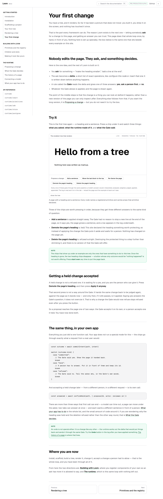
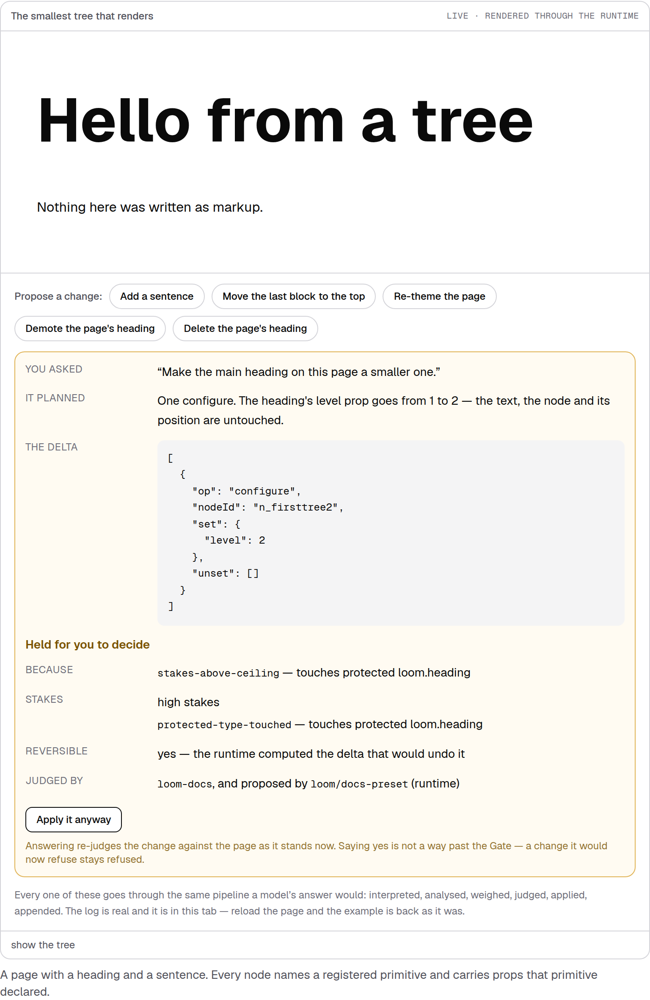
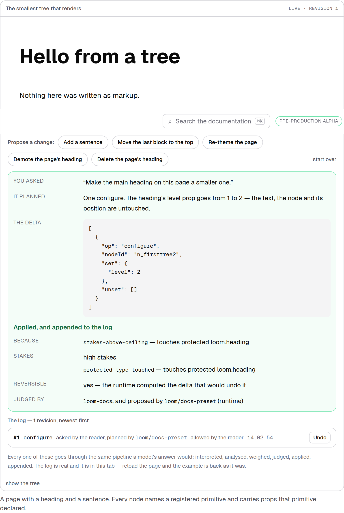

# 3 September 2026 — your first change

**Routine:** `Loom docs` · **Branch:** `docs-19-your-first-change` · **Section:** §4c (Getting started)

Getting started taught a reader to **build** a tree and to **render** one, and
then stopped. It never taught them to **change** one — which is the only thing
Loom does that another framework does not. A stranger who followed the beginner
track to its last page had installed the package, scaffolded a registry, built a
tree and drawn it on the screen, and had never once watched the runtime accept,
hold or refuse a change. The whole loop — the thing the exit condition is written
around — lived only in the five conceptual pages of *The runtime*, which a
beginner reaches by leaving Getting started.

This adds the page that closes the arc: **Your first change**, the last page of
Getting started, where the reader does the entire loop by hand in the browser.

## What shipped

A written getting-started page, `getting-started/your-first-change`, placed after
*Rendering a tree*. It is deliberately the **plain-language front** of the loop —
the maintainer's 18 August direction is that the plain version comes first and
the precise version is one link later, and this page is that first half. It does
not restate the runtime section; it points into it. The reader:

- meets the one idea in four bullets — *ask → delta → the Gate says yes / ask a
  person / no → apply what survives* — with the depth deferred to
  [Proposing a change](/docs/the-runtime/proposing-a-change);
- presses three chips on the **real** `first-tree` example and gets three
  different answers to the same kind of question: **Add a sentence** is applied,
  **Demote the page's heading** is held, **Delete the page's heading** is refused;
- accepts the held one with **Apply it anyway**, and reads in the log that it was
  *allowed by the reader* — a change that reached the page because a person said
  yes, which is the second half of "get a proposal accepted";
- sees the same loop as five lines of their own code (`commitIntent`, the three
  outcome kinds, `confirmHeld`), with the full seven endings and the write path
  left to [What your app has to do](/docs/the-runtime/what-your-app-has-to-do).

No new component, no new example, no `src/`. The page reuses the example a reader
has already met three pages earlier, mounted through the runtime like every other.

## The loop, on the page

The held verdict and the accepted-by-a-person verdict are not screenshots pasted
into prose — they are the live example responding to the two clicks the page
tells the reader to make.

The second image is the exit condition happening: a change the Gate would not
apply on its own reaches the page because a person allowed it, and the log
records the asker and the allower as two different things.

## A page that tells you which chip to press has to be right about the chip

The risk this page introduces is specific: it names chips by their label
(*"Demote the page's heading"*) and promises what the Gate will do with each one.
Rename a preset in `presets.ts`, or move a verdict, and the page would be telling
a reader to press a button that is not there or to expect an answer they will not
get — and nothing would fail but the reader.

`your-first-change.test.ts` closes that. For each of the three chips the page
walks, it asserts three things against the runtime the reader will actually
touch: the page **prints the label** that is on the chip, the example **offers**
that chip, and the pipeline **gives the verdict** the page promises. It also runs
the held change through `answerDocsHold` and asserts it commits — the accept path
the page's whole second half rests on — and checks that every `/docs/…` link the
page makes resolves to a page that exists.

Two of those are verified by mutation:

- Changing the promised verdict for *Delete the page's heading* from `refused` to
  `committed` fails *"promises the verdict the runtime gives"* and only that test —
  proving it runs the real Gate rather than reading the prose.
- The verdicts themselves (`add-a-sentence` committed, `demote-the-heading` held,
  `remove-the-heading` refused) are independently held by `propose/run.test.ts`,
  which this leans on rather than duplicates.

## Tests

`pnpm install && pnpm verify` at the repository root — **green, exit 0.** Nothing
failed, nothing was skipped, no test was weakened, no budget raised.

| Suite | Files | Tests |
| --- | --- | --- |
| `@loom/runtime` | 119 | 1860 passed — `src/` was not opened |
| `@loom/app` | 159 | 2504 passed |

Against `main`: **+1 file, +7 tests** (`your-first-change.test.ts`). `next build`
clean across all five route groups; the new route prerenders as static
(`/docs/getting-started/your-first-change`). The search index picks the page up
automatically — it reads `writtenDocsSections`, so the new prose is findable with
no separate registration, and `build.test.ts`'s size caps held.

## Scope

`apps/loom/app/(docs)/` only: one MDX page added, one nav entry, one test. No
route in another group touched, `src/` not opened, no file at the application
root touched. No primitive was needed and none is missing; the interactive box
and the `first-tree` example already existed. No decision record — nothing here
constrains anything outside this lane.

## Found while writing

- **No framework gaps.** Everything the page needed — the example, the propose
  box, the held/accept flow, the log recording asker separately from allower —
  was already in the runtime and the docs library. `src/` was not opened.
- **The "three doors" queue (27 August finding) is effectively closed, and not by
  me.** That finding tracked three published entry points with no prose:
  `telemetry`, `cli`, `telemetry/postgres`. The two telemetry doors are the
  subject of #225 (awaiting review), and `cli` is covered in full by *Scaffolding
  a project* via the scaffold components. Noting it here rather than editing the
  finding, since the telemetry half is #225's to close.
- **`*.vercel.app` is still not on the egress allowlist**, unchanged. The
  screenshots are `next build && next start` served locally, which is the same
  build Vercel runs.

## Open questions

**Nothing blocking.** One judgement call: this page sits at the *end* of Getting
started, after *Rendering a tree*, so the beginner arc reads build → render →
change. The alternative is placing it earlier, right after *Your first tree*,
before rendering — but a reader who has not rendered a tree cannot watch one
change, so it goes last. Reversible on request.
