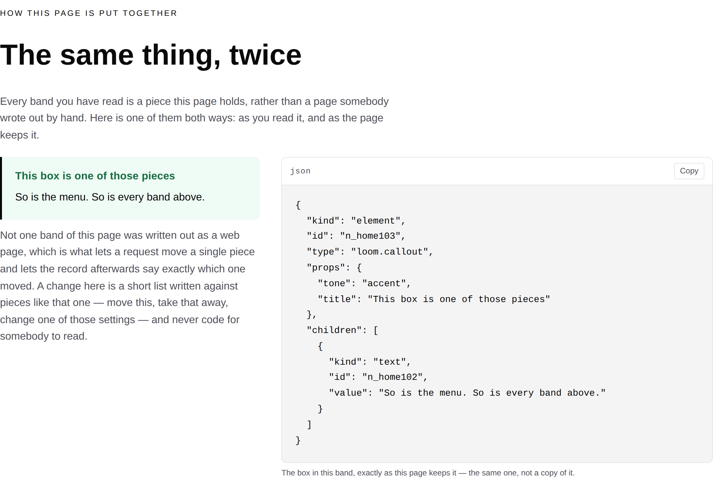
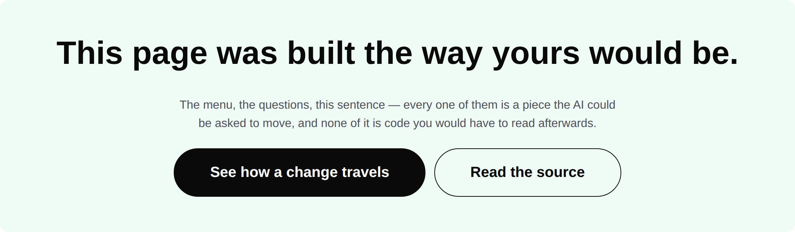
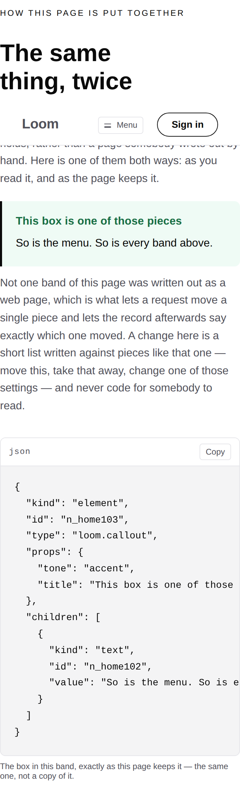
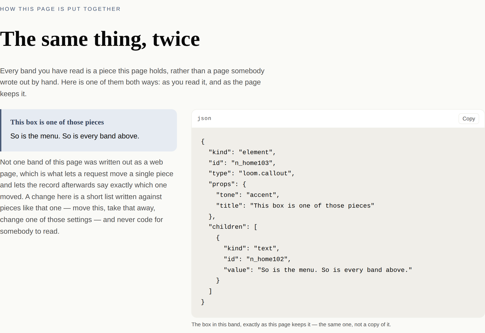
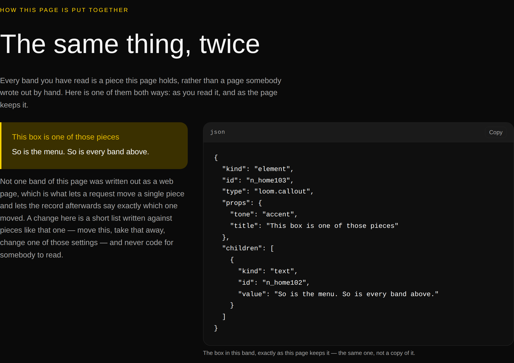


# 2026-09-03 — marketing: the same thing, twice

The front door ended on a claim it could not keep. **"None of it was written by
hand"** — directly above a button reading *Read the source*, which leads to a
file with that sentence typed into it.

The sentence has been there since 19 August. What it was reaching for is true:
no band of this site is written out as a web page, and that property is what
every other claim on the site rests on. What it *said*, to the stranger this
surface is written for, is that a machine wrote the words. A person wrote every
one of them.

So the site stops asserting it and shows it. One piece of the page, twice: as
you read it, and as the page keeps it — **not two copies, one object**, placed in
the split's first region and serialised into the panel in its second.

---

## What shipped

**One band on the front door, one module, one corrected sentence.**

`_lib/pages/as-data.ts` builds a box, puts the box in the page, and prints that
same box beside it. The panel cannot go stale, because there is nothing for it to
go stale *against*: `asDataBand` builds the specimen once and both halves of the
split are that one node. The reader can match the words across — *"So is the
menu. So is every band above."* is in the box and in the `"value"` line — and the
id in the listing is the id the record on `/how-it-works` names when a change
moves something.

It sits after **Where it is today** and before **Questions**, which is a
deliberate ordering rather than a free slot: the band above it says *not one of
these numbers was typed from memory*, and this is that same argument turned on
the page itself. The band below it opens with *can the AI write code into my
page?*, which is easier to believe from somebody who has just seen what a change
is actually written against.

The closing band keeps its heading and loses its second sentence:

| | |
| --- | --- |
| **was** | "…every one of them is a piece the AI could be asked to move. **None of it was written by hand.**" |
| **is** | "…every one of them is a piece the AI could be asked to move, **and none of it is code you would have to read afterwards.**" |

The replacement is not a hedge. It is the answer to the first problem the page
named half an hour of reading earlier — *it writes code, and somebody has to read
all of it* — said in the place a reader has just been persuaded of it.

### Two defects found by looking at it, and both were measured

The first draft of the box carried the band's whole argument in its body text.
`loom.code` sets `white-space: pre`, so the `"value"` line ran off the panel with
nothing but a scrollbar to say so — on the one band claiming you can see the
whole of it. The argument moved into prose, where nothing constrains its length,
and the box kept the job it is actually there for: being small enough to read
whole, twice.

The second was the split. An even ratio clipped the listing's longest line; a
split holding the box alone left two thirds of its region empty however the two
were aligned. `end-wide` gives the listing the room its longest line needs and
the paragraph fills the region beside it — and on a phone, where the regions
stack, the three arrive in the same order they read in.

`scrollWidth` is exactly 1440 at 1440 and exactly 390 at 390. Measured at four
widths, the panel hides nothing at 1440, 1024 or 768; at 390 there are 162px
behind a horizontal scroll *inside* the panel, which is the finding below and not
a layout fault.

### Under the other two palettes

No colour is named anywhere in the new module. Every tone on the band —
the box's accent, the panel's surface, the muted prose — is a token the palette
resolves.

## Tests

`pnpm install && pnpm verify` — **green, exit 0. Nothing failed, nothing skipped,
no test weakened, and no existing test file was opened.**

| suite | on `main` | on this branch |
| --- | --- | --- |
| `@loom/runtime` | 1860 / 119 files | **1860 / 119 files** — `src/` was not opened |
| `@loom/app` | 2497 / 158 files | **2514 / 159 files** |
| marketing, within it | 827 | **844** |

Seventeen new tests in one new file. **`main` was green when this branch was cut**
— measured, not assumed — which is the first run in this lane for some time that
did not open on red, and the record-count floor is why.

Everything is asserted against the **published tree**, never against
`as-data.ts`. A test that read the specimen out of the module and compared it
with itself would pass however the band was wired, including wired to a second
copy of the box — which is the one failure the band exists to rule out. So the
specimen is found by walking the page a visitor is served, by position rather
than by type, and the panel's text is parsed back out of it.

**Five mutations, because a test that has never failed is a claim rather than a
check:**

| mutation | result |
| --- | --- |
| the panel prints a fresh copy of the box rather than the box | **6 failed** — the identity assertion and all five per-ask ones |
| the old sentence restored on the closing band | **1 failed** — *never tells a stranger that nobody wrote it*, and only that |
| `
` written into a page builder's comment | **1 failed** — *is telling the truth: no page of this site is written out as a web page* |
| an ask taught to reconfigure the box the panel prints | **2 failed** — the panel goes stale *and* the box changes, caught separately |
| the caption reworded to *"The box on the left"* | **1 failed** — *places nothing by a side* |

The fourth is the one worth naming. The panel holds the page **as published**, so
a request that reconfigured what it prints would leave the site's most checkable
claim quietly wrong — and every choice the front door offers is run against the
real page and both halves checked on what comes back. That is what makes the band
safe to add a sixth choice beside.

The third assertion reads the page builders off the directory rather than from a
list, so a page added tomorrow is covered by a test written today.

### One thing the tests taught me about the page

Ids shift between the two states of the front door. A visitor who has asked for
something gets the answer above the opening band, so every piece built after it
is built one step later and carries a different id. That is a fact about two
different published pages rather than about anything a request did — each page's
ids are internally consistent, which is what the identity assertion checks — but
it is why the "did the ask touch the box" test compares ids out and the "does the
panel still print its own box" test does not. Written down here because it looked
like a bug for ten minutes and is not one.

## Decisions and findings

**No record written.** The change is compositional, adds nothing to the library,
constrains nothing outside this lane, and touches no Accepted record. `src/` was
not opened; no other route group was touched. Nothing outside
`apps/loom/app/(marketing)/` changed except `FINDINGS.md` and this report.

**Three filed, one of them closed on arrival.**

- **The closing band's claim**, recorded for how it survived rather than because
  it is still open. Fifth consecutive run on this surface to find the same shape
  — two individually defensible things nobody had read next to each other — and
  the first where it was an *argument* rather than a number.
- **`loom.code` cannot wrap**, for `Loom primitives`, with the four
  measurements. Printed data has no line structure below the printer's, so
  `overflow-x: auto` hides what wrapping would show. Recommendation is a `wrap`
  prop defaulting off.
- **The copy button's contrast under the bold palette**, filed **closed**. It
  looked dim in the screenshot and the obvious entry was a contrast finding.
  Measured off the running page it is 6.9:1 in bold and 7.7:1 in the other two —
  all three clear AA. Filed rather than dropped because a finding costs another
  lane a run whether or not it is real, and two `getComputedStyle` calls settled
  this one in under a minute.

**None closed from the queue.** Nothing in it was answerable from this lane this
run.

## Open questions

- **Positioning, audience and the licence line** (#96, restated on every
  marketing PR since #134). Still the site's one placeholder and still the
  Phase 2 gate. Untouched.
- **Raw data on the front door is a judgement call and it is yours.** The band
  puts fifteen lines of JSON on the landing page. Everything about it clears the
  register test — there is not one reserved word in the listing — and it is the
  seventh of eleven bands rather than the first screen. But you read this page
  against `nextjs.org` on 20 August and said it was heavy on jargon, and I would
  rather ask than find out from the next screenshot review.
- **The eight-item menu** (#166, #182). Untouched, and this run is the reason
  worth naming: the work went into a band on a page that already exists rather
  than a fifth page, so nothing was added to the bar.
- **The preview URL and the font**, both filed with measurements on #224 and both
  still true here. Every picture above is a local render against `next start` on
  the production build — the same artifact Vercel serves — in the fallback face,
  because `fonts.googleapis.com` is not reachable from the sandbox and neither is
  `*.vercel.app`.

Nothing scheduled and nothing armed.
