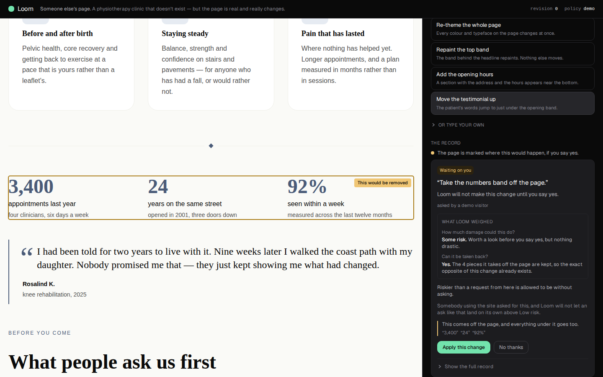
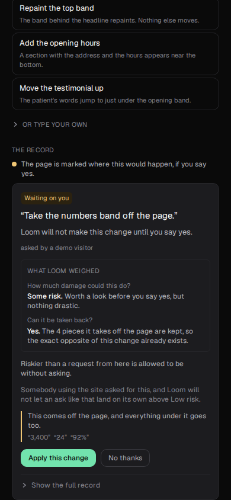
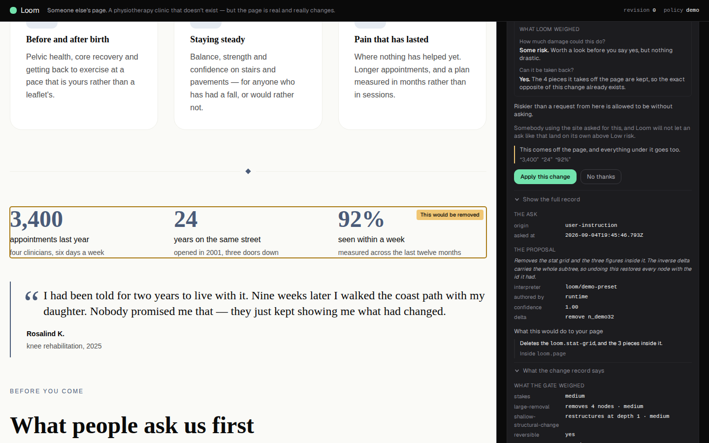
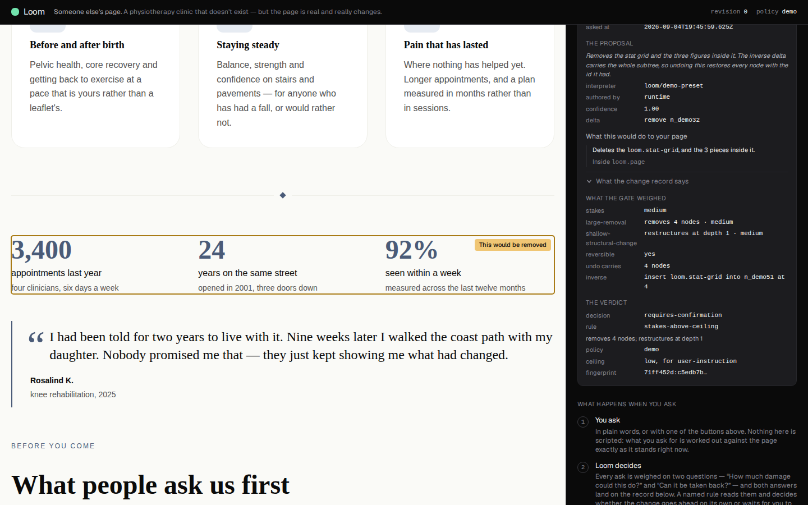

# What an ask *from here* may do

**Routine:** `Loom demo` · **Branch:** `demo-12-what-allowing-it-would-do` ·
**4 September 2026**

The fourth unit on this pull request, and the last of the four demo branches
closed unmerged on 28 August. It is on #220 rather than on a `demo-13` for the
reason the backlog entry gives: *"before starting a unit, check whether you
already have an open pull request — if you do, continue it rather than branching
again from `main`."* All four of those branches edited `record-card.tsx`, which
is the file that entry names as one of the two that made sixteen pull requests
unmergeable. This is the fourth unit on this branch to touch it, and no unit has
conflicted with another.

This one is about **the last hyphenated code left in the light**, and about the
sentence beside it that had been asking, for eleven runs, what that code meant.

---

## What a stranger could not understand before this run

I drove the built page in Chromium at 1440×900 and 390×844, as somebody who had
never heard of Loom, pressing what the rail puts first. This is the card that
press produces on `main`, in full, nothing left out:

> **Waiting on you**                                        `user-instruction`
> *“Take the numbers band off the page.”*
> Loom will not make this change until you say yes.
> asked by a demo visitor
>
> **what loom weighed**
> How much damage could this do? · **Some risk.** Worth a look before you say
> yes, but nothing drastic.
> Can it be taken back? · **Yes.** The 4 pieces it takes off the page are kept,
> so the exact opposite of this change already exists.
>
> **Riskier than a request from here is allowed to be without asking.**
> This comes off the page, and everything under it goes too. *“3,400” “24” “92%”*
> [ Apply this change ] [ No thanks ]
> ▸ Show the full record


Read the weighing and the rule together. The card says **how much risk this
carries** — *Some risk* — and then says a limit was exceeded. **It never says
what the limit is.** Both sides of an inequality in plain words, in the light,
one under the other, with the threshold between them missing.

And the rule sentence turns entirely on the phrase **“from here”** — that is the
whole of its claim — and **nothing on the card said what *here* was.** A stranger
is told a request from somewhere is allowed a certain amount of latitude, is not
told what the somewhere is or what the amount is, and is then asked to make a
decision on that basis.

The one thing on the card that came close was `user-instruction`, set in
monospace in the top right corner, at the size of a footnote, on the first card
this surface ever shows anybody. It is the runtime's enum for the *kind of act*
the ask was. As a token in a corner it read as a serial number.

### It is not a label. It is the input the rule read.

This is what makes it worth a unit rather than a tidy-up. `autoApplyCeiling` is
**keyed by origin**, and `demoPolicy` sets `user-instruction` to `low` on
purpose — `session.ts` says why: under the shipped default every change this demo
offers would auto-apply and the hold would never appear. So the Gate's comparison
on this exact card is *this origin's ceiling* against *these stakes*, and the
runtime is explicit about why an origin should have a ceiling at all:

> The highest stakes each origin may apply without asking. **An explicit human
> instruction earns more latitude than an adaptation nobody requested.**
> — `src/runtime/policy.ts`

That is one of the genuinely distinctive ideas in this project — *who asked
changes what may land alone* — and the demo was demonstrating it as a hyphenated
string with no verb.

**Everything needed was already exported.** `ceilingFor(policy, origin)` is the
function the Gate itself calls, public from `@loom/runtime`. `ASK_ORIGINS` in
`(portal)/_lib/vocabulary.ts` has translated all four origins into sentences for
weeks. `STAKES` names the four levels in plain words, and this card is **already
printing one of them** three lines above. The demo was the one surface with the
code in the light and no translation anywhere.

### What the closed branch could not have known

`demo-11-what-an-ask-from-here-may-do` was cut on 31 August, before
`_lib/weighed.ts` landed. It argued the sentence was missing a referent, which
was true. What is true now and was not then is sharper: the card **already puts
the stakes in the light**, so the missing sentence is not a gloss on a code — it
is one of three terms in an arithmetic the visitor can otherwise not complete.
That is why this unit ships the same module with a different argument behind it,
and why the report says the gap got worse in the four days the branch sat closed.

## What a stranger can understand now

Same press, same card, on this branch:

> **Waiting on you**
> *“Take the numbers band off the page.”*
> Loom will not make this change until you say yes.
> asked by a demo visitor
>
> **what loom weighed**
> How much damage could this do? · **Some risk.** …
> Can it be taken back? · **Yes.** …
>
> Riskier than a request from here is allowed to be without asking.
> *Somebody using the site asked for this, and Loom will not let an ask like that
> land on its own above Low risk.*
> This comes off the page, and everything under it goes too. *“3,400” “24” “92%”*
> [ Apply this change ] [ No thanks ]



Three lines, in the order the Gate did them:

1. **Some risk** — what this ask carries.
2. **Low risk** — what an ask like this is allowed to land on its own.
3. **So it waits for you** — which is what the rule sentence says.

A stranger who reads those has been told, without meeting a single piece of
vocabulary: what kind of ask this was, that Loom treats kinds of ask
differently, what this kind may do unsupervised, and that this ask asked for
more. That is the Gate's whole reasoning, and it is now legible without opening
anything.

The whole card still fits one phone screen at 390×844, badge to disclosure,
with both buttons in view — worth checking rather than assuming, since this made
it two lines taller and `AnswerInView` scrolls the waiting card into view:



### And the code went where the technical record goes

Open *Show the full record* and the disclosure opens on a section it never had:



```
THE ASK
origin        user-instruction
asked at      2026-09-04T19:45:46.793Z
```

**Nothing was removed to make room.** The origin is still on the card, in the
runtime's own word, one click away — and `asked at`, which the record has carried
since this surface was built and which neither half of this card had ever
printed, is beside it. The ceiling joins the verdict, next to the rule that read
it:



```
THE VERDICT
decision      requires-confirmation
rule          stakes-above-ceiling
policy        demo
ceiling       low, for user-instruction
fingerprint   71ff452d:c5edb7b…
```

## The changes

### `_lib/ceiling.ts` — new, and most of it is about when to say nothing

`ceilingNote(record)` returns the sentence and its technical twin, or
`undefined`. It returns `undefined` on **seven of the eight** rules the Gate can
cite, because only `stakes-above-ceiling` reads a ceiling — a card whose verdict
was *within-policy* would be answering a question the Gate never asked. That is
the same restraint `answer.ts` uses for the visitor's yes: one sentence, on the
one state where it is the missing term.

Three decisions inside it are load-bearing:

- **The ceiling is asked of the runtime, not read off the policy.** `ceilingFor`
  is what the Gate calls, `?? "low"` fallback and all. A surface that indexed
  `autoApplyCeiling` itself would claim a different ceiling than the Gate applied
  the first time an origin had none.
- **The words come off the shared tables.** `ASK_ORIGINS[origin].label` and
  `STAKES[ceiling].label`, so a rewording in the portal fails a test here rather
  than leaving two surfaces describing one verdict differently. This surface
  writes no vocabulary of its own — which is also the only reason the comparison
  reads: *Some risk* above and *Low risk* below are the same table's words for
  the same scale.
- **It stays quiet on a record decided under another policy.** The demo runs one
  policy, so this is a guard against a future rather than a live case — but the
  alternative is telling a visitor what *this* policy allows about a verdict
  another policy reached.

### `_components/record-card.tsx` — one span out of the light, one line into it

The origin span is gone from the header. The sentence sits directly under the
rule it completes, and quieter than it, because it is that sentence's second half
rather than a claim of its own. The disclosure gains **the ask** — the only
section on the card that renders unconditionally, so a record that never reached
a verdict still carries the field rather than dropping it — and the verdict
section gains the `ceiling` row.

## Tests

`pnpm install && pnpm verify` — **green, exit 0**, first attempt.

| package | files | tests |
| --- | --- | --- |
| `@loom/runtime` | 119 | 1860 |
| `@loom/app` | 163 | 2573 |

**13 new in this unit**, all in this lane: 9 in `_lib/ceiling.test.ts`, 4 in
`record-card.test.tsx`. Nothing skipped, no test weakened, no fixture loosened.

Measured rather than asserted: reverting `record-card.tsx` to its state before
this unit, with `ceiling.ts` left in place, turns **3 of the 4** new card tests
red. The fourth — that a change the ceiling did *not* decide says nothing about a
ceiling — was already true, and is there to fail if a later run starts saying it
on every card.

The test worth naming is `is the other half of a comparison the card has already
shown, and the comparison holds`. It reads the stakes through `weighedOf`, the
ceiling through `ceilingFor`, and asserts `isAbove(stakes, ceiling)` — so if a
policy retune ever made the demo's headline ask land on its own, this fails
rather than leaving the card explaining a hold that no longer happens.

## Findings

**Filed:** the unit itself, closed by this branch, recording that all four of
the 28 August demo branches have now been redone on one pull request.
`21st.dev` blocked a tenth time from this lane (seventeenth overall). The brief's
opening task, landed fourteen days ago, an eighth consecutive run.

**Closed:** the redo of #209.

## Open questions

Nothing blocking. The 1 September question — *should a primitive type ever get a
friendly name on this surface?* — did not arise in this unit; the recommendation
is unchanged, keep the refusal.

## What did not happen

No model was called and none could be: `ANTHROPIC_API_KEY` is absent from this
run's environment, which is the supported state the brief names. Everything above
is the preset path, assessed, gated, logged and inverted exactly like a model's
([0057](../decisions/0057-a-preset-is-a-deterministic-interpreter.md)).

No file outside `apps/loom/app/(demo)/` is touched, other than `FINDINGS.md` and
this report. No decision record was written: this unit reads two exported
functions and two exported tables the way four other screens already read them,
and decides nothing that would be expensive to reverse.

Nothing is scheduled and nothing is watching this pull request.
