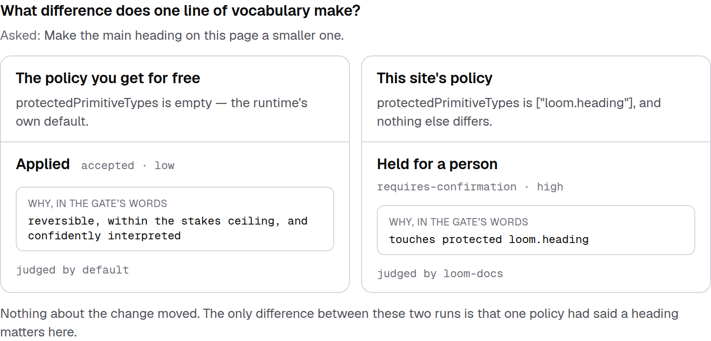
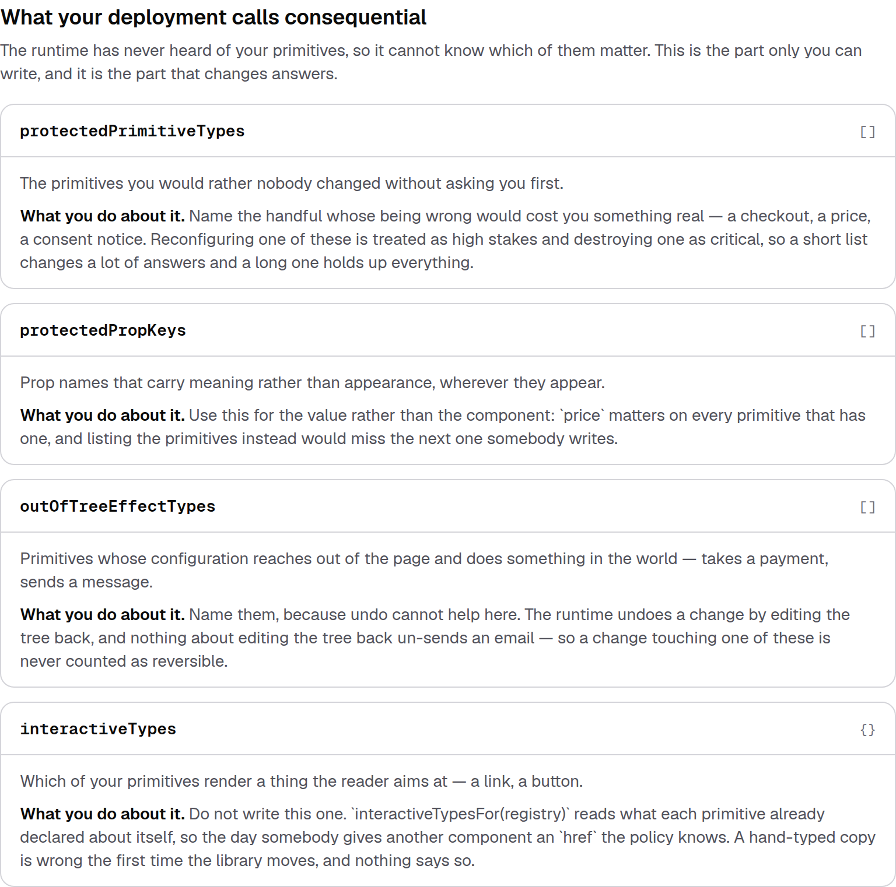
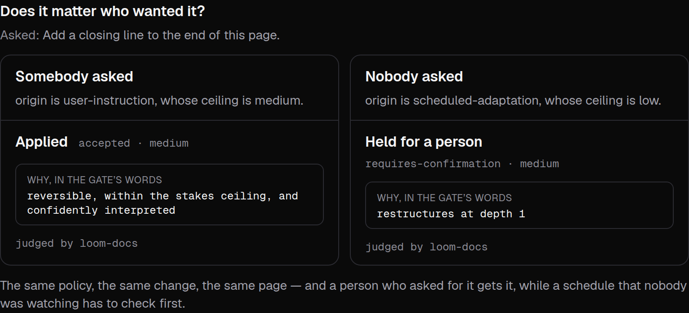


# 4 September 2026 — what AI may change

**Routine:** `Loom docs` · **Branch:** `docs-20-what-ai-may-change` · **Section:** §4c

The site could teach a stranger to build a page and to watch one change. It
could not teach them the one thing a deployment has to decide before it turns
any of this on: **which of my components would I not want changed without being
asked?**

That decision is a `GatePolicy`. It has thirteen settings. Before today the site
named three of them, in passing, on a page about something else.

## What shipped

**One new page — *What AI may change*, the last page of *Building with Loom*.**
The section now reads: define a primitive, compose them, make it look like
yours, decide what may change.

It is composed of two generated blocks and prose around them.

### Three comparisons, run as the page builds

The page's argument is that a policy is small and changes a lot. That is a claim
prose cannot make, so the page does not make it in prose: each comparison is
**one ask, judged twice, with one thing different between the runs**.

| | What differs | What the Gate said |
| --- | --- | --- |
| What one line of vocabulary buys | the policy: nothing protected, versus `["loom.heading"]` | applied · **held for a person** |
| Who asked | the origin, under one policy | applied · **held for a person** |
| Where asking stops being enough | the same one line, against a delete rather than an edit | applied · **refused** |

Every column is a real trip through `composeChange`: the site's own presets, the
site's own first example tree, the real Gate. The sentence under each verdict is
the runtime's own — *touches protected loom.heading*, *restructures at depth 1* —
printed rather than paraphrased.

**A column declares the verdict it is illustrating, and a run that produces a
different one throws.** That is the load-bearing line in the whole unit. Without
it, a policy change anywhere else would leave this page confidently printing
"applied" over a refusal, which is the exact failure a side-by-side exists to
make visible.

The middle comparison is the one I would not have predicted. Adding a sentence to
the end of a page — the most innocuous thing on this site — is **medium stakes in
both columns**. Nothing about the change is reassessed when the asker changes;
what moves is the line it has to stay under. The page says so, and
`verdicts.test.ts` asserts the two stakes are equal and the two answers are not,
so the sentence cannot outlive the fact.

### Thirteen settings, read off the type

The rows are a **`Record<keyof GatePolicy, Knob>`**. A fourteenth setting in the
runtime stops the documentation site compiling until somebody writes the sentence
that goes with it — verified by deleting `interactiveTypes` from the record,
which produces `TS2741: Property 'interactiveTypes' is missing`.

Every default beside a field is read out of `defaultGatePolicy` as the page
builds, so the number on the page is the number in the build.

The grouping is the site's half and is the answer to the question a reader
actually arrives with. Four fields are yours to write; the other nine ship with
answers, and each group says which it is above its cards. A table that did not
say so would read as thirteen decisions rather than four.

## What I decided that was not specified

**The page goes in *Building with Loom*, not in *The runtime*.** *What the Gate
decides* already explains the machinery — how a change is weighed, what the three
answers mean — and it is a good page. This one is about the file you write, which
is a building task, and it opens by saying so and linking there. The risk is two
pages about the Gate; the page manages it by never re-explaining stakes and
reversibility, only using them.

**The comparisons happen to `first-tree` rather than to a tree written for the
page.** A page about changing the policy should be changing the policy and
nothing else, and a reader has already watched chips run against that exact tree
twice.

**One fix outside this unit.** `getting-started/rendering-a-tree` had a fence
labelled `ts` containing `return <main>{…}</main>`; the same page labels the
identical construct `tsx` forty lines earlier. One word, and a reader pasting it
into a `.ts` file gets a syntax error from their own compiler and no
explanation. Found while measuring the fences for the finding below.

## Tests

`pnpm install && pnpm verify` at the repository root. **Green.** Nothing failed,
nothing was skipped, no test was weakened.

| Suite | Files | Tests |
| --- | --- | --- |
| `@loom/runtime` | 119 | 1860 passed — `src/` was not opened |
| `@loom/app` | 162 | 2539 passed |

`main` at `d7375ef` is **2497 app tests across 158 files**, so this branch is
**+42 tests across 4 new files**. `next build` clean across all five route
groups; 78 static pages generated.

Four claims were verified by mutation, because a test that has never failed is a
claim rather than a check:

- **deleting `interactiveTypes` from the knob record** → `TS2741`, the build
  stops. The type is the guarantee, not a test.
- **hard-coding a default** (`breadthThreshold` as `"9"` instead of reading it)
  → fails *prints the default the schema declares, not a number somebody typed*,
  and only that one. The check asks `gatePolicySchema.shape[field].parse(undefined)`
  rather than `defaultGatePolicy`, so it arrives at the value by a route the
  module does not use — an earlier draft compared the module against itself and
  passed the mutation, which is why it was rewritten.
- **a comparison claiming the wrong verdict** (the docs-policy column saying
  `accepted`) → six tests fail, all of them with the Gate's own message:
  *claims accepted and the Gate said requires-confirmation*.
- **the page naming a field the policy does not have** (`protectedPrimitives`)
  → fails *sets only fields the policy actually has*, and only that one.

## Dark and 390px, before the pull request

`document.documentElement.scrollWidth` is exactly 390 at a 390px viewport and
1280 at 1280. The comparison columns are `flex-col` below the `sm` breakpoint, so
on a phone the two verdicts stack rather than squeeze.

One defect the screenshots caught and the tests did not: the knob sentences are
rendered as **text nodes rather than as MDX**, so the backticks I had written
around `price` and `href` reached the reader as backticks. `catalogue.ts` already
records this trap for an example's caption; it is now a test — *writes prose
rather than markdown, because nothing renders it as markdown* — on both the knob
sentences and the comparison captions.

## Scope

`apps/loom/app/(docs)/` only: four files added, one component added, `nav.ts` and
one page edited. **No file in another lane was opened**, `src/` was not opened,
and the generated API reference was not regenerated because the runtime's surface
did not move.

The page is composed of prose, two generated blocks and the site's existing
`Callout`. No primitive was needed and none is missing — the blocks are the same
kind of furniture as the write-endings cards and the entry-points table, which is
the footing generated content has had on this site since #167.

## Findings filed

**A field added to `gatePolicySchema` and not to `GatePolicy` compiles**
(`Loom daily build`). The policy states its thirteen fields twice, and
`defaultGatePolicy: GatePolicy = gatePolicySchema.parse({})` only catches the
direction where the schema loses one — an added field is an excess property on a
returned value, so it is assignable and `keyof GatePolicy` never hears about it.
Nothing is broken today; `knobs.test.ts` holds `KNOB_ORDER` against
`Object.keys(gatePolicySchema.shape)` and will say so on every run until the
runtime owns the check. Recommendation: derive the type with `z.infer`.

**Thirty code fences, and nothing checks that any of them would compile**
(mine). Measured rather than asserted: 30 TypeScript fences across 10 pages, of
which eight are deliberate object-literal fragments, two contain a literal `…`,
one is deliberately invalid to show two options, and most of the rest reference
names from earlier on the page. So the general check is real work with a design
question in it — a fence would have to declare whether it is a program or a
fragment — and it is a unit of its own rather than a corner of this one. The one
defect the measurement found is fixed here.

## Open questions

**Nothing blocking.**

**Whether *What the Gate decides* should now shed its policy snippets.** That
page shows `gatePolicySchema.parse({…})` twice, to make a point it needs. It is
now the second-best place to learn that, and I left it alone rather than editing
a page a reader may be mid-way through. If you would rather it pointed here, that
is a small follow-up.

**What I would write next.** Nothing on this site tells a reader what to do when
they have shipped and something looks wrong — an audit that disagrees with the
log, a hold nobody answered, a journal that is not shrinking. That was the
recommendation on #199 and on #232 and it is still the largest hole. It wants
#225 on `main` first, because it would link to both of that branch's pages.
