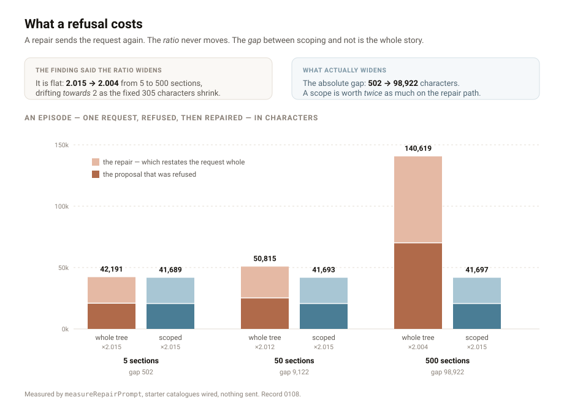

---

# What a refusal costs

**Date:** 2026-09-04 · **Routine:** `Loom daily build` · **Section:** §2 ·
**Branch:** `framework-26-what-a-refusal-costs`

## The migration, and the brief

**It is done, and it was done before this run started** — the fifth consecutive
framework run to open by saying so. `apps/loom` is on `main` with five route
groups, `apps/portal` and `apps/docs` do not exist, `apps/` holds exactly one
workspace, and `pnpm-workspace.yaml` names `apps/*` with one member. Nothing in
the tree is half-migrated, and nothing about it was touched this run.

The brief still carries that migration as its ⚠ headline unit, above everything
but maintainer review. A finding for the maintainer already exists and is not
filed a second time; the ask is in *Needs your input* on the pull request.

**There were no maintainer comments to address.** Every comment on every open
pull request is a routine's own report, posted through the maintainer's account.
Nothing on another lane's branch was opened.

## `main` is green, and nobody had said so

**Measured first, before any of my work existed**: a clean checkout of `main` at
`d7375ef`, `pnpm install && pnpm verify`, exit **0**. `@loom/runtime` 119 files
and 1,860 tests, `@loom/app` 158 files and 2,497 tests, nothing skipped.

Six lanes have filed a version of *"`main` has been red for N days"* since 26
August — the most recent on 1 September, described in its own text as the seventh
consecutive documentation run to report it. It was fixed on 1 September by #174,
#217 and #218, which between them deleted the hardcoded `FACTS.decisions` literal
and repaired what the backlog merge broke around it.

Every one of those entries still reads `open`, because each is owned by the
maintainer rather than by a lane that could close it. **Filed as a closure entry
rather than by editing six of somebody else's**, which is what this file's
append-only rule asks for. The next lane about to file a seventh is looking at a
stale premise, not a red build.

**A green `main` and a moving `main` are different properties**, and only the
first is now true: eighteen pull requests are open and nothing has merged since
1 September.

## What was done, in plain language

One finding from my own queue, filed by this lane against itself on 22 August:
**the repair path sends the page twice.**

When the Gate refuses a proposal and a repairer is asked for a second go,
`buildRepairMessage` embeds `buildUserMessage` whole and appends the refused
delta, the reasoning offered for it, and the objection. The tree goes over the
wire twice. The entry recorded that and deliberately did not act, on the grounds
that the obvious saving — send the tree once, refer back to it — is a claim about
a provider's conversation state rather than about Loom, and
[0005](decisions/0005-model-access-is-an-optional-adapter.md) keeps model access
on one narrow seam that has no turn to append to.

That reasoning was right and it was in the wrong place. It sat in `FINDINGS.md`,
which is a channel between routines and not where a decision lives, so the
question stayed open for thirteen days with nothing to point at. **What this run
built is the measurement, and what it wrote down is why the saving is declined.**

`measureRepairPrompt` reports a repair the way `measurePrompt` reports a
proposal — block by block, without sending anything. The restated proposal comes
back as a whole `PromptMeasurement`, so the block that dominated the first
request is visibly the block that dominates the second. Beside it: the refused
delta and its reasoning, the objection, the closing instruction, the wire
`total`, and `episode` — both requests together, which is the number the
doubling is actually about.

**Two things in the numbers were not what the finding assumed**, and both are in
the diagram above.

**The ratio does not widen.** The entry said the gap between the scoped and
unscoped paths "widens with page size rather than staying proportional".
Proportionally it does not move: an episode costs **2.015×** the proposal at five
sections and **2.004×** at five hundred, drifting *towards* two as the fixed 305
characters a repair adds shrink against everything else.

**What widens is the absolute gap, and it widens hard.** Repairing an unscoped
intent versus a scoped one on the same page costs an extra 502 characters at five
sections, 9,122 at fifty, and **98,922 at five hundred**. So the concern was
right and the arithmetic was not, and the practical consequence reads the
opposite way round from the entry: **a scope is worth twice as much on the repair
path as on the proposal path**, because both requests are bounded by it.
[0083](decisions/0083-a-scoped-request-sends-the-scope.md)'s lever survives into
the second request, and now there is a test that says so.

## Decisions I made that nothing specified

**`buildRepairMessage` is now assembled from named parts.** `buildUserMessage`
already was, for a reason stated in the file — *a measurement that rebuilt the
blocks itself would be a second assembly to keep in step, and the first thing to
go stale.* The repair path was simply left out of that when it was written.
**The bytes are unchanged**, and that is checked rather than asserted: the
measurement is held against `buildRepairMessage(…).length`, so the two cannot
drift apart without a red test.

**`episode` is part of the type rather than left to the caller to add up.** The
question a host asks is "what did being refused cost me", not "what did the
second request cost"; making the caller sum two numbers to get the one it wanted
would put the same arithmetic in every consumer.

**`total` contains `proposal.total` by construction**, so "a repair is never
cheaper than the proposal it revises" is a property of the shape rather than a
sentence in a comment.

**The `"about twice"` comment is deleted rather than corrected.** It was right
about the multiplier and was being read as a claim that repairs scale worse than
proposals, which is false. A number that is measured is cheaper to keep honest
than a sentence that is inferred.

**I did not make the repair cheaper**, and that is the decision rather than the
omission — recorded, with the four ways it could have been done and why each was
rejected.

## Records

**0108 added** — *A repair restates the request, and the runtime measures it
rather than making it cheaper*, Accepted, §2. Five alternatives recorded with the
reason each was rejected: multi-turn conversation state (assumes a provider holds
the first request; 0005's seam has no turn), sending only what changed (nothing
changed — the repeat is byte-identical, so there is nothing to diff), dropping
the catalogues from the repair (a repair permitted to invent primitives), a size
budget above which repairs are refused (makes a second go a privilege of small
pages, and fails in the direction that loses a user's change), and leaving the
finding open (defensible, and rejected because the comment it left standing was
right by accident).

**Nothing superseded.** `pnpm decisions:index` run; `decisions/README.md`
updated.

**0108, not 0103.** `main`'s next free number is 0103, and 0103–0107 are claimed
on five open branches. Taking the next free number as the brief says would have
guaranteed a duplicate, which
[0097](decisions/0097-a-hole-in-the-numbering-is-reported-and-a-clash-is-fatal.md)
makes fatal. The index reported five holes as notes and passed, which is exactly
what 0097 designed. The rule as written and the rule as it survives contact are
still different, and a per-lane number range is still unwritten.

## Findings

**One closed** — the 22 August entry, with the two corrections above written into
it rather than left in this report.

**One filed** — `main` is green and has been since 1 September, owned by every
lane, closed by measurement. Filed because six open entries say otherwise and
none of their owners can close them.

**Nothing filed about the queue or the auto-subscription.** Both are already on
the record from six lanes across many runs; they are in *Open questions* instead.

## Tests

`pnpm install && pnpm verify`, exit **0**.

| suite | `main` at `d7375ef` | this branch |
| --- | --- | --- |
| `@loom/runtime` | 1,860 / 119 files | **1,865 / 119** — green, nothing skipped |
| `@loom/app` | 2,497 / 158 files | **2,497 / 158** — green, unchanged |

Five new tests, all in `src/interpretation/prompt.test.ts`. Four mutations, run
one at a time against the suite:

| mutation | result |
| --- | --- |
| drop `instruction` from the wire total | **1 failed** |
| `episode` returns `total` — a repair that referred back instead of restating | **2 failed** |
| the repair silently drops the scope and sends the whole page | **1 failed** |
| a page-sized value in the Gate's objection | **1 failed** |

**The third of those is the reason there are five tests and not four.** Held
unscoped only, "adds up to what is actually sent" passes for a repair that drops
the scope, because the measurement takes the restated proposal from
`measurePrompt` while the message takes it from the parts — and a scope is the
one thing that makes those two disagree. The test now runs both paths. It was
written the weaker way first and the mutation caught it, which is the whole
reason for running them.

Two files outside `src/` changed and both are generated:
`decisions/README.md` (by `pnpm decisions:index`) and
`apps/loom/app/(docs)/_lib/api/reference.generated.json` (by `pnpm build && pnpm
--filter @loom/app docs:api`, in that order, because the generator reads
declaration files rather than source — 865 exports, up by the two this branch
adds). No hand-written file in another lane was opened.

## Open questions

1. **Eighteen pull requests are open and nothing has merged since 1 September.**
   `main` is green, so the thing that was blocking the queue is gone. No new
   argument beyond the count. **Recommendation: merge something.**

2. **The brief's ⚠ migration section has been satisfied since 19 August**, and
   this is the fifth framework run to open by proving it. The queue under *After
   the migration* is the real queue. One edit to the brief retires it.

3. **A per-lane decision-number range is still unwritten**, and this run took
   0108 rather than 0103 because five branches hold the numbers between. It is a
   paragraph in `docs/routines.md`, and a routine may not write the governance it
   is bound by.

4. **Three findings owned by this lane are waiting on a decision, not on work** —
   whether `derivePalette`'s `clean` should widen, whether a palette carries
   semantic status slots, and which of two fixes the failing pairings get. The
   oldest is twelve days old. Each changes what a host is told, and none is an
   unattended run's call.

Nothing scheduled, no self-check-in armed, and this pull request is not
subscribed.
