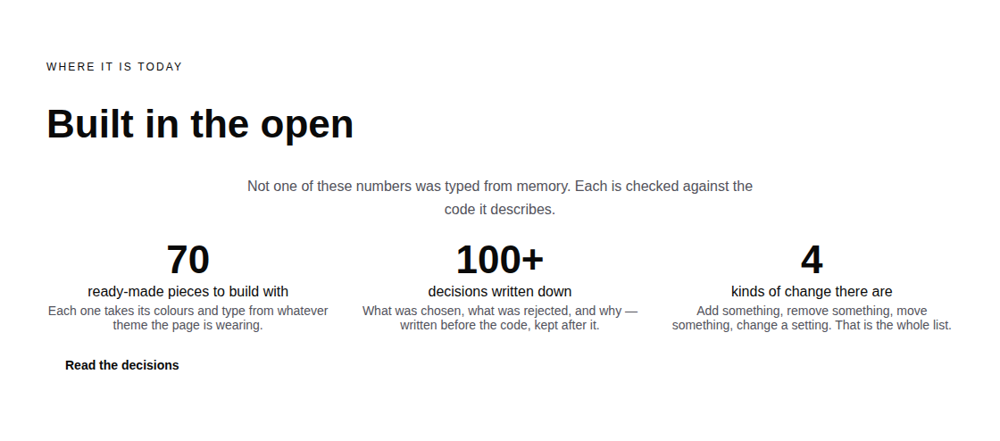
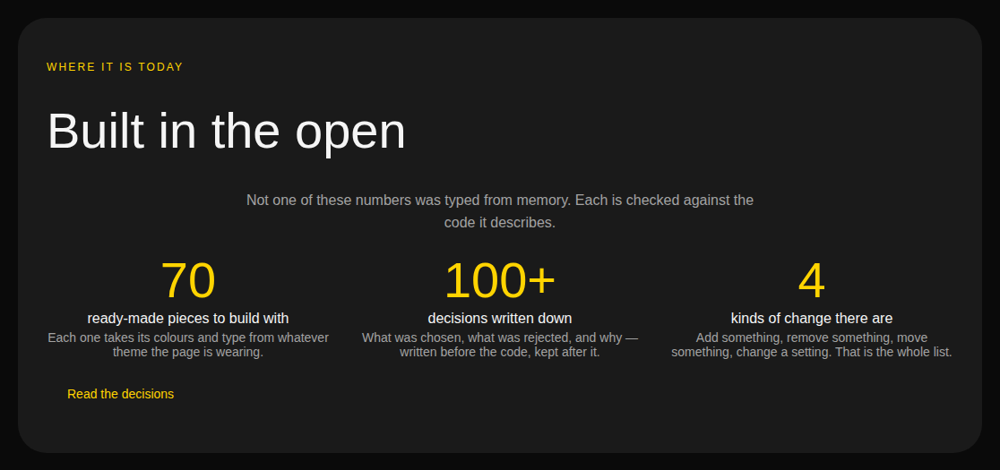

# 2026-09-04 — marketing: the last typed number, and the frame that could not ship

Two things happened this run and only one of them is in the diff.

**What shipped** is small and ends a recurring cost: the front door's third and
last hand-typed number now counts the thing it describes, so no run that
registers a primitive has to come and edit a file in this lane to get `pnpm
verify` green.

**What did not ship** is the band this run set out to build — §4d's *"embeds the
demo rather than describing it"* — which was built, wired, rendered, looked at,
and withdrawn, because the demo does not work inside the frame. That is the more
useful half of the report and it is at the bottom.



---

## What shipped

The band's own caption reads *"Not one of these numbers was typed from memory.
Each is checked against the code it describes."* Until today that was true of two
of the three.

| fact | was | is |
| --- | --- | --- |
| `primitives` | `"70"` — a literal, asserted equal to the registry | `String(catalogueOf(siteRegistry).length)` |
| `operations` | `String(DELTA_OPERATIONS.length)`, over a four-item list `copy.ts` kept | `TREE_OPERATIONS` from `@loom/runtime` |
| `decisions` | a floor, `100+` | unchanged — see below |

### Why the primitive count outlived the other two

This is the part worth writing down, because it is a general shape rather than a
missed chore.

`FACTS.decisions` was bumped by hand ten times in eleven days and everybody could
see it: the number went stale, `main` went red, and a routine that had not caused
it came and changed a digit. It was fixed on 27 August.

`FACTS.primitives` had exactly the same coupling and **never once looked wrong**,
because its test was

```ts
expect(FACTS.primitives).toBe(String(catalogueOf(siteRegistry).length))
```

which is a real comparison against a real registry — not a tautology, not
obviously weak, and green on every run where nobody had added a primitive. What
it actually did was make the library unable to grow without turning this lane
red. `Loom primitives` filed that on 25 August having hand-edited `copy.ts` in
two consecutive runs, and said it was this lane's call. It was.

**A check that is genuinely correct can still be the thing holding a coupling in
place.** The tell is not that the assertion is wrong; it is *who has to edit a
file when it fails*, and here the answer was always somebody in another lane.

### The two assertions, and what each is for

Deriving the number makes the obvious test worthless — comparing a derivation
with itself passes however the page was built — so what is asserted moved:

- **the page shows the registry's count**, with `FACTS` out of the path entirely,
  so a band that started spelling its own total fails;
- **the module does not spell the number**, read off `copy.ts` from disk the way
  this file already reads `decisions/`. The first test cannot catch a literal
  *coming back* — re-type today's count and the suite passes until the library
  grows — and this one fails immediately.

The band is unchanged in geometry and in every palette; the numbers are the same
numbers, arrived at differently.



`FACTS.decisions` is deliberately **not** re-derived. It stays a floor for the
reason recorded on 27 August: counting `decisions/` means reading the disk, and
`new URL(…, import.meta.url)` does not survive Turbopack. The registry is an
ordinary module already in this bundle, which is why this one is a derivation and
that one is not.

## Tests

`pnpm install && pnpm verify` — **green, exit 0. Nothing failed, nothing skipped,
no test weakened.**

| suite | on `main` (`d7375ef`) | on this branch |
| --- | --- | --- |
| `@loom/runtime` | 1860 / 119 files | **1860 / 119 files** — `src/` was not opened |
| `@loom/app` | 2497 / 158 files | **2498 / 158 files** |

One net new test: a tautology removed, a source guard added. **`main` was green
when this branch was cut, measured** — the record-count saga that had `main` red
from 27 August is over, and #217 landed the half of #174 that had been lost.

**Both changed assertions verified by mutation**, because a test that has never
failed is a claim rather than a check:

| mutation | result |
| --- | --- |
| `primitives:` back to the literal `"70"` | **1 failed**, 7 passed — *expected `'"70"'` not to match `/^["'`]\d+["'`]$/`* |
| `operations` counting one more than there are | **1 failed**, 7 passed — *expected `'5'` to be `'4'`* |

---

## The band that was built and withdrawn

§4d in `README.md` is explicit: the marketing site **embeds the demo rather than
describing it**, and that is *why the demo is public* (0056). Today it describes
it — a card, a menu item, and the hero's second button. So this run built the
embed.

It went further than expected. `loom.embed` had **no consumer anywhere in
`apps/`** — `Loom primitives` filed on 1 September that the first lane to render
one would find nothing had wired `origins` — so this run also wired
`createFrameOriginRegistry` into the marketing render, registering this
deployment's own origin with `self: true`, and made the origin a required
argument of `renderTree` so no page could be rendered without one.

It rendered. It was allowlisted. Here it is:


Then a click on the large green button produced this, in the console, and nothing
at all on the page:

```
Blocked form submission to '' because the form's frame is sandboxed
and the 'allow-forms' permission is not set.
```

`loom.embed`'s sandbox is a module constant —
`allow-scripts allow-same-origin allow-presentation` — with no prop that changes
it, and every control in `/demo` is a server action behind a `<form>`. So the
band offers a visitor a perfect rendering of the product and swallows their first
click in silence.

**That is worse than the link it replaces**, on this site more than most: the
whole argument of the front door is that you can always find out what happened.
A demonstration of that which quietly does nothing is an argument against itself.
So the band, the frame registry, the diagnostics split and the eight tests
supporting them were all reverted, and the diff contains none of it.

The primitive is not wrong. Its doc comment names the omission deliberately, and
that sandbox is right for the third-party video it was ported to carry. The case
it does not cover is a deployment framing **its own application**. Two findings
are filed for `Loom primitives`: the `allow-forms` gap, with a suggestion that
the seam already knows the answer (`RegisteredFrameOrigin.self` and the
`frame-same-origin` outcome), and a second, smaller one recording the aspect-ratio
measurements so nobody re-takes them.

### What it cost and what it bought

About half the run. The alternative was shipping it, and the reason to write this
down is that **it very nearly passed every check I had.** `pnpm verify` was green
with the band in. The tests asserted the frame was allowlisted, that the markup
carried an `<iframe>` rather than the refusal notice, and that no diagnostic
reported a refusal — all true, all passing, and none of them the question. The
only thing that caught it was opening the page and pressing the button.

That is the fifth consecutive run on this surface to find something no assertion
would have caught, and the sixth time the tell has been the same: **look at the
thing, in the order a visitor meets it, and press what a visitor would press.**

## Findings

**Two filed, one closed.**

- **`loom.embed` cannot frame this deployment's own application**, for
  `Loom primitives` — the `allow-forms` entry above, with the browser's own error
  and a suggested mechanism that needs no new prop.
- **`loom.embed` has one aspect ratio at every viewport**, for `Loom primitives`
  — measured at 1440 and 390, including the twelve pixels by which `wide` hides
  the demo's typing control.
- **The primitive count, closed** — the marketing half of the 25 August entry.
  `reference.generated.json` is untouched and is still `Loom docs`'.

The 30 August `FACTS.operations` entry from `Loom daily build` is also answered:
it asked for exactly this, against `TREE_OPERATIONS`, and named the reason worth
repeating — *a number nobody expects to move is the one nobody re-checks.*

## Open questions

Nothing new. The two standing ones are unchanged and both are the maintainer's:
the **licence line**, still this site's only placeholder and the Phase 2 gate;
and **positioning and audience**, untouched by this run as by every run.

Nothing scheduled and nothing armed.
