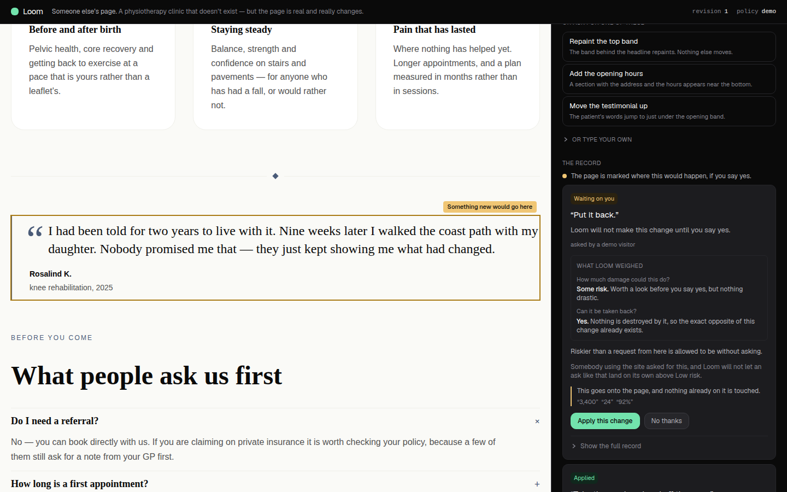
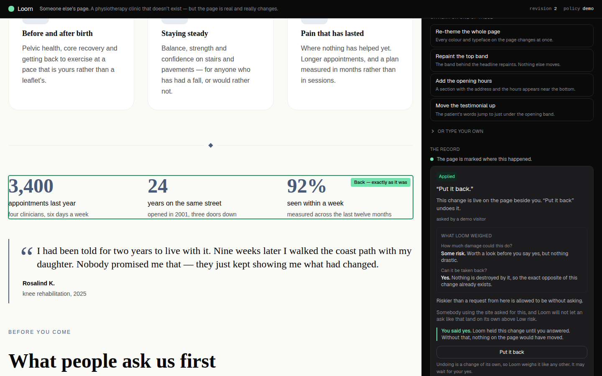

# The last frame of the demo said the opposite of the card beside it

**Routine:** `Loom demo` · **Branch:** `demo-12-what-allowing-it-would-do` · **5 September 2026**

The fifth unit on this branch, and the first since the backlog redo queue emptied.
The four before it were rebuilds of pull requests the 28 August backlog closed —
what allowing a change would do, the undo the card took away, the weighing it
never showed, and what an ask *from here* may do. This one is chosen from the
live diagnosis instead: I built the page, drove it in Chromium as somebody who
had never heard of Loom, and photographed every frame of the sequence the surface
is designed around.

The sequence holds up until the very end. **The last frame is wrong, and it is
wrong about the one claim the whole demo exists to make.**

---

## What a stranger could not understand before this run

Four presses, at 1440×900 and 390×844, with no `ANTHROPIC_API_KEY` in the
environment — the supported state the brief names, and the state every frame
below was taken in.

1. **Take the numbers off** → the Gate holds it, the stat grid is ringed amber.
2. **Apply this change** → the numbers go, the gap is marked *Something was
   removed here*, the card says *You said yes*.
3. **Put it back** → the Gate holds *that*, correctly, because an undo is a change
   of its own ([0032](../decisions/0032-an-undo-is-a-change.md)).
4. **Apply this change** → the numbers come back.

Presses 3 and 4 are the payoff. They are the difference between Loom and every
other demonstration of an AI editing a page: not that the change can be reversed,
but that **the same nodes come back, with the ids they had** — a change forward
rather than a rewind. The card says so twice. Its rationale, written by the
preset that planned the removal, reads *"the inverse delta carries the whole
subtree, so undoing this restores every node with the id it had"*, and the
weighing above it reads *"the 4 pieces it takes off the page are kept, so the
exact opposite of this change already exists"*.

And ninety pixels to the left, the page said this:

| press 3 — the undo, waiting | press 4 — the undo, landed |
| --- | --- |
| chip: **Something new would go here** | chip: **New — just added** |
| card: *"This goes onto the page, and nothing already on it is touched."* | |

A visitor watching the numbers band come back is told, by the mark on the band
itself, that a **new** one has been inserted. It is not a wording nit. It is the
demo's own thesis, printed backwards, in the largest mark on the screen, at the
last moment anybody looks at this surface before leaving it.

### Why every part of the surface got it wrong at once

Because none of them was wrong. **An undo's delta is an ordinary delta.** The
inverse of a `remove` is an `insert`, so `touched.ts` reports `added`,
`spotlight.ts` reaches the `added` branch of its label table, and
`plain-change.ts` reaches the `insert` branch of its sentence table. Every one of
those is a correct reading of the operation in front of it.

The fact that distinguishes a restoration from an arrival is not in the delta at
all — it is in the record's **provenance**, as the `REVERT_INTERPRETER` stamp
`revertRevision` writes. `undo.ts` has read that stamp since 26 August, for the
card's quotation: it is why the card says *"Put it back."* rather than
`Undo revision 1.`. Nothing else on the surface was given it.

So this is the same shape as the standing diagnosis for this lane, in its
cleanest form yet: **the machinery was right and did not reach the screen.** One
predicate, three readers, and only one of them had been told.

## What a stranger can understand now

| before | after |
| --- | --- |
|  |  |
|  |  |

Press 3 now reads **What was here would come back**, over the gap the numbers
left, with the card under it saying *"This goes back on the page, exactly as it
was before."* and quoting the three figures. Press 4 reads **Back — exactly as
it was**, inside the band that came back.

Nothing was removed and nothing moved. The ring is the same ring, in the same two
colours, in the same place; the record is untouched to the fingerprint. What
changed is four words on a chip and one sentence on a card, and they now say what
the record three inches away has always said.

## The changes

### `_lib/undo.ts` — `isUndo` is exported

Two lines. It was private because only the card's quotation needed it; the
comment now says why three readers need it, and that reading one stamp is what
stops two halves of the surface disagreeing about whether a change is a
restoration.

### `_lib/spotlight.ts` — a restoring change says *back* where an ordinary one says *new*

`restoringLabel` is a table of its own beside `labelFor`'s, not a prefix on it,
and the reason is the `removed` row rather than the `added` one: **undoing an
insert takes something off**, and calling that "removed" loses the half that
matters — that what went is the thing this visitor had just put there. So it
reads *What was added here has gone*, not *This was removed*.

| | ordinary | restoring |
| --- | --- | --- |
| waiting, added | Something new would go here | **What was here would come back** |
| waiting, removed | This would be removed | **This would go back off** |
| landed, added | New — just added | **Back — exactly as it was** |
| landed, removed | Something was removed here | **What was added here has gone** |
| moved · changed | Moved here · Just changed | **Moved back · Changed back** |

`spotlightsFor` takes `restoring` as a fourth argument, defaulted to `false`. It
is a parameter rather than a field on `TouchedNode` on purpose: it is a fact
about the *change*, and a `TouchedNode` is built from one operation, which cannot
know.

### `_lib/plain-change.ts` — the sentence under the button, for a change going backwards

`restoringOperation` mirrors the four cases and returns `undefined` for the two
stale ones, which then fall through to the ordinary table. That fall-through is
deliberate: *"This would take off something the page no longer has"* is a fact
about the tree, and the direction of travel is not what is wrong with it.

### `demo/page.tsx` — the join, in the one place both halves are in hand

The spotlight reads `isUndo(spotlit.record)` directly. The plain sentence needs a
join — a held **proposal** comes from the store and the **record** of the ask that
raised it is written by `session.ts`, and this page is the only place that holds
both. A hold with no matching record is described as an ordinary change, which is
the safe reading: it is what the delta says.

## Tests

`pnpm install && pnpm verify` — **green, exit 0**. `@loom/runtime` 119 files /
1860 tests; `@loom/app` 163 files / **2583** tests, up from 2573. Nothing skipped,
no test weakened.

**Ten new**, all in this lane, and **six of the ten go red** if `spotlight.ts` and
`plain-change.ts` are reverted with the tests left in place — measured by
stashing exactly those two files. The other four are guards rather than
demonstrations, and they are the ones worth naming:

- **the same delta, described twice.** One `insert` of the stat grid, run through
  `plainChange` with `restoring` true and false, produces two different
  sentences. It is what proves the fix reads provenance rather than
  pattern-matching a shape the delta happens to have.
- **the restored band is the node that left.** The mark's `nodeId` is asserted
  equal to the id `demoPageTree()` gives the stat grid on a pristine build. The
  chip now claims the band is the same one; this is the test that keeps the claim
  true.
- an ordinary change's words are unchanged, and the restoring sentences are held
  to the same *no vocabulary* property the ordinary ones are.

Every spotlight case goes through the real write path — interpreted, assessed,
gated, applied — including the undo, which is asked through `revertRevision`
exactly as the card's button asks it. Nothing asserts against a fixture delta.

## Findings

**Filed:** the applied card of an undo offers a button reading **Put it back**,
under a card headed *"Put it back."*, over a sentence saying *"'Put it back'
undoes it"* — three uses of one phrase, and pressing the button takes the numbers
*off* again. It is in the same frame as this unit and it is a second unit's worth
of design, because the honest label for undoing an undo is not obvious and the
surface's own rule forbids naming a change by its type. Diagnosed in full in
`FINDINGS.md` so that run is short.

**Not closed:** `21st.dev` is still `EGRESS_BLOCKED` for `WebFetch`, eleventh time
from this lane. No cost this run — what decided the four words on the chip was
building both trees and photographing the same four presses against each.

## Open questions

Nothing blocking. The 1 September question — *should a primitive type ever get a
friendly name on this surface?* — did not arise here and the recommendation is
unchanged: keep the refusal.
